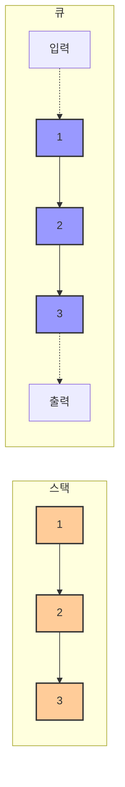

# 2. 스택과 큐 📚

## 목차
- [2. 스택과 큐 📚](#2-스택과-큐-)
  - [목차](#목차)
  - [스택과 큐의 개념 🧱](#스택과-큐의-개념-)
  - [스택과 큐의 의미 🔄](#스택과-큐의-의미-)
    - [스택의 활용 예시](#스택의-활용-예시)
    - [큐의 활용 예시](#큐의-활용-예시)
  - [스택으로 풀 수 있는 문제 📋](#스택으로-풀-수-있는-문제-)
    - [1. 올바른 괄호 판단 ✅](#1-올바른-괄호-판단-)
    - [2. 괄호 계산 순서 결정 🔢](#2-괄호-계산-순서-결정-)
    - [3. 스택으로 수열 만들기 🔄](#3-스택으로-수열-만들기-)
    - [4. 간이 텍스트 편집기 📝](#4-간이-텍스트-편집기-)
  - [큐로 풀 수 있는 문제 🚶‍♂️](#큐로-풀-수-있는-문제-️)
    - [1. 주문 처리 시뮬레이션 🛒](#1-주문-처리-시뮬레이션-)
    - [2. 요세푸스 순열 🔄](#2-요세푸스-순열-)

---

## 스택과 큐의 개념 🧱

**스택(Stack)** 은 한쪽 끝에서만 자료의 삽입과 삭제가 가능한 선형 자료구조이다. 삽입은 `push`, 삭제는 `pop` 연산으로 이루어지며, 가장 최근에 삽입된 자료가 가장 먼저 삭제된다(**LIFO** 구조).

```python
# 스택 기본 연산
stack.append(data)  # push
stack.pop()         # pop
```

**큐(Queue)** 는 한쪽에서 자료를 넣고 다른 쪽에서 꺼내는 구조로, 먼저 들어온 자료가 먼저 처리된다(**FIFO** 구조). 삽입은 `push`, 삭제는 `pop`이며, `front`와 `rear` 포인터를 통해 구현한다.

```python
# 큐 기본 연산 (queue 모듈 활용)
from queue import Queue
q = Queue()
q.put(data)    # push
q.get()        # pop
```

| 자료구조 | 구조 | 삽입 | 삭제 | 특징 |
|---------|------|------|------|------|
| **스택(Stack)** | LIFO | push(append) | pop | 최근 데이터 우선 처리 |
| **큐(Queue)** | FIFO | push(put) | pop(get) | 순서대로 처리 |
| **원형 큐** | FIFO | enqueue | dequeue | 메모리 효율적 사용 |

큐는 배열로 구현할 수 있으나 비효율적일 수 있으므로 **원형 큐**나 **링크드 큐**를 사용하여 공간 활용도를 높인다.



---

## 스택과 큐의 의미 🔄

스택과 큐는 단순한 자료 저장이 아닌 **작업의 순서**와 **의존관계**를 표현하는 데 유용하다.

### 스택의 활용 예시
- **콜 스택(Call Stack)**: 함수 호출 시 현재 상태를 저장하고 복귀 지점을 추적
- **재귀함수 처리**: 후입선출 구조로 호출된 함수들이 역순으로 처리됨

```python
# 재귀 예시
def factorial(n):
    if n == 0:
        return 1
    return n * factorial(n - 1)
```

### 큐의 활용 예시
- **스케줄링**: 순서대로 처리되는 작업, 예: 인쇄 작업, 프로세스 스케줄링
- **의존 없는 작업 목록** 처리에 적합

---

## 스택으로 풀 수 있는 문제 📋

### 1. 올바른 괄호 판단 ✅
괄호 문자열이 올바른 구조인지 확인한다. 여는 괄호는 스택에 push하고, 닫는 괄호는 pop하면서 쌍을 맞춘다.

```python
def is_valid_parentheses(s):
    stack = []
    for ch in s:
        if ch == '(':
            stack.append(ch)
        elif ch == ')':
            if not stack:
                return False
            stack.pop()
    return not stack
```

### 2. 괄호 계산 순서 결정 🔢
여는 괄호의 인덱스를 스택에 저장해 두고, 닫는 괄호가 나올 때 대응되는 여는 괄호의 인덱스를 확인하여 계산 순서를 기록한다.

### 3. 스택으로 수열 만들기 🔄
1부터 N까지 숫자를 스택에 push/pop 하여 주어진 수열을 만들 수 있는지를 판단한다.

```python
def can_form_sequence(seq):
    stack, current = [], 1
    for num in seq:
        while current <= num:
            stack.append(current)
            current += 1
        if stack.pop() != num:
            return False
    return True
```

### 4. 간이 텍스트 편집기 📝
커서를 기준으로 왼쪽과 오른쪽을 각각 스택으로 나눠 명령어 처리 (이동, 삭제, 삽입)를 구현한다.

```python
left, right = list("abc"), list("def")
# 명령: L → right.append(left.pop())
# 명령: R → left.append(right.pop())
# 명령: D → left.pop()
# 명령: P x → left.append('x')
```

---

## 큐로 풀 수 있는 문제 🚶‍♂️

### 1. 주문 처리 시뮬레이션 🛒
일반과 VIP 주문을 처리하되, VIP를 우선 처리하는 시뮬레이션을 큐를 이용해 구현한다.

### 2. 요세푸스 순열 🔄
N명이 원형으로 앉아 있을 때, K번째 사람을 반복적으로 제거한 순서를 출력하는 문제. 큐에서 `K-1`번 rotate하고 `pop()`하는 방식으로 구현한다.

```python
from collections import deque

def josephus(n, k):
    q = deque(range(1, n + 1))
    result = []
    while q:
        q.rotate(-(k - 1))
        result.append(q.popleft())
    return result
```

---

