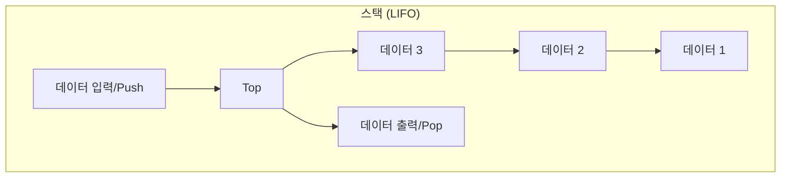
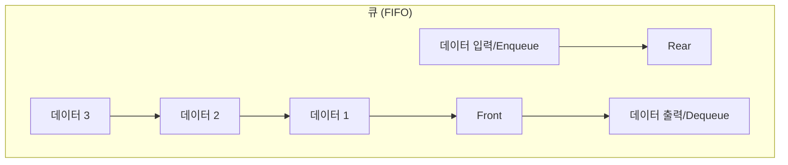

# 2. 스택과 큐: 순서가 중요한 자료구조 📚

## 목차
- [2. 스택과 큐: 순서가 중요한 자료구조 📚](#2-스택과-큐-순서가-중요한-자료구조-)
  - [목차](#목차)
  - [스택 (Stack): 마지막에 온 것이 먼저 나간다 (LIFO)](#스택-stack-마지막에-온-것이-먼저-나간다-lifo)
  - [큐 (Queue): 먼저 온 것이 먼저 나간다 (FIFO)](#큐-queue-먼저-온-것이-먼저-나간다-fifo)
  - [파이썬에서의 구현: `collections.deque`](#파이썬에서의-구현-collectionsdeque)
  - [문제 해결을 통한 활용](#문제-해결을-통한-활용)
    - [스택 활용 예시: 올바른 괄호 판단하기](#스택-활용-예시-올바른-괄호-판단하기)
    - [큐 활용 예시: 요세푸스 문제](#큐-활용-예시-요세푸스-문제)

---

스택과 큐는 데이터를 저장하는 방식을 넘어, **데이터를 처리하는 순서**를 제어하는 데 사용되는 중요한 선형 자료구조입니다. 이 둘은 추상적 자료형(ADT)의 대표적인 예시로, '어떻게' 구현하는지보다 '어떤 규칙'으로 동작하는지가 더 중요합니다.

## 스택 (Stack): 마지막에 온 것이 먼저 나간다 (LIFO)

**스택**은 데이터의 입구와 출구가 하나인 자료구조로, 가장 마지막에 들어온(Last-In) 데이터가 가장 먼저 나가는(First-Out) **LIFO** 원칙을 따릅니다. 마치 접시를 쌓아 올리고, 맨 위(Top)의 접시부터 사용하는 것과 같습니다.

- **`push`**: 스택의 맨 위에 데이터를 추가합니다.
- **`pop`**: 스택의 맨 위에서 데이터를 제거하고 반환합니다.



- **주요 활용처**:
    - 웹 브라우저의 '뒤로 가기' 기능
    - 실행 취소 (Undo) 기능
    - 함수 호출 스택 (Call Stack)
    - 재귀(Recursion) 알고리즘의 동작 원리

## 큐 (Queue): 먼저 온 것이 먼저 나간다 (FIFO)

**큐**는 데이터의 입구(Rear)와 출구(Front)가 양 끝에 따로 있는 자료구조로, 가장 먼저 들어온(First-In) 데이터가 가장 먼저 나가는(First-Out) **FIFO** 원칙을 따릅니다. 은행 창구에서 줄을 서서 기다리는 것과 같습니다.

- **`enqueue` (or `put`)** : 큐의 맨 뒤(Rear)에 데이터를 추가합니다.
- **`dequeue` (or `get`)** : 큐의 맨 앞(Front)에서 데이터를 제거하고 반환합니다.



- **주요 활용처**:
    - 프린터의 인쇄 작업 대기열
    - 메시지 큐 시스템 (MOM)
    - 너비 우선 탐색 (BFS) 알고리즘
    - 순서대로 처리해야 하는 모든 작업 (주문 처리, 고객센터 콜 등)

---

## 파이썬에서의 구현: `collections.deque`

파이썬에서 스택과 큐를 구현할 때 가장 효율적이고 표준적인 방법은 `collections` 모듈의 **`deque` (double-ended queue, '덱'이라고 읽음)** 를 사용하는 것입니다.

> **⚠️ 왜 `list`를 쓰면 안되나요?**
> 파이썬 `list`로 스택(`append`, `pop`)을 구현하는 것은 효율적입니다. 하지만 큐를 구현하기 위해 `list.pop(0)`를 사용하면, 맨 앞의 원소를 제거한 뒤 모든 원소를 한 칸씩 앞으로 당겨야 하므로 매우 비효율적(O(n))입니다.
>
> `deque`는 내부적으로 이중 연결 리스트로 구현되어, **양쪽 끝에서의 추가와 제거가 모두 O(1)의 시간 복잡도**로 매우 빠릅니다.

```python
from collections import deque

# 스택으로 사용하기 (오른쪽으로 push, 오른쪽으로 pop)
stack = deque()
stack.append(1)  # Push
stack.append(2)
stack.append(3)
print(stack.pop()) # 3
print(stack.pop()) # 2

# 큐로 사용하기 (오른쪽으로 enqueue, 왼쪽으로 dequeue)
queue = deque()
queue.append(1)  # Enqueue
queue.append(2)
queue.append(3)
print(queue.popleft()) # 1
print(queue.popleft()) # 2
```

---

## 문제 해결을 통한 활용

### 스택 활용 예시: 올바른 괄호 판단하기
괄호 문자열 `s`가 주어졌을 때, 괄호의 짝이 올바르게 맞는지 판단하는 문제입니다.

- **해결 전략**:
    1. 여는 괄호 `(`를 만나면 스택에 `push`합니다.
    2. 닫는 괄호 `)`를 만나면 스택에서 `pop`을 시도합니다.
    3. 만약 `pop`할 때 스택이 비어있다면, 짝이 맞지 않는 것이므로 `False`입니다.
    4. 모든 문자열을 순회한 후, 스택이 비어있으면 올바른 괄호, 비어있지 않으면 짝이 맞지 않는 것입니다.

```python
def is_valid_parentheses(s: str) -> bool:
    stack = deque()
    for char in s:
        if char == '(':
            stack.append(char)
        elif char == ')':
            if not stack: # 닫는 괄호가 나왔는데 스택이 비어있으면
                return False
            stack.pop()
    return len(stack) == 0 # 최종적으로 스택이 비어있어야 함
```

### 큐 활용 예시: 요세푸스 문제
N명의 사람이 원을 이루어 앉아있고, K번째 사람을 계속해서 제거해 나갈 때, 제거되는 순서를 구하는 문제입니다.

- **해결 전략**:
    1. 1부터 N까지의 사람을 큐에 넣습니다.
    2. 큐가 빌 때까지 다음을 반복합니다.
        a. 맨 앞의 사람을 `K-1`번 꺼내서 다시 맨 뒤로 넣습니다. (`rotate` 활용)
        b. 그 다음 사람(K번째)을 큐에서 제거하고, 결과 리스트에 추가합니다.

```python
from collections import deque

def josephus(n: int, k: int) -> list[int]:
    queue = deque(range(1, n + 1))
    result = []
    while queue:
        # k-1 만큼 왼쪽으로 회전 (맨 앞의 원소를 맨 뒤로 보냄)
        queue.rotate(-(k - 1))
        # k번째 원소를 제거하여 결과에 추가
        result.append(queue.popleft())
    return result
```