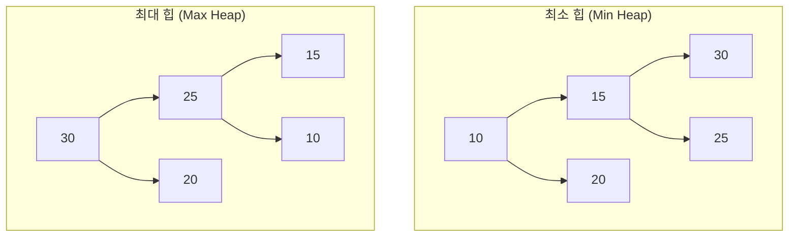

# 4. 우선순위 큐와 힙 🌲

## 목차
- [4. 우선순위 큐와 힙 🌲](#4-우선순위-큐와-힙-)
  - [목차](#목차)
  - [우선순위 큐 (Priority Queue)](#우선순위-큐-priority-queue)
  - [힙 (Heap): 우선순위 큐를 위한 최적의 자료구조](#힙-heap-우선순위-큐를-위한-최적의-자료구조)
    - [힙의 종류와 특징](#힙의-종류와-특징)
    - [힙의 내부 동작 원리: Up & Down](#힙의-내부-동작-원리-up--down)
  - [파이썬 heapq 모듈: 리스트를 힙으로](#파이썬-heapq-모듈-리스트를-힙으로)
    - [최대 힙 구현하기](#최대-힙-구현하기)
  - [힙을 이용한 문제 해결](#힙을-이용한-문제-해결)
    - [사례 1: 가장 비용이 적게 드는 작업 찾기 (그리디)](#사례-1-가장-비용이-적게-드는-작업-찾기-그리디)
    - [사례 2: 실시간으로 중간값 찾기](#사례-2-실시간으로-중간값-찾기)

---

## 우선순위 큐 (Priority Queue)

**우선순위 큐**는 일반적인 큐(FIFO)와 달리, 들어온 순서가 아니라 **데이터가 가진 우선순위**에 따라 원소를 처리하는 추상적 자료형(ADT)입니다. 우선순위가 가장 높은 원소가 항상 먼저 제거됩니다.

- **주요 연산**:
    - `insert(data, priority)`: 우선순위를 가진 데이터를 추가.
    - `pop()`: 우선순위가 가장 높은 데이터를 제거하고 반환.

- **활용 예시**:
    - 병원 응급실: 위급 환자를 먼저 치료.
    - 운영체제 스케줄링: 중요한 작업을 먼저 처리.

> 만약 우선순위 큐를 정렬되지 않은 배열로 구현한다면, `pop`을 할 때마다 모든 원소를 탐색하여 우선순위가 가장 높은 것을 찾아야 하므로 매우 비효율적(O(n))입니다. 이를 해결하기 위한 자료구조가 바로 **힙(Heap)** 입니다.

---

## 힙 (Heap): 우선순위 큐를 위한 최적의 자료구조

**힙**은 **완전 이진 트리**의 형태를 가지며, 우선순위 큐를 구현하기 위한 가장 효율적인 자료구조입니다. 힙은 항상 부모-자식 노드 간의 특정 대소 관계 규칙을 만족합니다.

### 힙의 종류와 특징

- **최소 힙 (Min Heap)** : **부모 노드의 값 ≤ 자식 노드의 값**. 즉, 루트 노드는 항상 전체에서 **최솟값**을 가집니다.
- **최대 힙 (Max Heap)** : **부모 노드의 값 ≥ 자식 노드의 값**. 즉, 루트 노드는 항상 전체에서 **최댓값**을 가집니다.


> **완전 이진 트리**의 특성 덕분에, 힙은 파이썬의 **리스트(배열)** 를 사용하여 매우 효율적으로 구현할 수 있습니다. (노드 `i`의 왼쪽 자식: `2*i+1`, 오른쪽 자식: `2*i+2`, 부모: `(i-1)//2`)

### 힙의 내부 동작 원리: Up & Down

힙은 삽입/삭제 시 O(log n)의 시간 복잡도를 유지하기 위해, 새로운 데이터가 추가되거나 루트가 제거된 후 트리를 재정렬하는 과정을 거칩니다.

1.  **삽입 (Push)** :
    1.  새로운 데이터를 완전 이진 트리의 **가장 마지막 위치**에 추가합니다.
    2.  추가된 노드를 자신의 **부모 노드와 비교**하며, 힙의 규칙에 맞을 때까지 계속 **위로 올립니다(Sift-up)** .

2.  **삭제 (Pop)** :
    1.  우선순위가 가장 높은 **루트 노드**를 제거합니다.
    2.  **가장 마지막 노드**를 루트 자리로 가져옵니다.
    3.  새로운 루트 노드를 자신의 **자식 노드와 비교**하며, 힙의 규칙에 맞을 때까지 계속 **아래로 내립니다(Sift-down)** .

이 'Up' & 'Down' 과정은 트리의 높이(log n)만큼만 일어나므로, 매우 빠른 성능을 보장합니다.

---

## 파이썬 `heapq` 모듈: 리스트를 힙으로

파이썬은 **최소 힙** 기능을 제공하는 `heapq` 모듈을 내장하고 있습니다. `heapq`는 일반적인 리스트를 최소 힙처럼 다룰 수 있게 해주는 함수들의 모음입니다.

```python
import heapq

heap = [] # 일반 리스트를 생성

# 힙에 원소 추가: heapq.heappush()
heapq.heappush(heap, 4)
heapq.heappush(heap, 1)
heapq.heappush(heap, 7)
# heap 리스트의 상태: [1, 4, 7] (항상 heap[0]이 최솟값)

# 힙에서 가장 작은 원소 제거 및 반환: heapq.heappop()
min_value = heapq.heappop(heap)
print(min_value) # 1
```

### 최대 힙 구현하기

`heapq`는 최소 힙만 지원하므로, 최대 힙은 값에 **음수 부호(`-`)를 붙여 저장**하는 트릭을 사용합니다. 이렇게 하면 가장 큰 값이 음수로는 가장 작아지므로, 최소 힙에서 가장 먼저 나오게 됩니다.

```python
max_heap = []

# (우선순위, 값) 형태로 저장 시, 우선순위에 음수를 붙임
heapq.heappush(max_heap, (-95, "과제 A"))
heapq.heappush(max_heap, (-70, "과제 B"))
heapq.heappush(max_heap, (-100, "과제 C"))

# 우선순위가 가장 높은(-100) 과제 C가 먼저 나옴
priority, task = heapq.heappop(max_heap)
print(f"가장 중요한 작업: {task} (우선순위: {-priority})")
```

---

## 힙을 이용한 문제 해결

### 사례 1: 가장 비용이 적게 드는 작업 찾기 (그리디)

- **문제**: 여러 개의 작업을 합칠 때, 두 작업을 합치는 비용이 '두 작업의 크기의 합'이라고 하자. 전체 비용을 최소화하려면?
- **해결 전략 (그리디)** : 매 순간, **가장 작은 크기의 작업 두 개**를 골라서 합치는 것이 최적입니다.
- **힙 활용**: 모든 작업의 크기를 **최소 힙**에 넣으면, 매번 `heappop()`을 두 번 호출하여 가장 작은 두 작업을 O(log n)만에 쉽게 찾을 수 있습니다.

### 사례 2: 실시간으로 중간값 찾기

- **문제**: 데이터가 하나씩 들어올 때마다, 현재까지 들어온 모든 데이터의 중간값(median)을 빠르게 찾아야 함.
- **해결 전략**: 두 개의 힙을 사용합니다.
    1.  **최대 힙**: 중간값보다 작거나 같은 값들을 저장.
    2.  **최소 힙**: 중간값보다 큰 값들을 저장.
- **동작**:
    - 항상 최대 힙의 크기가 최소 힙과 같거나, 하나 더 많도록 유지합니다.
    - 이렇게 하면, 전체 데이터의 **중간값은 항상 최대 힙의 루트**에 위치하게 됩니다.
    - 새로운 데이터가 들어올 때마다 두 힙 중 적절한 곳에 넣고, 크기 밸런스를 맞춰주면 O(log n)만에 중간값을 계속해서 찾을 수 있습니다.