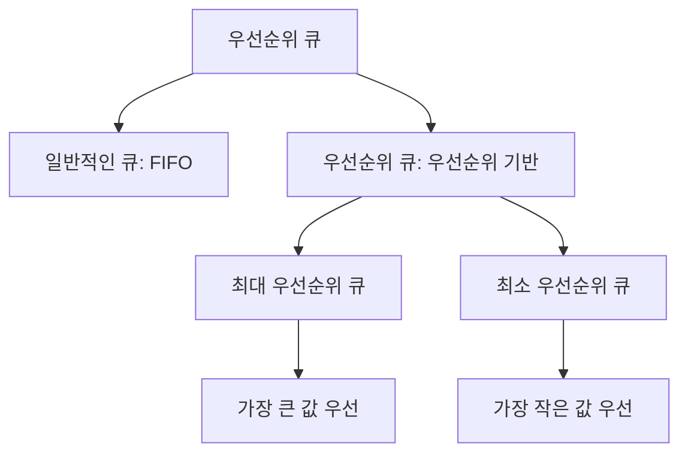
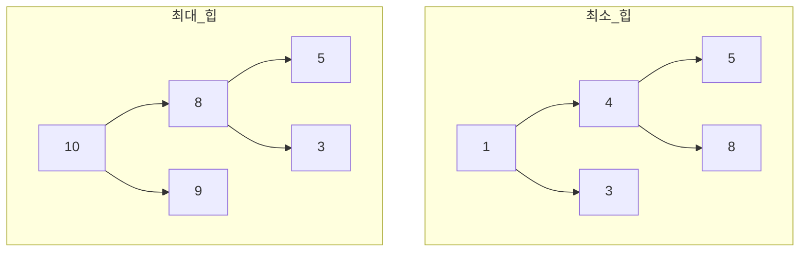
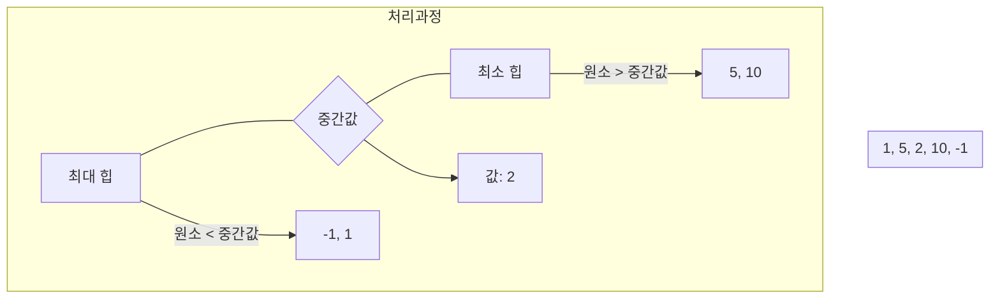

# 4. 우선순위 큐와 힙 🌲

## 목차
- [4. 우선순위 큐와 힙 🌲](#4-우선순위-큐와-힙-)
  - [목차](#목차)
  - [우선순위 큐와 힙 구조 📊](#우선순위-큐와-힙-구조-)
    - [우선순위 큐란?](#우선순위-큐란)
    - [배열로 단순 구현한 경우](#배열로-단순-구현한-경우)
    - [힙(Heap) 구조를 사용해 구현한 경우](#힙heap-구조를-사용해-구현한-경우)
    - [힙의 시간 복잡도](#힙의-시간-복잡도)
  - [힙을 이용한 문제 풀이 💡](#힙을-이용한-문제-풀이-)
    - [최소 힙 구현](#최소-힙-구현)
    - [최대 힙 구현](#최대-힙-구현)
    - [절댓값 힙](#절댓값-힙)
    - [힙 정렬](#힙-정렬)
    - [택배 박스 합치기 🚚](#택배-박스-합치기-)
    - [중간값 찾기 🎯](#중간값-찾기-)
      - [해결 전략](#해결-전략)
  - [힙의 활용 사례 🔍](#힙의-활용-사례-)
    - [다익스트라 알고리즘](#다익스트라-알고리즘)
    - [허프만 코딩](#허프만-코딩)
  - [파이썬의 heapq 모듈 활용하기 🐍](#파이썬의-heapq-모듈-활용하기-)
    - [기본 사용법](#기본-사용법)
    - [응용: K번째 큰 요소 찾기](#응용-k번째-큰-요소-찾기)
  - [요약 📝](#요약-)

---

## 우선순위 큐와 힙 구조 📊

### 우선순위 큐란?

**우선순위 큐(Priority Queue)** 는 일반 큐와 달리, **우선순위가 높은 요소를 먼저 꺼내는** 자료구조다. 출력 시 가장 높은 우선순위를 가진 원소가 먼저 반환되며, 이를 위해 일반적인 큐와는 다른 구조가 필요하다.



### 배열로 단순 구현한 경우

```python
data = [1, 5, 4, 3]
# 출력 과정: 가장 큰 수부터 꺼냄
output = sorted(data, reverse=True)  # [5, 4, 3, 1]
```

| 연산 | 시간 복잡도 | 설명 |
|------|------------|------|
| 입력 | O(1) | 배열 끝에 요소 추가 |
| 출력 | O(n) | 정렬이 필요하므로 비효율적 |

### 힙(Heap) 구조를 사용해 구현한 경우

**힙**은 **완전 이진 트리** 형태로, 최대값 또는 최소값을 빠르게 찾기 위해 사용된다.

- **최소 힙(Min Heap)**: 부모 노드가 항상 자식보다 작음
- **최대 힙(Max Heap)**: 부모 노드가 항상 자식보다 큼



파이썬 `heapq`는 **최소 힙**만 지원하며, 최대 힙은 값을 음수로 바꾸는 방식으로 사용한다.

```python
import heapq

heap = []
heapq.heappush(heap, 3)
heapq.heappush(heap, 1)
heapq.heappush(heap, 5)

print(heapq.heappop(heap))  # 출력: 1
```

### 힙의 시간 복잡도

| 연산 | 시간 복잡도 | 설명 |
|------|------------|------|
| 삽입 | O(log n) | 완전 이진 트리의 깊이만큼 비교 필요 |
| 삭제 | O(log n) | 루트 제거 후 재정렬 필요 |
| 조회 | O(1) | 최소/최대값 바로 확인 가능 |

---

## 힙을 이용한 문제 풀이 💡

### 최소 힙 구현

배열을 이용해 직접 **최소 힙**을 구현하며, 자식-부모 관계는 인덱스를 기반으로 계산할 수 있다.

```python
class MinHeap:
    def __init__(self):
        self.heap = [0]  # 인덱스 0은 사용하지 않음
        
    def push(self, val):
        self.heap.append(val)
        i = len(self.heap) - 1
        
        # 부모와 비교하며 위로 이동
        while i > 1 and self.heap[i] < self.heap[i//2]:
            self.heap[i], self.heap[i//2] = self.heap[i//2], self.heap[i]
            i = i // 2
    
    def pop(self):
        if len(self.heap) <= 1:
            return None
        
        min_val = self.heap[1]
        self.heap[1] = self.heap[-1]
        self.heap.pop()
        self._sift_down(1)
        
        return min_val
    
    def _sift_down(self, i):
        smallest = i
        left = 2 * i
        right = 2 * i + 1
        
        if left < len(self.heap) and self.heap[left] < self.heap[smallest]:
            smallest = left
            
        if right < len(self.heap) and self.heap[right] < self.heap[smallest]:
            smallest = right
            
        if smallest != i:
            self.heap[i], self.heap[smallest] = self.heap[smallest], self.heap[i]
            self._sift_down(smallest)
```

### 최대 힙 구현

최소 힙 구조를 활용하되, 모든 값을 **음수로 저장**하여 최대 힙처럼 동작하도록 구현한다.

```python
import heapq

class MaxHeap:
    def __init__(self):
        self.heap = []
        
    def push(self, val):
        # 값을 음수로 저장
        heapq.heappush(self.heap, -val)
        
    def pop(self):
        if not self.heap:
            return None
        # 값을 다시 양수로 변환
        return -heapq.heappop(self.heap)
```

### 절댓값 힙

우선순위 기준을 단순한 숫자 크기가 아니라 **절댓값**으로 변경한 힙. 값이 같으면 원래 값의 크기로 비교.

```python
import heapq

# 절댓값 힙 예시
abs_heap = []
values = [1, -3, 2, -5, 4]

# (절댓값, 원래값) 쌍으로 저장
for val in values:
    heapq.heappush(abs_heap, (abs(val), val))

# 절댓값이 작은 순서대로 출력
while abs_heap:
    _, original = heapq.heappop(abs_heap)
    print(original, end=" ")  # 출력: 1 2 -3 4 -5
```

### 힙 정렬

힙에 모든 데이터를 넣고 다시 꺼내 정렬된 리스트를 얻는다.

```python
import heapq

nums = [6, 1, 10, 3]
heap = []
for n in nums:
    heapq.heappush(heap, n)
result = [heapq.heappop(heap) for _ in range(len(heap))]  # 오름차순 정렬
```

- 전체 시간 복잡도: `O(n log n)`

### 택배 박스 합치기 🚚

여러 개의 택배 박스를 하나로 합치는 작업을 한다.  
두 박스를 합칠 때는 **두 박스 무게의 합만큼의 비용**이 발생한다.  
**전체 비용이 최소가 되도록** 모든 박스를 하나로 합쳐야 한다.

가장 가벼운 박스 2개를 계속해서 골라 합치면 된다.  
이때 힙을 사용하면 매번 최소값 2개를 빠르게 선택할 수 있다.

```python
import heapq

# 택배 박스 무게 리스트
boxes = [2, 5, 3, 7]
heapq.heapify(boxes)  # 리스트를 힙으로 변환
result = 0

# 합치는 과정
while len(boxes) > 1:
    a = heapq.heappop(boxes)  # 가장 가벼운 박스
    b = heapq.heappop(boxes)  # 두 번째로 가벼운 박스
    total = a + b
    result += total  # 비용 추가
    heapq.heappush(boxes, total)  # 합친 박스를 다시 힙에 추가

print(f"최소 비용: {result}")  # 최소 비용 출력
```

### 중간값 찾기 🎯

입력값이 순차적으로 들어올 때마다 현재까지의 **중간값**을 즉시 출력해야 하는 문제.

#### 해결 전략
- **최대 힙**: 중간값 이하의 값 저장
- **최소 힙**: 중간값 초과의 값 저장
- 최대 힙의 루트 노드가 중간값이 됨



입력마다 두 힙의 크기를 조정하여 밸런스를 유지하면 `O(log n)`에 중간값 계산이 가능하다.

```python
import heapq

class MedianFinder:
    def __init__(self):
        self.low = []  # max heap (음수로 저장)
        self.high = []  # min heap
        
    def add_num(self, num):
        # 삽입 위치 결정
        if not self.low or num <= -self.low[0]:
            heapq.heappush(self.low, -num)
        else:
            heapq.heappush(self.high, num)
        
        # 두 힙의 밸런스 맞추기
        if len(self.low) > len(self.high) + 1:
            heapq.heappush(self.high, -heapq.heappop(self.low))
        elif len(self.high) > len(self.low):
            heapq.heappush(self.low, -heapq.heappop(self.high))
    
    def find_median(self):
        if len(self.low) > len(self.high):
            return -self.low[0]
        else:
            return (-self.low[0] + self.high[0]) / 2

# 사용 예시
finder = MedianFinder()
nums = [2, 1, 5, 7, 2, 0, 5]
medians = []

for num in nums:
    finder.add_num(num)
    medians.append(finder.find_median())
    
print(medians)  # 각 단계의 중간값 출력
```

## 힙의 활용 사례 🔍

### 다익스트라 알고리즘
- 최단 경로 찾기에 사용
- 힙을 사용하여 최소 거리를 가진 노드 빠르게 선택

### 허프만 코딩
- 데이터 압축 알고리즘
- 빈도수가 낮은 문자부터 처리 (최소 힙 활용)

## 파이썬의 heapq 모듈 활용하기 🐍

### 기본 사용법

```python
import heapq

# 빈 리스트로 시작
heap = []

# 요소 추가
heapq.heappush(heap, 4)
heapq.heappush(heap, 1)
heapq.heappush(heap, 7)
heapq.heappush(heap, 3)

# 최솟값 확인 (제거 없이)
print(heap[0])  # 1

# 요소를 제거하면서 반환
print(heapq.heappop(heap))  # 1
print(heapq.heappop(heap))  # 3

# 기존 리스트를 힙으로 변환
numbers = [5, 8, 2, 4, 3]
heapq.heapify(numbers)
print(numbers)  # [2, 3, 5, 4, 8]
```

### 응용: K번째 큰 요소 찾기

```python
def find_kth_largest(nums, k):
    # k 크기의 최소 힙 유지
    min_heap = []
    for num in nums:
        if len(min_heap) < k:
            heapq.heappush(min_heap, num)
        elif num > min_heap[0]:
            heapq.heappop(min_heap)
            heapq.heappush(min_heap, num)
    
    return min_heap[0]  # k번째로 큰 요소

# 예시
nums = [3, 2, 1, 5, 6, 4]
k = 2
print(f"{k}번째 큰 요소: {find_kth_largest(nums, k)}")  # 5
```

## 요약 📝

| 구분 | 설명 | 시간 복잡도 |
|------|------|------------|
| 우선순위 큐 | 우선순위 높은 요소가 먼저 나오는 자료구조 | - |
| 배열 구현 | 단순하지만 효율성 낮음 | 출력: O(n) |
| 힙 구현 | 완전 이진 트리 기반, 효율적 | 삽입/삭제: O(log n) |
| 활용사례 | 스케줄링, 경로 탐색, 허프만 인코딩 | - |

힙은 최소/최대값을 빠르게 얻을 수 있는 효율적인 자료구조로,  
우선순위 기반 처리가 필요한 알고리즘에서 핵심적인 역할을 합니다.
