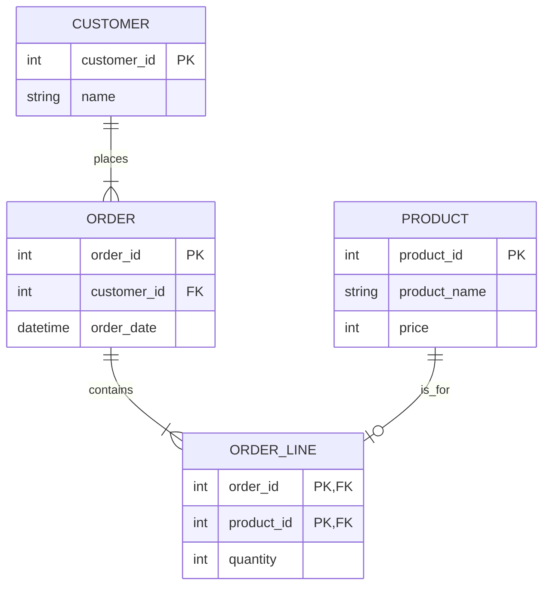

# 2. 데이터베이스 설계의 첫걸음: 모델링과 ERD 🏗️

## 목차
- [2. 데이터베이스 설계의 첫걸음: 모델링과 ERD 🏗️](#2-데이터베이스-설계의-첫걸음-모델링과-erd-️)
  - [목차](#목차)
  - [데이터 무결성과 제약조건](#데이터-무결성과-제약조건)
  - [관계의 핵심: 기본 키와 외래 키](#관계의-핵심-기본-키와-외래-키)
  - [데이터 모델링: 현실을 데이터 구조로](#데이터-모델링-현실을-데이터-구조로)
  - [ERD: 데이터 구조의 시각적 설계도](#erd-데이터-구조의-시각적-설계도)
    - [관계의 종류: 1:1, 1:N, N:M](#관계의-종류-11-1n-nm)
    - [IE 표기법으로 ERD 읽기](#ie-표기법으로-erd-읽기)

---

## 데이터 무결성과 제약조건

**데이터 무결성(Data Integrity)** 이란 데이터베이스 내의 데이터가 항상 정확하고 일관된 상태를 유지하는 것을 의미합니다. 이를 보장하기 위해, 테이블의 열에 특정 규칙을 강제하는 **제약조건(Constraint)** 을 설정합니다.

| 제약조건 | 설명 | SQL 예시 |
|---|---|---|
| **`NOT NULL`** | 해당 열에 `NULL` 값이 들어올 수 없음을 보장합니다. | `name VARCHAR(50) NOT NULL` |
| **`UNIQUE`** | 해당 열의 모든 값이 고유해야 함을 보장합니다. (중복 방지) | `email VARCHAR(100) UNIQUE` |
| **`PRIMARY KEY`** | `NOT NULL`과 `UNIQUE` 제약조건을 모두 가지며, 테이블의 각 행을 고유하게 식별합니다. 테이블당 하나만 지정 가능합니다. | `user_id INT PRIMARY KEY` |
| **`FOREIGN KEY`** | 한 테이블의 열이 다른 테이블의 기본 키(PK)를 참조하도록 하여, 두 테이블 간의 관계를 보장합니다. | `FOREIGN KEY (user_id) REFERENCES users(id)` |
| **`CHECK`** | 해당 열에 들어올 수 있는 값의 조건을 지정합니다. | `age INT CHECK (age >= 19)` |
| **`DEFAULT`** | 값이 명시적으로 입력되지 않았을 때 사용할 기본값을 지정합니다. | `role VARCHAR(10) DEFAULT 'user'` |

> 제약조건을 DB 수준에서 설정하면, 애플리케이션 코드의 실수로 인해 잘못된 데이터가 저장되는 것을 원천적으로 방지하여 데이터 품질을 높일 수 있습니다.

---

## 관계의 핵심: 기본 키와 외래 키

관계형 데이터베이스(RDB)의 가장 중요한 특징은 테이블 간의 **관계(Relationship)** 를 맺는 것입니다. 이 관계는 **키(Key)** 를 통해 정의됩니다.

- **기본 키 (Primary Key, PK)** : 테이블의 각 행(row)을 **고유하게 식별**할 수 있는 열(column)입니다. (예: `user` 테이블의 `user_id`)
- **외래 키 (Foreign Key, FK)** : 한 테이블의 열이 다른 테이블의 **기본 키를 참조**하는 것입니다. 이를 통해 두 테이블이 연결됩니다. (예: `orders` 테이블의 `user_id`는 `users` 테이블의 `user_id`를 참조)

```sql
CREATE TABLE users (
    user_id INT PRIMARY KEY, -- 기본 키
    username VARCHAR(50) NOT NULL
);

CREATE TABLE orders (
    order_id INT PRIMARY KEY,
    order_details VARCHAR(255),
    user_id INT, -- 외래 키
    -- orders 테이블의 user_id가 users 테이블의 user_id를 참조함을 명시
    FOREIGN KEY (user_id) REFERENCES users(user_id) 
);
```

---

## 데이터 모델링: 현실을 데이터 구조로

**데이터 모델링**은 우리가 만들려는 서비스나 시스템의 정보들을 분석하여, 데이터베이스의 테이블 구조로 표현하는 설계 과정 전체를 의미합니다.

- **주요 구성 요소**:
    - **엔티티 (Entity)** : 저장해야 할 데이터의 대상. (예: 회원, 상품, 주문) -> 테이블
    - **속성 (Attribute)** : 엔티티가 가지는 정보. (예: 회원의 이름, 나이, 주소) -> 열(Column)
    - **관계 (Relationship)** : 엔티티 간의 상호작용. (예: 회원이 상품을 주문한다) -> 외래 키(FK)

---

## ERD: 데이터 구조의 시각적 설계도

**ERD(Entity-Relationship Diagram)** 는 데이터 모델링의 결과를 시각적인 다이어그램으로 표현한 설계도입니다. ERD를 통해 시스템의 데이터 구조와 관계를 한눈에 파악하고, 관계자들과 소통할 수 있습니다.

### 관계의 종류: 1:1, 1:N, N:M

- **1:1 (일대일)** : 엔티티 A의 한 인스턴스가 엔티티 B의 한 인스턴스와만 관계를 맺음. (예: `사용자`와 `사용자_프로필`)
- **1:N (일대다)** : 엔티티 A의 한 인스턴스가 엔티티 B의 여러 인스턴스와 관계를 맺음. (예: 하나의 `고객`은 여러 개의 `주문`을 할 수 있음)
- **N:M (다대다)** : 엔티티 A의 여러 인스턴스가 엔티티 B의 여러 인스턴스와 관계를 맺음. (예: 하나의 `학생`은 여러 `과목`을 수강하고, 하나의 `과목`은 여러 `학생`이 수강함)

> **N:M 관계의 해소**: 관계형 데이터베이스에서는 N:M 관계를 직접 표현할 수 없습니다. 따라서 두 엔티티의 기본 키를 외래 키로 갖는 별도의 **연결 테이블(Junction Table)** 을 만들어, 두 개의 1:N 관계로 분해해야 합니다. (예: `수강_내역` 테이블)

### IE 표기법으로 ERD 읽기

실무에서 널리 쓰이는 IE(Information Engineering) 표기법은 관계를 선과 기호로 표현합니다.


- **관계선 읽기**:
    - `|` (실선): 필수 관계 (반드시 존재해야 함)
    - `o` (원): 선택 관계 (존재할 수도, 안 할 수도 있음)
    - `<` (까마귀발): 다수(Many)를 의미
- **해석**:
    - `CUSTOMER ||--|{ ORDER`: 한 명의 고객(`|`)은 여러 개의 주문(`{`)을 할 수 있다. 주문은 반드시 고객을 가져야 한다(`|`).
    - `PRODUCT ||--o| ORDER_LINE`: 하나의 상품(`|`)은 주문 내역에 없을 수도(`o`) 있다.
    - `ORDER_LINE`: `ORDER`와 `PRODUCT`의 N:M 관계를 해소하기 위한 연결 테이블.