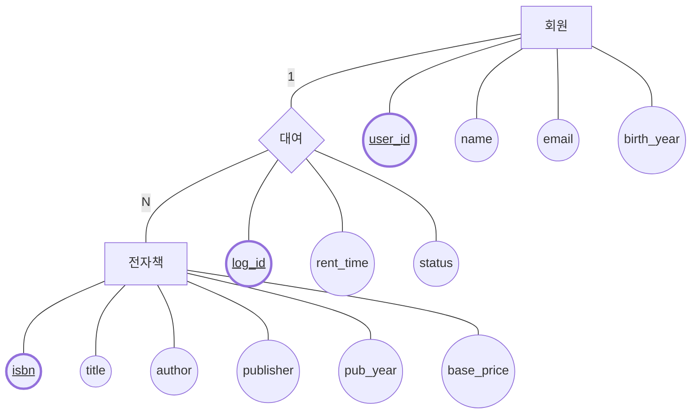
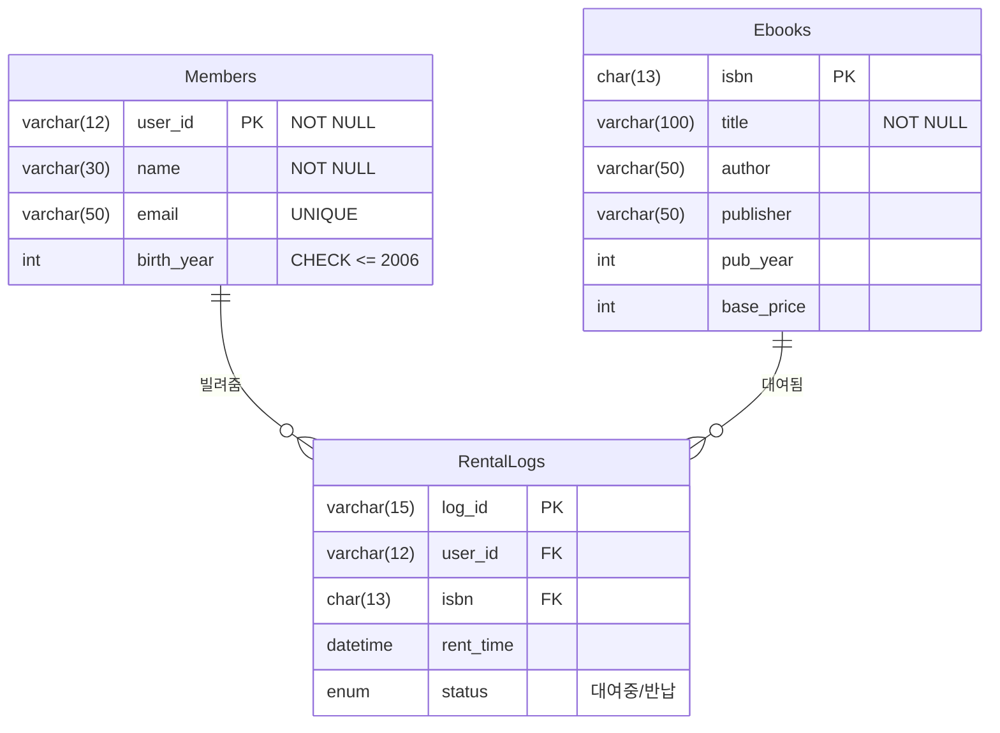

# 2. 데이터베이스 구성하기 🏗️

## 목차
- [2. 데이터베이스 구성하기 🏗️](#2-데이터베이스-구성하기-️)
  - [목차](#목차)
  - [제약조건: 데이터의 신뢰성을 유지하라 🔒](#제약조건-데이터의-신뢰성을-유지하라-)
  - [키: 데이터 관계 정의하기 🔑](#키-데이터-관계-정의하기-)
  - [데이터 모델링: 정보를 데이터베이스 구조로 📊](#데이터-모델링-정보를-데이터베이스-구조로-)
    - [구성 요소](#구성-요소)
    - [모델링 단계](#모델링-단계)
  - [Peter Chen의 ERD 📝](#peter-chen의-erd-)
    - [기호 의미](#기호-의미)
    - [관계 유형](#관계-유형)
    - [예시 요구사항 (전자책 대여 시스템)](#예시-요구사항-전자책-대여-시스템)
    - [Chen ERD 다이어그램](#chen-erd-다이어그램)
  - [IE 모델식 ERD 📋](#ie-모델식-erd-)
    - [예시 테이블](#예시-테이블)
    - [IE 모델 다이어그램](#ie-모델-다이어그램)
    - [관계 설정](#관계-설정)

---

## 제약조건: 데이터의 신뢰성을 유지하라 🔒

**제약조건(Constraint)** 은 잘못된 데이터 입력을 방지하고, 데이터의 일관성과 신뢰성을 유지하기 위해 사용된다.

```sql
-- NOT NULL: 값은 반드시 존재해야 함
username VARCHAR(20) NOT NULL;

-- UNIQUE: 값이 중복될 수 없음
email VARCHAR(50) UNIQUE;

-- DEFAULT: 기본값 설정
membership_status VARCHAR(15) DEFAULT 'standard';

-- CHECK: 특정 조건을 만족해야 함
birth_year INT CHECK (birth_year <= 2006);

-- 명시적 이름 부여
CONSTRAINT chk_birth CHECK (birth_year <= 2006)
```

**제약조건 수정 및 삭제 예:**

```sql
ALTER TABLE members ADD CONSTRAINT uniq_email UNIQUE (email);
ALTER TABLE members ALTER membership_status SET DEFAULT 'standard';
ALTER TABLE members DROP CONSTRAINT chk_birth;
ALTER TABLE members ALTER membership_status DROP DEFAULT;
```

> 참고: 제약조건은 데이터베이스 설계 시 데이터의 품질을 보장하는 중요한 요소이다. 적절한 제약조건을 통해 프로그램 로직에 의존하지 않고도 데이터 무결성을 유지할 수 있다.

---

## 키: 데이터 관계 정의하기 🔑

테이블에서 **데이터를 식별하거나 관계를 정의**하기 위해 사용하는 속성이다.

| 키 유형 | 설명 |
|--------|------|
| **기본 키(Primary Key)** | 중복 불가, NULL 불가, 테이블당 1개 |
| **외래 키(Foreign Key)** | 다른 테이블의 기본 키를 참조 |
| **후보 키(Candidate Key)** | 기본 키가 될 수 있는 속성 집합 |
| **대체 키(Alternate Key)** | 후보 키 중 선택되지 않은 키 |
| **슈퍼 키(Super Key)** | 유일성은 있으나 최소성을 만족하지는 않는 키 |

```sql
CREATE TABLE members (
  user_id VARCHAR(12) PRIMARY KEY,
  name VARCHAR(30)
);

CREATE TABLE rental_logs (
  log_id VARCHAR(15),
  user_id VARCHAR(12),
  FOREIGN KEY (user_id) REFERENCES members(user_id)
);
```

**무결성 제약조건**
- **개체 무결성**: 기본 키는 NULL이나 중복을 허용하지 않음
- **참조 무결성**: 외래 키는 참조되는 기본 키가 존재해야 함
- **도메인 무결성**: 속성 값은 정의된 도메인 범위 내여야 함
- **고유 무결성**: 특정 속성 값들은 서로 달라야 함

> 참고: 키는 데이터베이스의 테이블 간 관계를 정의하고 데이터 접근의 효율성을 높이는 핵심 요소이다. 특히 외래 키는 관계형 데이터베이스의 가장 중요한 특징 중 하나이다.

---

## 데이터 모델링: 정보를 데이터베이스 구조로 📊

**데이터 모델링**은 현실 세계의 정보를 추상화하여 데이터베이스 구조로 표현하는 과정이다.

### 구성 요소
- **개체(Entity)**: 정보를 나타내는 실체 (예: 사용자, 전자책)
- **속성(Attribute)**: 개체의 성질 또는 정보 (예: 사용자명, 출판년도)
- **관계(Relationship)**: 개체 간의 연관성 (예: 사용자는 전자책을 대여한다)

### 모델링 단계
1. **개념적 설계**: ER 다이어그램 등으로 추상화
2. **논리적 설계**: 데이터베이스 스키마로 구현
3. **물리적 설계**: 실제 테이블과 저장 방식 설계

> 참고: 데이터 모델링은 시스템 개발 초기 단계에서 매우 중요한 작업으로 나중에 변경하기 어려운 부분이므로 충분한 시간을 투자해야 한다.

---

## Peter Chen의 ERD 📝

**Peter Chen ERD**는 현실의 개체와 관계를 시각화하여 표현한다.

### 기호 의미
- **사각형**: 개체(Entity)
- **타원**: 속성(Attribute)
- **마름모**: 관계(Relationship)
- **밑줄 속성**: 기본 키

### 관계 유형
- **1:1 관계**
- **1:N 관계**
- **N:M 관계** → 별도 테이블로 분리

### 예시 요구사항 (전자책 대여 시스템)
- 회원가입 시 ID, 비밀번호, 이메일, 생년월일을 입력
- 전자책은 고유 ISBN, 제목, 저자, 출판사, 출판년도를 가진다
- 회원은 한 번에 하나의 전자책만 대여 가능
- 전자책의 대여료는 출판사에 따라 다름

### Chen ERD 다이어그램



**다이어그램 설명:**
위 다이어그램은 Peter Chen 표기법을 사용한 ER 다이어그램으로, 전자책 대여 시스템의 개념적 모델을 보여준다.
- **직사각형(Member, Ebook)**: 주요 개체(Entity)를 표현
- **마름모(Rental)**: 개체 간의 관계를 나타냄
- **원형(user_id, name 등)**: 각 개체의 속성(Attribute)을 표현
- **선 위 숫자("1", "N")**: 관계의 카디널리티를 표시 - 회원 1명은 여러 전자책을 대여할 수 있음
- **밑줄 표시된 속성**: 각 개체의 기본 키(Primary Key) 표시

이 다이어그램은 데이터베이스 구현 이전 단계에서 시스템의 구조를 명확히 파악하는 데 도움이 된다.

> 참고: ER 다이어그램은 데이터베이스를 설계하기 전 시스템의 데이터 구조를 시각적으로 표현하는데 매우 효과적인 도구이다. Peter Chen의 표기법은 학문적으로 널리 사용된다.

---

## IE 모델식 ERD 📋

**IE 모델**은 속성에 데이터 타입, 제약조건까지 표현하는 ERD 표기법이다.

### 예시 테이블

```
Members
- PK user_id : VARCHAR(12) NOT NULL
- name : VARCHAR(30) NOT NULL
- email : VARCHAR(50) UNIQUE
- birth_year : INT CHECK (birth_year <= 2006)

Ebooks
- PK isbn : CHAR(13)
- title : VARCHAR(100) NOT NULL
- author : VARCHAR(50)
- publisher : VARCHAR(50)
- pub_year : INT
- base_price : INT

RentalLogs
- PK log_id : VARCHAR(15)
- FK user_id : VARCHAR(12)
- FK isbn : CHAR(13)
- rent_time : DATETIME
- status : ENUM('대여중', '반납')
```

### IE 모델 다이어그램



**다이어그램 설명:**
이 IE 모델 다이어그램은 전자책 대여 시스템의 논리적/물리적 설계를 표현한다.

- **테이블 구조**: 각 테이블(Members, Ebooks, RentalLogs)은 직사각형으로 표현
- **열 정보**: 
  - 각 열의 데이터 타입(varchar, int 등)과 제약조건(PK, FK, NOT NULL 등)을 명시
  - PK는 기본 키, FK는 외래 키를 의미
- **테이블 간 관계**: 
  - `||--o{` 표기는 일대다(1:N) 관계를 나타냄 (Members-RentalLogs, Ebooks-RentalLogs)
  - `빌려줌`, `대여됨`은 관계에 대한 설명
- **관계의 표현**: Members와 Ebooks는 RentalLogs 테이블을 통해 연결됨(다대다 관계를 위한 중간 테이블)

이 다이어그램은 실제 데이터베이스 구현에 직접적으로 활용될 수 있는 상세 정보를 포함하고 있다.

### 관계 설정

```sql
CREATE TABLE rental_logs (
  log_id VARCHAR(15) PRIMARY KEY,
  user_id VARCHAR(12),
  isbn CHAR(13),
  rent_time DATETIME,
  status ENUM('대여중', '반납'),
  FOREIGN KEY (user_id) REFERENCES members(user_id),
  FOREIGN KEY (isbn) REFERENCES ebooks(isbn)
);
```

> 참고: IE 모델식 ERD는 실무에서 가장 많이 사용되는 표기법 중 하나로, 개체의 속성과 관계를 더욱 구체적으로 표현할 수 있다.

---
