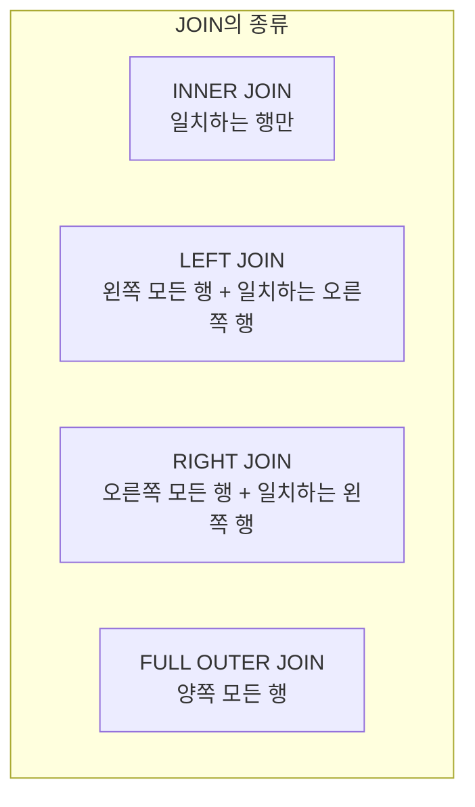

# 2. 여러 테이블 합치기 (JOIN)

## 목차
- [2. 여러 테이블 합치기 (JOIN)](#2-여러-테이블-합치기-join)
  - [목차](#목차)
  - [JOIN이란?: 흩어진 데이터를 연결하는 기술](#join이란-흩어진-데이터를-연결하는-기술)
  - [INNER JOIN: 두 테이블의 교집합](#inner-join-두-테이블의-교집합)
    - [테이블 별칭(Alias) 사용하기](#테이블-별칭alias-사용하기)
  - [OUTER JOIN: 한쪽을 기준으로 데이터 합치기](#outer-join-한쪽을-기준으로-데이터-합치기)
    - [LEFT JOIN](#left-join)
    - [RIGHT JOIN](#right-join)
    - [FULL OUTER JOIN](#full-outer-join)
  - [JOIN의 활용: 원하는 데이터만 찾아내기](#join의-활용-원하는-데이터만-찾아내기)

---

## JOIN이란?: 흩어진 데이터를 연결하는 기술

정규화를 통해 잘 설계된 데이터베이스에서는 데이터가 여러 테이블에 나뉘어 저장됩니다. (예: `고객` 테이블, `주문` 테이블) **`JOIN`**은 이렇게 분리된 테이블들을 **공통된 열(key)을 기준**으로 다시 합쳐서, 하나의 완성된 데이터처럼 조회할 수 있게 해주는 강력한 SQL 기능입니다.

`JOIN`의 기본 원리는 한 테이블의 모든 행과 다른 테이블의 모든 행을 짝지어보는 **데카르트 곱(Cartesian Product)** 에서 시작하여, `ON` 절에 명시된 조인 조건을 만족하는 행들만 남기는 것입니다.

---

## INNER JOIN: 두 테이블의 교집합

**`INNER JOIN`**은 두 테이블을 연결할 때, **양쪽 테이블에 모두 조인 조건과 일치하는 데이터가 존재하는 행들만** 결과에 포함시킵니다. 가장 기본적이고 널리 사용되는 조인 방식입니다.

```sql
-- 주문(orders) 테이블과 고객(customers) 테이블을
-- 공통된 열인 customer_id를 기준으로 합쳐서,
-- 주문한 고객의 이름과 주문 내역을 함께 조회
SELECT
    o.order_id,
    c.customer_name,
    o.order_date
FROM
    orders AS o
INNER JOIN
    customers AS c ON o.customer_id = c.customer_id;
```

### 테이블 별칭(Alias) 사용하기

`JOIN`을 사용하면 쿼리가 길어지고, 여러 테이블에 동일한 이름의 열이 존재할 수 있습니다. 이때 **`AS`** (또는 공백)를 사용하여 테이블 이름에 **짧은 별칭**을 부여하면, 쿼리를 훨씬 더 간결하고 명확하게 만들 수 있습니다. 위 예시의 `orders AS o`, `customers AS c`가 바로 그것입니다.

---

## OUTER JOIN: 한쪽을 기준으로 데이터 합치기

`OUTER JOIN`은 조인 조건이 일치하지 않더라도, 특정 테이블의 행은 모두 결과에 포함시키고 싶을 때 사용합니다. 일치하는 데이터가 없는 쪽은 `NULL`로 채워집니다.

### LEFT JOIN

**`LEFT JOIN`**은 **왼쪽 테이블(먼저 선언된 테이블)의 모든 행**을 결과에 포함시키고, 오른쪽 테이블에서 조인 조건에 맞는 데이터를 붙입니다. 오른쪽 테이블에 일치하는 데이터가 없으면 `NULL`이 표시됩니다.

```sql
-- "모든 고객"의 목록을 보여주되, "주문 내역이 있다면" 함께 보여줘
SELECT
    c.customer_name,
    o.order_id,
    o.order_date
FROM
    customers AS c
LEFT JOIN
    orders AS o ON c.customer_id = o.customer_id;
```
> 이 쿼리 결과에는 주문을 한 번도 하지 않은 고객도 포함되며, 해당 고객의 `order_id`와 `order_date`는 `NULL`로 표시됩니다.

### RIGHT JOIN

**`RIGHT JOIN`**은 `LEFT JOIN`과 반대로, **오른쪽 테이블(나중에 선언된 테이블)의 모든 행**을 결과에 포함시킵니다.

> **실무 팁**: `RIGHT JOIN`은 테이블의 순서를 바꿔 `LEFT JOIN`으로 동일하게 표현할 수 있기 때문에, 코드의 일관성을 위해 `LEFT JOIN`을 사용하는 것을 더 선호하는 경향이 있습니다.

### FULL OUTER JOIN

**`FULL OUTER JOIN`**은 **양쪽 테이블의 모든 행**을 결과에 포함시킵니다. `LEFT JOIN`과 `RIGHT JOIN`을 합친 것과 같습니다. 조인 조건이 일치하지 않는 쪽은 모두 `NULL`로 채워집니다. (일부 DBMS에서는 지원하지 않을 수 있습니다.)



---

## JOIN의 활용: 원하는 데이터만 찾아내기

`LEFT JOIN`과 `WHERE ... IS NULL` 조건을 조합하면, 특정 행동을 '하지 않은' 대상을 효과적으로 찾아낼 수 있습니다.

```sql
-- "한 번도 주문한 적 없는 고객" 목록 찾기
SELECT
    c.customer_name
FROM
    customers AS c
LEFT JOIN
    orders AS o ON c.customer_id = o.customer_id
WHERE
    o.order_id IS NULL; -- 주문 내역이 존재하지 않는(NULL) 고객만 필터링
```
이 패턴은 "강의를 신청했지만 수강하지 않은 학생", "로그인은 했지만 글을 쓰지 않은 회원" 등 데이터 분석에서 매우 유용하게 사용됩니다.
