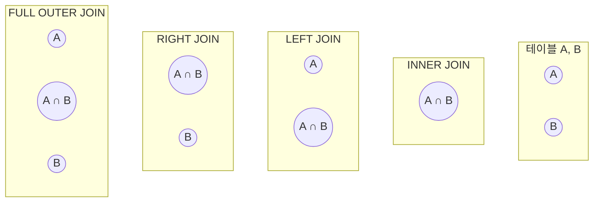

# 2. 특수 조인(JOIN) 기법

## 목차
- [2. 특수 조인(JOIN) 기법](#2-특수-조인join-기법)
  - [목차](#목차)
  - [JOIN 복습: INNER JOIN vs. OUTER JOIN](#join-복습-inner-join-vs-outer-join)
  - [셀프 조인 (SELF JOIN): 자기 자신과의 관계](#셀프-조인-self-join-자기-자신과의-관계)
  - [CROSS JOIN: 모든 경우의 수 조합하기](#cross-join-모든-경우의-수-조합하기)
  - [주의해야 할 JOIN 문법: USING과 NATURAL JOIN](#주의해야-할-join-문법-using과-natural-join)
    - [USING 절](#using-절)
    - [NATURAL JOIN](#natural-join)

---

## JOIN 복습: INNER JOIN vs. OUTER JOIN

`JOIN`은 여러 테이블에 흩어져 있는 정보를 연결하여 하나의 결과로 보여주는 핵심적인 기술입니다. 각 `JOIN`이 어떤 데이터를 포함하는지 벤 다이어그램으로 이해하면 쉽습니다.



- **`INNER JOIN`**: 두 테이블에 **모두 존재하는** 데이터만 보여줍니다. (교집합)
- **`LEFT OUTER JOIN`**: **왼쪽 테이블의 모든 데이터**를 기준으로, 오른쪽 테이블의 데이터를 붙입니다. (왼쪽 전체)
- **`RIGHT OUTER JOIN`**: **오른쪽 테이블의 모든 데이터**를 기준으로, 왼쪽 테이블의 데이터를 붙입니다. (오른쪽 전체)
- **`FULL OUTER JOIN`**: **양쪽 테이블의 모든 데이터**를 보여줍니다. (합집합)

---

## 셀프 조인 (SELF JOIN): 자기 자신과의 관계

**셀프 조인**은 물리적으로는 하나의 테이블이지만, 논리적으로는 **두 개의 다른 역할을 하는 테이블이 있는 것처럼** 자기 자신을 자기 자신과 조인하는 기법입니다. 계층 구조 데이터를 다룰 때 매우 유용합니다.

- **핵심**: 반드시 **테이블 별칭(Alias)** 을 사용하여, 같은 테이블을 서로 다른 두 개의 테이블인 것처럼 구분해야 합니다.

**예시: 각 직원의 이름과 그 직원의 관리자 이름 찾기**

`employees` 테이블:
| id | name | manager_id |
|---|---|---|
| 1 | 김사장 | NULL |
| 2 | 이부장 | 1 |
| 3 | 박과장 | 2 |

```sql
-- employees 테이블을 '직원(e)'과 '관리자(m)'라는 두 개의 역할로 분리하여 조인
SELECT
    e.name AS "직원 이름",
    m.name AS "관리자 이름"
FROM
    employees AS e
INNER JOIN
    employees AS m ON e.manager_id = m.id; -- 직원의 관리자ID와 관리자의 직원ID를 연결
```

**결과**:
| 직원 이름 | 관리자 이름 |
|---|---|
| 이부장 | 김사장 |
| 박과장 | 이부장 |

---

## CROSS JOIN: 모든 경우의 수 조합하기

**`CROSS JOIN`**은 조인 조건(`ON` 절) 없이, 한쪽 테이블의 모든 행을 다른 쪽 테이블의 모든 행과 **가능한 모든 조합으로 짝지어** 반환합니다. 그 결과는 `(A 테이블 행의 수) * (B 테이블 행의 수)`가 됩니다. 이를 **데카르트 곱(Cartesian Product)** 이라고 합니다.

**예시: 모든 사이즈의 티셔츠를 모든 색상으로 조합해보기**

`sizes` 테이블: `S, M, L` (3개 행)
`colors` 테이블: `Red, Blue` (2개 행)

```sql
SELECT
    s.size_name,
    c.color_name
FROM
    sizes AS s
CROSS JOIN
    colors AS c;
```

**결과**: (3 * 2 = 6개 행)
| size_name | color_name |
|---|---|
| S | Red |
| S | Blue |
| M | Red |
| M | Blue |
| L | Red |
| L | Blue |

> **⚠️ 경고**: 대용량 테이블에 `CROSS JOIN`을 사용하거나, `INNER JOIN`에서 `ON` 조건을 실수로 빠뜨리면 엄청난 양의 데이터가 생성되어 데이터베이스에 심각한 부하를 줄 수 있으므로 항상 주의해야 합니다.

---

## 주의해야 할 JOIN 문법: USING과 NATURAL JOIN

`ON` 절 대신 조인 조건을 간결하게 표현하는 방법도 있지만, 명확성이 떨어져 실무에서는 사용을 권장하지 않습니다.

### USING 절

두 테이블에서 조인하려는 **열의 이름이 같을 경우**, `ON` 절 대신 `USING(열이름)` 구문을 사용할 수 있습니다.

```sql
-- ON 절 사용 (권장)
SELECT * FROM orders o JOIN customers c ON o.customer_id = c.customer_id;

-- USING 절 사용
SELECT * FROM orders JOIN customers USING (customer_id);
```

### NATURAL JOIN

두 테이블에서 **이름이 같은 모든 열**을 찾아 자동으로 조인합니다. 조인 조건을 전혀 명시하지 않아 매우 편리해 보이지만, 심각한 위험을 내포하고 있습니다.

```sql
SELECT * FROM orders NATURAL JOIN customers;
```

> **⚠️ 절대 사용하지 마세요!**: `NATURAL JOIN`은 매우 위험합니다. 나중에 누군가 두 테이블에 의도치 않게 이름이 같은 열(예: `updated_at`)을 추가하면, 이 열까지 조인 조건에 포함되어 **쿼리 결과가 예고 없이 완전히 바뀌어 버릴 수 있습니다.** 조인 조건은 번거롭더라도, 항상 **`ON` 절에 명시적으로 작성**하는 것이 가장 안전하고 명확한 방법입니다.