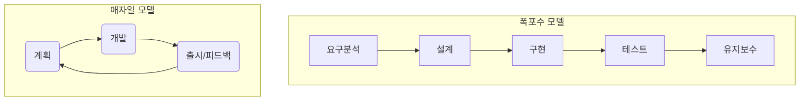
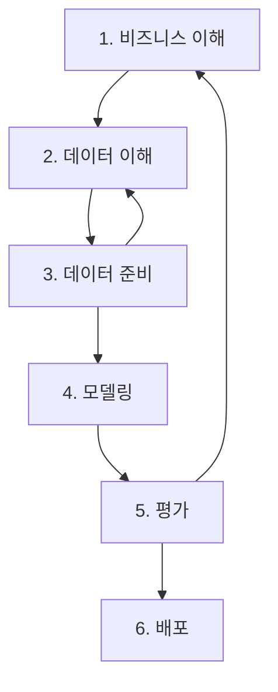

# 1. 소프트웨어 공학: 체계적인 개발의 모든 것 🔧

## 목차
- [1. 소프트웨어 공학: 체계적인 개발의 모든 것 🔧](#1-소프트웨어-공학-체계적인-개발의-모든-것-)
  - [목차](#목차)
  - [소프트웨어 공학이란 무엇인가?](#소프트웨어-공학이란-무엇인가)
    - [소프트웨어 위기와 공학적 접근의 필요성](#소프트웨어-위기와-공학적-접근의-필요성)
  - [소프트웨어 개발 생명주기 (SDLC)](#소프트웨어-개발-생명주기-sdlc)
  - [데이터 과학 프로젝트와 소프트웨어 공학](#데이터-과학-프로젝트와-소프트웨어-공학)
    - [데이터 과학 프로젝트의 특징](#데이터-과학-프로젝트의-특징)
    - [데이터 과학을 위한 프로세스 모델: CRISP-DM](#데이터-과학을-위한-프로세스-모델-crisp-dm)
  - [좋은 소프트웨어의 조건](#좋은-소프트웨어의-조건)

---

## 소프트웨어 공학이란 무엇인가?

**소프트웨어 공학(Software Engineering)** 은 단순히 코드를 작성하는 기술을 넘어, **소프트웨어를 개발, 운영, 유지보수하는 전 과정**에 적용되는 체계적이고, 공학적인 원리와 기술, 도구를 총칭하는 학문입니다.

궁극적인 목표는 **최소의 비용과 시간**으로, 사용자의 요구를 만족시키는 **품질 높은 소프트웨어**를 만들어내는 것입니다.

### 소프트웨어 위기와 공학적 접근의 필요성

과거 1960년대, 하드웨어는 급격히 발전했지만 소프트웨어 개발 기술은 이를 따라가지 못했습니다. 이로 인해 프로젝트의 **예산 초과, 일정 지연, 낮은 품질, 유지보수의 어려움** 등 심각한 문제들이 발생했는데, 이를 **'소프트웨어 위기(Software Crisis)'**라고 부릅니다.

이러한 위기를 극복하기 위해, 건축이나 기계 공학처럼 소프트웨어 개발에도 체계적인 프로세스와 검증된 방법론, 품질 관리 기법을 도입하려는 '공학적 접근'이 시작되었습니다.

---

## 소프트웨어 개발 생명주기 (SDLC)

**소프트웨어 개발 생명주기(Software Development Life Cycle, SDLC)** 는 소프트웨어를 기획하는 단계부터 폐기하는 단계까지의 전 과정을 여러 단계로 나눈 모델입니다. 어떤 순서와 방식으로 각 단계를 진행하는지에 따라 다양한 프로세스 모델이 존재합니다.

- **전통적인 모델**:
    - **폭포수 모델 (Waterfall Model)** : 요구분석 -> 설계 -> 구현 -> 테스트 -> 유지보수의 각 단계를 순차적으로, 폭포수처럼 진행합니다. 계획이 명확하고 변경이 적은 프로젝트에 적합하지만, 유연성이 떨어집니다.

- **현대적인 모델**:
    - **애자일 모델 (Agile Model)** : '계획 -> 개발 -> 피드백'의 짧은 주기를 계속해서 반복하며, 변화하는 요구사항에 민첩하게 대응합니다. 불확실성이 높은 현대 소프트웨어 개발 환경에서 널리 사용됩니다.

---

## 데이터 과학 프로젝트와 소프트웨어 공학

데이터 분석 코드나 머신러닝 모델도 결국 '소프트웨어'입니다. 따라서 데이터 과학 프로젝트 역시 소프트웨어 공학의 원칙을 따라야 하지만, 일반적인 소프트웨어 개발과는 다른 특징을 가집니다.

### 데이터 과학 프로젝트의 특징

- **불분명한 요구사항**: "데이터에서 의미 있는 인사이트를 찾아주세요" 처럼, 목표가 명확하지 않고 탐색적인 경우가 많습니다.
- **실험 중심**: 다양한 데이터를 탐색하고, 여러 모델을 실험하며, 가설을 검증하는 과정이 핵심입니다.
- **데이터 의존성**: 결과가 코드뿐만 아니라 '데이터'의 품질과 특성에 크게 의존합니다.
- **재현성(Reproducibility)의 중요성**: 동일한 데이터와 코드로 항상 동일한 분석 결과를 재현할 수 있어야 합니다.

### 데이터 과학을 위한 프로세스 모델: CRISP-DM

이러한 특징 때문에, 데이터 과학 프로젝트에서는 전통적인 SDLC 모델보다 **CRISP-DM**과 같은 데이터 마이닝 표준 프로세스 모델이 더 적합합니다.

> CRISP-DM은 비즈니스 문제 이해부터 시작하여, 데이터 준비, 모델링, 평가, 배포의 단계를 거치며, 각 단계의 결과에 따라 이전 단계로 되돌아가 반복적으로 개선하는 유연한 구조를 가집니다.

---

## 좋은 소프트웨어의 조건

소프트웨어 공학이 추구하는 '품질 높은 소프트웨어'란 다음과 같은 특성을 만족하는 소프트웨어를 의미합니다.

- **정확성 & 신뢰성**: 주어진 요구사항에 맞게 정확하게 동작하고, 오류 없이 안정적으로 실행되어야 합니다.
- **유지보수성 & 재사용성**: 다른 개발자가 코드를 쉽게 이해하고, 수정하거나 새로운 기능에 재사용하기 용이해야 합니다. (가독성 높은 코드, 명확한 문서화)
- **효율성**: 시스템 자원(CPU, 메모리)을 낭비하지 않고 효율적으로 사용해야 합니다.
- **보안성**: 외부의 공격이나 위협으로부터 데이터와 시스템을 안전하게 보호해야 합니다.