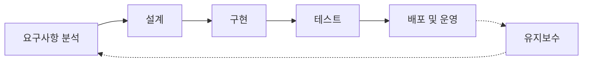
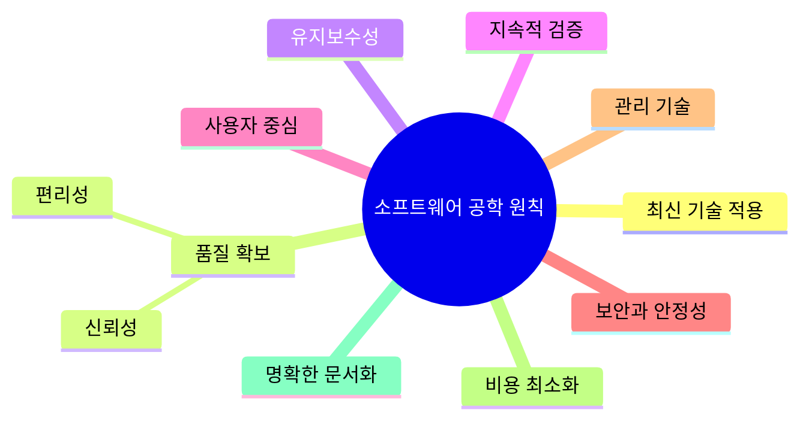
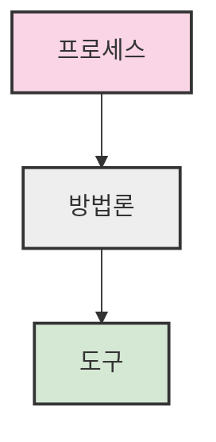

# 1. 소프트웨어 공학 🔧

## 목차
- [1. 소프트웨어 공학 🔧](#1-소프트웨어-공학-)
  - [목차](#목차)
  - [소프트웨어란 무엇인가 💾](#소프트웨어란-무엇인가-)
  - [소프트웨어 공학의 정의 📚](#소프트웨어-공학의-정의-)
  - [소프트웨어 위기와 원인 ⚠️](#소프트웨어-위기와-원인-️)
  - [소프트웨어 위기의 해결 방안 💡](#소프트웨어-위기의-해결-방안-)
    - [품질 향상 전략](#품질-향상-전략)
    - [생산성 향상 전략](#생산성-향상-전략)
    - [관리 기법 강화](#관리-기법-강화)
  - [소프트웨어 생명주기 모델 🔄](#소프트웨어-생명주기-모델-)
  - [소프트웨어 프로세스 모델 📋](#소프트웨어-프로세스-모델-)
  - [소프트웨어 품질 관리 ✅](#소프트웨어-품질-관리-)
  - [소프트웨어 유지보수 🔨](#소프트웨어-유지보수-)
  - [소프트웨어 공학의 기본 원칙 📏](#소프트웨어-공학의-기본-원칙-)
  - [소프트웨어 공학 계층 구조 🏗️](#소프트웨어-공학-계층-구조-️)
  - [소프트웨어 공학의 목표 🎯](#소프트웨어-공학의-목표-)

---

## 소프트웨어란 무엇인가 💾
소프트웨어는 현대 사회의 필수 요소로, 스마트폰, 금융, 의료, 자동차 등 다양한 산업에서 활용된다.  

**나이트 캐피털 사건(2012)** 에서는 단 45분 만에 약 5천억 원 손실이 발생했으며, 원인은 소프트웨어 오류였다. 이처럼 소프트웨어 실패는 막대한 경제적 손실을 초래할 수 있다.

소프트웨어 개발은 설계, 구현, 테스트 등 지속적인 과정을 거치는 복잡한 작업이다.  
한 번에 끝나는 일이 아니기 때문에 체계적 접근이 필수적이다.

---

## 소프트웨어 공학의 정의 📚
**소프트웨어 공학**이란 체계적이고 규율 있는, 경제적인 소프트웨어 개발을 위한 공학적 접근이다.  
목표는 예측 가능하고 안정적인 결과를 만드는 것이다.

```plaintext
- 체계적이고 계획적인 개발 과정 필요
- IEEE 기준에 의거
```

---

## 소프트웨어 위기와 원인 ⚠️
**소프트웨어 위기(Software Crisis)** 란 1968년 NATO 회의에서 공식 언급된 개념으로,  
요구 증대와 공급 능력 부족으로 품질 저하, 비용 초과, 일정 지연, 유지보수 문제를 초래한다.

**배경:**  
- 하드웨어 비용 감소, 소프트웨어 비용 증가
- 기존 시스템 유지보수의 어려움

**주요 원인:**  
- 인력 부족
- 미비한 체계

---

## 소프트웨어 위기의 해결 방안 💡
### 품질 향상 전략
- **CASE 도구**: 개발 생산성과 일관성 확보
- **SPICE**: 국제 표준 기반 품질 프로세스
- **CMMI**: 성숙도 모델 통한 품질 관리

### 생산성 향상 전략
- **모듈화** 및 **재사용** 
- **컴포넌트 기반 개발**
- **개발 및 테스트 자동화**
- **리엔지니어링(Re-engineering)** 및 **역공학(Reverse Engineering)**

### 관리 기법 강화
- 개발 과정 통제 및 최적화

---

## 소프트웨어 생명주기 모델 🔄
소프트웨어 개발 전체 과정을 구조화한 모델이다.  

**대표적 단계:**
```plaintext
요구사항 분석 → 설계 → 구현 → 테스트 → 배포 및 운영
```



**생명주기 기반 개발 방법론 예시:**
- 폭포수 모형
- 프로토타입 모형
- 나선형 모형
- 애자일 방법론

---

## 소프트웨어 프로세스 모델 📋
**ISO/IEC 12207**은 소프트웨어 개발 및 유지보수 방식을 체계적으로 표준화한 국제 규격이다.  
품질 모형은 1~5단계의 성숙도로 개발 조직을 평가한다.

---

## 소프트웨어 품질 관리 ✅
오류를 줄이고 시스템 신뢰성을 높이며 사용자 만족도를 향상시키기 위해 다음 활동이 필수적이다.

```plaintext
- 단위 테스트(Unit Test)
- 통합 테스트(Integration Test)
- 코드 리뷰(Code Review)
- 품질 보증(Quality Assurance)
```

---

## 소프트웨어 유지보수 🔨
개발 완료 후 소프트웨어를 사용하고 개선하는 과정이다.  
**주요 활동:**
- 버그 수정
- 기능 추가
- 기술 업그레이드

**핵심:**  
소프트웨어의 수명과 신뢰도를 결정짓는다.

---

## 소프트웨어 공학의 기본 원칙 📏
소프트웨어 개발 시 지켜야 할 9가지 핵심 원칙은 다음과 같다:



```plaintext
- 최신 프로그래밍 기술 적용
- 높은 신뢰성과 편리성 확보
- 유지보수성 확보
- 지속적인 검증과 시험
- 사용자 요구 충족
- 시스템 안정성과 보안 고려
- 최신 관리 기술 반영
- 개발 비용 최소화
- 문서화를 통한 명확성 유지
```

---

## 소프트웨어 공학 계층 구조 🏗️
소프트웨어 개발은 프로세스를 기반으로, 방법론과 도구가 상호 작용한다.



```plaintext
- 프로세스: 개발의 기조와 순서 정의
- 방법론: 기술적 설계 방법 제공
- 도구: 방법론과 프로세스 지원
```

---

## 소프트웨어 공학의 목표 🎯
소프트웨어 공학의 최종 목표는 **최소 비용**으로 **품질 높은 소프트웨어**를 **효율적**으로 개발하는 것이다.

**구체적 목표:**
- 개발 비용 최소화
- 개발 기간 단축
- 품질 향상과 사용자 만족도 증대
- 높은 신뢰성 확보

---
