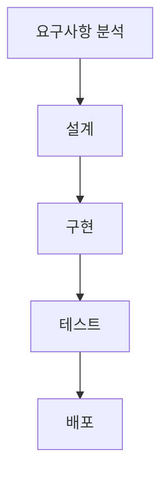

# 2. 소프트웨어 개발 방법론

## 목차
- [2. 소프트웨어 개발 방법론](#2-소프트웨어-개발-방법론)
  - [목차](#목차)
  - [소프트웨어 개발 생명주기 (SDLC)](#소프트웨어-개발-생명주기-sdlc)
  - [전통적 방법론: 폭포수 모델](#전통적-방법론-폭포수-모델)
  - [현대적 방법론: 애자일 (Agile)](#현대적-방법론-애자일-agile)
    - [애자일 선언의 4대 가치](#애자일-선언의-4대-가치)
    - [대표적인 애자일 프레임워크: 스크럼 (Scrum)](#대표적인-애자일-프레임워크-스크럼-scrum)
  - [데이터 과학 프로젝트에 적합한 방법론](#데이터-과학-프로젝트에-적합한-방법론)
  - [개발과 운영의 통합: DevOps](#개발과-운영의-통합-devops)

---

## 소프트웨어 개발 생명주기 (SDLC)

**소프트웨어 개발 생명주기(Software Development Life Cycle, SDLC)** 는 고품질의 소프트웨어를 효율적으로 개발하기 위해, 기획부터 폐기까지의 전체 과정을 여러 단계로 나누고 체계화한 프레임워크입니다.

- **주요 단계**:
    1.  **요구사항 분석**: 무엇을 만들어야 하는가? (기능 및 제약조건 정의)
    2.  **설계**: 어떻게 만들 것인가? (아키텍처, DB, UI/UX 설계)
    3.  **구현**: 설계에 따라 코드를 작성.
    4.  **테스트**: 요구사항대로 잘 만들어졌는지 검증.
    5.  **배포 및 유지보수**: 사용자에게 전달하고, 지속적으로 개선.

이 단계들을 어떤 방식과 순서로 진행하는지에 따라 다양한 **개발 방법론**으로 나뉩니다.

---

## 전통적 방법론: 폭포수 모델

**폭포수 모델(Waterfall Model)** 은 가장 오래되고 전통적인 방법론으로, 각 단계를 순서대로, 마치 폭포수처럼 한 방향으로만 진행합니다. 이전 단계가 완벽하게 끝나야 다음 단계로 넘어갈 수 있습니다.

- **장점**: 프로세스가 명확하고 단순하여 이해하기 쉽고, 각 단계의 산출물이 명확하여 관리가 용이합니다.
- **단점**: 한 번 지나간 단계는 되돌리기 어려워, 중간에 요구사항이 변경되면 대응하기가 매우 어렵습니다.
- **적합한 프로젝트**: 은행 시스템, 국방 시스템처럼 개발 시작 전에 **요구사항이 명확하게 확정**되고, 변경될 가능성이 거의 없는 대규모 프로젝트.

---

## 현대적 방법론: 애자일 (Agile)

**애자일**은 '민첩한, 기민한'이라는 뜻으로, 처음부터 모든 것을 계획하기보다, 짧은 주기의 **개발과 피드백을 반복**하면서 변화하는 요구사항에 유연하고 신속하게 대응하는 것을 목표로 하는 개발 철학입니다.

### 애자일 선언의 4대 가치

- 프로세스와 도구보다 **개인과 상호작용**을
- 포괄적인 문서보다 **작동하는 소프트웨어**를
- 계약 협상보다 **고객과의 협력**을
- 계획을 따르기보다 **변화에 대응**하는 것을 더 가치있게 여긴다.

### 대표적인 애자일 프레임워크: 스크럼 (Scrum)

**스크럼**은 애자일 철학을 실천하는 가장 대표적인 프레임워크입니다. 럭비에서 유래한 이름처럼, 하나의 팀이 되어 공동의 목표를 향해 나아갑니다.

- **스프린트 (Sprint)** : 1~4주 단위의 짧은 개발 주기를 반복합니다. 각 스프린트마다 실제 작동하는 제품의 일부를 만들어냅니다.
- **주요 역할**: 제품 책임자(Product Owner), 스크럼 마스터(Scrum Master), 개발팀(Development Team)
- **주요 활동**: 제품 백로그, 스프린트 계획 회의, 데일리 스크럼(매일 진행하는 짧은 공유 회의), 스프린트 리뷰 및 회고.

---

## 데이터 과학 프로젝트에 적합한 방법론

데이터 과학 프로젝트는 "이 데이터로 어떤 가치를 만들 수 있을까?"처럼 목표가 불분명하고, 수많은 실험과 탐색을 통해 결과를 찾아가야 하는 특징이 있습니다.

- **폭포수 모델의 한계**: 초기 요구사항 정의가 어렵고, 분석 과정에서 새로운 발견이 계속 일어나므로 순차적인 진행이 거의 불가능합니다.
- **애자일/CRISP-DM의 적합성**: 데이터 과학 프로젝트는 짧은 주기로 가설을 세우고(계획), 데이터를 분석/모델링하고(개발), 그 결과를 평가하여(피드백) 다음 단계의 방향을 계속 수정해나가는 **애자일 방식**이나, 이와 유사한 데이터 마이닝 표준 프로세스인 **CRISP-DM**이 훨씬 더 효과적입니다.

---

## 개발과 운영의 통합: DevOps

**DevOps**는 소프트웨어의 **개발(Development)** 과 **운영(Operations)** 을 통합하는 문화이자 방법론입니다. 개발팀과 운영팀이 긴밀하게 협력하고, CI/CD 파이프라인과 같은 도구를 통해 **빌드, 테스트, 배포, 모니터링의 전 과정을 자동화**하여, 더 빠르고 안정적으로 소프트웨어를 사용자에게 전달하는 것을 목표로 합니다.

- **CI (Continuous Integration, 지속적 통합)** : 개발자가 코드를 변경할 때마다, 자동으로 로드되고 테스트되어 중앙 리포지토리에 통합되는 프로세스.
- **CD (Continuous Delivery/Deployment, 지속적 제공/배포)** : CI를 통과한 코드가 자동으로 운영 환경에 배포될 수 있도록 준비하거나, 실제로 배포까지 하는 프로세스.

DevOps는 애자일의 '빠른 피드백'과 '변화 대응' 가치를 개발 단계를 넘어 운영과 배포까지 확장시킨 개념이라고 볼 수 있습니다.