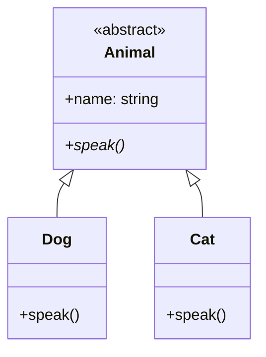

# 4. 좋은 객체 지향 설계 원칙

## 목차
- [4. 좋은 객체 지향 설계 원칙](#4-좋은-객체-지향-설계-원칙)
  - [목차](#목차)
  - [객체 지향 프로그래밍(OOP) 핵심 요약](#객체-지향-프로그래밍oop-핵심-요약)
  - [좋은 설계를 위한 5가지 원칙: SOLID](#좋은-설계를-위한-5가지-원칙-solid)
    - [S: 단일 책임 원칙 (Single Responsibility Principle)](#s-단일-책임-원칙-single-responsibility-principle)
    - [O: 개방-폐쇄 원칙 (Open-Closed Principle)](#o-개방-폐쇄-원칙-open-closed-principle)
    - [L: 리스코프 치환 원칙 (Liskov Substitution Principle)](#l-리스코프-치환-원칙-liskov-substitution-principle)
    - [I: 인터페이스 분리 원칙 (Interface Segregation Principle)](#i-인터페이스-분리-원칙-interface-segregation-principle)
    - [D: 의존관계 역전 원칙 (Dependency Inversion Principle)](#d-의존관계-역전-원칙-dependency-inversion-principle)
  - [설계의 시각적 언어: UML](#설계의-시각적-언어-uml)

---

## 객체 지향 프로그래밍(OOP) 핵심 요약

객체 지향 프로그래밍은 관련된 데이터(속성)와 동작(메서드)을 하나의 **객체(Object)** 로 묶어, 이 객체들의 상호작용으로 프로그램을 구성하는 방식입니다.

- **핵심 4대 특징**:
    1.  **추상화 (Abstraction)** : 복잡한 내부를 숨기고, 외부에 필요한 기능만 노출하는 것.
    2.  **캡슐화 (Encapsulation)** : 데이터와 메서드를 하나로 묶고, 데이터에 대한 직접적인 접근을 제한하여 보호하는 것. (파이썬에서는 `_`나 `__`를 붙여 표현)
    3.  **상속 (Inheritance)** : 부모 클래스의 속성과 메서드를 자식 클래스가 물려받아 코드 재사용성을 높이는 것.
    4.  **다형성 (Polymorphism)** : 동일한 이름의 메서드가 객체의 실제 타입에 따라 다르게 동작하는 것. (주로 메서드 오버라이딩으로 구현)

---

## 좋은 설계를 위한 5가지 원칙: SOLID

SOLID는 시간이 지나도 **유지보수하기 쉽고, 변화에 유연하게 대처할 수 있는** 안정적인 소프트웨어를 만들기 위한 5가지 객체 지향 설계 원칙입니다.

### S: 단일 책임 원칙 (Single Responsibility Principle)

> **"하나의 클래스는 단 하나의 책임만 가져야 한다."**

클래스를 변경해야 할 이유가 오직 하나여야 한다는 의미입니다. 예를 들어, `User` 클래스가 사용자 정보 관리와 이메일 전송이라는 두 가지 책임을 모두 가지고 있다면, 이메일 전송 방식이 변경될 때 사용자 정보 관리 코드까지 영향을 받을 수 있습니다. 따라서 `User` 클래스와 `EmailSender` 클래스로 분리하는 것이 좋습니다.

### O: 개방-폐쇄 원칙 (Open-Closed Principle)

> **"소프트웨어 요소는 확장에는 열려 있어야 하지만, 변경에는 닫혀 있어야 한다."**

새로운 기능을 추가할 때, 기존의 코드를 수정하는 것이 아니라, 새로운 코드를 추가하는 방식으로 설계해야 한다는 의미입니다. 주로 **추상화**와 **다형성**을 통해 달성됩니다.

```python
# 나쁜 예시: 새로운 결제 수단이 추가될 때마다 process_payment 함수를 수정해야 함
def process_payment(payment_type, amount):
    if payment_type == "credit_card":
        # ... 신용카드 처리
    elif payment_type == "paypal":
        # ... 페이팔 처리

# 좋은 예시: PaymentMethod라는 인터페이스를 만들고, 각 결제 수단이 이를 구현
# 새로운 결제 수단이 추가되어도 기존 코드는 수정할 필요가 없음
class PaymentProcessor:
    def process(self, payment_method, amount):
        payment_method.pay(amount)
```

### L: 리스코프 치환 원칙 (Liskov Substitution Principle)

> **"자식 클래스는 언제나 자신의 부모 클래스를 대체할 수 있어야 한다."**

부모 클래스 타입이 사용되는 곳에 자식 클래스 객체를 대신 넣어도, 프로그램의 정확성이 깨지면 안 된다는 의미입니다. 이는 자식 클래스가 부모 클래스의 규약을 어기지 않도록 설계해야 함을 뜻합니다.

### I: 인터페이스 분리 원칙 (Interface Segregation Principle)

> **"클라이언트는 자신이 사용하지 않는 메서드에 의존하도록 강요받아서는 안 된다."**

하나의 거대한 '만능' 인터페이스보다는, 역할에 따라 여러 개의 구체적인 인터페이스로 분리하는 것이 더 좋다는 원칙입니다.

### D: 의존관계 역전 원칙 (Dependency Inversion Principle)

> **"구체적인 구현 클래스에 의존하기보다, 추상화된 인터페이스나 추상 클래스에 의존해야 한다."**

상위 수준의 모듈이 하위 수준의 모듈의 구체적인 구현 내용에 의존해서는 안 되며, 양쪽 모두 **추상화**에 의존해야 한다는 의미입니다. 이는 시스템의 결합도를 낮추고 유연성을 높여줍니다.

---

## 설계의 시각적 언어: UML

**UML(Unified Modeling Language)** 은 소프트웨어 시스템의 구조와 동작을 시각적으로 표현하기 위한 **표준 모델링 언어**입니다. 객체 지향 설계를 다이어그램으로 표현하여, 개발자 및 관계자들이 시스템을 더 쉽게 이해하고 소통할 수 있도록 돕습니다.

- **주요 다이어그램**:
    - **클래스 다이어그램 (Class Diagram)** : 시스템의 클래스, 속성, 메서드 및 클래스 간의 관계(상속, 연관 등)를 보여주는 정적 구조 다이어그램.
    - **시퀀스 다이어그램 (Sequence Diagram)** : 객체 간의 상호작용(메시지 교환)을 시간 순서에 따라 보여주는 동적 행위 다이어그램.
    - **유스케이스 다이어그램 (Use Case Diagram)** : 사용자와 시스템 간의 상호작용을 표현하여, 시스템이 제공해야 할 기능을 정의.


> 위 다이어그램은 `Animal`이라는 추상 클래스를 `Dog`와 `Cat`이 상속받는 관계를 보여주는 간단한 UML 클래스 다이어그램입니다.