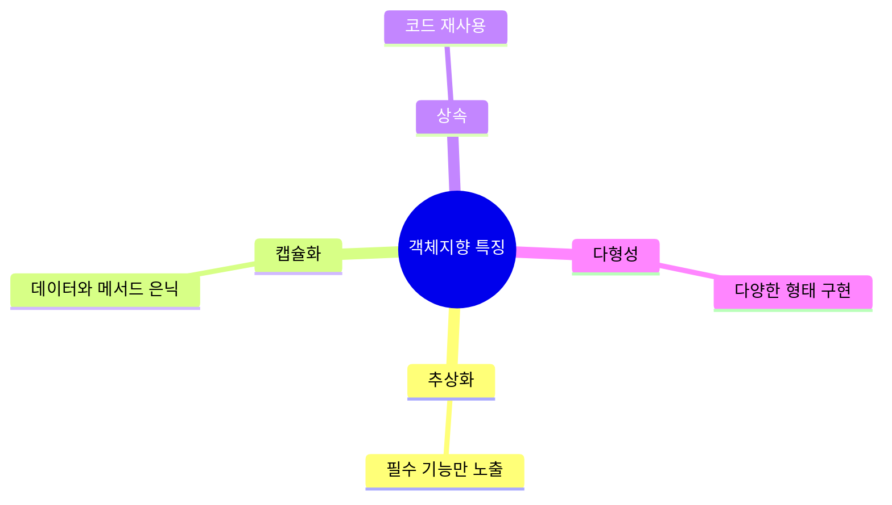
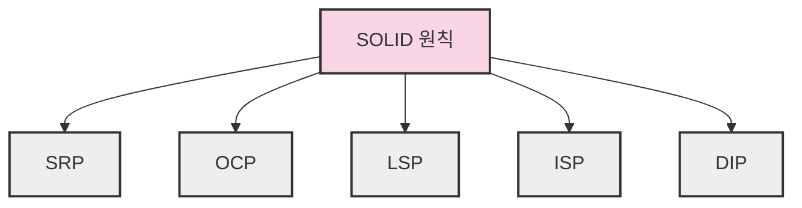
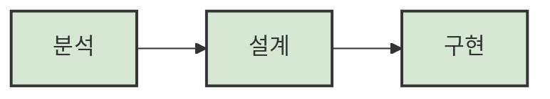
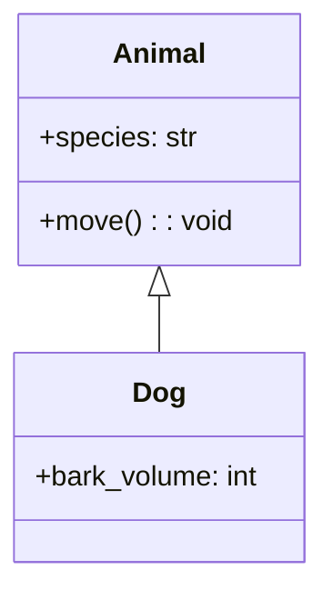

# 4. 객체지향 프로그래밍 기법 🧩

## 목차
- [4. 객체지향 프로그래밍 기법 🧩](#4-객체지향-프로그래밍-기법-)
  - [목차](#목차)
  - [객체지향 프로그래밍이란 🧩](#객체지향-프로그래밍이란-)
  - [객체지향 프로그래밍의 특징 🌟](#객체지향-프로그래밍의-특징-)
    - [추상화 (Abstraction)](#추상화-abstraction)
    - [캡슐화 (Encapsulation)](#캡슐화-encapsulation)
    - [상속 (Inheritance)](#상속-inheritance)
    - [다형성 (Polymorphism)](#다형성-polymorphism)
  - [SOLID 원칙 🔧](#solid-원칙-)
  - [객체지향 개발 방법론 📚](#객체지향-개발-방법론-)
  - [UML 개요 🖼️](#uml-개요-️)
    - [주요 다이어그램 종류](#주요-다이어그램-종류)
    - [주요 관계 요소](#주요-관계-요소)

---

## 객체지향 프로그래밍이란 🧩

**객체지향 프로그래밍(OOP)** 은 프로그램을 **객체 단위로 구성**하고, **객체 간 상호작용을 통해 기능을 구현**하는 프로그래밍 패러다임이다.  
객체란, 현실 세계의 사물이나 개념을 소프트웨어로 표현한 것으로, **속성(상태)** 과 **동작(행위)** 을 가진다.

객체는 세 가지 주요 특징을 가진다:
- **상태(State)**: 시간에 따라 변하는 데이터
- **행동(Behavior)**: 수행 가능한 기능 또는 동작
- **식별성(Identity)**: 다른 객체와 구별되는 고유성

```python
# 예시: 객체 생성
class Pet:
    pass

dog = Pet()
print(type(dog))  # <class '__main__.Pet'>
```

---

## 객체지향 프로그래밍의 특징 🌟

객체지향의 네 가지 핵심 기둥은 다음과 같다:



### 추상화 (Abstraction)

구현 세부사항을 숨기고, 필수적인 기능만 외부에 노출하는 설계 방법이다.  
복잡한 현실 세계를 단순화하여 모델링하며, 필요한 정보만 제공한다.

```python
from abc import ABC, abstractmethod

class Vehicle(ABC):
    @abstractmethod
    def start(self):
        pass

class Bicycle(Vehicle):
    def start(self):
        print("Pedaling to move forward.")

bike = Bicycle()
bike.start()  # Pedaling to move forward.
```

### 캡슐화 (Encapsulation)

데이터와 메서드를 하나로 묶고, 외부에서는 필요한 인터페이스만 공개한다.  
정보 은닉을 통해 코드 변경의 영향을 최소화한다.

```python
class Account:
    def __init__(self):
        self.__balance = 0.0
    
    def get_balance(self):
        return self.__balance
    
    def deposit(self, amount):
        self.__balance += amount

account = Account()
account.deposit(100)
print(account.get_balance())  # 100.0
```

### 상속 (Inheritance)

하위 클래스가 상위 클래스의 속성과 메서드를 물려받는 기능이다.  
**IS-A** 관계를 통해 코드 재사용과 확장이 가능하다.

```python
class Animal:
    def __init__(self, species):
        self.species = species

class Dog(Animal):
    def __init__(self, species, bark_volume):
        super().__init__(species)
        self.bark_volume = bark_volume

dog = Dog('Canine', 10)
print(dog.species)  # Canine
```

### 다형성 (Polymorphism)

하나의 인터페이스가 여러 형태로 구현될 수 있는 특성이다.  
부모 타입의 참조변수로 자식 객체를 다룰 수 있으며, 실행 시점에 호출 메서드가 결정된다.

```python
def start_vehicle(vehicle):
    vehicle.start()

class Car(Vehicle):
    def start(self):
        print("Igniting the engine.")

car = Car()
start_vehicle(car)    # Igniting the engine.
start_vehicle(bike)   # Pedaling to move forward.
```

**오버로딩(Overloading)** 과 **오버라이딩(Overriding)** 을 통해 구현된다:
- 오버로딩: 파이썬은 엄밀한 의미의 오버로딩을 지원하지 않지만, 기본값을 이용해 흉내낼 수 있다.
- 오버라이딩: 하위 클래스에서 상위 클래스 메서드를 재정의하는 것.

---

## SOLID 원칙 🔧

**SOLID**는 견고하고 유지보수하기 쉬운 설계를 위한 다섯 가지 원칙을 의미한다.

| 원칙 | 설명 |
|:----|:----|
| SRP (단일 책임 원칙) | 클래스는 하나의 책임만 가져야 한다. |
| OCP (개방-폐쇄 원칙) | 확장에는 열려있고, 변경에는 닫혀있어야 한다. |
| LSP (리스코프 치환 원칙) | 하위 타입은 상위 타입을 대체할 수 있어야 한다. |
| ISP (인터페이스 분리 원칙) | 사용하지 않는 인터페이스에 의존하지 말아야 한다. |
| DIP (의존 역전 원칙) | 구체화보다는 추상화에 의존해야 한다. |



---

## 객체지향 개발 방법론 📚

객체지향 개발 방법론은 분석-설계-구현 단계를 **객체 중심**으로 일관되게 연결하는 절차적 접근이다.

대표적인 방법론은 다음과 같다:

```plaintext
- OMT: 구조적/동적/기능 모델로 분리하여 시스템 모델링
- OOSE: 유스케이스 기반으로 요구사항 명세 및 설계
- Coad & Yourdon: E-R 다이어그램 확장하여 객체 관계 표현
```



---

## UML 개요 🖼️

**UML (Unified Modeling Language)** 은 다양한 객체지향 설계 방법론을 통합하여 소프트웨어 시스템을 시각적으로 모델링하기 위한 표준 언어이다.

### 주요 다이어그램 종류

- **정적 다이어그램**: 클래스 다이어그램, 객체 다이어그램, 컴포넌트 다이어그램, 배치 다이어그램
- **동적 다이어그램**: 유스케이스 다이어그램, 시퀀스 다이어그램, 상태 다이어그램, 활동 다이어그램

### 주요 관계 요소

- **연관(Association)**: 객체 간 연결 관계
- **집합(Aggregation)**: 느슨한 포함 관계
- **합성(Composition)**: 강한 포함 관계
- **일반화(Generalization)**: 상속 관계
- **의존(Dependency)**: 영향 관계
- **실체화(Realization)**: 인터페이스와 구현체의 관계



---
