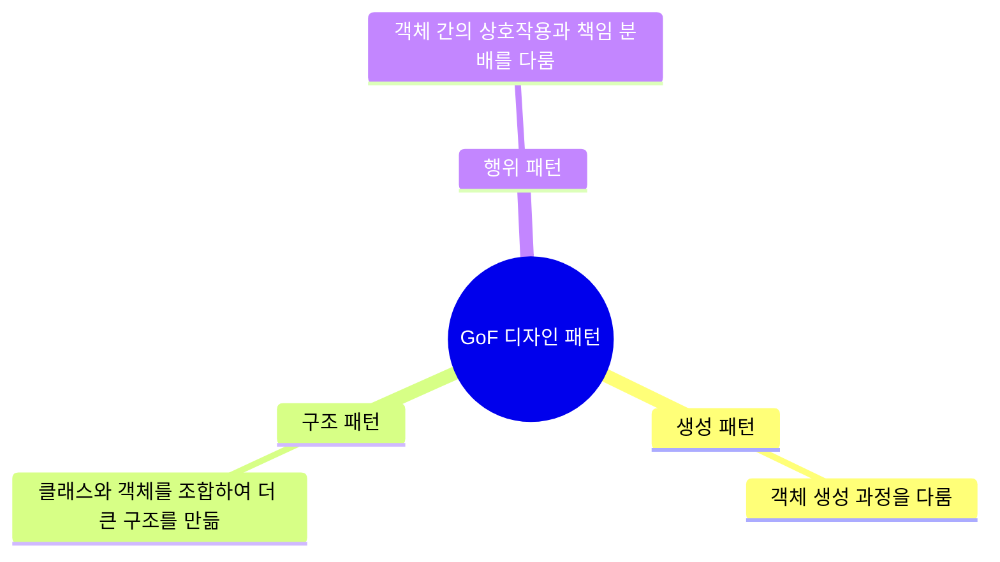

# 1. 디자인 패턴: 검증된 문제 해결 전략 🏗️

## 목차
- [1. 디자인 패턴: 검증된 문제 해결 전략 🏗️](#1-디자인-패턴-검증된-문제-해결-전략-️)
  - [목차](#목차)
  - [디자인 패턴이란?](#디자인-패턴이란)
  - [GoF 디자인 패턴의 세 가지 분류](#gof-디자인-패턴의-세-가지-분류)
  - [1. 생성 패턴 (Creational Patterns): 객체를 어떻게 만들까?](#1-생성-패턴-creational-patterns-객체를-어떻게-만들까)
    - [대표 패턴: 싱글턴 (Singleton)](#대표-패턴-싱글턴-singleton)
  - [2. 구조 패턴 (Structural Patterns): 어떻게 조합하여 구조를 만들까?](#2-구조-패턴-structural-patterns-어떻게-조합하여-구조를-만들까)
    - [대표 패턴: 어댑터 (Adapter)](#대표-패턴-어댑터-adapter)
  - [3. 행위 패턴 (Behavioral Patterns): 어떻게 협력하게 할까?](#3-행위-패턴-behavioral-patterns-어떻게-협력하게-할까)
    - [대표 패턴: 전략 (Strategy)](#대표-패턴-전략-strategy)
  - [디자인 패턴을 대하는 자세](#디자인-패턴을-대하는-자세)

---

## 디자인 패턴이란?

**디자인 패턴(Design Pattern)** 은 소프트웨어 설계 과정에서 **반복적으로 발생하는 특정 문제에 대한, 검증되고 재사용 가능한 해결책**입니다. 이는 구체적인 코드가 아닌, 문제 해결을 위한 아이디어나 설계의 '청사진'에 가깝습니다.

디자인 패턴을 학습하는 것은, 경험 많은 개발자들의 지혜와 노하우를 습득하여 더 유연하고, 재사용성 높고, 유지보수하기 좋은 소프트웨어를 설계하는 능력을 기르는 것입니다. 또한, 개발자들 사이의 **효율적인 의사소통을 위한 공용어** 역할을 합니다.

---

## GoF 디자인 패턴의 세 가지 분류

가장 널리 알려진 디자인 패턴은 **GoF(Gang of Four)** 가 정리한 23가지 패턴이며, 목적에 따라 세 가지로 분류됩니다.



---

## 1. 생성 패턴 (Creational Patterns): 객체를 어떻게 만들까?

객체를 생성하는 과정을 캡슐화하여, 코드의 유연성과 재사용성을 높이는 데 중점을 둡니다.

### 대표 패턴: 싱글턴 (Singleton)

- **문제**: 시스템 전체에서 **단 하나의 인스턴스만 존재**해야 하는 객체가 필요할 때. (예: 시스템 설정 관리자, 데이터베이스 연결 풀)
- **해결책**: 클래스 스스로 자신의 유일한 인스턴스를 생성하고 관리하며, 전역에서 이 인스턴스에 접근할 수 있는 단일한 지점을 제공합니다.

```python
class SettingsManager:
    _instance = None

    # __new__ 메서드를 오버라이딩하여 인스턴스 생성을 제어
    def __new__(cls):
        if cls._instance is None:
            print("Creating the instance")
            cls._instance = super(SettingsManager, cls).__new__(cls)
        return cls._instance

# 사용 예시
s1 = SettingsManager()
s2 = SettingsManager()

print(f"s1과 s2는 같은 객체인가? {s1 is s2}")
# 출력:
# Creating the instance
# s1과 s2는 같은 객체인가? True
```

---

## 2. 구조 패턴 (Structural Patterns): 어떻게 조합하여 구조를 만들까?

클래스와 객체들을 더 큰 구조로 조합하여, 새롭고 더 강력한 기능을 제공할 수 있도록 돕습니다.

### 대표 패턴: 어댑터 (Adapter)

- **문제**: 서로 **호환되지 않는 인터페이스**를 가진 두 클래스를 함께 작동시켜야 할 때. (예: 110V 플러그를 220V 콘센트에 꽂아야 할 때)
- **해결책**: 하나의 인터페이스를 다른 인터페이스로 **변환**해주는 '어댑터' 클래스를 중간에 둡니다.

```python
# 우리가 사용해야 하는 시스템
class KoreanPowerOutlet:
    def plug_in_korean(self):
        print("220V 전원 공급 시작")

# 우리가 가지고 있는 기기 (인터페이스가 다름)
class USAPowerDevice:
    def plug_in_us(self):
        print("110V 기기 작동")

# 어댑터 클래스
class USAToKoreanAdapter(KoreanPowerOutlet):
    def __init__(self, device):
        self.device = device
    
    # KoreanPowerOutlet의 인터페이스를 따르지만, 내부적으로는 USA 기기를 작동시킴
    def plug_in_korean(self):
        self.device.plug_in_us()

# 사용 예시
us_tv = USAPowerDevice()
adapter = USAToKoreanAdapter(us_tv)

# 이제 한국 콘센트에 미국 기기를 꽂을 수 있음
adapter.plug_in_korean() # "110V 기기 작동" 출력
```

---

## 3. 행위 패턴 (Behavioral Patterns): 어떻게 협력하게 할까?

객체들이 서로 효과적으로 상호작용하고, 책임을 분배하는 방법에 대한 패턴입니다.

### 대표 패턴: 전략 (Strategy)

- **문제**: 하나의 작업을 처리하는 **다양한 알고리즘(전략)** 이 있고, 클라이언트가 이 알고리즘들을 상황에 따라 **교체하며 사용**하고 싶을 때. (예: 다양한 결제 방법, 다양한 정렬 알고리즘)
- **해결책**: 각 알고리즘을 별도의 클래스로 캡슐화하고, 이들을 동일한 인터페이스를 통해 사용할 수 있도록 합니다. 이는 **개방-폐쇄 원칙(OCP)** 을 만족시키는 훌륭한 방법입니다.

```python
from abc import ABC, abstractmethod

# 전략 인터페이스
class PaymentStrategy(ABC):
    @abstractmethod
    def pay(self, amount):
        pass

# 구체적인 전략 클래스들
class CreditCardPayment(PaymentStrategy):
    def pay(self, amount):
        print(f"{amount}원을 신용카드로 결제합니다.")

class KakaoPayPayment(PaymentStrategy):
    def pay(self, amount):
        print(f"{amount}원을 카카오페이로 결제합니다.")

# 컨텍스트 (전략을 사용하는 주체)
class ShoppingCart:
    def __init__(self, payment_strategy):
        self.payment_strategy = payment_strategy
    
    def checkout(self, amount):
        self.payment_strategy.pay(amount)

# 사용 예시
cart1 = ShoppingCart(CreditCardPayment())
cart1.checkout(10000) # "10000원을 신용카드로 결제합니다."

cart2 = ShoppingCart(KakaoPayPayment())
cart2.checkout(20000) # "20000원을 카카오페이로 결제합니다."
```

---

## 디자인 패턴을 대하는 자세

- **만능 해결책이 아니다**: 디자인 패턴은 특정 문제 상황에 대한 해결책일 뿐, 모든 곳에 적용할 수 있는 만능 열쇠가 아닙니다.
- **과유불급**: 간단한 문제를 굳이 복잡한 패턴을 적용하여 과도하게 설계(Over-engineering)하는 것을 경계해야 합니다.
- **소통의 도구**: 패턴의 이름을 아는 것은, 복잡한 설계 아이디어를 팀원들과 효율적으로 공유하고 논의할 수 있게 해주는 강력한 소통의 도구입니다.