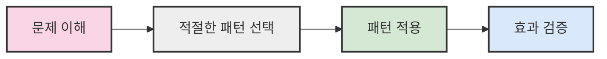
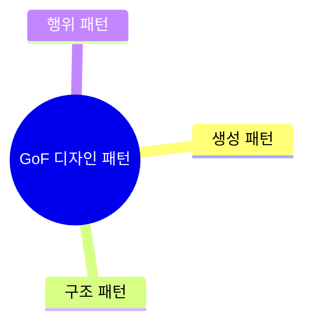
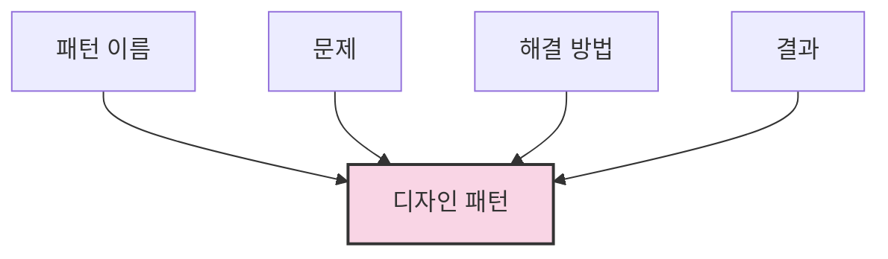
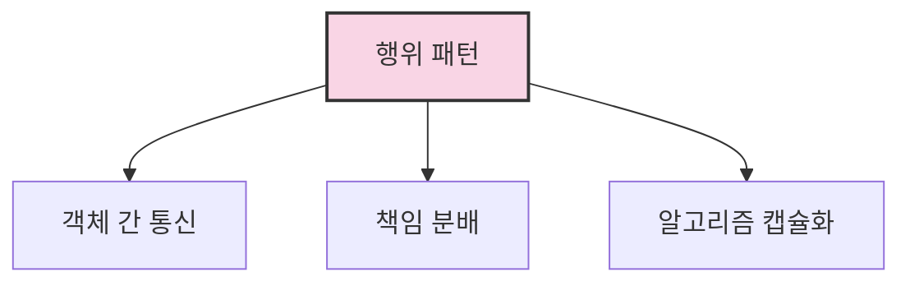

# 1. 디자인 패턴 🏗️

## 목차
- [1. 디자인 패턴 🏗️](#1-디자인-패턴-️)
  - [목차](#목차)
  - [디자인 패턴이란? 🤔](#디자인-패턴이란-)
  - [디자인 패턴 사용 시 장단점 ⚖️](#디자인-패턴-사용-시-장단점-️)
  - [GoF 디자인 패턴 소개 📚](#gof-디자인-패턴-소개-)
  - [디자인 패턴의 구성 요소 🧩](#디자인-패턴의-구성-요소-)
  - [디자인 패턴의 분류 🗂️](#디자인-패턴의-분류-️)
    - [생성(Creational) 패턴 🏭](#생성creational-패턴-)
    - [구조(Structural) 패턴 🔌](#구조structural-패턴-)
    - [행위(Behavioral) 패턴 🔄](#행위behavioral-패턴-)

---

## 디자인 패턴이란? 🤔

**디자인 패턴**은 소프트웨어 설계 과정에서 반복적으로 등장하는 문제들에 대한 **검증된 해결책**을 정형화한 설계 모범 사례를 의미한다.  

이는 구현(Implementation)이 아니라 **설계(Design)** 에 초점을 두며, 재사용성과 상호 운용성을 높이는 데 도움을 준다.

문제를 해결할 때는 **배경과 맥락**까지 이해하는 것이 중요하다.

```plaintext
- 소프트웨어 설계의 모범 사례
- 검증된 해결책 제공
- 재사용성과 상호 운용성 향상
```

---

## 디자인 패턴 사용 시 장단점 ⚖️

| 장점 | 단점 |
|:----|:----|
| 검증된 설계 지침 제공 | 과도한 사용 시 복잡도 증가 |
| 코드 재사용성과 확장성 향상 | 잘못 사용 시 오히려 코드 품질 저하 |
| 팀 간 소통 용이 | 패턴 자체를 학습해야 함 |

**→ 핵심은 '언제' 사용하는지 판단하는 것!**



---

## GoF 디자인 패턴 소개 📚

**GoF(Gang of Four)** 는 에리히 감마(Erich Gamma) 등 네 명의 저자가 정리한 객체지향 설계 패턴 모음집이다.  

**총 23가지** 패턴을, 다음 세 가지 분류로 체계화했다:



---

## 디자인 패턴의 구성 요소 🧩

- **패턴 이름 (Pattern Name)**: 소통을 위한 핵심 키워드
- **문제 (Problem)**: 해결해야 할 설계 이슈
- **해결 방법 (Solution)**: 구조 및 객체 간 협력 방식
- **결과 (Consequences)**: 적용 시 장점과 단점



---

## 디자인 패턴의 분류 🗂️

디자인 패턴은 **목적**에 따라 다음 세 가지로 구분된다.

### 생성(Creational) 패턴 🏭
객체를 **어떻게 만들 것인가**에 초점 맞춤.

- **싱글턴(Singleton)** 🔒: 단 하나의 인스턴스 보장
- **팩토리 메서드(Factory Method)** 🔨: 객체 생성 로직을 서브클래스에 위임
- 기타 5개 패턴 존재

```plaintext
- 객체 생성 방식에 관한 패턴
- 시스템 객체 생성 유연성 증가
- 코드 재사용성 향상
```

### 구조(Structural) 패턴 🔌
객체들을 **어떻게 구성할 것인가**에 초점 맞춤.

- **어댑터(Adapter)** 🔄: 인터페이스 변환
- **브리지(Bridge)** 🌉: 구현과 추상을 분리
- **컴포지트(Composite)** 🌲: 트리 구조로 복합 객체 표현
- **데코레이터(Decorator)** 🎀: 기능을 동적으로 추가
- **퍼사드(Facade)** 🏢: 통합된 인터페이스 제공
- **플라이웨이트(Flyweight)** 🪶: 메모리 절약 위해 공유
- **프록시(Proxy)** 🛡️: 접근 제어를 위한 대리자 역할

### 행위(Behavioral) 패턴 🔄
**객체 간 책임 분산과 커뮤니케이션**을 중심으로 설계.

- **책임 연쇄(Chain of Responsibility)** ⛓️: 요청을 처리할 객체를 연결
- **이터레이터(Iterator)** 🔍: 객체 집합을 순회
- **커맨드(Command)** 📝: 요청을 객체로 캡슐화
- **인터프리터(Interpreter)** 🗣️: 언어 해석 규칙 정의
- **메멘토(Memento)** 💾: 객체 상태를 저장 및 복원
- **옵저버(Observer)** 👀: 상태 변화 알림
- **상태(State)** 🔄: 상태에 따른 행동 변경
- **전략(Strategy)** 🎯: 알고리즘을 교체 가능하게
- **방문자(Visitor)** 🏃: 객체 구조에 새 기능 추가
- **템플릿 메서드(Template Method)** 📋: 알고리즘 뼈대 정의
- **중재자(Mediator)** 👥: 객체 간 통신을 중앙 집중화



---

> ✨ **요약**: 디자인 패턴은 문제를 해결하기 위한 일종의 '설계 도구 모음'이며, 문제의 종류와 상황에 따라 적절히 선택하여 적용하는 것이 핵심이다.
