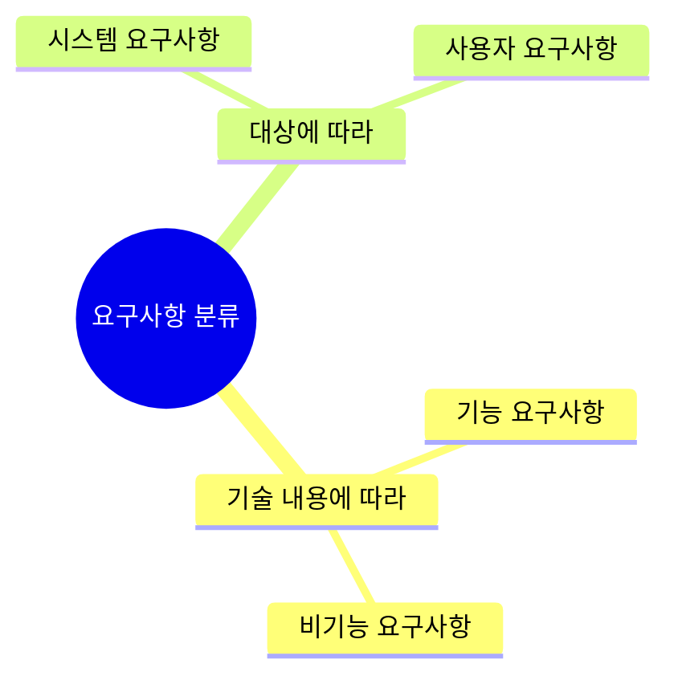
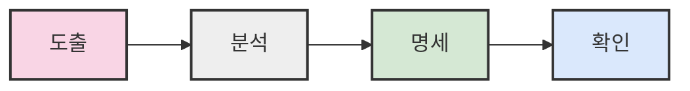
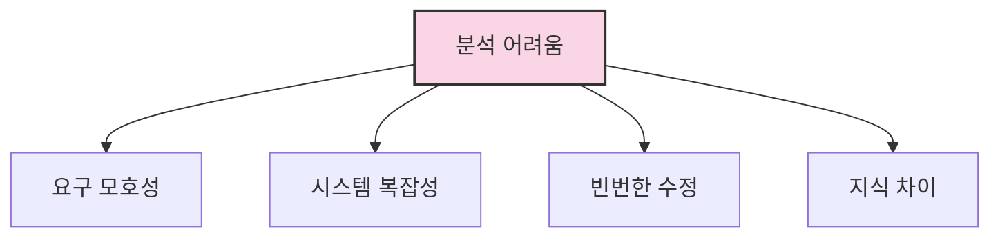
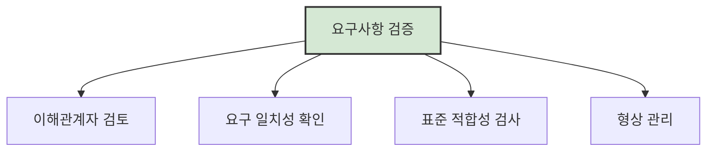
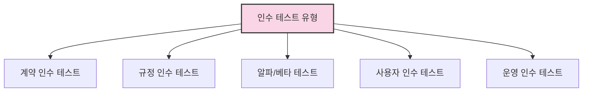

# 2. 요구공학 📋

## 목차
- [2. 요구공학 📋](#2-요구공학-)
  - [목차](#목차)
  - [요구공학이란? 🔍](#요구공학이란-)
  - [요구사항의 분류 🗂️](#요구사항의-분류-️)
  - [요구사항 개발 프로세스 🔄](#요구사항-개발-프로세스-)
  - [요구사항 도출 (Elicitation) 🔎](#요구사항-도출-elicitation-)
  - [요구사항 분석 (Analysis) 📊](#요구사항-분석-analysis-)
    - [분석이 어려운 이유 ⚠️](#분석이-어려운-이유-️)
  - [요구사항 명세 (Specification) 📝](#요구사항-명세-specification-)
  - [요구사항 검증 (Validation) ✅](#요구사항-검증-validation-)
  - [요구사항 관리 (Management) 📈](#요구사항-관리-management-)
  - [요구사항 할당 (Allocation) 🔀](#요구사항-할당-allocation-)
  - [보조 기법: 프로토타이핑과 모델 검증 🧪](#보조-기법-프로토타이핑과-모델-검증-)
    - [프로토타이핑 (Prototyping) 🏗️](#프로토타이핑-prototyping-️)
    - [모델 검증 (Model Verification) 🔍](#모델-검증-model-verification-)
  - [요구사항 리뷰와 인수 테스트 🔍](#요구사항-리뷰와-인수-테스트-)
    - [요구사항 리뷰 (Requirement Reviews) 👥](#요구사항-리뷰-requirement-reviews-)
    - [인수 테스트 (Acceptance Tests) 🧪](#인수-테스트-acceptance-tests-)

---

## 요구공학이란? 🔍

**요구공학(Requirements Engineering)** 은 시스템 개발에 필요한 요구사항을 체계적으로 정의하고 관리하는 과정이다.  
주요 목적은 **이해관계자 간 의사소통**, **요구 누락 방지**, **변경 이력 관리**, **비용 및 일정 기준 수립**이다.

요구사항을 명확히 합의함으로써 품질을 높이고, 비용과 시간을 절감하며 프로젝트의 성공 가능성을 높일 수 있다.

```plaintext
- 요구사항 정의 체계화
- 이해관계자 간 명확한 의사소통
- 개발 비용 및 시간 절감
- 프로젝트 성공률 향상
```

---

## 요구사항의 분류 🗂️

요구사항은 다음 기준으로 분류할 수 있다.



- **기술 내용에 따라**
  - **기능 요구사항** 💼: 시스템이 수행해야 할 동작
  - **비기능 요구사항** ⚙️: 성능, 보안, 품질, 제약 조건 등

- **대상에 따라**
  - **시스템 요구사항** 🖥️: 전체 시스템의 동작 명세
  - **사용자 요구사항** 👤: 사용자가 기대하는 기능 정의

---

## 요구사항 개발 프로세스 🔄

요구사항 개발은 다음 절차를 따른다.



1. **도출 (Elicitation)** 🔎: 이해관계자의 요구를 파악
2. **분석 (Analysis)** 📊: 요구를 명확히 이해하고 충돌 해결
3. **명세 (Specification)** 📝: 요구사항을 문서화
4. **확인 (Validation)** ✅: 요구사항의 일관성, 완전성 검증

---

## 요구사항 도출 (Elicitation) 🔎

이 단계에서는 숨겨진 요구까지 적극적으로 식별해야 한다.  
다양한 기법이 활용된다.

| 도출 기법 | 특징 |
|:---|:---|
| 인터뷰 👥 | 직접 대화를 통한 심층 정보 획득 |
| 설문조사 📊 | 다수의 의견을 정량적으로 수집 |
| 워크숍 🤝 | 이해관계자 간 집단 토론 |
| 관찰 👁️ | 실제 업무 프로세스 관찰 |
| 문서 조사 📚 | 기존 시스템 및 업무 문서 분석 |

협업을 통해 신뢰를 형성하고 정확한 정보를 수집한다.

---

## 요구사항 분석 (Analysis) 📊

요구사항 분석은 다음을 포함한다.

```plaintext
- 사용자 요구사항의 명확화
- 시스템과 환경 간 상호작용 분석
- 개발 범위와 일정, 제약조건 정의
- 요구사항 간 충돌 해결 및 타당성 조사
- 구현 가능성과 테스트 가능성 확보
```

### 분석이 어려운 이유 ⚠️



- 요구가 모호하거나 불완전할 수 있음
- 시스템 자체의 복잡성
- 빈번한 수정 및 예외 사항 발생
- 사용자와 개발자 간 지식 차이

---

## 요구사항 명세 (Specification) 📝

요구사항을 명확하고 일관성 있게 문서화하는 단계이다.

- **기능 요구사항** 📋: 빠짐없이 기술
- **비기능 요구사항** ⚙️: 필요한 항목만 명확히 작성
- **오류 추적 가능성** 🔍: 문제 원인 파악 가능하도록
- **이해도** 📚: 개발자와 사용자가 쉽게 이해할 수 있도록 작성

요구사항 명세는 다음 특성을 갖추어야 한다.

| 특성 | 설명 |
|:---|:---|
| 정확성 (Correctness) ✓ | 실제 요구와 일치 |
| 명확성 (Clarity) 🔍 | 해석의 여지가 없음 |
| 완전성 (Completeness) 🧩 | 필요한 모든 요구 포함 |
| 일관성 (Consistency) ⚖️ | 충돌 없음 |
| 수정 용이성 (Modifiability) 🔄 | 변경이 용이함 |
| 추적성 (Traceability) 🔎 | 변경 이력 추적 가능 |

---

## 요구사항 검증 (Validation) ✅

**요구사항 확인**이란 명세서가 올바르고 완전한지 검토하는 것이다.



- 이해관계자와 함께 검토
- 실제 요구와 일치 여부 확인
- 회사 표준과의 적합성 검사
- 문서에 대해 **형상 관리(Configuration Management)** 🔒 수행

---

## 요구사항 관리 (Management) 📈

변경사항을 체계적으로 관리하는 과정이다.

```plaintext
- 변경 요청 분류 및 승인 절차
- 변경이 기존 명세에 미치는 영향 분석
- 빠진 요구사항, 중복 요구사항 식별 및 관리
- 요구 변경으로 인한 파급효과 평가
- 사용자와 개발자 간 의사소통 지원
```

---

## 요구사항 할당 (Allocation) 🔀

요구사항을 시스템의 하위 구성요소나 모듈에 명확히 분배하는 작업이다.


- 시스템 아키텍처와 개발 단계 간 연계성 확보
- 각 요구사항이 어디에서 구현될지 명확히 지정

---

## 보조 기법: 프로토타이핑과 모델 검증 🧪

### 프로토타이핑 (Prototyping) 🏗️

도출된 요구를 기반으로 **시제품(Prototype)** 을 제작하여 요구사항을 재확인하는 기법이다.

| 장점 ✅ | 단점 ❌ |
|:---|:---|
| 요구사항 오류를 조기에 발견 가능 | 프로토타입 제작 비용 발생 |
| 이해관계자와 원활한 의사소통 | 부분만 구현하면 전체 품질을 과대평가할 위험 |

### 모델 검증 (Model Verification) 🔍

개발자가 작성한 모델이 요구사항을 정확히 반영하는지 검토한다.

- **정적 분석** 📄: 문서/코드를 실행 없이 분석
- **동적 분석** ⚙️: 실행하여 오류나 문제를 검출

---

## 요구사항 리뷰와 인수 테스트 🔍

### 요구사항 리뷰 (Requirement Reviews) 👥

- 여러 검토자가 다수 오류를 발견
- 오류, 잘못된 가정, 불명확성, 표준 불일치 등을 점검
- 검토자 그룹 구성 방식이 성과에 영향을 미침

### 인수 테스트 (Acceptance Tests) 🧪

소프트웨어가 사용자나 고객의 요구를 만족하는지 확인하는 테스트다.



**테스트 절차**: 계획 → 설계 → 구현 → 검토 → 수행 → 완료

---

> ✨ **요약**: 요구공학은 소프트웨어 개발의 기초 단계로, 이해관계자의 요구를 명확히 파악하고 관리함으로써 프로젝트의 성공 가능성을 높이는 핵심 활동이다.
