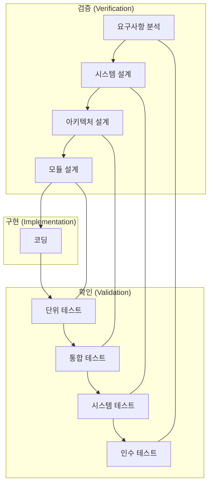

# 3. 소프트웨어 테스트: 품질과 신뢰성의 초석 🧪

## 목차
- [3. 소프트웨어 테스트: 품질과 신뢰성의 초석 🧪](#3-소프트웨어-테스트-품질과-신뢰성의-초석-)
  - [목차](#목차)
  - [소프트웨어 테스트의 원칙과 목적](#소프트웨어-테스트의-원칙과-목적)
  - [테스트의 종류: 무엇을, 어떻게 테스트할 것인가?](#테스트의-종류-무엇을-어떻게-테스트할-것인가)
    - [화이트박스 테스트 vs. 블랙박스 테스트](#화이트박스-테스트-vs-블랙박스-테스트)
  - [개발 단계별 테스트 (V-모델)](#개발-단계별-테스트-v-모델)
    - [1. 단위 테스트 (Unit Test)](#1-단위-테스트-unit-test)
    - [2. 통합 테스트 (Integration Test)](#2-통합-테스트-integration-test)
    - [3. 시스템 테스트 (System Test)](#3-시스템-테스트-system-test)
    - [4. 인수 테스트 (Acceptance Test)](#4-인수-테스트-acceptance-test)
  - [테스트 주도 개발 (TDD)](#테스트-주도-개발-tdd)
  - [데이터 과학 프로젝트의 테스트](#데이터-과학-프로젝트의-테스트)

---

## 소프트웨어 테스트의 원칙과 목적

**소프트웨어 테스트**는 개발된 프로그램이 요구사항에 맞게 정확히 동작하는지 확인하고, 숨어있는 결함(bug)을 찾아내어 소프트웨어의 품질과 신뢰성을 높이는 모든 활동을 의미합니다.

- **테스트의 7대 원칙**:
    1.  **테스트는 결함이 존재함을 보여줄 뿐, 결함이 없음을 증명할 수는 없다.**
    2.  **완벽한 테스트는 불가능하다.** (모든 경우의 수를 테스트하는 것은 불가능)
    3.  **테스트는 개발 초기에 시작해야 한다.** (나중에 발견된 결함은 수정 비용이 기하급수적으로 증가)
    4.  **결함은 특정 모듈에 집중되는 경향이 있다.** (파레토 법칙)
    5.  **살충제 패러독스**: 동일한 테스트 케이스를 반복하면 더 이상 새로운 결함을 찾지 못한다. (테스트는 계속 개선되어야 함)
    6.  **테스트는 정황에 의존한다.** (쇼핑몰과 항공 관제 시스템의 테스트는 달라야 함)
    7.  **오류 부재의 궤변**: 결함이 없다고 해서, 사용자가 원하는 좋은 소프트웨어라고 단정할 수 없다.

---

## 테스트의 종류: 무엇을, 어떻게 테스트할 것인가?

### 화이트박스 테스트 vs. 블랙박스 테스트

- **화이트박스 테스트 (White-box Testing)** : 소프트웨어의 **내부 구조와 코드 로직**을 보면서, 코드의 모든 경로가 의도대로 실행되는지를 검증합니다. 주로 개발자가 수행합니다.
- **블랙박스 테스트 (Black-box Testing)** : 소프트웨어의 **내부 구조는 전혀 보지 않고**, 오직 사용자의 관점에서 '입력'과 '출력'이 명세서대로 정확하게 동작하는지만을 검증합니다. 주로 QA(품질 보증) 테스터가 수행합니다.

---

## 개발 단계별 테스트 (V-모델)

테스트는 개발의 마지막 단계가 아니라, 개발 생명주기(SDLC)의 각 단계와 맞물려 진행되어야 합니다. 이를 효과적으로 보여주는 것이 **V-모델**입니다.

### 1. 단위 테스트 (Unit Test)
- **대상**: 함수, 메서드, 클래스 등 가장 작은 코드 단위(Unit).
- **목적**: 각 단위가 독립적으로 정확하게 동작하는지 검증.
- **핵심**: 외부 세계(DB, 네트워크, 파일 시스템)로부터 **독립적**이어야 합니다. 이를 위해 실제 객체 대신 가짜 객체인 **테스트 더블(Test Double: Mock, Stub 등)** 을 사용합니다.

### 2. 통합 테스트 (Integration Test)
- **대상**: 단위 테스트를 통과한 여러 모듈들을 결합한 부분.
- **목적**: 모듈과 모듈 사이의 인터페이스와 상호작용이 올바르게 동작하는지 검증.

### 3. 시스템 테스트 (System Test)
- **대상**: 완전히 통합된 소프트웨어 시스템 전체.
- **목적**: 전체 시스템이 기능적/비기능적 요구사항을 모두 만족하는지, 실제 운영 환경과 유사한 환경에서 검증.

### 4. 인수 테스트 (Acceptance Test)
- **대상**: 최종 완성된 소프트웨어.
- **목적**: 실제 사용자가 소프트웨어를 직접 사용해보며, 최종적으로 요구사항을 만족하고 배포할 가치가 있는지 '인수' 여부를 결정. (알파/베타 테스트 포함)

---

## 테스트 주도 개발 (TDD)

**TDD(Test-Driven Development)** 는 코드를 작성하기 전에 **실패하는 테스트 코드를 먼저 작성**하고, 그 테스트를 통과시키는 것을 목표로 코드를 개발한 뒤, 마지막으로 코드를 리팩토링하는 개발 방법론입니다.

- **TDD 사이클: Red -> Green -> Refactor**
    1.  **Red**: 실패하는 테스트 코드를 작성합니다. (아직 기능이 없으므로 당연히 실패)
    2.  **Green**: 이 테스트를 통과시키는 가장 간단한 코드를 작성합니다.
    3.  **Refactor**: 코드의 중복을 제거하고 구조를 개선하는 리팩토링을 수행합니다. (테스트는 계속 통과해야 함)

TDD는 단순히 버그를 찾는 것을 넘어, 테스트 자체가 개발의 요구사항이자 설계의 기준이 되도록 하여, 더 깔끔하고 안정적인 설계를 유도합니다.

---

## 데이터 과학 프로젝트의 테스트

머신러닝 모델과 데이터 파이프라인은 일반적인 소프트웨어와 다른 테스트가 필요합니다.

- **데이터 유효성 검사 (Data Validation)** : 모델에 입력되는 데이터가 예상된 분포를 따르는지, 결측치나 이상치는 없는지, 스키마는 올바른지 등을 검사합니다. 모델의 성능은 데이터 품질에 절대적으로 의존하기 때문에 가장 중요한 테스트입니다.
- **모델 품질 평가 (Model Evaluation)** : 테스트 세트에 대해 모델의 성능(정확도, 정밀도, 재현율 등)이 사전에 정의된 비즈니스 목표를 만족하는지 평가합니다.
- **모델 동작 테스트 (Model Behaviour Test)** : 특정 입력값에 대해 모델이 상식적으로 올바른 예측을 하는지, 불변성(invariance)을 유지하는지 등을 테스트합니다. (예: 주택 가격 예측 모델이 '방의 개수'가 늘어났는데 '가격'을 더 낮게 예측하지는 않는가?)
- **파이프라인 통합 테스트**: 데이터 추출, 전처리, 학습, 배포로 이어지는 전체 ML 파이프라인이 끊김 없이 올바르게 동작하는지 검증합니다.