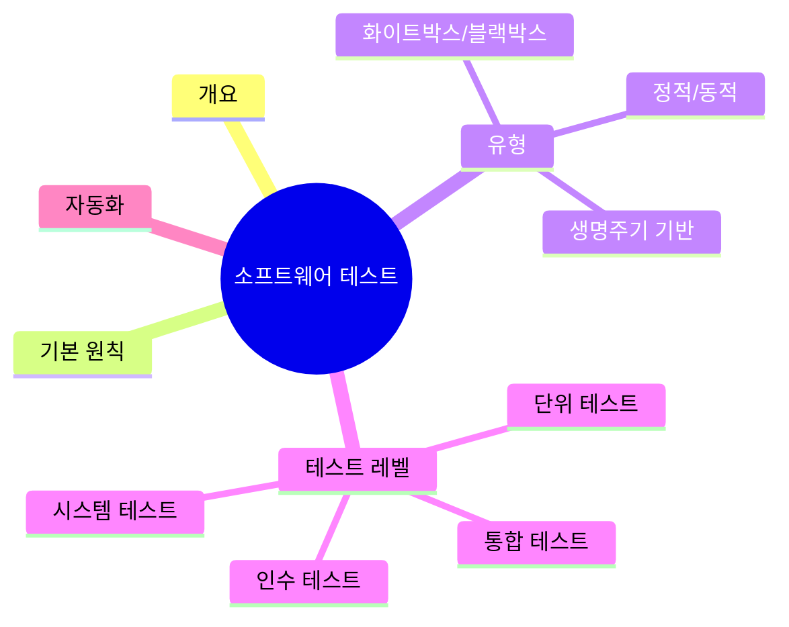
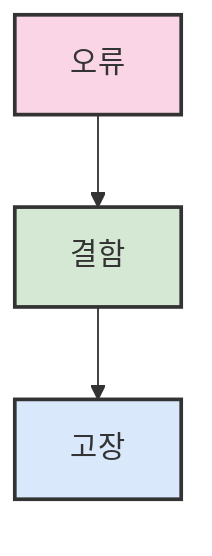
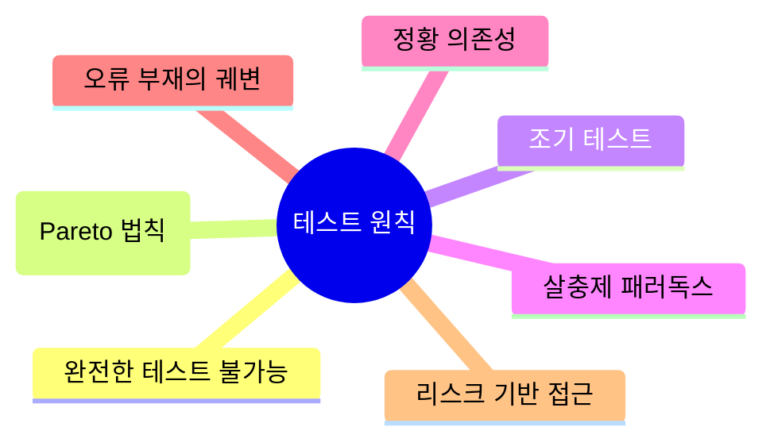
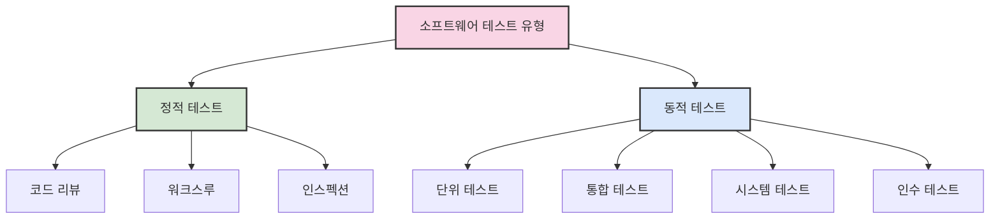
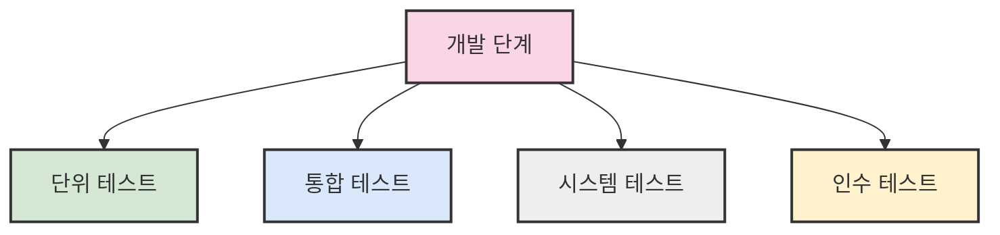
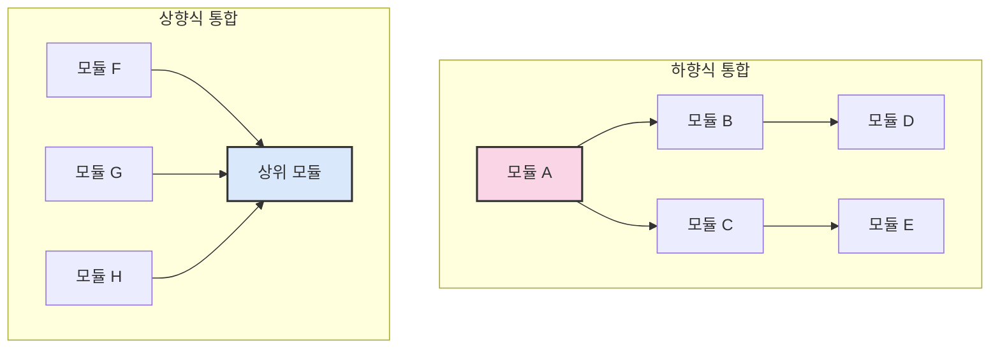

# 3. 소프트웨어 테스트 기법 🧪

## 목차
- [3. 소프트웨어 테스트 기법 🧪](#3-소프트웨어-테스트-기법-)
  - [목차](#목차)
  - [소프트웨어 테스트의 개요](#소프트웨어-테스트의-개요)
  - [소프트웨어 테스트의 기본 원칙](#소프트웨어-테스트의-기본-원칙)
  - [소프트웨어 테스트의 유형](#소프트웨어-테스트의-유형)
    - [테스트 수행 방식에 따라](#테스트-수행-방식에-따라)
    - [접근 방식에 따라](#접근-방식에-따라)
    - [테스트에 대한 시각에 따라](#테스트에-대한-시각에-따라)
    - [테스트 목적에 따라](#테스트-목적에-따라)
    - [테스트 기반에 따라](#테스트-기반에-따라)
    - [개발 생명주기(SDLC)에 따른 분류 🔄](#개발-생명주기sdlc에-따른-분류-)
  - [테스트 활동과 생명주기 연계 ⏱️](#테스트-활동과-생명주기-연계-️)
  - [단위 테스트 🧩](#단위-테스트-)
  - [통합 테스트 🔌](#통합-테스트-)
    - [방식 🛠️](#방식-️)
    - [설계 기법 🎯](#설계-기법-)
  - [시스템 테스트](#시스템-테스트)
  - [인수 테스트](#인수-테스트)
    - [알파/베타 테스트](#알파베타-테스트)
  - [테스트 자동화와 관련 도구 🤖](#테스트-자동화와-관련-도구-)
    - [구성 요소 🧩](#구성-요소-)
    - [주요 테스트 자동화 도구 🛠️](#주요-테스트-자동화-도구-️)



---

## 소프트웨어 테스트의 개요

**소프트웨어 테스트**란 프로그램이 사용자 요구에 맞게 작동하며 오류 없이 수행되는지를 검증하는 활동이다. 주요 목표는 다음과 같다:

- **기능성**: 요구된 기능이 정확히 수행되는가
- **사용성**: 사용자가 쉽게 접근하고 사용할 수 있는가
- **성능**: 빠르고 효율적인가
- **안정성**: 오류 없이 안정적으로 동작하는가

테스트의 필요성은 세 가지 관점에서 이해할 수 있다:

- **품질 향상 관점**: 반복적인 테스트로 신뢰도 확보
- **오류 발견 관점**: 잠재된 오류 탐색 및 수정
- **오류 예방 관점**: 코드 리뷰 및 검토를 통한 사전 차단

소프트웨어 결함의 3단계 흐름은 다음과 같다:

1. 오류: 개발자의 실수로 잘못된 로직을 작성할 시 발생한다.
2. 결함: 오류로 인해 시스템 내부 이상이 발생한 경우이다.
3. 고장: 결함으로 인해 실행 중 잘못된 결과가 발생하는 경우이다.



---

## 소프트웨어 테스트의 기본 원칙

테스트에는 다음의 **7가지 원칙**이 적용된다:

1. **완전한 테스트는 불가능하다** – 모든 경우를 테스트하는 것은 현실적으로 불가
2. **결함 집중(Pareto 법칙)** – 전체 오류의 대부분은 일부 컴포넌트에 집중됨
3. **조기 테스트** – 요구 분석 단계부터 테스트를 시작해야 비용 절감 가능
4. **살충제 패러독스** – 동일한 테스트 반복은 더 이상 오류를 찾지 못함 → 테스트 케이스 정기 개선 필요
5. **정황 의존성** – 테스트 결과는 사용 환경에 따라 달라질 수 있음
6. **오류 부재의 궤변** – 오류가 없다고 해서 요구사항을 만족한다고 볼 수는 없음
7. **리스크 기반 접근** – 자원과 시간은 리스크 우선순위에 따라 집중 배분해야 함



---

## 소프트웨어 테스트의 유형

### 테스트 수행 방식에 따라

- **정적 테스트**: 코드를 실행하지 않고 논리적으로 분석 (ex. 코드 리뷰, 워크스루)
- **동적 테스트**: 실제 프로그램 실행 기반 (ex. 단위, 통합, 시스템 테스트)



### 접근 방식에 따라

- **화이트박스 테스트**: 내부 구조를 기반으로 로직 경로 점검
- **블랙박스 테스트**: 외부 입력/출력 기반 테스트 (내부 로직 미고려)

### 테스트에 대한 시각에 따라

- **검증(Verification)**: 생산 과정을 테스트함
- **확인(Validation)**: 생산 제품의 결과를 테스트함
  
### 테스트 목적에 따라

- **회복 테스트**: 시스템에 고의로 실패를 유도하고 복구력을 테스트
- **안전 테스트**: 소스코드의 보안적 결함을 미리 테스트
- **강도 테스트**: 과부하 시 정상적으로 작동하는지 테스트
- **성능 테스트**: 사용자의 요구량을 시스템이 수용 가능한지 테스트
- **구조 테스트**: 시스템의 내부 경로와 소스코드의 복잡도를 평가
- **회귀 테스트**: 변경 및 수정된 코스트에 대한 결함 평가
- **병행 테스트**: 변경된 시스템과 기존 시스템에 동일한 결과를 입력해 의도한 결과가 나오는지를 확인

### 테스트 기반에 따라

- **명세 기반 테스트**: 명세가 충분히 반영되어있는지
- **구조 기반 테스트**: 내부 논리 흐름에 따른 테스트 케이스 작성
- **경험 기반 테스트**: 인력의 지식이나 경험으로부터 테스트 케이스를 작성
- 
### 개발 생명주기(SDLC)에 따른 분류 🔄

- **단위 테스트 (Unit Test)** 🧩: 각 모듈의 정확한 구현 테스트
- **통합 테스트 (Integration Test)** 🔌: 모듈 간 인터페이스 검증
- **시스템 테스트 (System Test)** 🖥️: 전체 시스템 동작 확인
- **인수 테스트 (Acceptance Test)** ✅: 최종 사용자가 요구사항 충족 여부를 확인



---

## 테스트 활동과 생명주기 연계 ⏱️

테스트 프로세스는 다음과 같은 단계로 구성된다:

| 단계 | 활동 내용 | 산출물 |
|:-----|:-----|:-----|
| **계획 및 제어** 📝 | 테스트 전략 및 일정 수립 | 테스트 계획서 |
| **분석 및 설계** 🔍 | 요구사항 기반 테스트 케이스 작성 | 테스트 케이스 |
| **구현 및 실행** 🏃 | 테스트 환경 구성, 테스트 수행 | 테스트 결과 |
| **평가 및 보고** 📊 | 결함 분석, 결과 검토 및 보고서 작성 | 테스트 보고서 |


> 💡 **중요**: 테스트는 개발 생명주기 전체에 걸쳐 반복적으로 수행되어야 하며, 각 단계마다 적절한 테스트 활동이 필요하다.

---

## 단위 테스트 🧩

**단위 테스트(Unit Test)** 는 소규모 모듈 단위에서 독립적으로 수행되며 다음을 점검한다:

- **인터페이스**: 인수의 수, 타입, 순서 오류
- **데이터 구조**: 변수 초기화, 이름 충돌
- **수행 경로**: 반복문이나 조건문 오류
- **오류 처리**: 예외상황 대응
- **경계 조건**: 최대값, 최소값 인접 영역에서의 안정성

```python
# 예시: Python의 unittest 모듈 사용
import unittest

def divide(a, b):
    return a / b

class TestDivide(unittest.TestCase):
    def test_divide_by_zero(self):
        with self.assertRaises(ZeroDivisionError):
            divide(1, 0)
```

---

## 통합 테스트 🔌

**통합 테스트(Integration Test)** 는 모듈 간 결합 및 상호작용을 점검한다.

### 방식 🛠️

| 통합 방식 | 설명 | 특징 |
|:---|:---|:---|
| **빅뱅(Big Bang)** | 모든 모듈을 한 번에 통합 | 오류 추적 어려움 |
| **상향식(Bottom-up)** | 하위 모듈부터 점진적 통합 | 드라이버 필요 |
| **하향식(Top-down)** | 상위 모듈부터 점진적 통합 | 스텁 필요 |
| **샌드위치(Sandwich)** | 상향식과 하향식 혼합 | 복잡한 시스템에 적합 |



### 설계 기법 🎯

- **동등 분할(Equivalence Partitioning)** 📊: 입력 값들을 유사 그룹으로 나눠 대표값 테스트
- **경계값 분석(Boundary Value Analysis)** 🔍: 극단값에서 오류를 유도
- **모델 기반 테스트(Model-based Testing)** 📈: 동작 흐름을 시각화해 케이스 도출

```plaintext
- 모듈 간 인터페이스 검증
- 통합 오류(Integration Bug) 발견
- 서브시스템 기능 확인
```

> ⚠️ **주의사항**: 단위 테스트를 먼저 완료한 후 통합 테스트를 진행해야 효율적인 오류 추적이 가능하다.

---

## 시스템 테스트

**시스템 테스트(System Test)** 는 전체 시스템이 요구 사항에 맞게 동작하는지 확인한다. 다음을 포함한다:

- **기능 요구 기반**: 명세서, 유스케이스 기반 검증
- **비기능 요구 기반**: 성능, 보안, 복구 기능 확인

예) 로그인 기능이 정상 작동하면서도 일정 초과 입력 시 계정 잠김 처리 여부 확인

---

## 인수 테스트

**인수 테스트(Acceptance Test)** 는 실제 사용자 또는 발주자가 시스템을 평가한다.

- **사용자 인수 테스트**: 실 사용자 관점의 적절성 확인
- **운영 인수 테스트**: 운영팀 관점의 배포 적합성 평가
- **계약 인수 테스트**: 계약 명세 충족 여부 검수

### 알파/베타 테스트

- **알파 테스트**: 개발사 내부 테스트 환경
- **베타 테스트**: 고객 환경에서 실사용자 참여

---

## 테스트 자동화와 관련 도구 🤖

테스트 효율성과 반복성 향상을 위해 **테스트 자동화**를 도입한다.

### 구성 요소 🧩

| 구성요소 | 설명 |
|:-----|:-----|
| `Test Case` | 입력, 조건, 예상 결과 명시 |
| `Test Script` | 자동 실행 스크립트 |
| `Test Driver` | 상위 호출 모듈이 없는 경우 호출 코드 |
| `Test Stub` | 하위 모듈이 없는 경우 가짜 응답 생성기 |
| `Test Log` | 실행 결과 기록용 로그 |
| `Test Harness` | 전체 실행 환경 및 도구 집합 |

### 주요 테스트 자동화 도구 🛠️

| 도구 | 언어/플랫폼 | 특징 |
|:-----|:-----|:-----|
| **JUnit** | Java | 자바 단위 테스트 표준 |
| **PyTest** | Python | 파이썬용 테스트 프레임워크 |
| **Selenium** | 다양한 언어 | 웹 브라우저 자동화 |
| **Postman** | API | API 테스트 자동화 |
| **Jenkins** | CI/CD | 지속적 통합 테스트 |

```python
# PyTest를 이용한 자동화 예시
def test_sum():
    assert sum([1, 2, 3]) == 6
```


> 📌 **핵심**: 도입 초기에는 도구 선정과 교육, 유지비용이 발생하나, 장기적으로 높은 생산성과 반복성 확보가 가능하다.

> 💡 **팁**: 반복적으로 수행해야 하는 회귀 테스트는 자동화의 우선 대상으로 삼는 것이 좋다.
