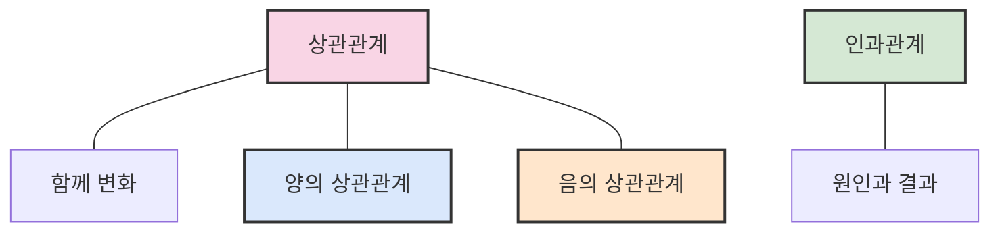
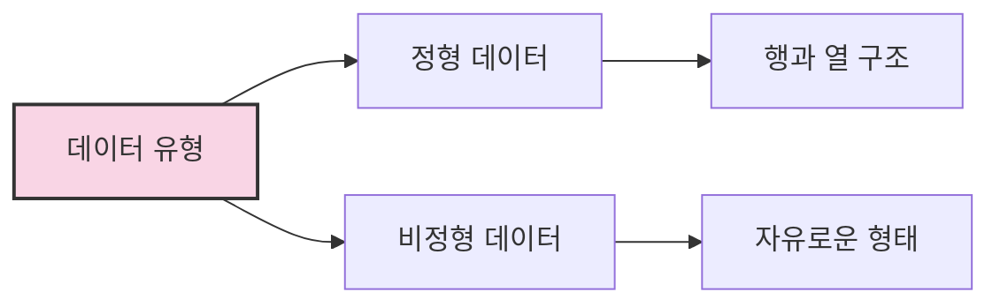
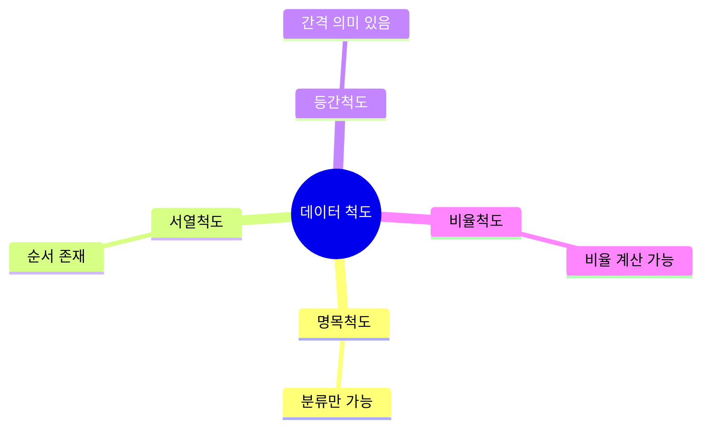
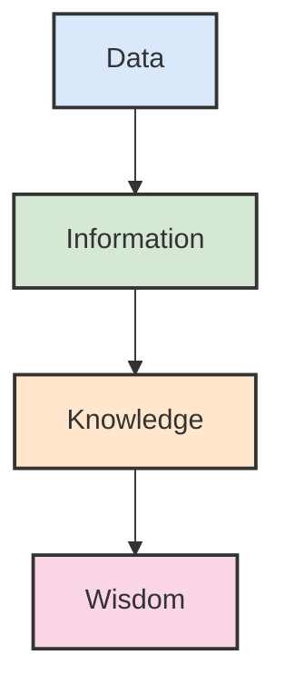
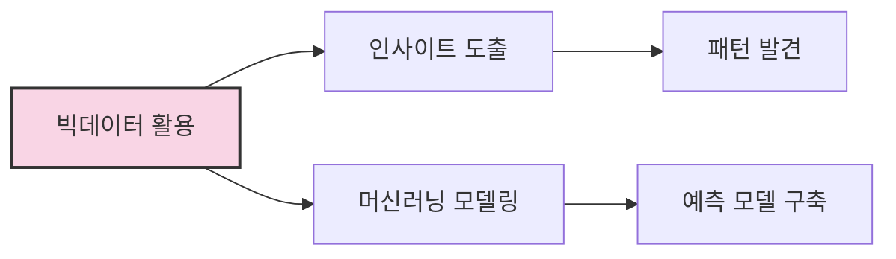
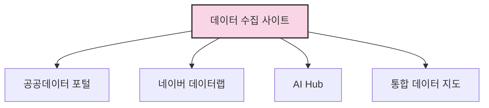

# 4. 양질의 데이터 판단을 위한 기준 📊

## 목차
- [4. 양질의 데이터 판단을 위한 기준 📊](#4-양질의-데이터-판단을-위한-기준-)
  - [목차](#목차)
  - [상관관계와 인과관계 🔄](#상관관계와-인과관계-)
  - [관계형 데이터베이스의 중요성 🗃️](#관계형-데이터베이스의-중요성-️)
  - [정형 데이터 vs 비정형 데이터 📋](#정형-데이터-vs-비정형-데이터-)
  - [데이터의 척도와 속성 📏](#데이터의-척도와-속성-)
  - [DIKW 피라미드 이론 🔺](#dikw-피라미드-이론-)
  - [빅데이터 활용법 🔍](#빅데이터-활용법-)
    - [빅데이터 활용법 1: 인사이트 목적 💼](#빅데이터-활용법-1-인사이트-목적-)
    - [빅데이터 활용법 2: 머신러닝 목적 🤖](#빅데이터-활용법-2-머신러닝-목적-)
  - [양질의 데이터 판단 기준 원칙 ✅](#양질의-데이터-판단-기준-원칙-)
  - [데이터 수집 사이트 🌐](#데이터-수집-사이트-)

---

## 상관관계와 인과관계 🔄

데이터 간의 **연관성**을 분석할 때 중요한 두 개념은 **상관관계(correlation)** 와 **인과관계(causation)** 이다.

- 상관관계: 두 변수의 값이 함께 변화할 뿐, 원인과 결과의 관계는 아님.
  - **양의 상관관계(Positive Correlation)** 📈: 한 변수가 증가할 때 다른 변수도 증가하는 관계
    ```python
    # 예: 공부 시간 증가 → 시험 점수 증가
    ```
  - **음의 상관관계(Negative Correlation)** 📉: 한 변수가 증가할 때 다른 변수는 감소하는 관계
    ```python
    # 예: 운동 시간 증가 → 체지방률 감소
    ```
  - **무상관(No Correlation)** 📊: 두 변수 간 관련성이 없는 경우
    ```python
    # 예: 신발 사이즈와 수학 성적 사이의 관계
    ```

- 인과관계: 한 변수가 다른 변수에 영향을 주는 관계.
  ```python
  # 예: 운동량 증가 → 체중 감소
  ```



---

## 관계형 데이터베이스의 중요성 🗃️

관계형 데이터베이스는 데이터를 **테이블(행과 열)** 구조로 저장하며, 서로 다른 테이블 간 연결이 가능하다.

- **Primary Key** 🔑: 각 행을 고유하게 식별하는 열
- **Foreign Key** 🔗: 다른 테이블과 연결을 위한 키
- **유일성**과 **무결성**이 보장되어야 분석이 가능하다.
> 유일성: 각 행이 고유하게 식별 가능해야 함
> 무결성: 데이터의 정확성과 일관성이 유지되어야 함

```python
# 유일성 조건 예
id | name
---|-----
101 | Alice
102 | Bob
```

**무결성**이 없으면 데이터는 해석 불가하며, 다른 데이터와의 연동도 불가능하다.

---

## 정형 데이터 vs 비정형 데이터 📋

| 정형 데이터 | 비정형 데이터 |
|:----|:----|
| 미리 정의된 구조(행/열) | 구조가 없거나 자유로운 형태 |
| Excel, SQL DB | 영상, 음성, 텍스트 |
| 분석이 용이함 | 가공이 필요함 |

```python
# 정형 데이터 예시
name, age, gender
"Jin", 27, "M"

# 비정형 데이터 예시
"오전 회의 녹음 파일" (.mp3)
```



- 분석 목적이 명확할수록 정형 데이터가 유리
- 비정형 데이터는 정성적 분석에 적합하나 품질 측정이 어려움

---

## 데이터의 척도와 속성 📏

데이터의 측정 수준(척도)은 다음 네 가지로 나뉜다:

| 척도 | 예시 | 설명 |
|------|------|------|
| 명목척도 | 성별, 혈액형 | 단순 분류만 가능 |
| 서열척도 | 등수, 만족도 | 순서만 존재, 간격 불명 |
| 등간척도 | 온도(C°), 시험 점수 | 간격 의미 있으나 절대 0 없음 |
| 비율척도 | 키, 몸무게, 가격 | 절대 0 존재, 비율 계산 가능 |

이 척도에 따라 **분석 방법**이나 **알고리즘 적용**이 달라진다.
> 범주형 데이터: 명목척도 + 서열척도로, 사칙연산이 불가능
> 수치형 데이터: 등간척도 + 비율척도로, 사칙연산이 가능



---

## DIKW 피라미드 이론 🔺

- **Data** 📄 → 단순한 숫자나 텍스트
- **Information** 📈 → 가공을 통해 의미를 부여한 데이터
- **Knowledge** 💡 → 정보 간의 연결을 통해 도출된 사실
- **Wisdom** 🧠 → 창의적 통찰을 더한 최종 활용 형태

```python
# 예시: 방송 시청률 분석
Data: A방송 2%, B방송 5%
Information: B가 A보다 시청률 높음
Knowledge: B방송 제작력 우수 가능성
Wisdom: 신작 드라마는 B방송 제작사와 협업 권장
```



---

## 빅데이터 활용법 🔍

### 빅데이터 활용법 1: 인사이트 목적 💼

전통적인 활용법에 해당하며 새로운 패턴 발견을 목표로 한다.

### 빅데이터 활용법 2: 머신러닝 목적 🤖

현재의 트렌드에 해당하며 예측 모델을 구축하는 데 중점을 둔다.



---

## 양질의 데이터 판단 기준 원칙 ✅

1. **목적 없이 데이터를 논할 수 없음** 🎯
2. **양질의 데이터를 100% 판단하는 방법이 없음** ⚖️
3. **특징과 경험으로 더 쉬운 판단이 가능** 🔍
4. **양질의 데이터 판별이 데이터 수집 및 분석의 효율성을 높임** ⚡
   
---

## 데이터 수집 사이트 🌐

다양한 목적에 따라 데이터를 수집할 수 있는 플랫폼:

1. **공공데이터 포털 (data.go.kr)** 🏛️  
   정부기관이 제공하는 행정/복지/환경 등의 구조화된 데이터

2. **네이버 데이터랩 (datalab.naver.com)** 📊  
   검색 트렌드, 쇼핑 소비 통계 등 사용자 행동 기반 데이터 제공

3. **AI Hub (aihub.or.kr)** 🧠  
   영상, 음성, 텍스트 등 인공지능 학습용 비정형 데이터

4. **통합 데이터 지도 (bigdata-map.kr)** 🗺️  
   공공/민간/유료/무료 데이터를 통합 검색 가능



> ✨ **핵심**: 데이터 선택의 핵심은 **목적에 맞는 양질의 데이터 선별**이다.
