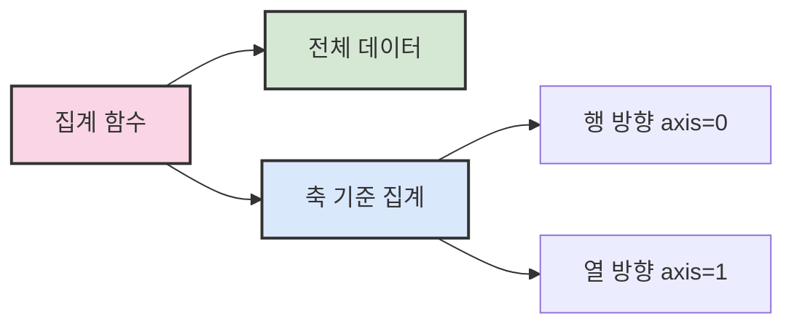

# 1. NumPy 사용법 🔢

## 목차
- [1. NumPy 사용법 🔢](#1-numpy-사용법-)
  - [목차](#목차)
  - [NumPy 소개](#numpy-소개)
  - [Indexing / Slicing](#indexing--slicing)
  - [NumPy 연산](#numpy-연산)
    - [브로드캐스팅 (Broadcasting)](#브로드캐스팅-broadcasting)
  - [집계함수 \& 마스킹 연산](#집계함수--마스킹-연산)
    - [집계 함수 📊](#집계-함수-)
    - [마스킹 연산 🔍](#마스킹-연산-)
      - [마스킹 활용 예제 🧩](#마스킹-활용-예제-)

---

## NumPy 소개

**NumPy(Numerical Python)** 는 파이썬에서 고속 수치 연산을 위한 라이브러리로, **다차원 배열**을 효율적으로 처리할 수 있게 해준다. 

Python의 기본 리스트보다 연산 속도가 빠르고, **단일 데이터 타입**으로 배열을 구성하여 메모리도 절약된다.

```python
import numpy as np

# 기본 배열 생성
np.array([1, 2, 3])                     # 정수형 배열
np.array([1.5, 2.5, 3.0])               # 실수형 배열
np.array([[1, 2], [3, 4]])              # 2차원 배열
np.array([1, 2, 3], dtype='float64')    # dtype 지정
```

배열의 타입은 `arr.dtype`, 변환은 `arr.astype()`으로 확인 및 변경 가능하다.
dtype은 `int`, `float`, `bool`, `str` 등 다양한 타입을 지원한다.

```python
arr = np.array([1, 2, 3], dtype=float)
arr.astype(int)  # → array([1, 2, 3])
```

다양한 배열 생성:

```python
np.zeros(5)                # 0으로 채운 배열
np.ones((2, 3))            # 1로 채운 2x3 배열
np.arange(0, 10, 2)        # [0, 2, 4, 6, 8]
np.linspace(0, 1, 4)       # 균등한 간격으로 나눈 값
np.random.random((2, 2))   # 0~1 사이 난수
np.random.normal(0, 1, (2, 2)) # 정규분포
np.random.randint(1, 10, (2, 2)) # 정수 난수
```

배열 정보 확인:

```python
x = np.random.randint(0, 10, (3, 4))
x.shape   # (3, 4)
x.ndim    # 2
x.size    # 12
x.dtype   # 데이터 타입
```

---

## Indexing / Slicing

**Indexing**은 특정 위치의 요소를 참조하고, **Slicing**은 배열의 일부분을 잘라낸다.

```python
x = np.arange(10)
x[3]       # 3번째 요소
x[2:5]     # 2~4번째 요소
x[::2]     # 짝수 인덱스
x[::-1]    # 역순
```

다차원 배열에서는 콤마로 차원을 구분한다.

```python
matrix = np.array([[1, 2, 3], [4, 5, 6]])
matrix[1, 2]     # 6
matrix[:, 1]     # 열 슬라이싱: [2, 5]
```

배열 구조 변경:

```python
x = np.arange(8)
x.reshape((2, 4))  # (2행, 4열)
```

배열 결합 및 분할:

```python
a = np.array([1, 2])
b = np.array([3, 4])
np.concatenate([a, b])  # [1 2 3 4]

m = np.arange(8).reshape(2, 4)
np.split(m, 2, axis=1)  # 열 기준 분할
```

---

## NumPy 연산

NumPy 배열은 **반복문 없이 벡터화 연산**을 지원하여 빠르게 수치 계산 가능하다.

```python
x = np.array([1, 2, 3])
x + 5     # [6 7 8]
x * 2     # [2 4 6]
```

행렬 연산도 동일하게 적용된다.

```python
a = np.arange(4).reshape(2, 2)
b = np.array([[5, 6], [7, 8]])
a + b     # 행렬 합
a - b     # 행렬 차
```

### 브로드캐스팅 (Broadcasting)

형태가 다른 배열 간 연산도 허용되며, 자동으로 맞춰진다.

```python
A = np.array([[1, 2, 3], [4, 5, 6]])
B = np.array([1, 2, 3])
A + B  # 각 행에 B가 더해짐
```

```python
np.arange(3).reshape((3, 1)) + np.arange(3)
# 3x3 결과행렬
```

---

## 집계함수 & 마스킹 연산

### 집계 함수 📊

배열 전체 혹은 축별로 요약 통계를 낼 수 있다.

```python
x = np.arange(8).reshape(2, 4)

np.sum(x)             # 전체 합
np.mean(x)            # 평균
np.max(x, axis=0)     # 열 단위 최대값
np.sum(x, axis=1)     # 행 단위 합
```

| 집계 함수 | 설명 |
|:----------|:-----|
| **np.sum()** | 합계 계산 |
| **np.mean()** | 평균 계산 |
| **np.median()** | 중앙값 계산 |
| **np.std()** | 표준편차 계산 |
| **np.var()** | 분산 계산 |
| **np.min(), np.max()** | 최소/최대값 |
| **np.argmin(), np.argmax()** | 최소/최대값 인덱스 |



### 마스킹 연산 🔍

논리 조건으로 요소 필터링이 가능하다.

```python
x = np.array([0, 1, 2, 3, 4])

mask = x < 3
x[mask]     # [0, 1, 2]

# 복합 조건
mask = (x > 0) & (x < 4)
x[mask]     # [1, 2, 3]

# 요소 변경
x[x < 3] = -1
print(x)    # [-1, -1, -1, 3, 4]
```

> 💡 **팁**: 마스킹은 복잡한 반복문 없이도 조건에 맞는 데이터를 빠르게 필터링할 수 있는 강력한 기능이다.


#### 마스킹 활용 예제 🧩

```python
# 이상치(outlier) 처리
data = np.random.normal(0, 1, 100)
outliers = np.abs(data) > 2  # 표준편차 2 이상인 값
cleaned_data = data[~outliers]  # 이상치 제거된 데이터

# 특정 조건 카운팅
np.sum(data > 0)  # 양수 값의 개수
```

---

> ✨ **요약**: NumPy의 집계함수와 마스킹은 데이터 분석 과정에서 핵심적인 역할을 하며, 복잡한 데이터에서 필요한 정보를 효율적으로 추출할 수 있게 해준다.

