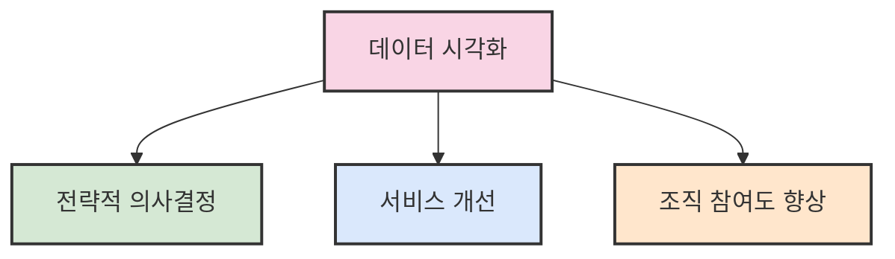
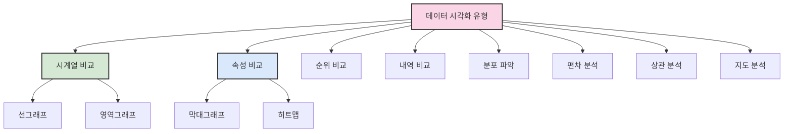

# 1. 데이터 시각화의 중요성 📊

## 목차
- [1. 데이터 시각화의 중요성 📊](#1-데이터-시각화의-중요성-)
  - [목차](#목차)
  - [데이터 시각화의 중요성](#데이터-시각화의-중요성)
  - [다양한 데이터의 유형](#다양한-데이터의-유형)
  - [데이터 시각화를 위한 다양한 도구들](#데이터-시각화를-위한-다양한-도구들)
    - [Code 기반 도구](#code-기반-도구)
    - [No Code 기반 도구](#no-code-기반-도구)
  - [데이터 시각화를 위한 용도별 분류 📈](#데이터-시각화를-위한-용도별-분류-)
  - [데이터 시각화 유의사항 ⚠️](#데이터-시각화-유의사항-️)

---

## 데이터 시각화의 중요성

**데이터 시각화(Data Visualization)** 는 숫자와 문자를 차트나 그래프를 통해 시각적으로 표현하는 것으로, 핵심 목표는 **효과적인 커뮤니케이션**이다. 목적에 따라 아래와 같이 유형이 나뉜다.

```text
1. 가설검증형: 특정 가설의 진위를 데이터로 입증
2. 가설탐색형: 데이터를 통해 가설을 도출
3. 사실보고형: 주기적 지표를 모니터링
4. 사실설명형: 데이터 기반의 스토리 전달
5. 주장설득형: 주장에 힘을 실기 위한 시각화
6. 주장표현형: 공감과 감동 중심의 창의적 표현
```

시각화를 통해 **전략적 의사결정**, **서비스 개선**, **조직 참여도 향상** 등을 기대할 수 있다.



---

## 다양한 데이터의 유형

데이터는 다음과 같이 구분된다.

- **정량적 데이터** 📏: 수치로 측정 가능한 데이터
  - 연속형: 길이, 온도 등
  - 이산형: 개수, 인원 등
- **정성적 데이터** 🗣️: 수치로 표현되지 않는 설명 중심의 데이터
  - 명목형: 성별, 혈액형 등
  - 순서형: 만족도, 등급 등
- **기타**:
  - 텍스트: 자유형식의 문자열
  - 날짜/시간: 시계열 처리 가능

**시각화 방법 예시:**
```python
import matplotlib.pyplot as plt
import numpy as np

# 정량적 데이터 시각화 예시 - 히스토그램
data = np.random.normal(0, 1, 1000)
plt.hist(data, bins=30)
plt.title('정규분포 히스토그램')
plt.show()

# 정성적 데이터 시각화 예시 - 막대그래프
categories = ['A', 'B', 'C', 'D']
values = [15, 25, 10, 30]
plt.bar(categories, values)
plt.title('카테고리별 수치')
plt.show()
```

---

## 데이터 시각화를 위한 다양한 도구들

### Code 기반 도구
- **Python**: `Matplotlib`, `seaborn`
- **R**: 다양한 시각화 패키지
- 장점: 유연한 커스터마이징, 대용량 처리
- 단점: 러닝커브, 시간 소모

### No Code 기반 도구
- **Excel**, **Tableau**, **Spotfire**
- 장점: 직관적, 빠른 시각화 가능
- 단점: 유연성 낮음, 대용량에 불리

> 💡 **팁**: 목적과 상황에 맞는 도구 선택이 중요합니다. 일회성 분석에는 No Code 도구가, 반복적이고 복잡한 분석에는 Code 기반 도구가 효율적입니다.

---

## 데이터 시각화를 위한 용도별 분류 📈

데이터 시각화는 목적에 따라 다음과 같이 분류된다:

| 분류 | 목적 | 주요 차트 | 활용 예시 |
|------|------|-----------|----------|
| 시계열 비교 ⏱️ | 시간에 따른 변화 | 선그래프, 영역그래프 | 주식 가격 추이, 일별 판매량 |
| 속성 비교 🔄 | 속성별 지표 비교 | 막대그래프, 히트맵 | 제품별 판매량, 부서별 성과 |
| 순위 비교 🏆 | 순서화된 속성 | 막대그래프, 범프차트 | 매출 순위, 성적 순위 |
| 내역 비교 🧩 | 전체 대비 구성비 | 원그래프, 적립형 막대그래프 | 예산 할당, 시장 점유율 |
| 분포 파악 📊 | 데이터 확산/이상치 파악 | 산점도, 히스토그램 | 신장/체중 분포, 시험 점수 분포 |
| 편차 분석 📉 | 평균과의 차이 분석 | 박스플롯 | 지역별 소득 격차, 제품 품질 편차 |
| 상관 분석 🔗 | 두 변수 간 관계 | 산점도(회귀선 포함) | 광고비-매출 관계, 학습시간-성적 관계 |
| 지도 분석 🗺️ | 위치 기반 데이터 시각화 | 지도 차트, 히트맵 | 지역별 판매량, 인구 밀도 |



---

## 데이터 시각화 유의사항 ⚠️

시각화 시 다음을 주의해야 한다:

- **막대그래프 기준선은 0부터 시작**해야 왜곡 방지
  ```python
  # 올바른 예시
  plt.bar(['A', 'B', 'C'], [10, 20, 15])
  plt.ylim(0)  # y축 0부터 시작
  ```

- **선그래프의 축 스케일**이 다르면 오해 소지 있음
  ```python
  # 오해 소지가 있는 예시와 해결책
  fig, (ax1, ax2) = plt.subplots(1, 2, figsize=(10, 4))
  ax1.plot([1, 2, 3], [100, 120, 90])
  ax1.set_ylim(0, 150)  # 올바른 접근법
  ax2.plot([1, 2, 3], [100, 120, 90])
  ax2.set_ylim(80, 130)  # 오해 소지 있음
  ```

- **파이그래프는 반드시 총합이 100%** 여야 함
- **3D 그래프는 시점 차이로 인해 정보 왜곡 발생** 가능 → 지양

> ⚠️ **주의사항**: 데이터 시각화에서 정직함(data integrity)은 가장 중요한 가치이다. 의도적이든 비의도적이든 잘못된 시각화는 잘못된 의사결정으로 이어질 수 있다.

> ✨ **요약**: 효과적인 데이터 시각화는 정보를 직관적으로 전달하고 인사이트 발견을 촉진하며 데이터 기반 의사결정을 지원한다. 목적에 맞는 차트 유형 선택과 시각화 원칙 준수가 핵심이다.

---
