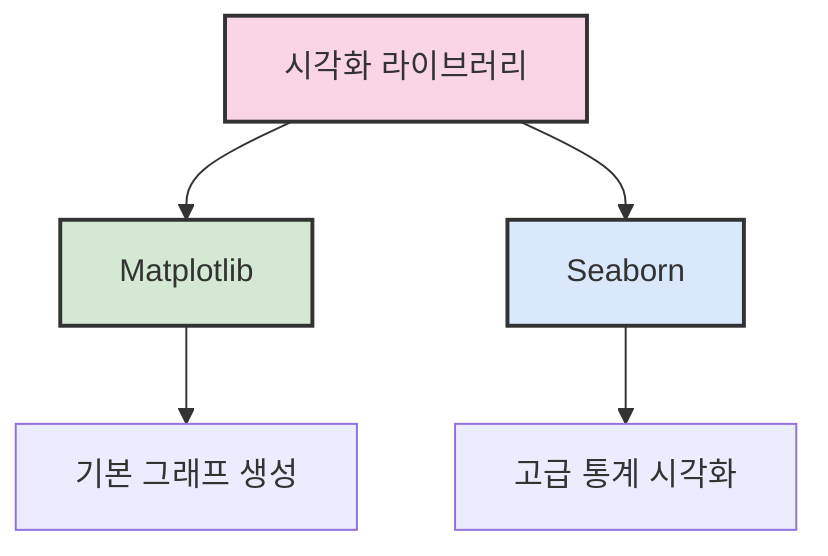

# 6. python을 사용한 데이터 시각화 📊

## 목차
- [6. python을 사용한 데이터 시각화 📊](#6-python을-사용한-데이터-시각화-)
  - [목차](#목차)
  - [1. Matplotlib 기본 문법 📈](#1-matplotlib-기본-문법-)
  - [2. Seaborn 기본 문법 🎨](#2-seaborn-기본-문법-)
  - [3. 선 그래프와 막대 그래프 📊](#3-선-그래프와-막대-그래프-)
    - [선 그래프 📈](#선-그래프-)
    - [막대 그래프 📊](#막대-그래프-)
  - [4. Groupby 및 실제 데이터 활용 📑](#4-groupby-및-실제-데이터-활용-)
  - [5. 파이 차트와 히스토그램 🥧](#5-파이-차트와-히스토그램-)
    - [파이 차트 🥧](#파이-차트-)
    - [히스토그램 📊](#히스토그램-)
  - [6. 박스 플롯 📦](#6-박스-플롯-)
  - [7. 산점도와 히트맵 🔍](#7-산점도와-히트맵-)
    - [산점도 📍](#산점도-)
    - [히트맵 🌈](#히트맵-)

## 1. Matplotlib 기본 문법 📈

- Matplotlib은 파이썬에서 다양한 시각화 그래프를 그릴 수 있는 기본 패키지이다.
- 보통 `import matplotlib.pyplot as plt` 형식으로 불러온다.
- `plt.plot(x, y)`로 그래프를 그리고 `plt.show()`로 출력한다.
- `plt.title()`, `plt.xlabel()`, `plt.ylabel()`로 그래프의 제목과 축 이름을 설정한다.
- `plt.plot()`을 여러 번 호출하면 여러 선이 겹쳐서 출력된다.
- 범례는 `plt.legend()` 또는 `label` 매개변수를 이용해 자동 설정할 수 있다.
- 하나의 figure에 여러 subplot을 배치하려면 `plt.subplot()` 또는 `plt.subplots()`를 사용한다.
- 여러 개의 figure를 사용하려면 `plt.figure()`로 각각 설정할 수 있다.
- `constrained_layout=True`를 설정하면 subplot 간 간격을 자동 조절할 수 있다.

**기본 사용 예시:**
```python
import matplotlib.pyplot as plt
import numpy as np

# 데이터 준비
x = np.linspace(0, 10, 100)
y1 = np.sin(x)
y2 = np.cos(x)

# 그래프 생성
plt.figure(figsize=(10, 6))
plt.plot(x, y1, label='sin(x)', color='blue', linestyle='-')
plt.plot(x, y2, label='cos(x)', color='red', linestyle='--')

# 그래프 꾸미기
plt.title('사인과 코사인 함수', fontsize=16)
plt.xlabel('x 값', fontsize=12)
plt.ylabel('y 값', fontsize=12)
plt.grid(True, linestyle=':')
plt.legend()

# 그래프 출력
plt.show()
```

> 💡 **팁**: `plt.tight_layout()` 또는 `constrained_layout=True`를 사용하면 그래프의 레이블과 제목이 잘리는 문제를 방지할 수 있다.

## 2. Seaborn 기본 문법 🎨

- Seaborn은 Matplotlib 기반의 시각화 라이브러리로, 보다 미려한 시각화를 지원한다.
- 보통 `import seaborn as sns`로 불러온다.
- `sns.lineplot()`을 통해 라인 그래프를 간단히 그릴 수 있다.
- Seaborn은 `label`만 지정해도 범례를 자동 표시한다.
- `sns.set_style()`로 시각화 테마를 변경할 수 있다.
- 내장 테마는 `"darkgrid"`, `"whitegrid"`, `"dark"`, `"white"`, `"ticks"` 다섯 가지이다.

**Seaborn 예시:**
```python
import seaborn as sns
import matplotlib.pyplot as plt
import pandas as pd
import numpy as np

# 샘플 데이터 생성
dates = pd.date_range('20220101', periods=30)
df = pd.DataFrame({
    '날짜': dates,
    '값1': np.random.normal(10, 2, 30).cumsum(),
    '값2': np.random.normal(5, 1, 30).cumsum(),
    '그룹': np.random.choice(['A', 'B'], 30)
})

# Seaborn 스타일 설정
sns.set_style("whitegrid")

# 그래프 생성
plt.figure(figsize=(12, 6))
sns.lineplot(data=df, x='날짜', y='값1', label='시리즈 1')
sns.lineplot(data=df, x='날짜', y='값2', label='시리즈 2')

# 그래프 꾸미기
plt.title('Seaborn을 활용한 시계열 데이터 시각화', fontsize=16)
plt.xticks(rotation=45)
plt.tight_layout()

# 그래프 출력
plt.show()
```



## 3. 선 그래프와 막대 그래프 📊

### 선 그래프 📈

- 선 그래프는 추이와 패턴을 시각적으로 파악하는 데 유용하다.
- 눈금 조절은 `plt.xticks()`와 `plt.yticks()`로 수동 설정할 수 있다.
- `marker`, `linestyle`, `color`로 선의 모양, 색상, 마커 형태를 설정할 수 있다.
- `plt.grid()`로 격자를 추가할 수 있다.

**선 그래프 예시:**
```python
# 연도별 성장률 시각화
years = [2015, 2016, 2017, 2018, 2019, 2020, 2021, 2022]
growth = [3.2, 3.5, 2.8, 3.0, 2.5, -0.9, 4.1, 2.6]

plt.figure(figsize=(10, 6))
plt.plot(years, growth, marker='o', linestyle='-', color='blue', linewidth=2)
plt.axhline(y=0, color='r', linestyle='-', alpha=0.3)  # 0% 기준선

plt.title('연도별 GDP 성장률 (%)', fontsize=16)
plt.xlabel('연도', fontsize=12)
plt.ylabel('성장률 (%)', fontsize=12)
plt.grid(True, linestyle='--', alpha=0.7)
plt.xticks(years)
plt.ylim(-1.5, 5)

# 각 지점에 값 표시
for x, y in zip(years, growth):
    plt.text(x, y + 0.1, f'{y}%', ha='center')

plt.show()
```

### 막대 그래프 📊

- 막대 그래프는 복수의 데이터를 비교하거나 절댓값 크기를 한눈에 파악하기에 유용한 시각화 방법이다.
- `plt.bar()`는 세로 막대 그래프를, `plt.barh()`는 가로 막대 그래프를 생성한다.
- Seaborn의 `sns.barplot()`은 통계적 요약(기본적으로 평균)과 함께 오차 막대를 자동으로 포함한다.
- `errorbar=None`을 설정하면 오차 막대를 제거할 수 있다.
- `hue` 매개변수를 사용하면 그룹별로 막대를 나누어 비교할 수 있다.

**막대 그래프 예시:**
```python
# 카테고리별 매출 비교
categories = ['전자제품', '의류', '식품', '가구', '도서']
sales_2021 = [850, 730, 620, 410, 330]
sales_2022 = [920, 680, 670, 440, 350]

# 그룹화된 막대 그래프
x = np.arange(len(categories))
width = 0.35

fig, ax = plt.subplots(figsize=(12, 7))
bar1 = ax.bar(x - width/2, sales_2021, width, label='2021년', color='skyblue')
bar2 = ax.bar(x + width/2, sales_2022, width, label='2022년', color='salmon')

# 그래프 꾸미기
ax.set_title('카테고리별 연간 매출 비교 (단위: 백만원)', fontsize=16)
ax.set_xlabel('제품 카테고리', fontsize=12)
ax.set_ylabel('매출액 (백만원)', fontsize=12)
ax.set_xticks(x)
ax.set_xticklabels(categories)
ax.legend()
ax.grid(True, linestyle='--', alpha=0.3, axis='y')

# 막대 위에 값 표시
def add_labels(bars):
    for bar in bars:
        height = bar.get_height()
        ax.annotate(f'{height}',
                    xy=(bar.get_x() + bar.get_width() / 2, height),
                    xytext=(0, 3),  # 3 points vertical offset
                    textcoords="offset points",
                    ha='center', va='bottom')

add_labels(bar1)
add_labels(bar2)

fig.tight_layout()
plt.show()
```

> ⚠️ **주의사항**: 막대그래프는 기준선을 0부터 시작해야 데이터를 왜곡하지 않는다. 부득이하게 0부터 시작하지 않는 경우, 축이 끊어졌음을 시각적으로 표시해야 한다.

## 4. Groupby 및 실제 데이터 활용 📑

- `DataFrame.groupby()`와 `mean()`을 통해 월별 또는 항목별로 데이터를 집계할 수 있다.
- Matplotlib 또는 Seaborn으로 월별 변화량 등의 추이를 시각화할 수 있다.
- Seaborn의 `lineplot()`은 `data=`, `x=`, `y=` 방식으로 선언하며, `errorbar` 옵션도 포함할 수 있다.
- 오차 막대는 기본적으로 95% 신뢰 구간을 표현하며, 필요 없을 경우 `errorbar=None`을 전달한다.

**Pandas와 Seaborn을 활용한 그룹화 예시:**
```python
import pandas as pd
import seaborn as sns
import matplotlib.pyplot as plt
import numpy as np

# 샘플 판매 데이터 생성
np.random.seed(42)
dates = pd.date_range('20220101', periods=365)
df = pd.DataFrame({
    '날짜': dates,
    '매출액': np.random.normal(1000, 200, 365) + np.sin(np.linspace(0, 2*np.pi, 365)) * 200,
    '제품': np.random.choice(['A', 'B', 'C'], 365),
    '지역': np.random.choice(['서울', '부산', '대구', '인천'], 365)
})

# 날짜에서 월 추출
df['월'] = df['날짜'].dt.month

# 월별, 제품별 평균 매출 집계
monthly_sales = df.groupby(['월', '제품'])['매출액'].mean().reset_index()

# 시각화
plt.figure(figsize=(12, 8))
sns.lineplot(data=monthly_sales, x='월', y='매출액', hue='제품', marker='o')

plt.title('월별 제품 평균 매출액', fontsize=16)
plt.xlabel('월', fontsize=12)
plt.ylabel('평균 매출액', fontsize=12)
plt.xticks(range(1, 13))
plt.grid(True, linestyle='--', alpha=0.7)
plt.legend(title='제품')

plt.tight_layout()
plt.show()
```

## 5. 파이 차트와 히스토그램 🥧

### 파이 차트 🥧

- 파이 차트는 범주형 데이터의 비율을 원형으로 나타내는 그래프이다.
- `plt.pie()`를 사용하며, `autopct="%1.1f%%"`를 지정하면 백분율도 함께 표기된다.
- 범례는 `plt.legend(loc='lower left')` 등의 방식으로 설정한다.

**파이 차트 예시:**
```python
# 카테고리별 예산 할당
categories = ['연구개발', '마케팅', '운영', '인사', '기타']
budget = [35, 25, 20, 15, 5]
colors = ['#ff9999', '#66b3ff', '#99ff99', '#ffcc99', '#c2c2f0']
explode = (0.1, 0, 0, 0, 0)  # 첫 번째 조각만 돌출

plt.figure(figsize=(10, 7))
plt.pie(budget, explode=explode, labels=categories, colors=colors,
        autopct='%1.1f%%', shadow=True, startangle=90)

# 비율 유지를 위한 설정
plt.axis('equal')  
plt.title('부서별 예산 비율', fontsize=16)
plt.legend(loc='lower left')
plt.tight_layout()
plt.show()
```

### 히스토그램 📊

- 히스토그램은 특정 값의 빈도를 보여주는 데 적합한 시각화 방법이다.
- `sns.histplot()` 또는 `plt.hist()`를 사용하여 그리며, `bins`와 `binrange`를 조정해 구간 수와 범위를 설정할 수 있다.
- `hue`, `multiple='dodge'`, `shrink=0.8` 등의 매개변수로 그룹별 히스토그램을 겹치지 않게 표시할 수 있다.

**히스토그램 예시:**
```python
# 두 집단의 시험 점수 분포
np.random.seed(42)
group_a = np.random.normal(70, 10, 200)  # 평균 70, 표준편차 10
group_b = np.random.normal(75, 12, 200)  # 평균 75, 표준편차 12

# 데이터프레임 생성
scores_df = pd.DataFrame({
    '점수': np.concatenate([group_a, group_b]),
    '그룹': ['A'] * 200 + ['B'] * 200
})

plt.figure(figsize=(12, 7))
sns.histplot(data=scores_df, x='점수', hue='그룹', bins=15, 
             multiple='dodge', shrink=0.8, kde=True)

plt.title('그룹별 시험 점수 분포', fontsize=16)
plt.xlabel('점수', fontsize=12)
plt.ylabel('빈도', fontsize=12)
plt.grid(True, linestyle='--', alpha=0.7, axis='y')
plt.tight_layout()
plt.show()
```

## 6. 박스 플롯 📦

- 박스 플롯은 데이터의 중위수, 사분위수, 이상치를 시각적으로 보여주는 그래프이다.
- 중앙값, IQR(Interquartile Range), 수염(whisker), 이상치가 포함된다.
- `plt.boxplot()` 또는 `sns.boxplot()`으로 구현 가능하며, 여러 열을 한꺼번에 그릴 수도 있다.
- 특정 월, 연도 등의 조건을 만족하는 데이터를 선택해 월별 박스 플롯을 그리는 것도 가능하다.

**박스 플롯 구성요소:**

| 요소 | 설명 |
|------|------|
| 중앙선 | 데이터의 중앙값(50th 퍼센타일) |
| 박스 상단 | 3사분위수(75th 퍼센타일) |
| 박스 하단 | 1사분위수(25th 퍼센타일) |
| 수염 상단 | 최댓값 또는 Q3 + 1.5 * IQR |
| 수염 하단 | 최솟값 또는 Q1 - 1.5 * IQR |
| 점 | 이상치(outlier) |

**박스 플롯 예시:**
```python
# 지역별 월 평균 기온 데이터 생성
np.random.seed(42)
regions = ['서울', '부산', '대전', '광주', '제주']
monthly_temps = pd.DataFrame()

for region in regions:
    # 각 지역별로 약간 다른 기온 패턴 생성
    base = 10 + np.random.randint(-3, 4)
    temps = base + 15 * np.sin(np.linspace(0, 2*np.pi, 12)) + np.random.normal(0, 3, 12)
    df = pd.DataFrame({
        '지역': region,
        '월': range(1, 13),
        '평균기온': temps
    })
    monthly_temps = pd.concat([monthly_temps, df])

plt.figure(figsize=(14, 8))
sns.boxplot(data=monthly_temps, x='지역', y='평균기온', palette='Set3')

plt.title('지역별 월평균 기온 분포', fontsize=16)
plt.xlabel('지역', fontsize=12)
plt.ylabel('평균기온(°C)', fontsize=12)
plt.grid(True, linestyle='--', alpha=0.7, axis='y')
plt.tight_layout()
plt.show()
```

**여러 변수 비교를 위한 박스 플롯:**
```python
# 다변량 박스 플롯 - 월별 지역 기온 분포
plt.figure(figsize=(16, 10))
sns.boxplot(data=monthly_temps, x='월', y='평균기온', hue='지역', palette='Set2')

plt.title('월별 지역 기온 분포 비교', fontsize=16)
plt.xlabel('월', fontsize=12)
plt.ylabel('평균기온(°C)', fontsize=12)
plt.xticks(range(0, 12), ['1월', '2월', '3월', '4월', '5월', '6월', '7월', '8월', '9월', '10월', '11월', '12월'])
plt.grid(True, linestyle='--', alpha=0.7, axis='y')
plt.legend(title='지역')
plt.tight_layout()
plt.show()
```

> 💡 **팁**: 박스 플롯과 함께 `sns.stripplot()`을 사용하면 개별 데이터 포인트도 함께 표시할 수 있어, 데이터 분포를 더 명확하게 이해할 수 있다.

> ⚠️ **주의사항**: 극단적인 이상치가 많은 데이터는 박스 플롯의 전체적인 스케일을 왜곡시킬 수 있다. 이런 경우 `showfliers=False` 옵션을 사용하여 이상치를 제외하고 표시하는 것이 좋다.

## 7. 산점도와 히트맵 🔍

### 산점도 📍

- 산점도는 두 변수 간의 관계를 시각화할 수 있는 방법이다.
- `plt.scatter()` 또는 `sns.scatterplot()`을 이용하며, `xlim`과 `ylim`으로 축 범위를 지정할 수 있다.
- 상관관계가 있을 경우 점들이 선형 패턴을 형성하며, 이는 양의 상관 혹은 음의 상관 관계로 해석 가능하다.
- `sns.regplot()`을 사용하면 추세선(회귀선)을 함께 표시할 수 있다.
- 마커 크기, 색상, 투명도 등을 조절해 추가 변수를 표현할 수도 있다.

**산점도 예시:**
```python
# 광고비와 매출액 관계 데이터 생성
np.random.seed(42)
n = 50
ad_spend = np.random.uniform(5, 50, n)  # 5-50 사이 광고 지출
noise = np.random.normal(0, 10, n)  # 무작위 노이즈
sales = 5 + 3 * ad_spend + noise  # 선형 관계 + 노이즈

plt.figure(figsize=(10, 8))
plt.scatter(ad_spend, sales, s=80, alpha=0.7, c='royalblue', edgecolors='navy')

# 추세선 추가
z = np.polyfit(ad_spend, sales, 1)
p = np.poly1d(z)
plt.plot(ad_spend, p(ad_spend), "r--", alpha=0.8, linewidth=2)

plt.title('광고비 지출과 매출액의 관계', fontsize=16)
plt.xlabel('월간 광고비 지출 (백만원)', fontsize=12)
plt.ylabel('월간 매출액 (천만원)', fontsize=12)
plt.grid(True, linestyle='--', alpha=0.7)

# 상관계수 계산 및 표시
corr = np.corrcoef(ad_spend, sales)[0, 1]
plt.annotate(f'상관계수: {corr:.2f}', xy=(0.05, 0.95), xycoords='axes fraction',
             fontsize=12, bbox=dict(boxstyle="round,pad=0.3", fc="white", alpha=0.8))

plt.tight_layout()
plt.show()
```

**버블 차트(크기가 있는 산점도):**
```python
# 세 번째 변수를 크기로 표현하는 버블 차트
np.random.seed(42)
n = 30
x = np.random.normal(0, 2, n)
y = x * 0.8 + np.random.normal(0, 1, n)
size = np.random.uniform(20, 200, n)  # 버블 크기
category = np.random.choice(['A', 'B', 'C'], n)  # 범주형 변수

plt.figure(figsize=(12, 8))
for cat, color in zip(['A', 'B', 'C'], ['royalblue', 'crimson', 'forestgreen']):
    mask = category == cat
    plt.scatter(x[mask], y[mask], s=size[mask], c=color, alpha=0.6, 
                edgecolor='white', linewidth=1, label=f'그룹 {cat}')

plt.title('버블 차트: 세 가지 변수 시각화', fontsize=16)
plt.xlabel('X 변수', fontsize=12)
plt.ylabel('Y 변수', fontsize=12)
plt.grid(True, linestyle='--', alpha=0.7)
plt.legend()
plt.tight_layout()
plt.show()
```

### 히트맵 🌈

- 상관 계수 행렬은 `df.corr()`로 계산할 수 있으며, 이를 기반으로 `sns.heatmap()`을 통해 히트맵을 생성할 수 있다.
- 히트맵은 변수 간 상관관계를 색의 진하기로 시각화하여, 관계 강도를 직관적으로 표현한다.
- `annot=True` 옵션으로 각 셀에 수치를 함께 표기할 수 있으며, `cmap` 매개변수로 색상 팔레트를 지정할 수 있다.
- 'coolwarm', 'viridis', 'YlGnBu' 등이 자주 사용된다.
- 행렬 데이터가 아닌 피벗 테이블 형태의 데이터도 히트맵으로 시각화할 수 있다.

**상관관계 히트맵 예시:**
```python
# 다변량 데이터셋 생성
np.random.seed(42)
n = 200
df = pd.DataFrame({
    '키': np.random.normal(170, 10, n),
    '체중': np.random.normal(65, 12, n),
    '연령': np.random.normal(35, 8, n),
    '혈압': np.random.normal(120, 15, n),
    '콜레스테롤': np.random.normal(200, 30, n)
})

# 체중과 키 사이에 상관관계 설정
df['체중'] = df['키'] * 0.5 + np.random.normal(0, 8, n)
# 혈압과 연령 사이에 상관관계 설정
df['혈압'] = df['연령'] * 0.8 + np.random.normal(90, 10, n)
# 콜레스테롤과 연령 사이에 약한 상관관계 설정
df['콜레스테롤'] = df['연령'] * 1.2 + np.random.normal(160, 25, n)

# 상관계수 계산
corr_matrix = df.corr()

# 히트맵 생성
plt.figure(figsize=(10, 8))
sns.heatmap(corr_matrix, annot=True, cmap='coolwarm', vmin=-1, vmax=1,
            linewidths=0.5, fmt='.2f')

plt.title('변수 간 상관관계 히트맵', fontsize=16)
plt.tight_layout()
plt.show()
```

**피벗 테이블 히트맵 예시:**
```python
# 시간대별 요일별 수요 데이터 생성
np.random.seed(42)
hours = list(range(0, 24))
days = ['월', '화', '수', '목', '금', '토', '일']
demand_data = []

for day in days:
    for hour in hours:
        # 시간과 요일에 따라 다른 패턴 생성
        base_demand = 100  # 기본 수요
        
        # 출퇴근 시간대 피크
        if day in ['월', '화', '수', '목', '금']:  # 평일
            if 7 <= hour <= 9:  # 출근 시간
                base_demand += 80
            elif 17 <= hour <= 19:  # 퇴근 시간
                base_demand += 100
        else:  # 주말
            if 10 <= hour <= 16:  # 주말 활동 시간
                base_demand += 60
        
        # 심야 시간대는 수요 감소
        if 0 <= hour <= 5:
            base_demand -= 50
            
        # 노이즈 추가
        demand = base_demand + np.random.normal(0, 10)
        demand_data.append({'요일': day, '시간': hour, '수요': max(0, demand)})

demand_df = pd.DataFrame(demand_data)

# 피벗 테이블 생성
pivot_table = demand_df.pivot(index='요일', columns='시간', values='수요')

# 히트맵 생성
plt.figure(figsize=(16, 8))
sns.heatmap(pivot_table, cmap='YlOrRd', annot=False)

plt.title('요일별 시간대별 수요 히트맵', fontsize=16)
plt.xlabel('시간', fontsize=12)
plt.ylabel('요일', fontsize=12)
plt.tight_layout()
plt.show()
```


> 💡 **팁**: 히트맵에서 색상 대비를 높이려면 `vmin=-1, vmax=1` 옵션을 설정하면 된다. 또한 `mask=np.triu(corr_matrix)` 옵션으로 대각선 위쪽만 표시할 수도 있다.

> ✨ **요약**: Python을 활용한 데이터 시각화는 Matplotlib과 Seaborn과 같은 라이브러리를 통해 다양한 그래프를 생성할 수 있다. 데이터의 특성과 전달하고자 하는 메시지에 따라 적절한 시각화 방법을 선택하는 것이 중요하다. 데이터 시각화는 단순히 그래프를 그리는 것이 아니라 데이터의 패턴과 인사이트를 효과적으로 전달하는 커뮤니케이션 도구라는 점을 항상 기억하자.
