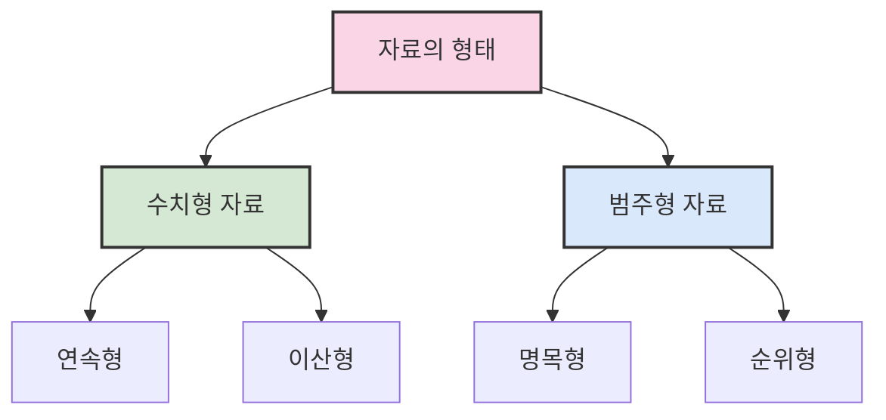

# 1. 시각화를 통한 자료의 요약 📊

## 목차
- [1. 시각화를 통한 자료의 요약 📊](#1-시각화를-통한-자료의-요약-)
  - [목차](#목차)
  - [자료의 형태](#자료의-형태)
  - [범주형 자료의 요약](#범주형-자료의-요약)
  - [수치형 자료의 요약](#수치형-자료의-요약)
    - [이산형 자료](#이산형-자료)
    - [연속형 자료](#연속형-자료)
  - [요약](#요약)

---

## 자료의 형태

자료는 크게 **수치형 자료**와 **범주형 자료**로 나뉜다.

- **수치형 자료** 📏: 수치로 직접 측정 가능한 자료 (예: 키, 몸무게, 시간)
  - `연속형`: 이론적으로 무한히 세분화 가능 (예: 시간, 온도)
  - `이산형`: 셀 수 있는 정수 값 (예: 학생 수, 조회수)

- **범주형 자료** 🏷️: 수치보다 분류에 의미가 있는 자료
  - `명목형`: 순서 없음 (예: 혈액형, 지역)
  - `순위형`: 순서 존재 (예: 학점, 만족도)



> ⚠️ **주의**: 범주형 자료도 숫자로 표현될 수 있으나, 의미가 다르면 수치형으로 오해하면 안 됩니다.

```python
# 예시
df['성별'].value_counts()  # 도수
df['성별'].value_counts(normalize=True)  # 상대도수
```

---

## 범주형 자료의 요약

범주형 자료는 각 범주가 얼마나 자주 등장하는지를 요약하는 것이 핵심이다.

| 요약 방법 | 설명 | 활용 |
|----------|------|------|
| 도수분포표 | 각 범주별 관측 수 및 비율 요약 | 빈도와 비율 파악 |
| 원형 그래프 | 비율 중심의 시각화 | 전체 분포 직관적 이해 |
| 막대 그래프 | 각 범주의 빈도 비교 | 범주 간 빈도 차이 분석 |

```python
# 도수분포표 생성
pd.crosstab(index=df['지역'], columns='count')

# 두 변수 교차표
pd.crosstab(index=df['성별'], columns=df['선호도'])

# 시각화 예시
plt.figure(figsize=(10, 5))
plt.subplot(1, 2, 1)
plt.pie(df['항목'].value_counts(), labels=df['항목'].unique(), autopct='%.1f%%')
plt.title('원형 그래프: 항목별 비율')

plt.subplot(1, 2, 2)
plt.bar(df['항목'].unique(), df['항목'].value_counts())
plt.title('막대 그래프: 항목별 빈도')
plt.show()
```

---

## 수치형 자료의 요약

수치형 자료는 연속/이산 여부에 따라 분석 방식이 다르다.

### 이산형 자료
- 범주형처럼 요약 가능 (예: 도수분포표, 막대그래프)

### 연속형 자료
- 값이 다양하므로 구간을 나눠 요약
- 대표적인 요약 도구:

| 시각화 도구 | 특징 | 적합한 상황 |
|------------|------|------------|
| 점도표 | 각 데이터 포인트 표시 | 데이터 수가 적을 때 |
| 히스토그램 | 구간별 빈도 시각화 | 분포 파악, 일반적 상황 |
| 도수다각형 | 추세선으로 비교 | 여러 그룹 분포 비교 |
| 줄기-잎 그림 | 분포 + 구체값 표현 | 데이터 세부값 보존 필요시 |

```python
# 히스토그램
plt.hist(df['점수'], bins=10, color='skyblue', edgecolor='black')
plt.title('점수 분포 히스토그램')
plt.xlabel('점수')
plt.ylabel('빈도')
plt.show()

# 도수다각형: 계급 중앙값을 x축으로 도수와 연결
hist, bins = np.histogram(df['점수'], bins=10)
bin_centers = (bins[1:] + bins[:-1]) / 2
plt.plot(bin_centers, hist, '-o')
plt.title('점수 분포 도수다각형')
plt.show()

# 줄기-잎 그림
from matplotlib import pyplot as plt
plt.stem(stems, leaves)
plt.title('줄기-잎 그림')
plt.show()
```

> 💡 **줄기-잎 그림의 장점**
> - 최대/최소 등 구체값 유지
> - 히스토그램보다 정보 보존도가 높음
>
> ⚠️ **단점**
> - 데이터 수가 많거나 흩어지면 부적절

---

## 요약

- **범주형**: 각 범주의 도수 및 비율이 중요 → `도수분포표`, `막대/원형 그래프`
- **수치형**: 데이터가 얼마나, 어떻게 퍼졌는지가 중요 → `히스토그램`, `도수다각형`, `줄기-잎 그림`

> ✨ **핵심**: `pandas`와 `matplotlib`의 함수들을 활용해 시각적 요약을 효율적으로 수행할 수 있습니다. 데이터 특성에 맞는 시각화 방법을 선택하는 것이 중요합니다.

```python
# 정리된 요약 코드 예시
df['등급'].value_counts()                     # 도수
df['등급'].value_counts(normalize=True)      # 상대도수
plt.bar(df['등급'].unique(), df['등급'].value_counts())  # 시각화
```
