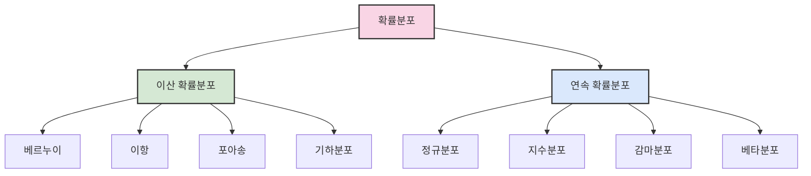

# 1. 확률 🎲

## 목차
- [1. 확률 🎲](#1-확률-)
  - [목차](#목차)
  - [확률의 기초 개념](#확률의-기초-개념)
  - [경우의 수와 기본 연산](#경우의-수와-기본-연산)
    - [사건 간 연산](#사건-간-연산)
    - [기본 법칙](#기본-법칙)
  - [순열과 조합](#순열과-조합)
    - [순열(Permutation)](#순열permutation)
    - [조합(Combination)](#조합combination)
    - [중복순열](#중복순열)
    - [중복조합](#중복조합)
  - [조건부 확률과 독립](#조건부-확률과-독립)
    - [조건부 확률](#조건부-확률)
    - [독립사건](#독립사건)
  - [확률분포와 확률변수](#확률분포와-확률변수)
    - [이산 확률 분포](#이산-확률-분포)
    - [연속 확률 분포](#연속-확률-분포)
    - [누적분포함수(CDF)](#누적분포함수cdf)

---

## 확률의 기초 개념

**확률**은 어떤 사건이 발생할 가능성을 0과 1 사이의 값으로 수치화한 것이다. 실험 또는 시행을 통해 얻어지는 가능한 모든 결과들의 집합은 **표본공간(Ω)** 이라 하며, 그 중 관심 있는 부분집합을 **사건(Event)** 이라고 한다.

예를 들어, 동전을 던져 앞면이 나오는 사건 A에 대해:
```python
P(A) = 앞면이 나올 경우의 수 / 전체 경우의 수 = 1/2
```

**복원 추출**은 결과를 원래 상태로 되돌리는 방식(예: 공을 다시 주머니에 넣음),  
**비복원 추출**은 이전 결과가 이후 시행에 영향을 주는 방식이다.

---

## 경우의 수와 기본 연산

사건 A의 확률은 다음과 같이 정의된다:

```math
P(A) = |A| / |Ω|
```

### 사건 간 연산
- **여사건**: A에 속하지 않는 사건 → `Ac`
- **합사건**: A 또는 B가 일어나는 사건 → `A ∪ B`
- **곱사건**: A와 B가 동시에 일어나는 사건 → `A ∩ B`
- **배반사건**: 동시에 일어날 수 없는 사건들 → `A ∩ B = ∅`

### 기본 법칙
- **합의 법칙**: 두 사건 A, B가 동시에 발생하지 않을 때, 가능한 경우의 수는 `m + n`
- **곱의 법칙**: A와 B가 연속 발생할 때, 경우의 수는 `m × n`

---

## 순열과 조합

### 순열(Permutation)
서로 다른 n개 중 k개를 **순서를 고려해** 나열하는 방법:

```python
from itertools import permutations
list(permutations([1,2,3], 2))  # [(1,2), (1,3), (2,1), ...]
```
수학적으로는 `nPk = n! / (n-k)!`

### 조합(Combination)
서로 다른 n개 중 k개를 **순서를 무시하고** 뽑는 방법:

```python
from itertools import combinations
list(combinations([1,2,3], 2))  # [(1,2), (1,3), (2,3)]
```
수학적으로는 `nCk = n! / (k!(n-k)!)`

### 중복순열
중복을 허용해 k개를 나열 → `nr`  
```python
from itertools import product
list(product([1,2], repeat=3))  # 중복 포함 순열
```

### 중복조합
중복을 허용하되 순서 무시  
```python
from itertools import combinations_with_replacement
list(combinations_with_replacement([1,2,3], 2))
```

수학적으로 `nHr = C(n + r - 1, r)`

---

## 조건부 확률과 독립

### 조건부 확률
어떤 사건 B가 발생했을 때, 사건 A가 일어날 확률:

```math
P(A|B) = P(A ∩ B) / P(B)
```

### 독립사건
두 사건이 서로 영향을 주지 않으면 독립이라 하며, 다음이 성립한다:

```math
P(A ∩ B) = P(A) × P(B)
```

즉, `P(A|B) = P(A)`이면 두 사건은 독립이다.

---

## 확률분포와 확률변수

**확률변수(Random Variable)**는 시행 결과에 수치를 대응시키는 함수다.



### 이산 확률 분포
셀 수 있는 확률변수 값에 대해 확률을 정의하는 **확률질량함수(PMF)** 사용:

```math
P(X = xₖ) = f(xₖ),  모든 xₖ에 대해 ∑ f(xₖ) = 1
```

| 분포 | 특징 | 주요 매개변수 | 활용 사례 |
|------|------|-------------|-----------|
| 베르누이 | 성공/실패 두 가지 결과만 가짐 | p(성공 확률) | 동전 던지기, 합격/불합격 |
| 이항 | n번 시행에서 k번 성공 확률 | n, p | 불량품 개수, 시험 통과자 수 |
| 포아송 | 단위 시간/공간의 사건 발생 수 | λ(평균 발생률) | 전화 통화량, 웹사이트 방문자 수 |
| 기하 | 첫 성공까지의 시행 횟수 | p | 첫 당첨까지 복권 구매 수 |

```python
# 파이썬으로 이산 확률분포 다루기
from scipy import stats
import numpy as np
import matplotlib.pyplot as plt

# 이항분포 예시
n, p = 10, 0.3
k = np.arange(0, n+1)
pmf = stats.binom.pmf(k, n, p)

plt.bar(k, pmf)
plt.title('이항분포 (n=10, p=0.3)')
plt.xlabel('성공 횟수')
plt.ylabel('확률')
plt.show()

# 포아송 분포 예시
lamb = 3
k = np.arange(0, 15)
pmf = stats.poisson.pmf(k, lamb)
plt.bar(k, pmf)
plt.title('포아송 분포 (λ=3)')
plt.show()
```

### 연속 확률 분포
연속적인 값에 대해 확률을 정의하며 **확률밀도함수(PDF)** 를 사용:

```math
P(a ≤ X ≤ b) = ∫[a to b] f(x) dx
```

| 분포 | 특징 | 주요 매개변수 | 활용 사례 |
|------|------|-------------|-----------|
| 정규 | 종 모양의 대칭 분포 | μ(평균), σ(표준편차) | 키, 몸무게, 시험 점수 |
| 지수 | 사건 간 대기 시간 | λ(비율 매개변수) | 서비스 대기시간, 부품 수명 |
| 감마 | k번 사건 발생까지 시간 | α(형상), β(비율) | 누적 대기시간, 수리시간 |
| 베타 | [0,1] 범위의 비율 모델링 | α, β(형상 매개변수) | 확률 추정, 비율 분석 |

- 조건: f(x) ≥ 0 이고, ∫[-∞ to ∞] f(x) dx = 1

```python
# 연속 확률분포 시각화
import numpy as np
import matplotlib.pyplot as plt
from scipy import stats

# 정규분포
x = np.linspace(-4, 4, 1000)
plt.plot(x, stats.norm.pdf(x, 0, 1), label='표준정규분포')
plt.plot(x, stats.norm.pdf(x, 0, 2), label='N(0,4)')
plt.legend()
plt.title('정규분포 확률밀도함수')
plt.show()

# 지수분포
x = np.linspace(0, 5, 1000)
plt.plot(x, stats.expon.pdf(x, scale=1), label='λ=1')
plt.plot(x, stats.expon.pdf(x, scale=0.5), label='λ=2')
plt.legend()
plt.title('지수분포 확률밀도함수')
plt.show()
```

> 💡 **TIP**
> - 이산분포에서는 확률질량함수(PMF)를 사용하며, 특정값의 확률을 직접 계산할 수 있습니다.
> - 연속분포에서는 정확히 하나의 점에서의 확률은 항상 0이므로, 구간의 확률을 계산합니다.

### 누적분포함수(CDF)
확률변수 X가 어떤 값 이하일 확률을 나타내며, 다음과 같이 정의된다:

```math
F(x) = P(X ≤ x)
```

- 이산형: F(x) = ∑[y ≤ x] P(Y = y)
- 연속형: F(x) = ∫[-∞ to x] f(t) dt

```python
# 누적분포함수 시각화
import matplotlib.pyplot as plt
from scipy import stats
import numpy as np

x = np.linspace(-3, 3, 1000)
plt.plot(x, stats.norm.cdf(x), label='CDF')
plt.plot(x, stats.norm.pdf(x), label='PDF')
plt.legend()
plt.title('표준정규분포의 PDF와 CDF 비교')
plt.show()

# 분위수 계산 예시
print(f"정규분포 95% 분위수: {stats.norm.ppf(0.95):.4f}")
```

> ⚠️ **주의사항**: 확률분포 선택 시 데이터의 특성과 가정을 고려해야 합니다. 적합도 검정(Goodness of fit)을 통해 특정 분포의 적합성을 검증할 수 있습니다.

---
