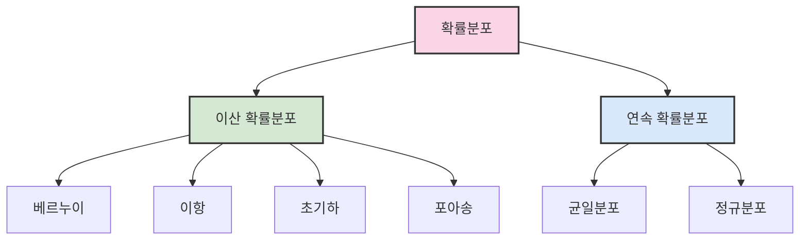
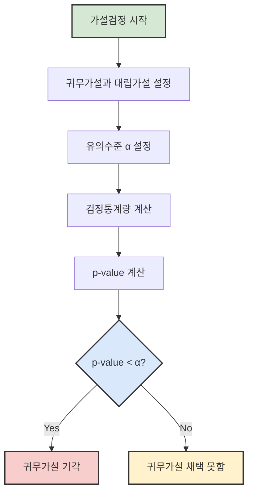

# 2. 추론과 가설검정 📊

## 목차
- [2. 추론과 가설검정 📊](#2-추론과-가설검정-)
  - [목차](#목차)
  - [여러 가지 확률분포](#여러-가지-확률분포)
    - [이산 확률 분포](#이산-확률-분포)
    - [연속 확률 분포](#연속-확률-분포)
  - [모집단과 표본](#모집단과-표본)
  - [통계적 추론](#통계적-추론)
    - [모수 추정](#모수-추정)
  - [통계적 가설 검정](#통계적-가설-검정)
    - [가설의 구조](#가설의-구조)
    - [오류의 유형](#오류의-유형)
  - [검정의 종류와 과정](#검정의-종류와-과정)
    - [가설검정 절차](#가설검정-절차)
    - [유의확률(P-value)](#유의확률p-value)
    - [주요 검정 예시](#주요-검정-예시)
      - [이항 검정](#이항-검정)
      - [모평균 검정](#모평균-검정)

---

## 여러 가지 확률분포

확률분포는 **모집단으로부터 얻는 상대도수 분포**이며, 사건의 발생 가능성과 그 확률을 설명한다.



### 이산 확률 분포

**이산 확률 변수**는 정수처럼 셀 수 있는 값을 가지며, 다음과 같은 분포를 포함한다.

| 분포 | 특징 | 주요 매개변수 | Python 예제 |
|------|------|-------------|------------|
| 베르누이 분포 | 성공과 실패로 이루어진 단일 시행 | p(성공확률) | `probs = [1 - p_success, p_success]` |
| 이항 분포 | 독립적인 베르누이 시행 n번 반복 | n, p | `binom(n=10, p=0.5).pmf(3)` |
| 초기하 분포 | 비복원 추출에서 특정 범주에 속한 표본 수 | M, n, N | `hypergeom(M=20, n=7, N=5).pmf(3)` |
| 포아송 분포 | 단위 시간/공간에 드물게 발생하는 사건의 수 | λ(평균) | `poisson(mu=2).pmf(4)` |

```python
# 이산 확률 분포 예시
p_success = 0.3
x = [0, 1]
probs = [1 - p_success, p_success]

from scipy.stats import binom
dist = binom(n=10, p=0.5)
dist.pmf(3)  # 성공 3번의 확률
```

### 연속 확률 분포

**연속 확률 변수**는 실수 값을 가지며, 다음과 같은 분포가 있다.

| 분포 | 특징 | 주요 매개변수 | Python 예제 |
|------|------|-------------|------------|
| 균일분포 | 구간 [a, b]에서 모든 값이 동일한 확률 | a, b | `uniform(loc=0, scale=5).pdf(2.5)` |
| 정규분포 | 평균과 표준편차로 정의되는 종 모양 분포 | μ, σ | `norm(loc=100, scale=15).pdf(110)` |

```python
# 연속 확률 분포 예시
from scipy.stats import uniform, norm
uniform_dist = uniform(loc=0, scale=5)  # U(0,5)
normal_dist = norm(loc=100, scale=15)
```

---

## 모집단과 표본

- **모집단**: 관심 있는 전체 집합
- **표본**: 모집단에서 추출된 부분집합
- **모수 (Parameter)**: 모집단의 특성을 수치화한 값
- **통계량 (Statistic)**: 표본으로부터 계산된 값

> 예: 출구조사는 표본으로 전체 유권자의 선택을 추정하는 사례

---

## 통계적 추론

표본을 통해 **모집단의 모수에 대해 추정**하거나 **가설을 검정**하는 과정이다.

### 모수 추정

- **점추정**: 하나의 수치를 추정값으로 제시  
  예: 표본평균 `x̄ = (x₁ + x₂ + ... + xₙ)/n`

- **구간추정 (신뢰구간)**:
  ```text
  x̄ ± z_(α/2) × (σ / √n)
  ```
  95% 신뢰수준 예시:
  ```text
  (x̄ - 1.96 × (σ/√n), x̄ + 1.96 × (σ/√n))
  ```

> 💡 **TIP**
> - 신뢰구간이 95%라는 것은 같은 방식으로 구간을 100번 만들면, 그중 약 95개는 진짜 모수를 포함한다는 의미이다.
> - 표본의 크기가 커질수록 신뢰구간의 폭이 좁아지므로 추정의 정확도가 증가한다.

---

## 통계적 가설 검정

표본을 이용해 **모수에 대한 주장(가설)** 을 검토하는 절차이다.

### 가설의 구조

- **귀무가설(H₀)**: 기존 주장을 유지
- **대립가설(H₁)**: 새로운 주장을 뒷받침

예:
```text
H₀: p = 0.5  (공정한 동전)
H₁: p ≠ 0.5  (편향된 동전)
```

### 오류의 유형

- **1종 오류 (α)**: H₀가 참인데 기각 (False Positive)
- **2종 오류 (β)**: H₀가 거짓인데 채택 (False Negative)

통계에서는 일반적으로 1종 오류를 더 중요하게 본다.



---

## 검정의 종류와 과정

### 가설검정 절차

1. 가설 설정
2. 통계량 선택 (예: 표본평균)
3. 검정통계량 계산
4. 기각역 또는 P값 계산
5. 결론 도출

### 유의확률(P-value)

- **P < α**: 귀무가설 기각
- **P ≥ α**: 귀무가설 기각 못 함

> ⚠️ **주의사항**: P값이 크다고 귀무가설이 참임을 증명한 것은 아니다. 단지 귀무가설을 기각할 충분한 증거가 없다는 의미이다.

### 주요 검정 예시

#### 이항 검정
```python
from scipy.stats import binomtest
binomtest(x=6, n=10, p=0.5, alternative='two-sided')
```

#### 모평균 검정
정규 근사를 통해 Z-검정 수행
```python
from scipy.stats import norm
z = (sample_mean - mu0) / (sigma / np.sqrt(n))
p = 2 * (1 - norm.cdf(abs(z)))
```

> 💡 **TIP**
> - 표본 크기가 30개 미만이고 모표준편차를 모르는 경우 t-검정을 사용한다.
> - 양측검정은 방향성 없이 차이만 검증할 때, 단측검정은 방향성까지 검증할 때 사용된다.

---

```python
# 예시 함수: 모평균에 대한 가설검정
def ztest(stat, mu, sigma):
    z = (stat.mean() - mu) / (sigma / np.sqrt(len(stat)))
    return 2 * (1 - sp.stats.norm.cdf(abs(z)))
```
