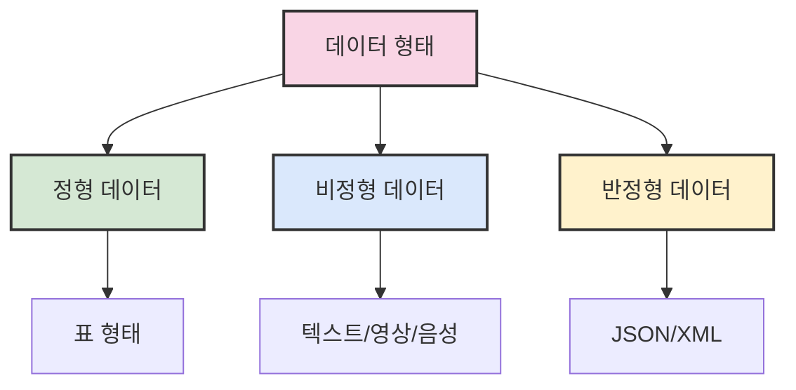

# 2. 파이썬을 사용한 빅데이터 분석 📊

## 목차 📑

### 1. 기본 개념
- [1.1 AI와 빅데이터](#ai와-빅데이터-) 🤖
- [1.2 빅데이터의 특징](#빅데이터의-특징-) 📈
- [1.3 데이터 분석 계획](#데이터-분석-계획-) 📝

### 2. 분석 방법론
- [2.1 빅데이터 활용 기술](#빅데이터-활용-기술-) 🔧
- [2.2 데이터 변환](#데이터-변환-) 🔄
  - [이상치 처리](#이상치-처리)
  - [결측치 처리](#결측치-처리)

### 3. Pandas 활용
- [3.1 Pandas 개요](#pandas-) 🐼
- [3.2 Pandas Series 다루기](#pandas-series-다루기-) 📊
- [3.3 Pandas 기초 문법](#pandas-기초-문법-) 📝
- [3.4 DataFrame 생성과 조작](#dataframe-생성과-조작-) 📋
- [3.5 데이터 집계 및 요약](#데이터-집계-및-요약-) 📊

---

## AI와 빅데이터 🤖

인공지능은 컴퓨터 시스템이 **학습**, **추론**, **인식** 등의 작업을 인간과 유사한 수준으로 수행하도록 하는 기술이다. 

| 기술 | 설명 | 특징 |
|------|------|------|
| **머신러닝** | 인공지능의 한 분야 | 지도학습과 비지도학습으로 구분 |
| **지도학습** | 레이블이 있는 데이터 사용 | 분류, 회귀 문제에 적용 |
| **비지도학습** | 레이블이 없는 데이터 사용 | 군집화, 차원 축소에 적용 |
| **딥러닝** | 인공신경망 기반 머신러닝 | 복잡한 패턴 인식에 강점 |

**빅데이터**는 전통적 방법으로 처리하기 어려운 대용량의 데이터를 말하며, 지속적으로 증가하는 **데이터의 양**이 특징이다.

```python
# 딥러닝 예시: 가상의 학습률과 에포크 설정
learning_rate = 0.01  # 학습률
epochs = 50           # 반복 횟수

# 간단한 신경망 구현 예시
import numpy as np

# 데이터 준비
X = np.array([[0, 0], [0, 1], [1, 0], [1, 1]])  # 입력 데이터
y = np.array([[0], [1], [1], [0]])              # 출력 데이터 (XOR 문제)

# 모델 학습 과정은 생략
```

> **⚠️ 주의사항**: 학습률이 너무 크면 발산, 너무 작으면 수렴 속도 저하가 발생한다.

---

## 빅데이터의 특징 📈

빅데이터는 크게 **3V**로 정의되며, 추가적으로 **5V**로 확장된다:

| V | 의미 | 설명 |
|---|------|------|
| **Volume** | 규모 | 대용량 데이터 |
| **Velocity** | 속도 | 데이터 생성 및 처리 속도 |
| **Variety** | 다양성 | 다양한 형태의 데이터 |
| **Value** | 가치 | 데이터에서 추출 가능한 가치 |
| **Veracity** | 진실성 | 데이터의 정확성과 신뢰성 |

### 데이터 형태 분류



---

## 데이터 분석 계획 📝

데이터 분석은 유용한 **인사이트**를 도출하기 위해 데이터를 수집·정리·분석하는 과정이다.

### 데이터 분석 프로세스

1. **문제 정의** 🎯
   - 분석할 의사결정 문제를 구체화
   - 연구 질문 설정

2. **데이터 수집** 🔍
   - 웹 크롤링, API 활용
   - 데이터베이스 쿼리
   - 설문조사, 실험 등

3. **데이터 전처리** 🧹
   - 결측치 처리
   - 이상치 탐지 및 처리
   - 중복값 제거

4. **모델링** 🧠
   - 통계 기법 적용
   - 머신러닝 모델 구축
   - 딥러닝 모델 학습

5. **결과 분석 및 시각화** 📊
   - 그래프와 표로 표현
   - 비즈니스 인사이트 도출

> 💡 **탐색적 데이터 분석(EDA)** 는 데이터의 분포와 패턴을 파악하는 과정이며, **확증적 데이터 분석(CDA)** 는 가설을 검증하는 과정이다.

---

## 빅데이터 활용 기술 🔧

| 기술 | 설명 | 활용 사례 |
|------|------|----------|
| **연관 규칙 학습** | 항목 간 관계 발견 | 장바구니 분석(사과→배→바나나) |
| **분류 트리 분석** | 데이터 분류 | 뉴스 기사 카테고리 예측 |
| **유전 알고리즘** | 진화 과정 모사 | 배송 경로 최적화 |
| **머신러닝** | 데이터 기반 예측 | 영화/음악 추천 시스템 |
| **회귀 분석** | 변수 간 관계 파악 | 키와 몸무게 관계 분석 |
| **감정 분석** | 감성 추출 | 상품 리뷰 긍/부정 분석 |
| **소셜 네트워크 분석** | 연결 관계 분석 | 영향력 있는 계정 식별 |

---

## 데이터 변환 🔄

### 이상치 처리

**이상치**는 데이터 분포에서 동떨어진 값이다.

- **발견 방법**:
  - 박스플롯(Box Plot)
  - 히스토그램(Histogram)
  - 산점도(Scatter Plot)

- **처리 방법**:
  - 제거
  - 대체(평균, 중앙값)
  - 변환(로그 변환 등)

```python
# 이상치 대체 예시
import numpy as np
import matplotlib.pyplot as plt

# 이상치가 포함된 데이터셋
dataset = [10, 12, 15, 12, 14, 300, 13, 15, 14]

# 시각화로 이상치 확인
plt.boxplot(dataset)
plt.title('이상치 시각화')
plt.show()

# 평균값으로 이상치 대체
mean_val = sum([x for x in dataset if x < 100]) / len([x for x in dataset if x < 100])
dataset_clean = [mean_val if x > 100 else x for x in dataset]
print(f"처리 후 데이터: {dataset_clean}")
```

### 결측치 처리

**결측치**는 값이 없는 데이터이다.

- **처리 방법**:
  - 해당 행 제거
  - 평균/중앙값/최빈값으로 대체
  - 예측 모델을 통한 대체

> ⚠️ **주의**: 결측치 처리 방법에 따라 분석 결과가 달라질 수 있으므로 신중하게 선택해야 한다.

---

## Pandas 🐼

`pandas`는 Python 기반 데이터 처리 라이브러리로, `NumPy`를 기반으로 설계되었다.

### 주요 데이터 구조

1. **Series**: 1차원 배열 (라벨이 있는 배열)
2. **DataFrame**: 2차원 테이블 (행과 열 구조)

```python
import pandas as pd
import numpy as np

# Series 생성 예시
data = [100, 200, 300]
labels = ['가', '나', '다']
fruit_series = pd.Series(data, index=labels)
print(fruit_series)

# DataFrame 생성 예시
df_data = {
    '이름': ['철수', '영희', '민수'],
    '나이': [20, 25, 22],
    '점수': [85, 92, 78]
}
df = pd.DataFrame(df_data)
print("\nDataFrame 예시:")
print(df)
```

**출력 예시**:
```
가    100
나    200
다    300
dtype: int64

DataFrame 예시:
   이름  나이  점수
0  철수  20  85
1  영희  25  92
2  민수  22  78
```

---

## Pandas Series 다루기 📊

**Series**는 **1차원 배열** 형태의 데이터 구조로, **인덱스**와 **값**으로 구성된다.

### Series 생성 방법

```python
import pandas as pd
import numpy as np

# 방법 1: 리스트로부터 생성
ser1 = pd.Series([3, 7, 1, 9, 4])

# 방법 2: 리스트와 인덱스로 생성
ser2 = pd.Series([3, 7, 1, 9, 4], index=list('abcde'))

# 방법 3: 딕셔너리로부터 생성
ser3 = pd.Series({'a': 3, 'b': 7, 'c': 1, 'd': 9, 'e': 4})

# 방법 4: NumPy 배열로부터 생성
ser4 = pd.Series(np.random.randint(0, 10, 5))
```

### Series 인덱싱과 슬라이싱

```python
# 인덱스로 값 접근
value_b = ser2['b']  # 7
print(f"b 인덱스의 값: {value_b}")

# 슬라이싱
subset = ser2['b':'d']
print("\n슬라이싱 결과:")
print(subset)

# 불리언 인덱싱
mask = ser2 > 5
filtered = ser2[mask]
print("\n5보다 큰 값:")
print(filtered)
```

### 결측치 처리

```python
ser_with_nan = pd.Series([1, None, 2, None, 3])
print("\n결측치 포함 Series:")
print(ser_with_nan)

# 결측치 확인
print("\n결측치 확인:")
print(ser_with_nan.isnull())

# 결측치 제거
ser_clean = ser_with_nan.dropna()
print("\n결측치 제거 후:")
print(ser_clean)

# 결측치 대체
ser_filled = ser_with_nan.fillna(0)
print("\n결측치 0으로 대체:")
print(ser_filled)
```

---

## Pandas 기초 문법 📝

### Series 연산

```python
import pandas as pd

# 두 Series 생성
s1 = pd.Series([10, 20, 30], index=['a', 'b', 'c'])
s2 = pd.Series([5, 10, 15], index=['a', 'b', 'd'])

# 덧셈 연산 (인덱스 불일치시 NaN 발생)
s_add = s1 + s2
print("Series 덧셈 결과:")
print(s_add)

# 곱셈 연산
s_mult = s1 * 2
print("\nScalar 곱셈 결과:")
print(s_mult)

# 통계 함수
print(f"\n합계: {s1.sum()}")
print(f"평균: {s1.mean()}")
print(f"최댓값: {s1.max()}")
print(f"최솟값: {s1.min()}")
```

> 💡 **참고**: Series 연산 시 동일 인덱스에 대해 연산이 수행되며, 일치하지 않는 인덱스는 NaN 결과가 생성된다.

---

## DataFrame 생성과 조작 📋

**DataFrame**은 **Series의 집합**으로, 표 형태(행과 열)를 가진다.

### DataFrame 생성

```python
import pandas as pd

# 방법 1: 딕셔너리로 생성
records = [
    {'email': 'alpha@example.com', 'name': '철수', 'age': 22},
    {'email': 'beta@example.com', 'name': '영희', 'age': 23},
    {'email': 'gamma@example.com', 'name': '민수', 'age': 25}
]
df = pd.DataFrame(records)
print("DataFrame 생성 결과:")
print(df)

# 방법 2: 2차원 배열과 인덱스/컬럼으로 생성
data = [[1, 2, 3], [4, 5, 6], [7, 8, 9]]
df2 = pd.DataFrame(data, 
                   columns=['A', 'B', 'C'],
                   index=['X', 'Y', 'Z'])
print("\n2차원 배열로 생성한 DataFrame:")
print(df2)
```

### DataFrame 조작

```python
# 인덱스 설정
df.index = ['one', 'two', 'three']

# 열 추가 (스칼라 값)
df['성인여부'] = [True, True, True]

# 열 추가 (계산 결과)
df['출생년도'] = 2023 - df['age']

# 행 추가
df.loc['four'] = {'email': 'delta@example.com', 'name': '지수', 'age': 24, 
                 '성인여부': True, '출생년도': 1999}

# 행/열 개수 확인
print(f"\nDataFrame 크기: {df.shape}")

# 열 방향 결합
df_extra = pd.DataFrame({
    'height': [175, 162, 180, 168]
}, index=['one', 'two', 'three', 'four'])
df_combined = pd.concat([df, df_extra], axis=1)

# 전치 (행/열 바꾸기)
df_transposed = df.T
```

### DataFrame 인덱싱

```python
# 열 선택
names = df['name']
print("\n이름 열:")
print(names)

# 여러 열 선택
subset = df[['name', 'age']]
print("\n이름과 나이:")
print(subset)

# 위치 기반 인덱싱
cell = df.iloc[0, 1]  # 첫 행, 두번째 열
print(f"\n첫 행, 두번째 열 값: {cell}")

# 라벨 기반 인덱싱
cell = df.loc['one', 'name']
print(f"'one' 행, 'name' 열 값: {cell}")

# 조건부 인덱싱
young = df[df['age'] < 24]
print("\n24세 미만인 사람들:")
print(young)
```

---

## 데이터 집계 및 요약 📊

DataFrame에서 **기초 통계**를 계산하거나 데이터를 요약할 때 다음 메서드를 활용한다:

```python
import pandas as pd
import numpy as np

# 샘플 데이터 생성
df = pd.DataFrame({
    'product': ['Apple', 'Banana', 'Cherry', 'Date', 'Apple', 'Banana'],
    'quantity': [5, 3, 8, 4, 7, 2],
    'price': [1.2, 0.5, 2.5, 3.0, 1.0, 0.6],
    'sold': [True, True, False, True, True, False]
})

# 기본 통계량
print("합계:", df['quantity'].sum())
print("평균:", df['quantity'].mean())
print("분산:", df['quantity'].var())
print("표준편차:", df['quantity'].std())
print("최소값:", df['quantity'].min())
print("최대값:", df['quantity'].max())

# 요약 통계
print("\n요약 통계:")
print(df.describe())

# 정렬
df_sorted = df.sort_values('price', ascending=False)
print("\n가격 내림차순 정렬:")
print(df_sorted)

# 순위
print("\n수량 순위:")
print(df['quantity'].rank(method='dense', ascending=False))

# 결측치 확인
print("\n결측치 확인:")
print(df.isnull().sum())

# 앞/뒤 데이터 확인
print("\n앞 3행:")
print(df.head(3))
print("\n뒤 2행:")
print(df.tail(2))

# 특정 값 포함 여부
apple_filter = df['product'].isin(['Apple', 'Banana'])
print("\n사과 또는 바나나인 행:")
print(df[apple_filter])

# 그룹화 및 집계
print("\n제품별 수량 합계:")
print(df.groupby('product')['quantity'].sum())

# 파일 입출력
# df.to_csv('output.csv', index=False)
# df_read = pd.read_csv('output.csv')

```

> 💡 **고급 기능**:
> - `pivot_table`: 엑셀의 피벗 테이블과 유사한 기능
> - `melt`: wide 형식에서 long 형식으로 데이터 변환
> - `merge`: SQL 조인과 유사한 데이터프레임 결합
> - `apply`: 행/열에 사용자 정의 함수 적용

---
