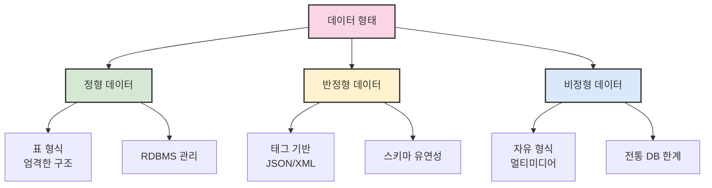
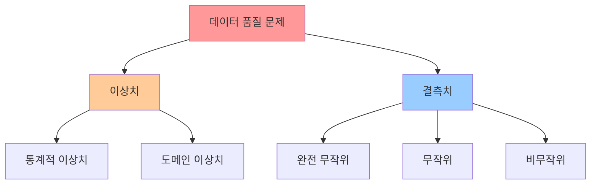
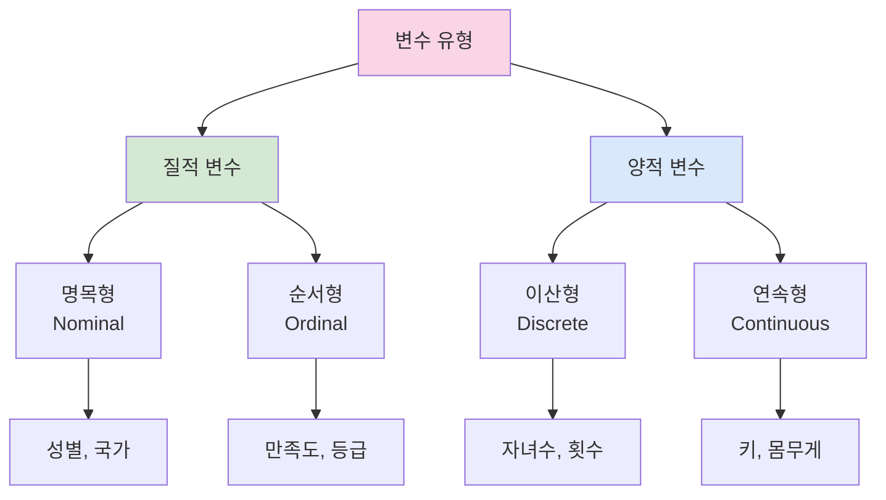

# 3. 데이터 이론과 데이터 처리 📊

## 목차 📑

### 1. 기본 개념
- [1.1 데이터 이론](#데이터-이론-) 📋
- [1.2 데이터 로드](#데이터-로드-) 📂
- [1.3 데이터 변환](#데이터-변환-) 🔄

### 2. 데이터 분석 기법
- [2.1 데이터 요약하기](#데이터-요약하기-) 📈
  - [기술통계](#1-describe---기술통계-)
  - [데이터 정보](#2-info---데이터-정보-ℹ️)
  - [빈도 분석](#3-value_counts---빈도-분석-)
- [2.2 이상치와 결측치](#이상치와-결측치-) 🚨
  - [이상치 탐지](#1-이상치-탐지-박스플롯box-plot-)
  - [결측치 처리](#2-결측치-처리-🕳️)

### 3. 데이터 통합 및 분석
- [3.1 데이터 병합](#데이터-병합-) 🔗
  - [단순 결합](#1-pdconcat---단순-결합-)
  - [관계형 결합](#2-pdmerge---관계형-결합-)
- [3.2 기초 통계](#기초-통계-) 📊
  - [기술 통계 분석](#1-기술-통계-분석-)
  - [변수 유형별 분석](#2-변수-유형별-분석-)
  - [종합 데이터 요약](#3-종합-데이터-요약-예시-)

---

## 데이터 이론 📋

데이터는 정보 전달을 위한 연속 또는 불연속 값의 모음이다. 형식에 따라 **정형 데이터**, **반정형 데이터**, **비정형 데이터**로 구분된다.

### 데이터 형태별 분류

| 데이터 형태 | 특징 | 예시 | 관리 방법 |
|-------------|------|------|-----------|
| **정형 데이터** 📊 | 표 형식, 엄격한 구조 | 직원 정보, 판매 내역 | RDBMS |
| **반정형 데이터** 🏷️ | 일정한 구조, 유연성 | JSON, XML, HTML | NoSQL |
| **비정형 데이터** 🌐 | 미리 정의된 형식 없음 | 사진, 동영상, 텍스트 | 특수 처리 필요 |



> 💡 **데이터 특성 이해**: 각 데이터 형태에 따라 적합한 저장 방식과 처리 기법이 다르므로, 분석 전 데이터 특성을 정확히 파악해야 한다.

---

## 데이터 로드 📂

데이터를 분석하기 위해서는 먼저 외부 파일을 **로드(load)** 해야 한다. 대표적인 방법으로는 CSV 파일을 파이썬 내장 `csv` 모듈이나 `pandas` 라이브러리를 통해 읽어들이는 방식이 있다.

### 데이터 로드 방법 비교

| 방법 | 장점 | 단점 | 적용 상황 |
|------|------|------|-----------|
| **CSV 모듈** | 가벼움, 세밀한 제어 | 복잡한 처리 필요 | 간단한 데이터 |
| **Pandas** | 편리함, 다양한 기능 | 메모리 사용량 높음 | 복잡한 분석 |

### 1. 파이썬 내장 `csv` 모듈 🐍

```python
import csv

# 예시: products.csv 파일을 열어 항목별로 읽어오기
with open('products.csv', 'r', encoding='utf-8') as file:
    reader = csv.reader(file)
    for row in reader:
        print(row)  # 각 행은 리스트로 반환된다
```

**출력 예시:**
```
['제품명', '가격', '재고']
['사과', '1200', '50']
['바나나', '800', '30']
['오렌지', '1500', '25']
```

### 2. Pandas 라이브러리 사용 🐼

```python
import pandas as pd

# 예시: sales_data.csv 파일을 DataFrame으로 로드
df_sales = pd.read_csv('sales_data.csv', encoding='utf-8')
print(df_sales.head())  # 데이터프레임 상위 5개 행 출력
```

**출력 예시:**
```
   제품명    가격  재고
0   사과  1200  50
1  바나나   800  30
2  오렌지  1500  25
3   포도  2000  15
4   배   1800  20
```

> ⚠️ **인코딩 주의사항**: 한글 데이터 처리 시 `encoding='utf-8'` 또는 `encoding='cp949'` 설정이 필요하다.

---

## 데이터 변환 🔄

로드된 `DataFrame`을 분석에 적합하도록 변환(transform)하는 과정이다. 주요 작업에는 열(column) 추가, 이름 변경, 인덱스 재설정, 조건 필터링 등이 있다.

### 데이터 변환 주요 작업


### 1. 새로운 열 추가 ➕

기존 열을 기반으로 새로운 정보를 계산하여 추가할 수 있다.

```python
import pandas as pd

df = pd.DataFrame({
    '이름': ['가영', '민수', '예린'],
    'age': [23, 17, 35]
})

# 'is_adult' 열 추가: age가 18 이상이면 1, 아니면 0
df['is_adult'] = df['age'].map(lambda x: 1 if x >= 18 else 0)

# 'birth_year' 열 추가: 현재 연도 2025에서 age를 뺌
df['birth_year'] = 2025 - df['age']

print(df)
```

**출력 결과:**
```
   이름  age  is_adult  birth_year
0  가영   23         1        2002
1  민수   17         0        2008
2  예린   35         1        1990
```

### 2. 열 이름 변경 (`rename`) 🏷️

```python
# 예시: df에서 'age'를 '나이', 'birth_year'를 '출생년도'로 변경
df = df.rename(columns={'age': '나이', 'birth_year': '출생년도'})
print(df)
```

**출력 결과:**
```
   이름  나이  is_adult  출생년도
0  가영   23         1    2002
1  민수   17         0    2008
2  예린   35         1    1990
```

### 3. 조건에 따른 행 필터링 🔍

```python
# 예시: 나이가 20 이상인 사람만 필터링
adult_df = df[df['나이'] >= 20]
print("성인만 필터링:")
print(adult_df)

# 복수 조건 결합: 나이가 20 이상이고, is_adult가 1인 행만 필터링
filtered_df = df[(df['나이'] >= 20) & (df['is_adult'] == 1)]
print("\n복수 조건 필터링:")
print(filtered_df)
```

> 💡 **필터링 팁**: 복수 조건 사용 시 각 조건을 괄호로 묶고 `&`(AND), `|`(OR) 연산자를 사용한다.

---

## 데이터 요약하기 📈

대규모 데이터의 전반적 분포나 경향을 파악하기 위해 **요약 통계(summary statistics)** 와 **정보(info)** 를 확인한다.

### 주요 데이터 요약 메서드

| 메서드 | 기능 | 반환값 | 활용도 |
|--------|------|--------|--------|
| `head()` | 상위 n개 행 | DataFrame | ⭐⭐⭐⭐⭐ |
| `describe()` | 기술통계 | DataFrame | ⭐⭐⭐⭐⭐ |
| `info()` | 데이터 정보 | 출력만 | ⭐⭐⭐⭐ |
| `shape` | 행/열 개수 | 튜플 | ⭐⭐⭐⭐⭐ |
| `value_counts()` | 빈도 계산 | Series | ⭐⭐⭐⭐ |

### 1. `describe()` - 기술통계 📊

```python
import pandas as pd

df = pd.read_csv('sample_data.csv')
stats = df.describe()
print(stats)
```

**출력 예시:**
```
          age     score     income
count  100.000  100.000   100.000
mean    28.500   75.300  3500.500
std     10.200   12.345   800.123
min     18.000   50.000  1200.000
25%     20.500   65.000  2600.000
50%     28.000   75.000  3500.000
75%     35.000   85.000  4400.000
max     60.000  100.000  7000.000
```

### 2. `info()` - 데이터 정보 ℹ️

```python
df.info()
```

**출력 예시:**
```
<class 'pandas.core.frame.DataFrame'>
RangeIndex: 100 entries, 0 to 99
Data columns (total 4 columns):
 #   Column   Non-Null Count  Dtype  
---  ------   --------------  -----  
 0   user_id  100 non-null    int64  
 1   age      95 non-null     float64
 2   score    100 non-null    float64
 3   country  100 non-null    object
dtypes: float64(2), int64(1), object(1)
memory usage: 3.2+ KB
```

### 3. `value_counts()` - 빈도 분석 📊

```python
# 예시: 'country' 열의 고유값별 빈도 계산
print(df['country'].value_counts())
```

**출력 예시:**
```
Korea       40
USA         25
Japan       15
Others      20
Name: country, dtype: int64
```

---

## 이상치와 결측치 🚨

데이터를 분석하기 전에 **이상치(outlier)** 와 **결측치(missing value)** 를 확인하고 처리해야 한다.

### 데이터 품질 문제 유형



### 1. 이상치 탐지: 박스플롯(Box Plot) 📦

```python
import seaborn as sns
import matplotlib.pyplot as plt

# 예시: 'age' 열의 이상치 시각화
sns.boxplot(y=df['age'])
plt.title('Age Distribution with Outliers')
plt.show()

# IQR 기반 이상치 탐지
Q1 = df['age'].quantile(0.25)
Q3 = df['age'].quantile(0.75)
IQR = Q3 - Q1

lower_bound = Q1 - 1.5 * IQR
upper_bound = Q3 + 1.5 * IQR

print(f"📊 IQR 분석 결과:")
print(f"   IQR: {IQR:.2f}")
print(f"   하한: {lower_bound:.2f}")
print(f"   상한: {upper_bound:.2f}")
```

### 이상치 처리 방법

| 방법 | 설명 | 장점 | 단점 |
|------|------|------|------|
| **제거** | 이상치 행 삭제 | 간단함 | 정보 손실 |
| **대체** | 상/하한값으로 대체 | 정보 보존 | 분포 왜곡 |
| **변환** | 로그 변환 등 | 자연스러움 | 해석 복잡 |

```python
# 예시: 이상치를 상한값으로 대체
df.loc[df['age'] > upper_bound, 'age'] = upper_bound
print("✅ 이상치 처리 완료")
```

### 2. 결측치 처리 🕳️

```python
# 결측치 확인
missing_counts = df.isnull().sum()
print("📋 결측치 현황:")
print(missing_counts)

# 결측치 비율 계산
missing_ratio = (df.isnull().sum() / len(df)) * 100
print("\n📊 결측치 비율 (%):")
print(missing_ratio)
```

### 결측치 처리 전략

```python
# 1. 평균값으로 대체
mean_age = df['age'].mean()
df['age'] = df['age'].fillna(mean_age)

# 2. 중앙값으로 대체 (이상치에 강건)
median_score = df['score'].median()
df['score'] = df['score'].fillna(median_score)

# 3. 최빈값으로 대체 (범주형 데이터)
mode_country = df['country'].mode()[0]
df['country'] = df['country'].fillna(mode_country)

# 4. 특정 값으로 대체
df['address'] = df['address'].fillna('Unknown')

print("✅ 결측치 처리 완료")
```

> ⚠️ **주의사항**: 결측치 처리 방법에 따라 분석 결과가 크게 달라질 수 있으므로, 데이터 특성과 분석 목적을 고려하여 신중하게 선택해야 한다.

---

## 데이터 병합 🔗

여러 데이터 소스를 하나로 합치는 작업이다. `pandas`에서는 **`concat()`** 과 **`merge()`** 를 사용하여 병합한다.

### 병합 방법 비교

| 방법 | 용도 | 특징 | 사용 시기 |
|------|------|------|-----------|
| **`concat()`** | 단순 결합 | 행/열 기준 이어붙이기 | 동일 구조 데이터 |
| **`merge()`** | 관계형 결합 | 키 기반 JOIN | 관련 데이터 결합 |

### 1. `pd.concat()` - 단순 결합 📎

```python
import pandas as pd

# 예시: 1월과 2월 데이터프레임을 행 기준으로 합치기
jan_df = pd.DataFrame({
    '날짜': ['2023-01-01', '2023-01-02'],
    '매출': [10000, 15000],
    '비용': [5000, 7000],
    '수량': [10, 12]
})

feb_df = pd.DataFrame({
    '날짜': ['2023-02-01', '2023-02-02'],
    '매출': [12000, 13000],
    '비용': [6000, 6500],
    '수량': [11, 13]
})

# 행 기준 병합 (위아래로 합치기)
combined_df = pd.concat([jan_df, feb_df], axis=0).reset_index(drop=True)
print("📊 행 기준 병합 결과:")
print(combined_df)
```

**출력 결과:**
```
📊 행 기준 병합 결과:
         날짜   매출   비용  수량
0 2023-01-01 10000  5000   10
1 2023-01-02 15000  7000   12
2 2023-02-01 12000  6000   11
3 2023-02-02 13000  6500   13
```

### 2. `pd.merge()` - 관계형 결합 🔀

```python
# 예시: 고객 정보와 주문 정보를 'customer_id' 열을 기준으로 병합
customer_df = pd.DataFrame({
    'customer_id': [101, 102, 103],
    'name': ['김철수', '이영희', '박민수'],
    'age': [30, 25, 28]
})

orders_df = pd.DataFrame({
    'order_id': [201, 202],
    'customer_id': [101, 102],
    'total_price': [5000, 7000]
})

# Inner Join: 공통 customer_id만 포함
merged_inner = pd.merge(customer_df, orders_df, on='customer_id', how='inner')
print("🔗 Inner Join 결과:")
print(merged_inner)

# Left Join: 모든 고객 포함
merged_left = pd.merge(customer_df, orders_df, on='customer_id', how='left')
print("\n🔗 Left Join 결과:")
print(merged_left)
```

**출력 결과:**
```
🔗 Inner Join 결과:
   customer_id   name  age  order_id  total_price
0          101  김철수   30       201       5000.0
1          102  이영희   25       202       7000.0

🔗 Left Join 결과:
   customer_id   name  age  order_id  total_price
0          101  김철수   30     201.0       5000.0
1          102  이영희   25     202.0       7000.0
2          103  박민수   28       NaN          NaN
```


---

## 기초 통계 📊

데이터의 **기술 통계(descriptive statistics)** 및 **추론 통계(inferential statistics)** 개념을 이해하고, `pandas` 메서드를 통해 간단하게 계산한다.

### 통계 분석 유형

| 통계 유형 | 목적 | 주요 기법 | 활용 예시 |
|-----------|------|-----------|-----------|
| **기술 통계** | 데이터 요약 | 평균, 분산, 분포 | 매출 평균, 고객 연령대 |
| **추론 통계** | 모집단 추론 | 가설검정, 신뢰구간 | A/B 테스트, 효과 검증 |

### 1. 기술 통계 분석 📈

```python
import pandas as pd

# 샘플: 직원 정보와 급여 데이터
df_emp = pd.DataFrame({
    'emp_id': [1001, 1002, 1003, 1004],
    'age': [28, 34, 45, 23],
    'department': ['영업', '기술', '인사', '마케팅'],
    'salary': [3500, 4200, 5000, 3100]
})

print("📊 기본 통계량 계산:")
print(f"   평균 급여: {df_emp['salary'].mean():,.0f}원")
print(f"   급여 중앙값: {df_emp['salary'].median():,.0f}원")
print(f"   나이 분산: {df_emp['age'].var():.2f}")
print(f"   나이 표준편차: {df_emp['age'].std():.2f}")
```

**출력 결과:**
```
📊 기본 통계량 계산:
   평균 급여: 3,950원
   급여 중앙값: 3,850원
   나이 분산: 90.25
   나이 표준편차: 9.50
```

### 2. 변수 유형별 분석 🔍



### 3. 종합 데이터 요약 예시 💼

```python
# 1) 데이터 개요 확인
print("🔍 데이터 기본 정보:")
print(f"   크기: {df_emp.shape}")
print(f"   열 이름: {list(df_emp.columns)}")

# 2) 요약 통계
print("\n📊 수치형 변수 요약 통계:")
print(df_emp.describe())

# 3) 범주형 변수 분석
print("\n🏢 부서별 분포:")
dept_counts = df_emp['department'].value_counts()
for dept, count in dept_counts.items():
    print(f"   {dept}: {count}명")

# 4) 고급 통계 계산
salary_stats = {
    '평균': df_emp['salary'].mean(),
    '중앙값': df_emp['salary'].median(),
    '최솟값': df_emp['salary'].min(),
    '최댓값': df_emp['salary'].max(),
    '범위': df_emp['salary'].max() - df_emp['salary'].min(),
    '변동계수': (df_emp['salary'].std() / df_emp['salary'].mean()) * 100
}

print("\n💰 급여 상세 통계:")
for stat_name, value in salary_stats.items():
    if stat_name == '변동계수':
        print(f"   {stat_name}: {value:.2f}%")
    else:
        print(f"   {stat_name}: {value:,.0f}원")
```

**최종 출력 예시:**
```
🔍 데이터 기본 정보:
   크기: (4, 4)
   열 이름: ['emp_id', 'age', 'department', 'salary']

📊 수치형 변수 요약 통계:
           emp_id   age  salary
count     4.000000   4.0   4.000000
mean   1002.500000  32.5   3950.000000
std       1.290994   9.5   718.361370
min    1001.000000  23.0  3100.000000
25%    1001.750000  25.75  3462.500000
50%    1002.500000  31.0  3850.000000
75%    1003.250000  38.25  4462.500000
max    1004.000000  45.0  5000.000000

🏢 부서별 분포:
   영업: 1명
   기술: 1명
   인사: 1명
   마케팅: 1명

💰 급여 상세 통계:
   평균: 3,950원
   중앙값: 3,850원
   최솟값: 3,100원
   최댓값: 5,000원
   범위: 1,900원
   변동계수: 18.18%
```

> 💡 **분석 팁**: 변동계수(CV)는 표준편차를 평균으로 나눈 값으로, 서로 다른 단위나 규모의 데이터 변동성을 비교할 때 유용하다.

---
