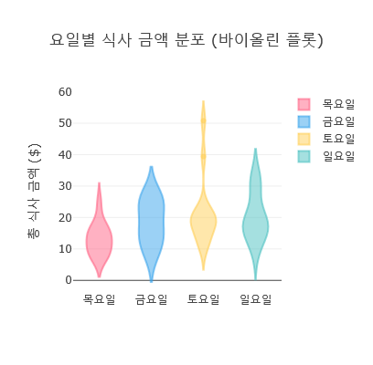

# 4. 데이터와 대화하는 법: 탐색적 데이터 분석(EDA)과 시각화

## 목차
- [4. 데이터와 대화하는 법: 탐색적 데이터 분석(EDA)과 시각화](#4-데이터와-대화하는-법-탐색적-데이터-분석eda과-시각화)
  - [목차](#목차)
  - [1. EDA의 철학: 질문이 먼저, 코드는 다음](#1-eda의-철학-질문이-먼저-코드는-다음)
  - [2. 시각화 라이브러리 선택: Matplotlib vs Seaborn](#2-시각화-라이브러리-선택-matplotlib-vs-seaborn)
  - [3. 단일 변수 탐색: 데이터의 본질 파악하기](#3-단일-변수-탐색-데이터의-본질-파악하기)
    - [질문 1: 수치형 데이터는 어떻게 분포되어 있는가? → `Histogram`, `Box Plot`](#질문-1-수치형-데이터는-어떻게-분포되어-있는가--histogram-box-plot)
    - [질문 2: 범주형 데이터는 어떤 항목이 많은가? → `Bar Plot`](#질문-2-범주형-데이터는-어떤-항목이-많은가--bar-plot)
  - [4. 다중 변수 탐색: 변수 간의 관계 파헤치기](#4-다중-변수-탐색-변수-간의-관계-파헤치기)
    - [질문 3: 두 수치형 변수는 어떤 관계가 있는가? → `Scatter Plot`](#질문-3-두-수치형-변수는-어떤-관계가-있는가--scatter-plot)
    - [질문 4: 범주에 따라 수치형 데이터의 분포가 어떻게 다른가? → `Box Plot`, `Violin Plot`](#질문-4-범주에-따라-수치형-데이터의-분포가-어떻게-다른가--box-plot-violin-plot)
    - [질문 5: 모든 변수 간의 상관관계를 한눈에 보려면? → `Heatmap`, `Pair Plot`](#질문-5-모든-변수-간의-상관관계를-한눈에-보려면--heatmap-pair-plot)

---

## 1. EDA의 철학: 질문이 먼저, 코드는 다음

EDA는 코드 기술이 아니라 **탐정의 사고방식**에 가깝습니다. 데이터를 마주했을 때, 다음과 같은 질문을 스스로에게 던져야 합니다.

- 이 데이터는 어떤 변수들로 이루어져 있는가? 각 변수의 타입은 무엇인가?
- 각 변수는 어떤 분포를 가지고 있는가? (평균, 중앙값, 최빈값은?)
- 데이터에 이상하거나 극단적인 값(이상치)은 없는가?
- 변수들 사이에 어떤 관계나 패턴이 숨어있는가?

이 질문들에 대한 답을 찾아가는 과정이 EDA이며, 시각화는 그 답을 가장 명확하게 보여주는 도구입니다.

## 2. 시각화 라이브러리 선택: Matplotlib vs Seaborn

- **`Matplotlib`**: 파이썬 시각화의 근간이 되는 라이브러리. 모든 요소를 세밀하게 제어할 수 있지만, 코드가 길어지고 디자인이 미려하지 않습니다.
- **`Seaborn`**: Matplotlib을 기반으로, 더 적은 코드로 더 아름답고 통계적으로 의미 있는 그래프를 그릴 수 있게 만든 라이브러리입니다. Pandas DataFrame과 완벽하게 호환됩니다.

> **결론**: 특별한 경우가 아니라면, EDA에는 `Seaborn`을 사용하세요. 생산성과 심미성 모두 월등합니다. `Matplotlib`은 Seaborn으로 만든 그래프를 미세 조정(축 이름 변경, 제목 추가 등)할 때 함께 사용합니다.

```python
import pandas as pd
import seaborn as sns
import matplotlib.pyplot as plt

# Seaborn의 내장 'tips' 데이터셋 로드
tips = sns.load_dataset("tips")

# 한글 폰트 설정 (Windows: Malgun Gothic, Mac: AppleGothic)
# 이 코드는 실행 환경에 맞는 폰트가 설치되어 있어야 합니다.
plt.rc('font', family='Malgun Gothic')
plt.rc('axes', unicode_minus=False) # 마이너스 부호 깨짐 방지
```

## 3. 단일 변수 탐색: 데이터의 본질 파악하기

먼저 각 변수를 하나씩 살펴보며 데이터의 기본적인 특성을 이해합니다.

### 질문 1: 수치형 데이터는 어떻게 분포되어 있는가? → `Histogram`, `Box Plot`

- **`Histogram` (히스토그램)** : 데이터가 어떤 값에 얼마나 많이 분포하는지 구간별 빈도를 보여줍니다.
- **`Box Plot` (박스 플롯)** : 데이터의 중앙값, 사분위수, 이상치를 한 번에 요약해서 보여줍니다.

```python
plt.figure(figsize=(12, 5))

# 히스토그램
plt.subplot(1, 2, 1)
sns.histplot(tips['total_bill'], kde=True, bins=20) # kde=True는 밀도 곡선을 함께 표시
plt.title('총 식사 금액(total_bill)의 분포')

# 박스 플롯
plt.subplot(1, 2, 2)
sns.boxplot(x=tips['total_bill'])
plt.title('총 식사 금액(total_bill)의 요약')

plt.tight_layout()
plt.show()
```


> **인사이트**: 위 그래프를 통해 "대부분의 손님은 10~20달러 사이의 금액을 지불하며, 40달러를 초과하는 일부 이상치(고액 손님)가 존재한다"는 사실을 알 수 있습니다.

### 질문 2: 범주형 데이터는 어떤 항목이 많은가? → `Bar Plot`

- **`Bar Plot` (막대 그래프)** : 각 범주(category)의 빈도(count)를 비교할 때 사용합니다.

```python
plt.figure(figsize=(8, 5))
sns.countplot(x='day', data=tips, order=['Thur', 'Fri', 'Sat', 'Sun'])
plt.title('요일별 방문 손님 수')
plt.xlabel('요일')
plt.ylabel('손님 수')
plt.show()
```

> **인사이트**: "주말(토, 일)에 손님이 가장 많고, 금요일에 가장 적다"는 패턴을 명확히 파악할 수 있습니다.

## 4. 다중 변수 탐색: 변수 간의 관계 파헤치기

데이터의 진짜 재미는 변수들이 서로 어떻게 상호작용하는지 발견하는 데 있습니다.

### 질문 3: 두 수치형 변수는 어떤 관계가 있는가? → `Scatter Plot`

- **`Scatter Plot` (산점도)** : 두 변수를 x축과 y축에 각각 배치하여 점으로 관계를 나타냅니다. 양의 상관관계, 음의 상관관계, 혹은 아무 관계 없는지를 파악할 수 있습니다.

```python
plt.figure(figsize=(8, 5))
# hue='smoker'를 추가하여 흡연 여부에 따라 점의 색을 다르게 표시
sns.scatterplot(x='total_bill', y='tip', hue='smoker', data=tips)
plt.title('식사 금액과 팁의 관계')
plt.xlabel('총 식사 금액')
plt.ylabel('팁')
plt.show()
```

> **인사이트**: "식사 금액이 증가할수록 팁도 증가하는 경향(양의 상관관계)이 있다"는 것을 알 수 있습니다.

### 질문 4: 범주에 따라 수치형 데이터의 분포가 어떻게 다른가? → `Box Plot`, `Violin Plot`

- **`Box Plot`**: 여러 그룹의 분포를 나란히 놓고 비교하기에 탁월합니다.
- **`Violin Plot`**: Box Plot에 데이터의 밀도 정보까지 추가하여 더 풍부한 정보를 제공합니다.

```python
plt.figure(figsize=(12, 5))

# 박스 플롯으로 그룹 비교
plt.subplot(1, 2, 1)
sns.boxplot(x='day', y='total_bill', data=tips)
plt.title('요일별 식사 금액 분포')

# 바이올린 플롯으로 그룹 비교
plt.subplot(1, 2, 2)
sns.violinplot(x='day', y='total_bill', data=tips)
plt.title('요일별 식사 금액 분포 (밀도 포함)')

plt.tight_layout()
plt.show()
```


> **인사이트**: "주말(토, 일)에는 평일보다 전반적으로 높은 금액의 식사가 많다"는 사실을 그룹별 분포 비교를 통해 알 수 있습니다.

### 질문 5: 모든 변수 간의 상관관계를 한눈에 보려면? → `Heatmap`, `Pair Plot`

- **`Heatmap`**: 상관계수 행렬을 색상으로 시각화하여 모든 변수 쌍의 관계를 빠르게 스캔할 수 있습니다.
- **`Pair Plot`**: 모든 수치형 변수 쌍에 대해 산점도를 그리고, 대각선에는 각 변수의 히스토그램을 그려줍니다. 데이터 전체를 조망할 때 매우 강력합니다.

```python
# 수치형 데이터만 선택
numeric_tips = tips.select_dtypes(include=['number'])

# 상관계수 계산
correlation_matrix = numeric_tips.corr()

# 히트맵
plt.figure(figsize=(8, 6))
sns.heatmap(correlation_matrix, annot=True, cmap='coolwarm', fmt='.2f')
plt.title('수치형 변수 간의 상관관계 히트맵')
plt.show()

# 페어플롯
sns.pairplot(tips, hue='day') # hue를 지정하여 요일별로 색을 다르게 표시
plt.suptitle('Tips 데이터셋 Pair Plot', y=1.02)
plt.show()
```

> **인사이트**: 히트맵을 통해 `total_bill`과 `tip`의 상관계수가 0.68로 꽤 높다는 것을 수치적으로 확인할 수 있습니다. 페어플롯은 데이터의 전체적인 구조와 변수 간 관계를 한 번에 탐색하는 데 매우 유용합니다.