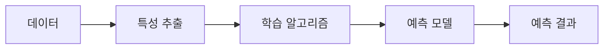
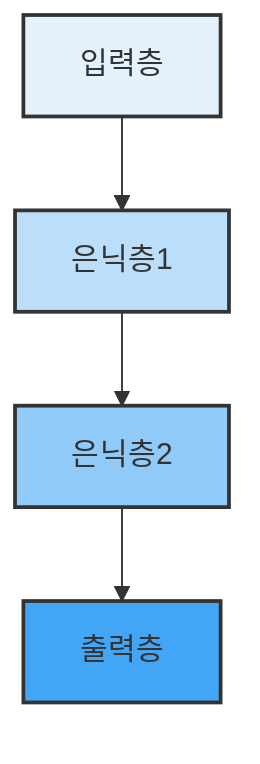

# 1. 머신러닝과 딥러닝 개념 이해 📚

## 목차 📑

### 1. 인공지능과 머신러닝 소개
- [1.1 인공지능이란](#인공지능이란-) 🤖
- [1.2 인공지능의 사례](#인공지능의-사례-) 🏆
- [1.3 강인공지능과 약인공지능](#강인공지능과-약인공지능-) 🧠

### 2. 머신러닝 개요
- [2.1 머신러닝이란](#머신러닝이란-) 🖥️
- [2.2 머신러닝의 필요성](#머신러닝의-필요성-) 🔍
- [2.3 머신러닝 구조](#머신러닝-구조-) 🏗️

### 3. 머신러닝 기법
- [3.1 머신러닝 분류](#머신러닝-분류-) 🗂️
- [3.2 지도학습](#지도학습-) 📑
  - [분류](#분류)
  - [회귀](#회귀)
- [3.3 비지도학습](#비지도학습-) 🧩
  - [클러스터링](#클러스터링)
  - [차원 축소](#차원-축소)
  - [추천 시스템](#추천-시스템)
- [3.4 강화학습](#강화학습-) 🎮

### 4. 딥러닝 개요
- [4.1 딥러닝이란](#딥러닝이란-) 🧬
- [4.2 신경망 모델](#신경망-모델-) 🕸️

---

## 인공지능이란 🤖

**인공지능**은 인공적으로 만들어진 **지능**을 의미하며, 컴퓨터 시스템이 인간과 유사하게 **문제 해결**, **패턴 인식**, **의사결정 보조** 등의 작업을 수행할 수 있도록 하는 기술이다. 이러한 시스템은 다양한 분야에서 활용되며, 대표적으로 **스팸 필터링**, **음성 검색**, **얼굴 인식**, **추천 시스템** 등이 있다.

```python
# 인공지능 시스템 예시: 간단한 의사결정 로직
def recommend_action(input_data):
    if input_data == "스팸":
        return "차단"
    elif input_data == "정상":
        return "수신"
    else:
        return "검토 필요"

print(recommend_action("스팸"))  # 출력: 차단
```

> ⚠️ **주의사항**: 인공지능 시스템은 입력 데이터의 품질에 따라 결과가 크게 달라질 수 있다.

---

## 인공지능의 사례 🏆

현대의 **인공지능**은 인간의 영역을 넘어서 다양한 분야에서 혁신을 이루고 있다. 대표적인 사례로는 **바둑 인공지능 프로그램**이 인간 챔피언을 이긴 사건이 있으며, **자연어 처리 기반 대화형 모델**도 일상에서 널리 사용되고 있다.

- **게임 인공지능**: 바둑, 체스 등에서 인간을 능가하는 성능을 보임
- **대화형 AI**: 사용자의 질문에 자연스럽게 답변을 제공

```python
# 대화형 AI 예시: 간단한 레시피 안내
def make_sandwich():
    steps = [
        "식빵 두 장을 준비한다.",
        "한 쪽에 버터를 바른다.",
        "햄이나 치즈를 올린다.",
        "상추나 토마토를 추가한다.",
        "다른 식빵으로 덮는다."
    ]
    return " > ".join(steps)

print(make_sandwich())
# 출력: 식빵 두 장을 준비한다. > 한 쪽에 버터를 바른다. > 햄이나 치즈를 올린다. > 상추나 토마토를 추가한다. > 다른 식빵으로 덮는다.
```

> ⚠️ **주의사항**: 실제 인공지능 대화 모델은 방대한 데이터와 복잡한 알고리즘을 필요로 한다.

---

## 강인공지능과 약인공지능 🧠

**강인공지능(Strong AI)**은 인간과 유사한 **자기 인식**과 **추론 능력**을 갖춘 인공지능을 의미한다. 이러한 시스템은 스스로 사고하고, 새로운 문제 상황에 적응하며, 폭넓은 인지 능력을 보유한다.

반면, **약인공지능(Weak AI)**은 특정 작업이나 한정된 영역에서만 인간과 비슷한 성능을 내는 인공지능이다. 주로 **특정 문제 해결**이나 **업무 자동화**에 집중되어 있다.

```python
# 약인공지능 예시: 특정 업무 자동화
def detect_spam(email_text):
    keywords = ["광고", "무료", "이벤트"]
    return any(word in email_text for word in keywords)

print(detect_spam("무료 쿠폰을 드립니다!"))  # 출력: True
```

> ⚠️ **주의사항**: 강인공지능은 아직 연구 단계이며, 현재 상용화된 대부분의 인공지능은 약인공지능에 해당한다.

---

## 머신러닝이란 🖥️

**머신러닝**은 **인공지능**의 한 분야로, 컴퓨터가 명시적인 프로그래밍 없이 **데이터로부터 학습**하여 스스로 패턴을 발견하고 예측 또는 분류를 수행하는 기술이다. 머신러닝은 **안면 인식**, **음성 비서**, **콘텐츠 추천** 등 다양한 분야에서 활용된다.

```python
# 머신러닝 예시: 간단한 데이터 기반 예측
import random

def predict_weather(features):
    if features['humidity'] > 70:
        return "비"
    else:
        return "맑음"

sample = {'humidity': random.randint(50, 90)}
print(predict_weather(sample))
```

> ⚠️ **주의사항**: 머신러닝 모델의 성능은 학습 데이터의 품질과 양에 크게 의존한다.

---

## 머신러닝의 필요성 🔍

기존의 **순차적 프로그래밍**은 모든 경우의 수를 코드로 명시해야 하므로 복잡한 문제에 한계가 있다. 반면, 머신러닝은 **데이터 기반 학습**을 통해 복잡한 패턴을 자동으로 인식하고, **자동화**와 **효율성**을 높일 수 있다.

### 비교 예시

- **전통적 방식**: 입력에 따라 미리 정의된 결과만 반환
- **머신러닝 방식**: 데이터로부터 규칙을 학습하여 새로운 입력에도 적절히 대응

```python
# 전통적 방식
def translate(word):
    dictionary = {"손": "hand", "고장": "break"}
    return dictionary.get(word, "unknown")

print(translate("손"))  # 출력: hand

# 머신러닝 방식(의사 코드)
def ml_translate(sentence):
    # 실제로는 모델이 문맥을 파악하여 번역
    return "The machine is broken."

print(ml_translate("기계가 고장나서 손을 쓸 수 없다"))
```

> ⚠️ **주의사항**: 머신러닝은 복잡한 문제 해결에 강점이 있지만, 잘못된 데이터로 학습하면 오히려 부정확한 결과를 낼 수 있다.

---

## 머신러닝 구조 🏗️

머신러닝은 **데이터**와 **특성(Feature)**을 입력받아, **학습 알고리즘**을 통해 **예측 모델**을 생성한다. 이 모델은 새로운 데이터에 대해 예측 또는 분류를 수행한다.



> ⚠️ **주의사항**: 특성 선택과 데이터 전처리는 모델 성능에 큰 영향을 미친다.

---

## 머신러닝 분류 🗂️

머신러닝은 **지도학습**, **비지도학습**, **강화학습**으로 구분된다.

| 분류         | 설명                                   | 예시                        |
|--------------|----------------------------------------|-----------------------------|
| **지도학습**   | 정답(레이블)이 있는 데이터로 학습         | 이메일 분류, 가격 예측      |
| **비지도학습** | 정답 없이 데이터의 패턴을 찾음            | 군집화, 차원 축소           |
| **강화학습**   | 보상 기반으로 최적의 행동을 학습           | 게임 AI, 로봇 제어          |

---

## 지도학습 📑

**지도학습(Supervised Learning)**은 **입력 데이터(특성)**와 **정답(레이블)**이 쌍으로 제공되는 데이터셋을 이용하여 모델을 학습시키는 방법이다. 주로 **분류**와 **회귀** 문제에 적용된다.

### 분류

**분류(Classification)**는 예측 대상이 **범주형(숫자가 아닌 값)**일 때 사용한다. 예를 들어, 이메일이 스팸인지 아닌지 분류하는 문제 등이 있다.

```python
# 분류 예시: 간단한 이메일 스팸 분류
def classify_email(subject):
    spam_keywords = ["광고", "이벤트", "무료"]
    return "스팸" if any(word in subject for word in spam_keywords) else "정상"

print(classify_email("무료 이벤트 안내"))  # 출력: 스팸
```

> ⚠️ **주의사항**: 분류 문제에서는 데이터의 불균형(한 쪽 클래스가 월등히 많음)에 주의해야 한다.

### 회귀

**회귀(Regression)**는 예측 대상이 **연속적인 숫자 값**일 때 사용한다. 예를 들어, 면적에 따른 가격 예측 등이 있다.

```python
# 회귀 예시: 면적에 따른 가격 예측(단순 선형 회귀)
def estimate_price(area):
    slope = 150  # 단위 면적당 가격
    intercept = 50000  # 기본 가격
    return slope * area + intercept

print(estimate_price(120))  # 출력: 68000
```

> ⚠️ **주의사항**: 회귀 모델은 이상치에 민감할 수 있으므로 데이터 전처리가 중요하다.

---

## 비지도학습 🧩

**비지도학습(Unsupervised Learning)**은 **레이블이 없는 데이터**만을 이용하여 데이터의 구조나 패턴을 찾는 방법이다. 대표적으로 **클러스터링**, **차원 축소**, **추천 시스템** 등이 있다.

### 클러스터링

**클러스터링(Clustering)**은 데이터들을 유사한 특성에 따라 그룹으로 묶는 기법이다.

```python
# 클러스터링 예시: 간단한 그룹 분류
def cluster_by_size(sizes):
    return ["대" if s > 20 else "소" for s in sizes]

print(cluster_by_size([15, 22, 8, 30]))  # 출력: ['소', '대', '소', '대']
```

> ⚠️ **주의사항**: 클러스터의 개수(k) 선정이 결과에 큰 영향을 미친다.

### 차원 축소

**차원 축소(Dimensionality Reduction)**는 데이터의 특성 수를 줄여서, 분석이나 시각화를 용이하게 만드는 기법이다. 주로 **PCA**(주성분 분석) 등이 사용된다.

```python
# 차원 축소 예시: 2차원 데이터를 1차원으로 변환(의사 코드)
def reduce_dimension(data):
    # 실제로는 PCA 등 알고리즘 사용
    return [sum(point)/len(point) for point in data]

print(reduce_dimension([[2, 4], [6, 8], [1, 3]]))  # 출력: [3.0, 7.0, 2.0]
```

> ⚠️ **주의사항**: 차원 축소 과정에서 정보 손실이 발생할 수 있다.

### 추천 시스템

**추천 시스템(Recommendation System)**은 사용자의 선호도를 예측하여 적합한 아이템을 추천하는 기법이다.

```python
# 추천 시스템 예시: 간단한 영화 추천
def recommend_movie(user_likes, movie_list):
    return [movie for movie in movie_list if movie in user_likes]

print(recommend_movie(["로맨스", "코미디"], ["코미디", "액션", "스릴러"]))  # 출력: ['코미디']
```

> ⚠️ **주의사항**: 추천 시스템은 사용자 데이터의 다양성과 정확성에 따라 성능이 달라진다.

---

## 강화학습 🎮

**강화학습(Reinforcement Learning)**은 **데이터셋 없이**, **보상(Reward)**과 **규칙**이 정의된 환경에서 **에이전트(Agent)**가 최적의 행동을 학습하는 방법이다. 에이전트는 시행착오를 통해 보상을 최대화하는 방향으로 학습한다.

```python
# 강화학습 예시: 단순한 보상 기반 행동 선택
def choose_action(state):
    actions = ["왼쪽", "오른쪽"]
    rewards = {"왼쪽": 1, "오른쪽": 2}
    return max(actions, key=lambda a: rewards[a])

print(choose_action("초기상태"))  # 출력: 오른쪽
```

> ⚠️ **주의사항**: 강화학습은 환경 설계와 보상 함수 정의가 매우 중요하다.

---

## 딥러닝이란 🧬

**딥러닝(Deep Learning)**은 **머신러닝**의 한 분야로, **인공 신경망(Artificial Neural Network)**을 기반으로 한다. 입력층, 은닉층, 출력층으로 구성된 다층 구조를 통해 복잡한 문제를 해결할 수 있다. 딥러닝은 특히 **이미지 처리**와 **자연어 처리** 등에서 뛰어난 성능을 보인다.

```python
# 딥러닝 예시: 신경망 구조(의사 코드)
layers = ["입력층", "은닉층1", "은닉층2", "출력층"]
print(" -> ".join(layers))
# 출력: 입력층 -> 은닉층1 -> 은닉층2 -> 출력층
```

> ⚠️ **주의사항**: 딥러닝 모델은 대량의 데이터와 높은 연산 자원을 필요로 한다.

---

## 신경망 모델 🕸️

**신경망 모델**은 인간의 뇌 신경 구조를 모방한 구조로, **입력 노드**, **은닉 노드**, **출력 노드**로 구성된다. 각 노드는 가중치와 활성화 함수를 통해 신호를 전달하며, 여러 층을 거치면서 데이터의 복잡한 패턴을 학습한다.



> ⚠️ **주의사항**: 신경망의 층이 깊어질수록 학습이 어려워질 수 있으므로, 적절한 구조 설계가 필요하다.