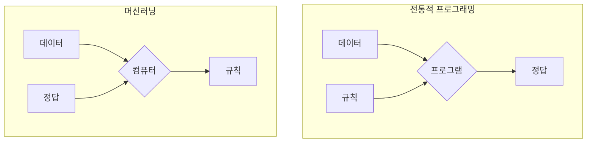
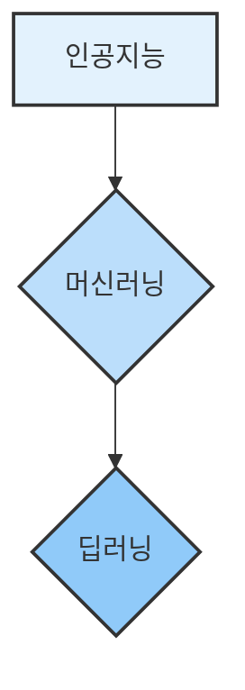

# 1. 머신러닝의 지도 읽기: AI, 머신러닝, 딥러닝의 관계와 핵심 개념

## 목차
- [1. 머신러닝의 지도 읽기: AI, 머신러닝, 딥러닝의 관계와 핵심 개념](#1-머신러닝의-지도-읽기-ai-머신러닝-딥러닝의-관계와-핵심-개념)
  - [목차](#목차)
  - [1. 모든 것의 시작: 인공지능(AI)의 큰 그림](#1-모든-것의-시작-인공지능ai의-큰-그림)
  - [2. AI를 구현하는 핵심 접근법: 머신러닝(Machine Learning)](#2-ai를-구현하는-핵심-접근법-머신러닝machine-learning)
    - [전통적인 프로그래밍 vs 머신러닝: 무엇이 다른가?](#전통적인-프로그래밍-vs-머신러닝-무엇이-다른가)
  - [3. 머신러닝의 3가지 학습 전략](#3-머신러닝의-3가지-학습-전략)
    - [전략 1: 지도학습 (Supervised Learning) - 정답지를 보고 배우기](#전략-1-지도학습-supervised-learning---정답지를-보고-배우기)
    - [전략 2: 비지도학습 (Unsupervised Learning) - 정답지 없이 스스로 패턴 찾기](#전략-2-비지도학습-unsupervised-learning---정답지-없이-스스로-패턴-찾기)
    - [전략 3: 강화학습 (Reinforcement Learning) - 상과 벌을 통해 배우기](#전략-3-강화학습-reinforcement-learning---상과-벌을-통해-배우기)
  - [4. 머신러닝의 강력한 도구: 딥러닝(Deep Learning)](#4-머신러닝의-강력한-도구-딥러닝deep-learning)

---

## 1. 모든 것의 시작: 인공지능(AI)의 큰 그림

**인공지능(Artificial Intelligence)**  은 '기계가 사람처럼 생각하고 행동하게 만드는' 모든 기술을 아우르는 아주 넓은 개념입니다. 마치 '스포츠'라는 단어와 같습니다. 스포츠에 축구, 농구, 야구가 있듯이, 인공지능 안에는 머신러닝, 규칙 기반 시스템 등 여러 접근법이 존재합니다.

> **실무 관점**:
> 우리가 오늘날 마주하는 대부분의 AI(스팸 필터, 추천 시스템, 자율주행)는 **약인공지능(Weak AI)**  입니다. 특정 작업에만 특화되어 있죠. 인간처럼 자유로운 사고를 하는 **강인공지능(Strong AI)**  은 아직 영화 속 이야기입니다.

## 2. AI를 구현하는 핵심 접근법: 머신러닝(Machine Learning)

**머신러닝(Machine Learning)**  은 인공지능을 구현하는 가장 성공적인 접근법 중 하나입니다. 핵심 아이디어는 **"기계에게 명시적인 규칙을 알려주는 대신, 데이터를 통해 스스로 배우게 하자"**  는 것입니다.

### 전통적인 프로그래밍 vs 머신러닝: 무엇이 다른가?

이 차이를 이해하는 것이 가장 중요합니다.

- **전통적인 프로그래밍**: 개발자가 **규칙(알고리즘)**  과 데이터를 입력하면, 컴퓨터가 **정답**을 출력합니다.
  - 예: `if '광고' in email_title: return '스팸'` 이라는 규칙을 사람이 직접 만듭니다.

- **머신러닝**: 개발자가 **데이터(문제)**  와 **정답**을 함께 입력하면, 컴퓨터가 그 관계를 학습하여 **규칙**을 스스로 찾아냅니다.
  - 예: 수만 개의 스팸 메일과 정상 메일을 보여주면, 기계가 어떤 단어와 패턴이 스팸을 결정하는지 '규칙'을 스스로 학습합니다.

> **핵심**: 머신러닝은 '자동으로 규칙을 찾아내는 기계'를 만드는 기술입니다. 이 '규칙'을 우리는 **모델(Model)**  이라고 부릅니다.

## 3. 머신러닝의 3가지 학습 전략

기계는 어떻게 배울까요? 학습 방식에 따라 크게 3가지 전략으로 나뉩니다.

### 전략 1: 지도학습 (Supervised Learning) - 정답지를 보고 배우기

가장 흔하고 강력한 방식입니다. '문제(입력 데이터)'와 '정답(레이블)'이 짝을 이룬 데이터로 학습합니다.

- **분류 (Classification)** : 예측할 정답이 **카테고리**일 때.
  - **문제**: 고양이 사진, 강아지 사진
  - **정답**: '고양이', '강아지' 라는 이름표(레이블)
  - **학습 후**: 새로운 사진을 보고 '고양이'인지 '강아지'인지 구분하는 규칙(모델)을 만듭니다.
  - **다른 예시**: 스팸/정상 메일 분류, 신용카드 사기/정상 거래 분류

- **회귀 (Regression)** : 예측할 정답이 **연속적인 숫자**일 때.
  - **문제**: 아파트의 평수, 위치, 건축 연도
  - **정답**: 실제 아파트 매매 가격
  - **학습 후**: 새로운 아파트 정보를 보고 예상 가격을 예측하는 규칙(모델)을 만듭니다.
  - **다른 예시**: 내일의 주가 예측, 키에 따른 몸무게 예측

### 전략 2: 비지도학습 (Unsupervised Learning) - 정답지 없이 스스로 패턴 찾기

정답(레이블)이 없는 날것의 데이터만으로 숨겨진 구조나 패턴을 찾아내는 방식입니다.

- **군집화 (Clustering)** : 비슷한 데이터끼리 그룹으로 묶습니다.
  - **문제**: 고객들의 구매 내역 데이터 (정답 없음)
  - **학습 후**: 데이터를 분석해 '알뜰 쇼핑 그룹', '신제품 선호 그룹', '대량 구매 그룹' 등으로 고객을 자동으로 분류하는 규칙을 찾습니다.

- **차원 축소 (Dimensionality Reduction)** : 너무 많은 변수(특성)를 가진 데이터를 중요한 몇 개의 변수로 압축합니다.
  - **문제**: 수백 개의 문항으로 이루어진 설문조사 결과
  - **학습 후**: 수백 개의 변수를 '만족도', '충성도' 같은 몇 개의 핵심 요인으로 요약합니다.

### 전략 3: 강화학습 (Reinforcement Learning) - 상과 벌을 통해 배우기

정해진 데이터셋 없이, 에이전트(Agent)가 환경(Environment) 안에서 특정 행동을 취하고, 그 결과로 **보상(Reward)**  또는 **벌점(Penalty)**  을 받으며 최적의 행동 전략을 학습합니다.

- **예시**: 게임 AI
  - **에이전트**: 게임 캐릭터
  - **환경**: 게임 맵
  - **행동**: 상, 하, 좌, 우 이동
  - **보상/벌점**: 점수를 얻으면 보상(+), 장애물에 부딪히면 벌점(-)
  - **학습 후**: 가장 높은 점수를 얻기 위한 최적의 이동 경로(전략)를 스스로 터득합니다.
- **다른 예시**: 로봇 제어, 공장 최적화

## 4. 머신러닝의 강력한 도구: 딥러닝(Deep Learning)

**딥러닝(Deep Learning)**  은 머신러닝의 여러 기법 중 하나로, 인간의 뇌 신경망 구조를 모방한 **인공신경망(Artificial Neural Network)**  을 깊게(deep) 쌓아올려 학습하는 방식입니다.

- **왜 강력한가?**: 딥러닝은 데이터 속에서 **스스로 특징(feature)을 추출하고 학습**하는 능력이 매우 뛰어납니다. 특히 이미지, 음성, 텍스트 같은 비정형 데이터 처리에서 기존 머신러닝 기법들을 압도하는 성능을 보여주면서 AI의 전성기를 이끌었습니다.

> **핵심**: 딥러닝은 머신러닝과 별개의 것이 아닙니다. 머신러닝이라는 큰 상자 안에 있는, 매우 효과적인 '연장' 중 하나입니다.