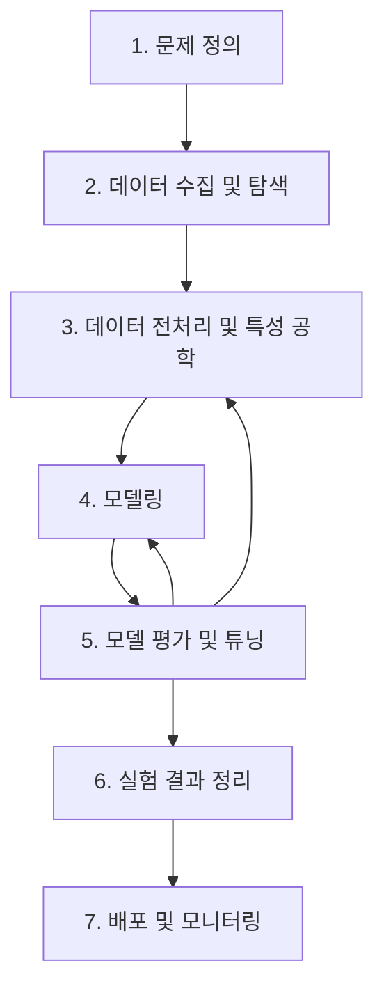

# 1. 머신러닝 프로젝트의 전체 지도: 문제 정의부터 배포까지

## 목차
- [1. 머신러닝 프로젝트의 전체 지도: 문제 정의부터 배포까지](#1-머신러닝-프로젝트의-전체-지도-문제-정의부터-배포까지)
  - [목차](#목차)
  - [1. 머신러닝 프로젝트의 7단계 핵심 워크플로우](#1-머신러닝-프로젝트의-7단계-핵심-워크플로우)
  - [2. 1단계: 문제 정의 (가장 중요한 시작)](#2-1단계-문제-정의-가장-중요한-시작)
  - [3. 2단계: 데이터 수집 및 탐색 (재료 준비 및 탐색)](#3-2단계-데이터-수집-및-탐색-재료-준비-및-탐색)
  - [4. 3단계: 데이터 전처리 및 특성 공학 (재료 다듬기)](#4-3단계-데이터-전처리-및-특성-공학-재료-다듬기)
  - [5. 4단계: 모델링 (설계도에 따라 집 짓기)](#5-4단계-모델링-설계도에-따라-집-짓기)
  - [6. 5단계: 모델 평가 및 튜닝 (집 검사 및 개선)](#6-5단계-모델-평가-및-튜닝-집-검사-및-개선)
  - [7. 6-7단계: 실험 결과 정리 및 배포 (보고 및 입주)](#7-6-7단계-실험-결과-정리-및-배포-보고-및-입주)

---

## 1. 머신러닝 프로젝트의 7단계 핵심 워크플로우

모든 머신러닝 프로젝트는 아래의 흐름을 따릅니다. 각 단계는 독립적이지 않고, 서로 영향을 주며 반복적으로 수행될 수 있습니다.

## 2. 1단계: 문제 정의 (가장 중요한 시작)

- **목표**: 비즈니스 문제를 머신러닝 문제(분류, 회귀 등)로 명확하게 재정의하고, 성공의 기준(평가 지표)을 설정합니다.
- **핵심 질문**:
    - "우리가 해결하려는 진짜 문제는 무엇인가?"
    - "이 문제를 해결하면 어떤 비즈니스 가치가 창출되는가?"
    - "이것은 분류 문제인가, 회귀 문제인가, 아니면 군집화 문제인가?"
    - "모델의 성공을 어떻게 측정할 것인가? (예: 정확도 95% 이상, 매출 5% 상승)"

> **실수하지 마세요**: 기술에 매몰되어 "무엇을 예측할지"만 고민하고 "왜 예측해야 하는지"를 놓치는 것이 주니어들이 가장 많이 하는 실수입니다.

## 3. 2단계: 데이터 수집 및 탐색 (재료 준비 및 탐색)

- **목표**: 문제 해결에 필요한 데이터를 가능한 한 많이, 그리고 다양한 소스에서 수집하고, 데이터의 기본적인 구조와 패턴, 품질을 파악합니다.
- **핵심 질문**:
    - "어떤 데이터가 필요한가? 어디서 얻을 수 있는가?"
    - "데이터의 각 변수는 무엇을 의미하며, 어떤 타입을 가지고 있는가?"
    - "데이터에 결측치나 이상치는 없는가? 데이터의 전반적인 분포는 어떠한가?" (EDA)
    - "변수들 간에 눈에 띄는 상관관계나 패턴이 있는가?"

## 4. 3단계: 데이터 전처리 및 특성 공학 (재료 다듬기)

- **목표**: '날것'의 데이터를 모델이 '먹기 좋은' 형태로 가공하고, 모델의 성능을 높일 수 있는 유용한 특성을 만들어냅니다. **프로젝트 시간의 70~80%가 이 단계에 소요됩니다.**
- **핵심 질문**:
    - "결측치와 이상치를 어떻게 처리할 것인가? (삭제, 대체 등)"
    - "텍스트나 날짜 같은 비정형 데이터를 어떻게 숫자 형태로 바꿀 것인가?"
    - "기존 특성들을 조합하여 더 의미 있는 새로운 특성을 만들 수 있는가? (특성 공학)"
    - "모델의 학습을 돕기 위해 데이터의 스케일을 맞춰야 하는가? (정규화, 표준화)"

## 5. 4단계: 모델링 (설계도에 따라 집 짓기)

- **목표**: 준비된 데이터를 사용하여, 문제에 적합한 여러 머신러닝 모델을 학습시킵니다.
- **핵심 질문**:
    - "이 문제에 적합한 모델 후보군은 무엇인가? (예: 선형 모델, 트리 기반 모델, 신경망)"
    - "데이터를 훈련용, 검증용, 테스트용으로 어떻게 나눌 것인가?"
    - "선택한 모델을 훈련 데이터로 어떻게 학습시킬 것인가? (`.fit`)"

## 6. 5단계: 모델 평가 및 튜닝 (집 검사 및 개선)

- **목표**: 학습된 모델이 얼마나 좋은 성능을 내는지 객관적으로 평가하고, 더 나은 성능을 위해 모델의 설정을 최적화(하이퍼파라미터 튜닝)합니다.
- **핵심 질문**:
    - "1단계에서 정의한 성공 기준(평가 지표)으로 모델의 성능을 측정하면 몇 점인가?"
    - "모델이 훈련 데이터에만 과적합(Overfitting)되지는 않았는가? (교차 검증)"
    - "어떤 모델이 가장 좋은 성능을 보이는가?"
    - "모델의 성능을 더 끌어올리기 위해 어떤 하이퍼파라미터를 조정해야 하는가?"

> **기억하세요**: 이 단계에서 성능이 만족스럽지 않다면, 3단계(전처리/특성 공학)나 4단계(다른 모델 선택)로 되돌아가 과정을 반복해야 합니다.

## 7. 6-7단계: 실험 결과 정리 및 배포 (보고 및 입주)

- **목표**: 최종 선택된 모델의 성능과 한계, 그리고 비즈니스 기여도를 명확하게 정리하여 보고하고, 실제 서비스에 적용(배포)하여 가치를 창출합니다.
- **핵심 질문**:
    - "최종 모델은 무엇이며, 그 성능은 어느 정도인가?"
    - "이 모델을 통해 어떤 비즈니스 임팩트를 기대할 수 있는가?"
    - "모델을 실제 시스템에 어떻게 통합할 것인가? (API, 배치 작업 등)"
    - "배포 후 모델의 성능을 어떻게 지속적으로 모니터링하고 관리할 것인가?"
