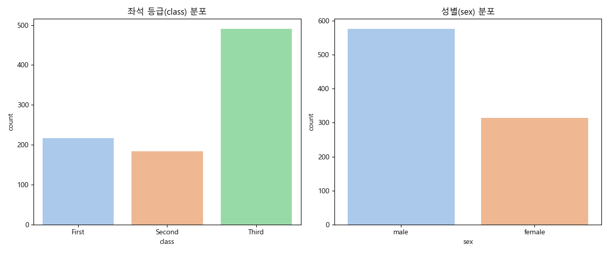

# 2. 데이터 탐험가를 위한 안내서: EDA 체크리스트

## 목차
- [2. 데이터 탐험가를 위한 안내서: EDA 체크리스트](#2-데이터-탐험가를-위한-안내서-eda-체크리스트)
  - [목차](#목차)
  - [1. EDA의 2가지 핵심 목표](#1-eda의-2가지-핵심-목표)
  - [2. 1단계: 데이터의 첫인상 파악하기 (숲 전체 보기)](#2-1단계-데이터의-첫인상-파악하기-숲-전체-보기)
    - [Checklist 1: 구조, 정보, 결측치 확인](#checklist-1-구조-정보-결측치-확인)
    - [Checklist 2: 수치형 데이터와 범주형 데이터 구분](#checklist-2-수치형-데이터와-범주형-데이터-구분)
  - [3. 2단계: 데이터 깊게 들여다보기 (나무 하나씩 보기)](#3-2단계-데이터-깊게-들여다보기-나무-하나씩-보기)
    - [Checklist 3: 수치형 데이터의 분포 탐색](#checklist-3-수치형-데이터의-분포-탐색)
    - [Checklist 4: 범주형 데이터의 분포 탐색](#checklist-4-범주형-데이터의-분포-탐색)
  - [4. 3단계: 변수 간의 관계 파악하기 (나무들의 관계 보기)](#4-3단계-변수-간의-관계-파악하기-나무들의-관계-보기)
    - [Checklist 5: 수치형 변수 vs 수치형 변수 (상관관계 분석)](#checklist-5-수치형-변수-vs-수치형-변수-상관관계-분석)
    - [Checklist 6: 범주형 변수 vs 수치형 변수 (그룹별 비교)](#checklist-6-범주형-변수-vs-수치형-변수-그룹별-비교)
    - [Checklist 7: 종합적인 관계 탐색 (다변량 분석)](#checklist-7-종합적인-관계-탐색-다변량-분석)

---

## 1. EDA의 2가지 핵심 목표

1.  **데이터에 대한 이해 증진**: 데이터의 구조, 패턴, 이상치, 변수 간 관계 등을 파악하여 데이터 자체를 깊이 이해합니다.
2.  **모델링 전략 수립**: 탐색 결과를 바탕으로 어떤 전처리 기법을 사용할지, 어떤 특성을 만들지, 어떤 모델이 적합할지에 대한 가설을 세웁니다.

---

## 2. 1단계: 데이터의 첫인상 파악하기 (숲 전체 보기)

가장 먼저 데이터의 전체적인 크기, 변수의 종류, 결측치 유무 등 기본적인 정보를 확인합니다.

### Checklist 1: 구조, 정보, 결측치 확인

- **질문**: "이 데이터는 얼마나 크고, 어떤 변수들로 이루어져 있으며, 결측치는 얼마나, 어디에 있는가?"
- **액션**: `.shape`, `.info()`와 함께 `sns.heatmap`으로 결측치 패턴 시각화

```python
import pandas as pd
import seaborn as sns
import matplotlib.pyplot as plt

# 타이타닉 데이터셋 로드 및 기본 정보 출력
df = sns.load_dataset('titanic')
print("--- 데이터 크기 ---")
print(df.shape)
print("\n--- 데이터 정보 ---")
df.info()

# 결측치 패턴 시각화 코드 (generate_eda_plots.py에 포함)
# plt.figure(figsize=(10, 6))
# sns.heatmap(df.isnull(), cbar=False, cmap='viridis')
# plt.title('결측치 분포 시각화')
# plt.show()
```


> **Insight:**
> `df.isnull().sum()`은 결측치의 **개수**를 알려주지만, 위 `heatmap`은 결측치의 **패턴**을 보여줍니다. 'age'에 결측치가 광범위하게 퍼져있고, 'deck'은 대부분이 결측 상태임을 한눈에 알 수 있죠. 이는 'age'는 채워 넣는 전략(imputation)을, 'deck'은 변수 제거(feature dropping)를 고려하게 만드는 강력한 시각적 단서입니다.

### Checklist 2: 수치형 데이터와 범주형 데이터 구분

- **질문**: "어떤 변수가 숫자(수치형)이고, 어떤 변수가 카테고리(범주형)인가?"
- **액션**: `.select_dtypes()`를 사용하여 데이터를 분리하고, 각 데이터의 기술 통계 확인 (`.describe()`)

```python
# 수치형 데이터 선택 및 요약
numeric_df = df.select_dtypes(include=['int64', 'float64'])
print("\n--- 수치형 데이터 요약 ---")
print(numeric_df.describe())

# 범주형 데이터 선택 및 요약
categorical_df = df.select_dtypes(include=['object', 'category', 'bool'])
print("\n--- 범주형 데이터 요약 ---")
print(categorical_df.describe())
```

---

## 3. 2단계: 데이터 깊게 들여다보기 (나무 하나씩 보기)

이제 각 변수를 하나씩 상세히 살펴보며 분포와 특성을 파악합니다.

### Checklist 3: 수치형 데이터의 분포 탐색

- **질문**: "각 수치형 변수는 어떤 분포를 가지는가? 중심 경향은 어떻고, 얼마나 퍼져 있는가? 이상치는 없는가?"
- **액션**: `sns.histplot()`과 `sns.boxplot()`으로 시각화


> **Insight:**
> 왼쪽 히스토그램은 'age'가 20-30대에 집중된 정규분포와 유사한 형태를 띠지만, 어린아이 피크가 하나 더 있는 것을 보여줍니다. 오른쪽 박스플롯은 'fare'가 극단적인 이상치(outlier)를 많이 포함하고 있음을 명확히 보여줍니다. 이런 왜곡된 분포(skewed distribution)는 로그 변환(log transformation) 같은 스케일링 기법을 적용할 후보가 됩니다.

### Checklist 4: 범주형 데이터의 분포 탐색

- **질문**: "각 범주형 변수는 어떤 값들을 가지고 있으며, 각 값의 빈도는 어떻게 되는가?"
- **액션**: `.value_counts()`로 빈도 계산, `sns.countplot()`으로 시각화



> **Insight:**
> 차트는 3등석 승객과 남성 승객이 압도적으로 많다는 사실을 보여줍니다. 이는 데이터 불균형(imbalance) 문제로 이어질 수 있습니다. 예를 들어, 모델이 단순히 다수인 '남성' 또는 '3등석' 승객의 특징에 과적합(overfitting)될 수 있음을 암시합니다.

---

## 4. 3단계: 변수 간의 관계 파악하기 (나무들의 관계 보기)

데이터의 진짜 인사이트는 변수들이 서로 어떻게 상호작용하는지 살펴볼 때 드러납니다.

### Checklist 5: 수치형 변수 vs 수치형 변수 (상관관계 분석)

- **질문**: "수치형 변수들 사이에 어떤 선형 관계가 있는가?"
- **액션**: `.corr()`와 `sns.heatmap()`으로 상관계수 계산 및 시각화


> **Insight:**
> 히트맵은 'pclass'(좌석 등급)와 'fare'(요금) 사이에 강한 음의 상관관계(-0.55)가 있음을 보여줍니다. (등급 숫자가 작을수록 비싼 요금). 또한 'pclass'와 'age' 사이에도 약한 음의 상관관계가 보입니다. (좋은 등급일수록 나이가 많은 경향). 하지만 'survived'와의 직접적인 선형 관계는 뚜렷하지 않으므로, 더 복잡한 비선형 관계나 다른 변수와의 상호작용을 탐색해야 합니다.

### Checklist 6: 범주형 변수 vs 수치형 변수 (그룹별 비교)

- **질문**: "각 카테고리별로 수치형 변수의 분포는 어떻게 다른가?"
- **액션**: `sns.boxplot()`, `sns.barplot()` 등으로 그룹 간 비교 시각화


> **Insight:**
> 왼쪽 차트는 '1등석'의 요금이 비쌀 뿐만 아니라 변동성도 매우 크다는 것을 보여줍니다. 오른쪽 차트는 **여성의 생존율이 남성보다 압도적으로 높다**는, 이 데이터셋의 가장 유명하고 강력한 패턴을 명확히 보여줍니다. 'sex'는 생존 예측에 있어 핵심적인 변수가 될 것임을 직감할 수 있습니다.

### Checklist 7: 종합적인 관계 탐색 (다변량 분석)

- **질문**: "여러 변수들을 종합적으로 고려했을 때, 타겟 변수(생존 여부)를 잘 구분하는 패턴은 무엇인가?"
- **액션**: `sns.pairplot()`으로 여러 변수 간의 관계를 한 번에 시각화


> **Insight:**
> `Pairplot`은 EDA의 하이라이트입니다. 이 차트 하나로 우리는 다음의 복합적인 사실들을 추론할 수 있습니다.
> - **pclass vs fare**: 1등석(pclass=1)은 요금이 비싸고, 3등석(pclass=3)은 저렴하며, 이 두 그룹 간에 생존율(survived, 색상) 차이가 보입니다.
> - **age vs pclass**: 1등석에는 고연령층이, 3등석에는 저연령층이 더 많습니다. 특히 3등석의 젊은 남성(파란색 점)들의 생존율이 낮아 보입니다.
> - **fare 분포**: 생존자(survived=1, 노란색)들이 사망자들보다 전반적으로 더 높은 요금을 낸 경향이 보입니다.
>
> 이처럼 `Pairplot`은 여러 단변량, 이변량 분석에서 얻은 가설들을 종합적으로 확인하고 새로운 인사이트를 발견하게 해주는 가장 강력한 탐색 도구 중 하나입니다.