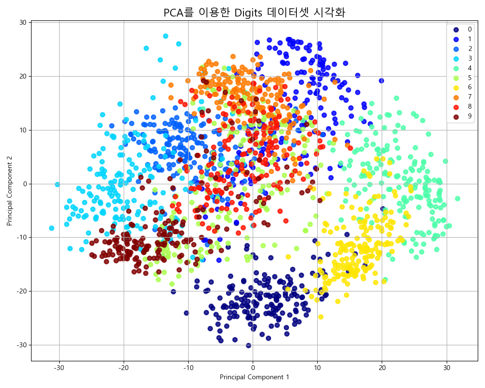
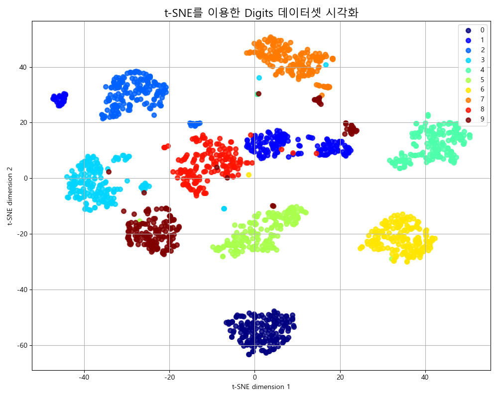

# 3. 비지도 학습: 정답 없는 데이터에서 숨은 보석 찾기

## 목차
- [3. 비지도 학습: 정답 없는 데이터에서 숨은 보석 찾기](#3-비지도-학습-정답-없는-데이터에서-숨은-보석-찾기)
  - [목차](#목차)
  - [1. 클러스터링: 데이터에 숨겨진 그룹 찾기](#1-클러스터링-데이터에-숨겨진-그룹-찾기)
    - [클러스터링 성능 평가: 실루엣 점수](#클러스터링-성능-평가-실루엣-점수)
  - [2. 차원 축소: 복잡함 속에서 핵심만 남기기](#2-차원-축소-복잡함-속에서-핵심만-남기기)
    - [주성분 분석 (PCA): 데이터의 가장 중요한 축을 찾아서](#주성분-분석-pca-데이터의-가장-중요한-축을-찾아서)
    - [t-SNE: 고차원 데이터를 시각화하는 마법](#t-sne-고차원-데이터를-시각화하는-마법)
    - [PCA vs. t-SNE: 시각화를 통한 결정적 차이 이해하기](#pca-vs-t-sne-시각화를-통한-결정적-차이-이해하기)

---

## 1. 클러스터링: 데이터에 숨겨진 그룹 찾기
... (이하 클러스터링 내용은 기존과 동일) ...
### 클러스터링 성능 평가: 실루엣 점수
...

---

## 2. 차원 축소: 복잡함 속에서 핵심만 남기기

차원 축소는 고차원 데이터의 **'차원의 저주'** 를 피하고, 데이터의 본질적인 구조를 파악하기 위한 핵심 기술입니다.

### 주성분 분석 (PCA): 데이터의 가장 중요한 축을 찾아서

- **핵심 원리**: 데이터의 **분산(정보량)을 가장 잘 보존하는 새로운 축(주성분)**을 찾아, 데이터를 그 축에 투영합니다. 선형적인 관계를 기반으로 데이터의 전체적인 구조를 요약하는 데 탁월합니다.
- **특징**:
    - **장점**: 계산이 빠르고, 변환된 축의 의미(분산의 크기)를 해석하기 쉽습니다. 머신러닝 모델의 **전처리 단계**에서 특성 수를 줄이는 데 널리 사용됩니다.
    - **단점**: 데이터의 비선형적인 복잡한 구조는 잘 잡아내지 못합니다.

### t-SNE: 고차원 데이터를 시각화하는 마법

- **핵심 원리**: 고차원 공간에서 가까웠던 데이터 포인트들이, 저차원 공간에서도 **가깝게 유지되도록** 위치를 최적화합니다. 데이터의 **지역적 구조(local structure)**를 보존하는 데 매우 뛰어납니다.
- **특징**:
    - **장점**: 복잡한 고차원 데이터의 군집 구조를 2차원이나 3차원으로 매우 아름답고 직관적으로 시각화해줍니다.
    - **단점**: 계산량이 매우 많아 대용량 데이터에는 적용하기 어렵고, **오직 시각화 목적**으로만 사용해야 합니다. 변환된 축은 특별한 의미가 없으며, `fit_transform`만 지원하고 새로운 데이터에 대한 `transform`은 지원하지 않습니다.

### PCA vs. t-SNE: 시각화를 통한 결정적 차이 이해하기

이 두 기법의 차이를 이해하는 가장 좋은 방법은 동일한 데이터셋에 적용된 시각화 결과를 직접 비교하는 것입니다. `scikit-learn`의 `digits` 데이터셋(64차원)을 2차원으로 축소해 보겠습니다.

 

| PCA (주성분 분석) | t-SNE (t-분산 확률적 이웃 임베딩) |
| :---: | :---: |
|  |  |

 

> **Insight: 숲을 보는 지도 vs. 나무 군락을 보는 지도**
>
> 위 두 차트는 차원 축소의 두 가지 다른 철학을 명확히 보여줍니다.
>
> **PCA (왼쪽)** 는 데이터 전체의 **분산**을 최대한 보존하려 합니다. 그 결과, 데이터의 전반적인 분포와 방향성은 유지되지만, 각 숫자 그룹들이 상당히 겹쳐 보입니다. 이는 마치 위성에서 찍은 것처럼 **'숲' 전체의 구조**를 보여주는 지도와 같습니다. 노이즈를 제거하고 모델의 입력으로 사용할 데이터를 압축하는 **전처리**에 강력한 힘을 발휘하는 이유입니다.
>
> **t-SNE (오른쪽)** 는 **지역적 이웃 관계**를 지키는 데 목숨을 겁니다. 그 결과, 각 숫자 그룹(클러스터)이 매우 명확하고 예쁘게 분리됩니다. 이는 마치 탐험가가 직접 걸어 다니며 그린 것처럼 **'나무 군락'** 이 어디에 있는지 상세히 보여주는 지도와 같습니다. 데이터에 숨겨진 군집을 **발견**하고 다른 사람에게 **설명**하기 위한 **시각화**에 최고의 도구입니다.
>
> **핵심 주의사항**: t-SNE에서 클러스터 간의 거리나 크기는 실제 의미를 갖지 않습니다. '4번' 클러스터와 '6번' 클러스터가 멀리 떨어져 있다고 해서 PCA에서처럼 '더 많이 다르다'고 해석해서는 안 됩니다. 오직 '같은 그룹은 뭉쳐있다'는 사실만이 중요합니다.
>
> **결론: 당신의 목적이 무엇입니까?**
> - 모델의 성능을 높이기 위해 **데이터를 압축**하고 싶다면 **PCA**를 사용하십시오.
> - 데이터의 **숨겨진 그룹을 찾아내고 보고**하고 싶다면 **t-SNE**를 사용하십시오.
>
> 최고의 전문가는 두 가지 지도를 모두 펼쳐놓고, 상황에 맞는 통찰을 이끌어내는 사람입니다.
