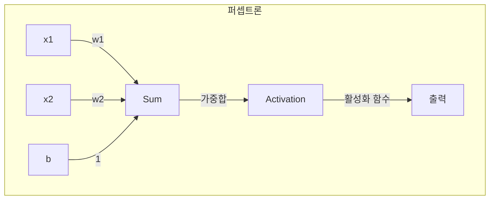

# 1. 딥러닝의 시작: 퍼셉트론과 학습의 원리

## 목차
- [1. 딥러닝의 시작: 퍼셉트론과 학습의 원리](#1-딥러닝의-시작-퍼셉트론과-학습의-원리)
  - [목차](#목차)
  - [1. 퍼셉트론: 가장 단순한 학습 기계](#1-퍼셉트론-가장-단순한-학습-기계)
    - [퍼셉트론의 구조](#퍼셉트론의-구조)
  - [2. 퍼셉트론은 어떻게 학습하는가?](#2-퍼셉트론은-어떻게-학습하는가)
    - [퍼셉트론 학습 규칙: 실수로부터 배우기](#퍼셉트론-학습-규칙-실수로부터-배우기)
  - [3. 단층 퍼셉트론의 명백한 한계: XOR 문제](#3-단층-퍼셉트론의-명백한-한계-xor-문제)
  - [4. 한계를 넘어서: 다층 퍼셉트론(MLP)과 딥러닝의 등장](#4-한계를-넘어서-다층-퍼셉트론mlp과-딥러닝의-등장)
    - [왜 층을 쌓으면 해결되는가?](#왜-층을-쌓으면-해결되는가)

---

## 1. 퍼셉트론: 가장 단순한 학습 기계

**퍼셉트론**은 여러 개의 신호(입력)를 받아 하나의 신호(출력)를 내보내는, 인공신경망의 가장 기본적인 단위입니다. 그 본질은 데이터를 두 개의 그룹으로 나누는 **선형 분류기(Linear Classifier)**  입니다.

### 퍼셉트론의 구조

1.  **입력 (Inputs, `x`)** : 데이터의 각 특성 값들.
2.  **가중치 (Weights, `w`)** : 각 입력 신호의 **중요도**를 나타내는 값. 가중치가 클수록 해당 입력이 결과에 미치는 영향이 큽니다.
3.  **편향 (Bias, `b`)** : 뉴런이 얼마나 쉽게 활성화되는지를 조절하는 값. (결정 경계선을 원점에서부터 이동시키는 역할)
4.  **가중합 (Weighted Sum)** : `(x₁w₁ + x₂w₂ + ... + b)` 입력과 가중치를 곱한 값들을 모두 더하고 편향을 더합니다.
5.  **활성화 함수 (Activation Function)** : 가중합의 결과를 최종 출력 신호로 변환합니다. 가장 단순한 퍼셉트론에서는 **계단 함수(Step Function)**  를 사용합니다. (가중합이 0보다 크면 1, 작으면 0을 출력)



## 2. 퍼셉트론은 어떻게 학습하는가?

퍼셉트론의 핵심은 **스스로 최적의 가중치(`w`)와 편향(`b`)을 찾아가는 '학습' 능력**에 있습니다.

### 퍼셉트론 학습 규칙: 실수로부터 배우기

학습 과정은 매우 직관적입니다.
1.  가중치와 편향을 무작위 값으로 초기화합니다.
2.  훈련 데이터를 하나씩 입력하여 예측값을 계산합니다.
3.  **예측이 맞으면**: 가만히 있습니다.
4.  **예측이 틀리면**: **정답에 가까워지는 방향으로 가중치와 편향을 조금씩 조정**합니다.
    - **`w_new = w_old + 학습률 * (실제값 - 예측값) * x`**
    - **`b_new = b_old + 학습률 * (실제값 - 예측값)`**
5.  모든 훈련 데이터에 대해 이 과정을 반복합니다.

> **핵심**: 예측이 틀렸을 때, 그 '오차(`실제값 - 예측값`)'를 이용하여 파라미터를 업데이트합니다. 이것이 바로 머신러닝 '학습'의 가장 원시적인 형태입니다.

## 3. 단층 퍼셉트론의 명백한 한계: XOR 문제

단층 퍼셉트론은 AND 게이트(`x₁=1이고 x₂=1일 때만 1`)나 OR 게이트(`x₁ 또는 x₂가 1이면 1`) 문제는 잘 해결합니다. 이들은 하나의 직선으로 두 그룹을 나눌 수 있는 **선형 문제**이기 때문입니다.

하지만 **XOR 게이트**(`x₁과 x₂가 서로 다를 때만 1`) 문제는 해결하지 못합니다. XOR 문제의 데이터 분포는 **하나의 직선으로는 두 그룹을 절대 나눌 수 없기 때문**입니다.

```python
import matplotlib.pyplot as plt

# XOR 데이터 시각화
X_xor = [[0,0], [0,1], [1,0], [1,1]]
y_xor = [0, 1, 1, 0]

plt.figure(figsize=(5,5))
plt.scatter([p[0] for i, p in enumerate(X_xor) if y_xor[i]==0],
            [p[1] for i, p in enumerate(X_xor) if y_xor[i]==0], marker='o', s=100, label='Class 0')
plt.scatter([p[0] for i, p in enumerate(X_xor) if y_xor[i]==1],
            [p[1] for i, p in enumerate(X_xor) if y_xor[i]==1], marker='x', s=100, label='Class 1')
plt.title("XOR 문제: 직선 하나로 나눌 수 없다")
plt.xlabel("x1"); plt.ylabel("x2")
plt.legend()
plt.grid()
plt.show()
```
이 한계로 인해 인공지능 연구는 첫 번째 겨울(AI Winter)을 맞게 됩니다.

## 4. 한계를 넘어서: 다층 퍼셉트론(MLP)과 딥러닝의 등장

XOR 문제의 해결책은 의외로 간단했습니다. **퍼셉트론을 여러 층으로 쌓는 것**입니다.
입력층과 출력층 사이에 **은닉층(Hidden Layer)**  을 추가한 구조를 **다층 퍼셉트론(MLP, Multi-Layer Perceptron)**  이라고 부릅니다.

### 왜 층을 쌓으면 해결되는가?

- **1층 (은닉층)** : 입력 데이터를 선형적으로 나눌 수 있는 더 높은 차원의 새로운 공간으로 보냅니다. 예를 들어, 1층의 뉴런들이 각각 AND, OR 같은 간단한 경계선을 학습합니다.
- **2층 (출력층)** : 1층에서 변환된 새로운 공간에서, 이 간단한 경계선들을 조합하여 복잡한 **비선형 경계선**을 만들어냅니다. (예: AND와 OR의 조합으로 XOR 구현)

> **핵심**: 층을 쌓고, 계단 함수 대신 **시그모이드나 ReLU 같은 부드러운 비선형 활성화 함수**를 사용함으로써, 신경망은 어떤 복잡한 함수라도 근사할 수 있는 강력한 표현력을 갖게 됩니다. 그리고 은닉층이 깊어진(deep) 신경망이 바로 **딥러닝(Deep Learning)**  입니다.