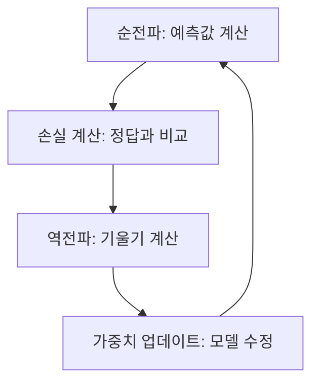

# 2. 딥러닝 학습의 엔진: 역전파와 텐서플로우


## 목차
- [2. 딥러닝 학습의 엔진: 역전파와 텐서플로우](#2-딥러닝-학습의-엔진-역전파와-텐서플로우)
  - [목차](#목차)
  - [1. 딥러닝 학습의 전체 과정: 순전파와 역전파](#1-딥러닝-학습의-전체-과정-순전파와-역전파)
  - [2. 1단계 (순전파): 모델의 예측](#2-1단계-순전파-모델의-예측)
  - [3. 2단계 (오차 계산): 얼마나 틀렸는가? (손실 함수)](#3-2단계-오차-계산-얼마나-틀렸는가-손실-함수)
  - [4. 3단계 (역전파): 실수에 대한 책임을 묻고 전파하기](#4-3단계-역전파-실수에-대한-책임을-묻고-전파하기)
    - [역전파의 핵심: 미분의 연쇄 법칙 (Chain Rule)](#역전파의-핵심-미분의-연쇄-법칙-chain-rule)
  - [5. 4단계 (가중치 업데이트): 더 나은 방향으로 (옵티마이저)](#5-4단계-가중치-업데이트-더-나은-방향으로-옵티마이저)
  - [6. 텐서플로우 Keras로 모든 과정 구현하기](#6-텐서플로우-keras로-모든-과정-구현하기)

---

## 1. 딥러닝 학습의 전체 과정: 순전파와 역전파

딥러닝의 '학습'은 크게 네 단계로 이루어진 사이클을 반복하는 과정입니다.



이 사이클을 수천, 수만 번 반복하면서 모델의 가중치는 점차 최적의 값으로 수렴해갑니다.

## 2. 1단계 (순전파): 모델의 예측

**순전파(Forward Propagation)**  는 입력 데이터가 신경망의 입력층부터 출력층까지, 각 층의 가중치와 곱해지고 활성화 함수를 거쳐 최종 예측값을 만들어내는 과정입니다. 우리가 이전 챕터에서 배운 `예측값 = f(입력 @ 가중치 + 편향)` 계산이 각 층에서 일어나는 것입니다.

## 3. 2단계 (오차 계산): 얼마나 틀렸는가? (손실 함수)

모델이 예측값을 내놓으면, 우리는 이 예측이 **실제 정답과 얼마나 다른지**, 즉 **오차(Error) 또는 손실(Loss)**  를 계산해야 합니다. 이 오차를 측정하는 기준이 바로 **손실 함수(Loss Function)**  입니다.

- **회귀 문제**: 주로 **평균 제곱 오차(MSE, Mean Squared Error)**  사용.
- **이진 분류 문제**: 주로 **이진 크로스엔트로피(Binary Crossentropy)**  사용. 두 확률분포 사이의 차이를 측정하며, 모델의 예측 확률이 실제 정답(0 또는 1)과 멀어질수록 손실이 커집니다.
- **다중 분류 문제**: **범주형 크로스엔트로피(Categorical Crossentropy)**  사용.

## 4. 3단계 (역전파): 실수에 대한 책임을 묻고 전파하기

**역전파(Backpropagation)**  는 딥러닝 학습의 핵심 엔진입니다. 최종적으로 계산된 오차에 **각 가중치가 얼마나 기여했는지(책임이 있는지)**  를 계산하여, 그 '책임'을 출력층에서부터 입력층 방향으로 거꾸로 전파하는 과정입니다.

### 역전파의 핵심: 미분의 연쇄 법칙 (Chain Rule)

역전파는 '미분의 연쇄 법칙'을 이용하여, 최종 오차에 대한 각 층, 각 가중치의 **기울기(Gradient)**  를 효율적으로 계산합니다.
- **기울기**: 특정 가중치를 아주 조금 바꿨을 때, 최종 오차가 얼마나 변하는지를 나타냅니다.
- **의미**: 기울기가 크다는 것은 해당 가중치가 최종 오차에 미치는 영향(책임)이 크다는 의미입니다.

> **핵심**: 역전파는 "최종 오차는 결국 모든 가중치들의 합작품이니, 각자 책임져야 할 몫(기울기)을 정확히 계산해서 알려줄게!" 라고 말하는 것과 같습니다.

## 5. 4단계 (가중치 업데이트): 더 나은 방향으로 (옵티마이저)

역전파를 통해 각 가중치의 기울기(책임의 크기와 방향)를 알게 되면, **옵티마이저(Optimizer)**  가 이 정보를 바탕으로 가중치를 업데이트합니다.

- **기본 원리 (경사 하강법)** : `새로운 가중치 = 기존 가중치 - 학습률 * 기울기`
- **의미**: 손실을 줄이는 방향(기울기의 반대 방향)으로 가중치를 조금씩 수정합니다.

**Adam**은 현재 가장 널리 쓰이는 똑똑한 옵티마이저로, 각 가중치마다 다른 학습률을 적용하고, 학습 방향에 관성을 부여하여 더 빠르고 안정적으로 최적의 가중치를 찾아갑니다.

## 6. 텐서플로우 Keras로 모든 과정 구현하기

텐서플로우의 고수준 API인 Keras를 사용하면, 이 복잡한 순전파-역전파-업데이트 과정을 단 몇 줄의 코드로 구현할 수 있습니다.

```python
import tensorflow as tf
from sklearn.model_selection import train_test_split
import numpy as np

# 0. 데이터 준비
X = np.random.rand(100, 10)
y = np.random.randint(0, 2, 100)
X_train, X_test, y_train, y_test = train_test_split(X, y, test_size=0.2, random_state=42)

# 1. 모델 구조 정의
model = tf.keras.Sequential([
    tf.keras.layers.Dense(32, activation='relu', input_shape=(10,)),
    tf.keras.layers.Dense(16, activation='relu'),
    tf.keras.layers.Dense(1, activation='sigmoid') # 이진 분류이므로 출력층 활성화 함수는 sigmoid
])

# 2. 모델 컴파일: 옵티마이저와 손실 함수, 평가 지표 설정
model.compile(
    optimizer='adam', # Adam 옵티마이저 사용
    loss='binary_crossentropy', # 이진 분류 손실 함수
    metrics=['accuracy'] # 학습 과정을 모니터링할 지표
)

# 3. 모델 학습: fit() 함수가 순전파, 역전파, 가중치 업데이트를 자동으로 수행
history = model.fit(
    X_train,
    y_train,
    epochs=10, # 전체 데이터를 10번 반복 학습
    batch_size=32, # 한 번에 32개씩 데이터를 처리
    validation_split=0.2, # 훈련 데이터 중 20%를 검증용으로 사용
    verbose=0 # 학습 과정 출력 생략
)

# 4. 모델 평가
loss, accuracy = model.evaluate(X_test, y_test)
print(f"테스트 데이터 정확도: {accuracy:.4f}")
```
> **코드 해석**: `model.fit()`이라는 단 하나의 명령 안에, 수많은 데이터 배치에 대한 '순전파 → 손실 계산 → 역전파 → 가중치 업데이트' 사이클이 `epochs` 횟수만큼 반복되는 복잡한 과정이 모두 포함되어 있습니다.