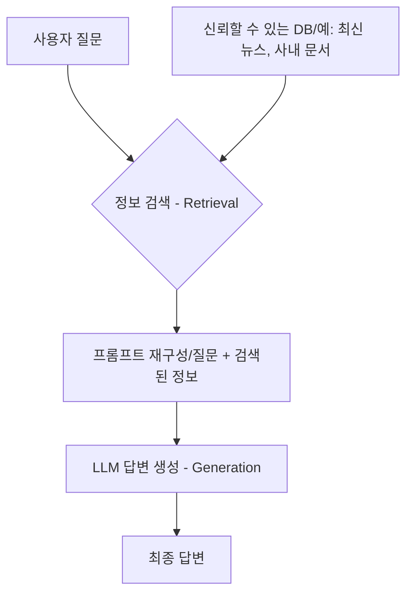

# 2. 생성형 AI의 그림자: 할루시네이션과 신뢰도 문제

## 목차
- [2. 생성형 AI의 그림자: 할루시네이션과 신뢰도 문제](#2-생성형-ai의-그림자-할루시네이션과-신뢰도-문제)
  - [목차](#목차)
  - [1. 할루시네이션: AI는 왜 거짓말을 하는가?](#1-할루시네이션-ai는-왜-거짓말을-하는가)
    - [원인 1: 잘못된 지식의 학습](#원인-1-잘못된-지식의-학습)
    - [원인 2: 확률적 단어 선택의 한계](#원인-2-확률적-단어-선택의-한계)
    - [원인 3: 최신 정보의 부재](#원인-3-최신-정보의-부재)
  - [2. 할루시네이션의 해결사: 검색 증강 생성 (RAG)](#2-할루시네이션의-해결사-검색-증강-생성-rag)
    - [RAG의 작동 원리: "오픈북 시험처럼"](#rag의-작동-원리-오픈북-시험처럼)
  - [3. 정보 보호와 저작권: 반드시 알아야 할 규칙](#3-정보-보호와-저작권-반드시-알아야-할-규칙)
    - [개인정보 및 기밀정보 유출](#개인정보-및-기밀정보-유출)
    - [저작권 문제](#저작권-문제)
---

## 1. 할루시네이션: AI는 왜 거짓말을 하는가?

**할루시네이션**은 생성형 AI가 사실에 근거하지 않은, 그럴듯한 허위 정보를 만들어내는 현상입니다. 이는 AI가 '생각'을 하는 것이 아니라, 훈련 데이터에 기반하여 **다음에 올 단어를 확률적으로 예측**하는 기계이기 때문에 발생합니다.

### 원인 1: 잘못된 지식의 학습

AI는 인터넷의 방대한 텍스트로 학습합니다. 인터넷에는 잘못된 정보, 편향된 의견, 심지어 소설까지 포함되어 있습니다. AI는 이것이 사실인지 아닌지 구분할 능력이 없으며, 그저 데이터에 나타난 패턴을 학습할 뿐입니다.
- **예시**: "세종대왕이 맥북을 던졌다"는 내용의 인터넷 밈(meme)이 많다면, AI는 이 둘의 연관성이 높다고 학습하여 관련 질문에 허위 사실을 생성할 수 있습니다.

### 원인 2: 확률적 단어 선택의 한계

AI는 문장을 생성할 때, 주어진 문맥 다음에 올 가장 '그럴듯한(확률적으로 자연스러운)' 단어를 선택합니다. 이 과정은 '사실'을 기반으로 하지 않기 때문에, 문맥상 자연스럽지만 사실이 아닌 내용으로 쉽게 빠질 수 있습니다.
- **예시**: "아인슈타인이 만든 가장 유명한 음식은?" 이라는 질문에, AI는 '아인슈타인'과 '유명한'이라는 키워드에 반응하여, "아인슈타인의 상대성 이론 파이" 와 같이 존재하지 않는 그럴듯한 답변을 지어낼 수 있습니다.

### 원인 3: 최신 정보의 부재

대부분의 거대 언어 모델(LLM)은 특정 시점까지의 데이터로만 학습됩니다. 따라서 그 이후에 발생한 사건이나 발견된 새로운 정보에 대해서는 알지 못하며, 이에 대해 질문하면 과거의 정보를 바탕으로 추측하거나 정보를 지어낼 수밖에 없습니다.

## 2. 할루시네이션의 해결사: 검색 증강 생성 (RAG)

할루시네이션을 완화하고 AI 답변의 신뢰도를 높이기 위한 가장 효과적인 기술 중 하나가 바로 **RAG(Retrieval-Augmented Generation)**  입니다.

### RAG의 작동 원리: "오픈북 시험처럼"

기존의 LLM이 아무런 참고자료 없이 자신의 '기억(학습된 가중치)'만으로 문제를 푸는 '클로즈북 시험'이라면, RAG는 **신뢰할 수 있는 외부 자료(오픈북)를 먼저 찾아보고, 그 내용을 바탕으로 답변을 생성**하는 방식입니다.

1.  **정보 검색 (Retrieval)** : 사용자의 질문이 들어오면, LLM은 먼저 **별도의 신뢰할 수 있는 데이터베이스(DB)**  (예: 최신 뉴스 기사, 기업 내부 문서, 특정 분야의 전문 자료 등)에서 질문과 관련된 정보를 검색합니다.
2.  **프롬프트 재구성 (Augmentation)** : 검색된 **'참고 자료'** 와 사용자의 **'원본 질문'** 을 결합하여, LLM에게 전달할 새로운 프롬프트(지시문)를 만듭니다.
    - 예: `(참고 자료: "2024년 노벨 물리학상은 OOO에게 수여되었다.")` + `(원본 질문: "올해 노벨 물리학상 수상자는 누구야?")`
3.  **답변 생성 (Generation)** : LLM은 이 풍부한 정보가 담긴 프롬프트를 바탕으로, **검색된 사실에 근거하여** 답변을 생성합니다.

> **RAG의 효과**: RAG를 통해 LLM은 자신의 기억에만 의존하지 않게 되므로, **최신 정보를 반영**할 수 있고, **사실에 기반한 답변**을 생성하게 되어 할루시네이션을 획기적으로 줄일 수 있습니다.

## 3. 정보 보호와 저작권: 반드시 알아야 할 규칙

### 개인정보 및 기밀정보 유출

- **위험성**: 사용자가 ChatGPT와 같은 외부 서비스에 입력하는 내용은 모델을 학습시키는 데 사용될 수 있습니다. 회사 기밀 정보, 고객 개인정보, 미공개 소스 코드 등을 입력하는 것은 심각한 정보 유출 사고로 이어질 수 있습니다.
- **대응책**:
    - **절대 민감 정보를 입력하지 마세요.**
    - 기업용으로 별도 계약된, 데이터가 학습에 사용되지 않는(non-training) 비공개 AI 서비스를 이용해야 합니다.

### 저작권 문제

- **AI 생성물의 저작권**: 현재 대부분의 국가(미국 포함)에서는 **인간의 창의적인 개입이 없는** 순수 AI 생성물에 대해서는 저작권을 인정하지 않습니다.
- **학습 데이터의 저작권**: AI가 저작권이 있는 데이터를 무단으로 학습하는 것에 대한 법적 논쟁이 계속되고 있습니다.
- **대응책**:
    - AI 생성물을 상업적으로 사용할 때는 법률 전문가의 검토가 필요할 수 있습니다.
    - AI를 '아이디어 발상 도구'나 '초안 작성 도구'로 활용하되, 최종 결과물에는 반드시 **자신의 창의적인 기여**를 담아야 합니다.
