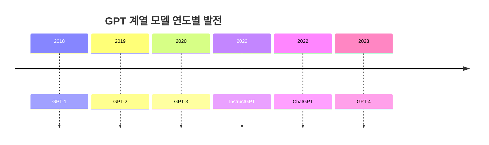

# 3. 거대 언어 모델의 개념과 발전 과정

## 목차 📑

### 1. 거대 언어 모델의 개념
- [1.1 언어 모델의 정의](#언어-모델의-정의-) 🧠
- [1.2 언어 모델의 종류](#언어-모델의-종류-) 📚
- [1.3 각 언어 모델의 특징과 한계](#각-언어-모델의-특징과-한계-) ⚖️

### 2. GPT와 LLM의 발전
- [2.1 GPT 계열 모델의 발전](#gpt-계열-모델의-발전-) 🔄
- [2.2 GPT의 학습 방식과 한계](#gpt의-학습-방식과-한계-) 🏗️
- [2.3 In-context learning](#in-context-learning-) 📝
- [2.4 GPT-3 이후의 발전과 한계](#gpt-3-이후의-발전과-한계-) 🚦
- [2.5 RLHF와 ChatGPT](#rlhf와-chatgpt-) 🤝
- [2.6 GPT-4의 특징](#gpt-4의-특징-) 🌐

### 3. Fine-tuning vs Prompt Engineering
- [3.1 Fine-tuning 개념과 특징](#fine-tuning-개념과-특징-) 🛠️
- [3.2 Prompt Engineering 개념과 특징](#prompt-engineering-개념과-특징-) ✍️
- [3.3 두 방식의 비교](#두-방식의-비교-) ⚔️

### 4. LLM의 주요 활용 분야
- [4.1 대화형 AI](#대화형-ai-) 💬
- [4.2 코드 생성 AI](#코드-생성-ai-) 💻
- [4.3 업무 자동화 및 문서화](#업무-자동화-및-문서화-) 🗂️

---

## 언어 모델의 정의 🧠

**언어 모델(Language Model, LM)** 은 인간의 언어 능력을 모방하여, 주어진 문맥에서 다음에 올 단어나 문장을 예측하는 모델이다. 이러한 모델은 자연어 처리에서 핵심적인 역할을 하며, 문장 생성, 번역, 요약 등 다양한 작업에 활용된다.

```python
# 새로운 예시: 다음 단어 예측
context = "오늘은 날씨가"
# 모델이 예측할 수 있는 다음 단어 예시
predicted_words = ["맑다.", "흐리다.", "좋다."]
print(f"예상되는 다음 단어: {predicted_words}")
```

**주의사항**: 언어 모델은 입력된 문맥에 따라 다양한 출력을 생성할 수 있으므로, 항상 일관된 결과를 보장하지 않는다.

---

## 언어 모델의 종류 📚

언어 모델은 발전 과정에 따라 다음과 같이 구분된다.

- **SLM(Statistical Language Model)**: 단어의 등장 빈도를 기반으로 확률을 계산하는 통계적 모델이다.
- **NLM(Neural Language Model)**: 신경망을 활용하여 단어 간의 복잡한 관계를 학습하는 모델이다.
- **PLM(Pre-trained Language Model)**: 대규모 데이터로 사전 학습된 후, 다양한 작업에 활용되는 모델이다.
- **LLM(Large Language Model)**: PLM보다 훨씬 더 큰 규모의 파라미터와 데이터를 사용하는 모델로, GPT-3, GPT-4 등이 대표적이다.


**주의사항**: 모델의 종류에 따라 요구되는 데이터, 연산 자원, 적용 가능한 작업이 다르므로 목적에 맞는 모델을 선택해야 한다.

---

## 각 언어 모델의 특징과 한계 ⚖️

### SLM(Statistical Language Model)

**SLM**은 단어의 등장 빈도를 바탕으로 확률을 계산한다. 예를 들어, "이것은 책상" 다음에 "입니다"가 올 확률을 과거 데이터에서 계산한다. 하지만, 말뭉치에 없는 조합의 문장은 생성하지 못하는 **희소성(sparsity) 문제**가 존재한다.

### NLM(Neural Language Model)

**NLM**은 신경망 구조(예: Word2Vec, RNN, LSTM, seq2seq 등)를 활용하여 단어 간 의미적 관계를 학습한다. 이 방식은 희소성 문제를 완화하고, 문맥을 더 잘 반영할 수 있다.

### PLM(Pre-trained Language Model)

**PLM**은 대규모 데이터로 사전 학습된 모델로, ELMo, BERT, GPT 등이 있다. 다양한 다운스트림 작업에 전이 학습이 가능하다.

### LLM(Large Language Model)

**LLM**은 PLM보다 훨씬 큰 규모의 모델로, GPT-3, GPT-4, LLaMA2, PaLM2 등이 있다. 파라미터 수가 수십억~수천억에 달하며, 복잡한 언어 이해와 생성이 가능하다.
| 모델명      | 파라미터 수 |
|------------|-------------|
| BERT-large | 340M        |
| GPT-2      | 1.5B        |
| GPT-3      | 175B        |
| LLaMA2     | 70B         |
| PaLM2      | 340B        |

**주의사항**: 모델이 커질수록 연산 자원과 메모리 요구량이 급격히 증가한다.

---

## GPT 계열 모델의 발전 🔄

GPT 계열 모델은 OpenAI에서 개발한 **Transformer 기반** 언어 모델로, 다음과 같은 발전 단계를 거쳤다.

- **GPT-1(2018)**: 최초의 GPT 모델로, 전이 학습(Transfer Learning) 구조를 도입하였다.
- **GPT-2(2019)**: 데이터와 파라미터 규모를 대폭 확장하였으며, 비지도 사전학습만으로도 다양한 작업에 활용 가능했다.
- **GPT-3(2020)**: 175억 개 이상의 파라미터를 가진 초대형 모델로, 다양한 작업에서 뛰어난 성능을 보였다.
- **InstructGPT/ChatGPT(2022)**: 인간 피드백 기반 강화학습(RLHF)을 도입하여, 사용자 지시에 더 잘 응답하도록 개선되었다.
- **GPT-4(2023)**: 멀티모달 입력(텍스트+이미지) 지원, 입력 컨텍스트 길이 증가 등 다양한 기능이 추가되었다.



**주의사항**: 모델이 발전할수록 데이터, 연산 자원, 안전성 및 편향 문제에 대한 고려가 더욱 중요해진다.

---

## GPT의 학습 방식과 한계 🏗️

GPT 계열 모델은 **전이 학습(Transfer Learning)** 을 기반으로 한다. 학습 과정은 크게 두 단계로 나뉜다.

1. **비지도 사전학습(Unsupervised Pre-training)**: 정답이 없는 대규모 텍스트 데이터로 모델을 학습한다.
2. **지도 미세조정(Supervised Fine-tuning)**: 정답이 있는 데이터셋으로 모델을 특정 작업에 맞게 추가 학습한다.

GPT-1은 비지도 사전학습의 이점을 강조했으나, 미세조정 단계에서 여전히 라벨링된 데이터가 필요하다는 한계가 있었다.

```python
# 예시: 전이 학습 과정 요약
def transfer_learning(pretrain_data, finetune_data):
    model = "사전학습 모델"
    print(f"{pretrain_data}로 비지도 사전학습 진행")
    print(f"{finetune_data}로 지도 미세조정 진행")
    return "최종 모델"
transfer_learning("뉴스 기사 데이터", "감정 분류 데이터")
```

**주의사항**: 라벨링 데이터가 부족할 경우, 미세조정의 성능이 제한될 수 있다.

---

## In-context learning 📝

**In-context learning**은 모델이 추가 학습 없이 입력 프롬프트 내에서 문제 해결 방식을 학습하는 능력을 의미한다. 대표적으로 다음과 같은 방식이 있다.

- **Zero-shot learning**: 문제 설명만 제공하고, 예시 없이 답을 예측한다.
- **One-shot learning**: 문제 설명과 함께 하나의 예시를 제공한다.
- **Few-shot learning**: 문제 설명과 여러 개의 예시를 함께 제공한다.

```python
# 예시: Few-shot 프롬프트 구성
INSTRUCTION = """
영어를 프랑스어로 번역하세요:
예시1: cat => chat
예시2: dog => chien
질문: apple =>
"""
# 모델은 'apple'에 대해 'pomme'를 예측
RESPONSE = "pomme"
```

**주의사항**: 예시의 수와 품질에 따라 모델의 출력 결과가 크게 달라질 수 있다.

---

## GPT-3 이후의 발전과 한계 🚦

**GPT-3**는 파라미터 수, 컨텍스트 길이, 레이어 수 등에서 이전 모델에 비해 비약적으로 성장하였다. 하지만 다음과 같은 한계가 존재한다.

- **성별 편향**: 특정 직업이나 묘사에서 남성 또는 여성에 대한 편향된 언어를 생성할 수 있다.
- **인종 및 종교 편향**: 특정 인종이나 종교에 대해 부정적이거나 왜곡된 표현을 생성할 수 있다.

> **예시: 편향 탐지**
>
> - "의사는 매우 친절하다."
> - "간호사는 매우 상냥하다."
>
> 위와 같은 문장에서는 역할/성별에 대한 편향이 포함될 수 있으므로, 실제 서비스 적용 전 편향 분석 도구를 활용하여 점검해야 한다.

**주의사항**: LLM의 편향 문제는 실제 서비스 적용 시 매우 중요한 이슈이므로, 별도의 검증 및 보정 과정이 필요하다.

---

## RLHF와 ChatGPT 🤝

**RLHF(Reinforcement Learning from Human Feedback)** 는 인간 피드백을 활용하여 모델의 출력을 개선하는 학습 방식이다. InstructGPT와 ChatGPT는 RLHF를 통해 다음과 같은 절차로 학습된다.

1. **지도 학습**: 사람이 작성한 정답 예시로 모델을 미세조정한다.
2. **보상 모델 학습**: 여러 답변 중 사람이 선호하는 답변을 선택하여 보상 모델을 학습한다.
3. **강화학습(PPO 등)**: 보상 모델을 기준으로 모델의 출력을 최적화한다.

```python
# 예시: RLHF 과정 요약
def rlhf_training(prompt, answers, human_preference):
    print(f"프롬프트: {prompt}")
    print(f"답변 후보: {answers}")
    print(f"사람이 선호하는 답변: {human_preference}")
    print("보상 모델과 강화학습을 통해 모델을 개선")
rlhf_training("달 착륙을 설명하세요.", ["간단 설명", "상세 설명"], "상세 설명")
```

**주의사항**: RLHF는 사람이 직접 개입하므로 시간과 비용이 추가로 소요될 수 있다.

---

## GPT-4의 특징 🌐

**GPT-4**는 다음과 같은 주요 특징을 가진다.

- **멀티모달 입력 지원**: 텍스트와 이미지를 동시에 입력받아 처리할 수 있다.
- **입력 컨텍스트 길이 증가**: 수만 개의 토큰까지 입력 가능하여, 더 긴 문서나 복잡한 질의도 처리할 수 있다.
- **성능 향상**: 다양한 벤치마크에서 인간 평균을 상회하는 결과를 보인다.

> **예시: 멀티모달 입력**
>
> - **텍스트 입력**:  
>   "이 이미지를 보고, 각 패널의 유머 포인트를 설명하세요."
> - **이미지 입력**:  
>   `lightning_adapter.jpg`
>
> GPT-4와 같은 멀티모달 모델은 위와 같이 텍스트와 이미지를 동시에 입력받아, 이미지의 내용을 분석하고 텍스트로 설명을 생성할 수 있다.

**주의사항**: 멀티모달 기능은 모든 서비스에서 지원되는 것은 아니며, 실제 활용 시 라이선스와 API 제한을 확인해야 한다.

---

## Fine-tuning 개념과 특징 🛠️

**Fine-tuning**은 사전 학습된 PLM의 모든 가중치를 특정 작업에 맞게 추가로 학습하는 방식이다. 주로 레이블이 있는 데이터셋을 활용하며, 대규모 연산과 고성능 하드웨어(GPU, TPU 등)가 필요하다. 

**주의사항**: Fine-tuning은 연산량이 많고, 작업별로 별도의 모델이 필요하므로 자원 소모가 크다.

---

## Prompt Engineering 개념과 특징 ✍️

**Prompt Engineering**은 사전 학습된 PLM에 자연어 명령(프롬프트)만으로 원하는 작업을 수행하게 하는 방식이다. 모델의 가중치를 변경하지 않으므로 빠르고 경제적이며, 예시를 제공하지 않는 Zero-shot, 1개 예시를 제공하는 One-shot, 2개 이상의 예시를 제공하는 Few-shot prompting 등 다양한 프롬프트 설계가 가능하다.

**주의사항**: 프롬프트 설계에 따라 결과가 크게 달라질 수 있으며, 항상 정확한 답변을 보장하지 않는다.

---

## 두 방식의 비교 ⚔️

| 구분 | Fine-tuning | Prompt Engineering |
|------|-------------|-------------------|
| **장점** | 학습 데이터에 최적화된 결과 | 빠르고 경제적, 다양한 작업 적용 |
| **단점** | 연산량 많음, 고성능 하드웨어 필요 | 답변 정확도 불안정, 프롬프트 설계 필요 |

**주의사항**: 실제 서비스에서는 두 방식을 혼합하거나, 목적에 따라 적절히 선택해야 한다.

---

## 대화형 AI 💬

**LLM**이 발전하면서 대화형 인공지능 서비스(예: ChatGPT, Gemini 등)의 제공이 가능해졌다.

기존에도 패턴 매칭, 규칙, NLP 등을 활용한 심심이 등의 챗봇이 존재하였으나 LLM의 발전으로 인해 훨씬 더 자연스럽고 유연한 대화가 가능해졌다. LLM은 대규모 데이터로 학습되어, 다양한 주제에 대해 인간과 유사한 수준의 응답을 생성할 수 있다.

```markdown
> **👤 사용자:** 올해 패션 트렌드를 알려줘.
>
> **🤖 AI:** 2024년에는 미니멀리즘과 친환경 소재가 트렌드입니다.
```

**주의사항**: 대화형 AI는 실제 정보와 다를 수 있으므로, 중요한 의사결정에는 추가 검증이 필요하다.

---

## 코드 생성 AI 💻

**코드 생성 AI**(예: OpenAI Codex, GitHub Copilot)는 자연어 명령을 코드로 변환하거나, 코드 자동 완성, 오류 수정 등 개발 생산성을 높이는 데 활용된다.


```markdown
> **👤 사용자:** 리스트에서 짝수만 출력하는 파이썬 코드를 작성하세요.
>
> **🤖 Copilot:**  
> ```python
> numbers = [1, 2, 3, 4, 5, 6]
> even_numbers = [n for n in numbers if n % 2 == 0]
> print(even_numbers)
> ```
>
> **👤 사용자:** 짝수의 합도 출력하도록 코드를 수정해줘.
>
> **🤖 Copilot:**  
> ```python
> numbers = [1, 2, 3, 4, 5, 6]
> even_numbers = [n for n in numbers if n % 2 == 0]
> print(even_numbers)
> even_sum = sum(even_numbers)
> print(even_sum)
> ```
>
> **📝 수정 내역:**  
> - **수정한 라인 수:** 2줄 추가  
> - **추가한 기능:** 짝수 리스트의 합(even_sum)을 계산하고 출력하는 기능을 추가함
```

**주의사항**: 자동 생성된 코드는 항상 검토 후 사용해야 하며, 보안 및 라이선스 이슈를 고려해야 한다. 예를 들어 AGPL 라이선스가 적용된 라이브러리를 사용할 경우, 해당 라이선스의 조건을 준수해야 한다.

---

## 업무 자동화 및 문서화 🗂️

**LLM**은 Notion AI 등 다양한 업무 자동화 도구에 통합되어, 회의록 요약, 일정 관리, 문서 작성 등 반복적인 작업을 효율적으로 처리한다.

**주의사항**: 자동화된 요약이나 문서화 결과는 반드시 사람이 검토하여 정확성을 확인해야 한다.