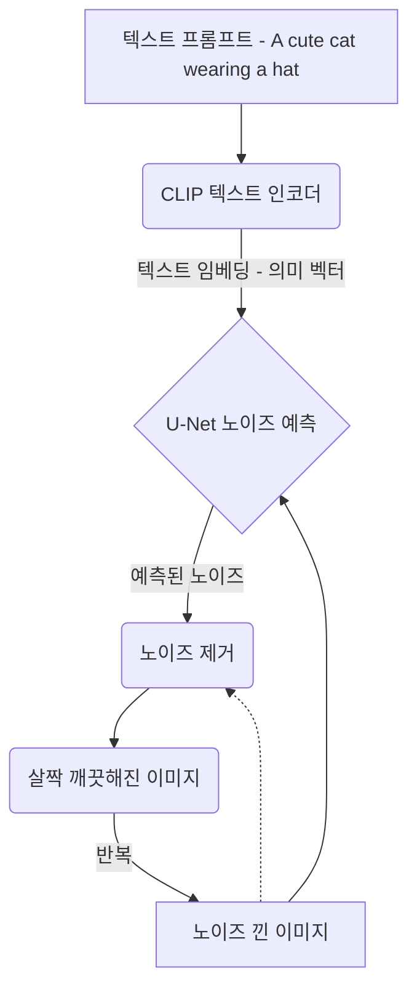

# 4. LLM과 이미지 생성 AI: 아이디어를 현실로 만드는 협업

## 목차
- [4. LLM과 이미지 생성 AI: 아이디어를 현실로 만드는 협업](#4-llm과-이미지-생성-ai-아이디어를-현실로-만드는-협업)
  - [목차](#목차)
  - [1. 이미지 생성 AI의 혁명: Diffusion 모델](#1-이미지-생성-ai의-혁명-diffusion-모델)
    - [Diffusion 모델의 핵심 원리: 노이즈에서 창조하기](#diffusion-모델의-핵심-원리-노이즈에서-창조하기)
  - [2. Text-to-Image: 어떻게 텍스트가 그림이 되는가?](#2-text-to-image-어떻게-텍스트가-그림이-되는가)
  - [3. 대표적인 이미지 생성 AI 서비스 비교](#3-대표적인-이미지-생성-ai-서비스-비교)
  - [4. 실전 프로젝트: LLM과 DALL-E를 연동한 '여행 컨셉 아트' 생성기](#4-실전-프로젝트-llm과-dall-e를-연동한-여행-컨셉-아트-생성기)
    - [1단계: LLM으로 창의적인 이미지 프롬프트 생성하기](#1단계-llm으로-창의적인-이미지-프롬프트-생성하기)
    - [2단계: 생성된 프롬프트로 DALL-E 이미지 생성하기](#2단계-생성된-프롬프트로-dall-e-이미지-생성하기)

---

## 1. 이미지 생성 AI의 혁명: Diffusion 모델

과거의 이미지 생성 모델(VAE, GAN)은 학습이 불안정하거나 생성된 이미지의 품질이 떨어지는 한계가 있었습니다. **Diffusion 모델**은 이 문제들을 해결하며 이미지 생성 분야의 게임 체인저가 되었습니다.

### Diffusion 모델의 핵심 원리: 노이즈에서 창조하기

1.  **Forward Process (노이즈 추가)** : 원본 이미지에 점진적으로 가우시안 노이즈를 추가하여, 최종적으로는 순수한 노이즈 이미지로 만듭니다. 이 과정은 정해진 규칙에 따라 진행됩니다.
2.  **Reverse Process (노이즈 제거)** : **핵심 단계**입니다. 신경망(주로 U-Net 구조)이 노이즈 이미지에서 원본 이미지를 복원하도록, 즉 **노이즈를 예측하고 제거하도록** 학습합니다. 이 '노이즈 제거' 과정을 반복하면, 완전한 랜덤 노이즈로부터 새로운 이미지를 창조해낼 수 있습니다.

## 2. Text-to-Image: 어떻게 텍스트가 그림이 되는가?

Diffusion 모델이 **텍스트 프롬프트**에 맞는 이미지를 생성하게 하려면, 이 '노이즈 제거' 과정에 텍스트 정보를 조건으로 주입해야 합니다.


- **CLIP (Contrastive Language-Image Pre-training)**  과 같은 모델이 텍스트 프롬프트를 숫자 벡터(임베딩)로 변환합니다.
- 이 텍스트 임베딩이 U-Net의 **Cross-Attention** 레이어를 통해, 노이즈를 예측하는 모든 단계에 '가이드라인'으로 작용합니다.
- 결과적으로 모델은 **"이 텍스트의 의미에 부합하도록 노이즈를 제거해라"**  라는 지시를 따르게 되어, 프롬프트에 맞는 이미지를 생성합니다.

## 3. 대표적인 이미지 생성 AI 서비스 비교

| 서비스 | 개발사 | 특징 | 추천 대상 |
| :--- | :--- | :--- | :--- |
| **DALL-E** | OpenAI | ChatGPT와 통합, 프롬프트 이해 능력이 매우 뛰어남, 사용이 간편함 | 초보자, ChatGPT 유료 사용자, 자연어 프롬프트 선호 |
| **Midjourney** | Midjourney, Inc. | 특정 스타일(예: 판타지, 실사풍)의 고품질 이미지 생성에 강점, Discord 기반 | 아티스트, 디자이너, 특정 스타일 선호 |
| **Stable Diffusion** | Stability AI | **오픈소스**, 모델 커스터마이징/파인튜닝 가능, 로컬 환경에 설치 가능 | 개발자, 연구자, 자신만의 모델을 만들고 싶은 사용자 |

## 4. 실전 프로젝트: LLM과 DALL-E를 연동한 '여행 컨셉 아트' 생성기

LLM을 '아이디어 기획자'로, DALL-E를 '컨셉 아티스트'로 활용하는 파이프라인을 만들어 봅시다.

### 1단계: LLM으로 창의적인 이미지 프롬프트 생성하기

사용자로부터 간단한 여행 키워드를 받아, DALL-E가 그림을 잘 그릴 수 있도록 상세하고 창의적인 **이미지 생성용 프롬프트**를 LLM이 만들게 합니다.

```python
import openai
import os

# client = openai.OpenAI(api_key="YOUR_OPENAI_API_KEY")

def create_image_prompt(user_input):
    system_prompt = """
    당신은 세계 최고의 여행 컨셉 아티스트를 위한 프롬프트 엔지니어입니다.
    사용자의 간단한 여행 키워드를 받으면, DALL-E가 환상적인 컨셉 아트를 그릴 수 있도록,
    매우 상세하고, 감성적이며, 시각적으로 풍부한 영어 프롬프트를 한 문장으로 생성해야 합니다.
    프롬프트에는 장소, 시간대, 분위기, 화풍(예: oil painting, cinematic, photorealistic)이 반드시 포함되어야 합니다.
    """
    
    response = client.chat.completions.create(
        model="gpt-4",
        messages=[
            {"role": "system", "content": system_prompt},
            {"role": "user", "content": user_input}
        ]
    )
    return response.choices[0].message.content

# 사용자가 '겨울밤의 파리'라는 키워드를 입력
travel_keyword = "겨울밤의 파리"
dalle_prompt = create_image_prompt(travel_keyword)

print("--- LLM이 생성한 DALL-E 프롬프트 ---")
print(dalle_prompt)
```

### 2단계: 생성된 프롬프트로 DALL-E 이미지 생성하기

1단계에서 LLM이 생성한 상세 프롬프트를 DALL-E API에 전달하여 이미지를 생성합니다.

```python
from IPython.display import Image, display

def generate_image_with_dalle(prompt):
    response = client.images.generate(
        model="dall-e-3",
        prompt=prompt,
        size="1024x1024",
        quality="standard",
        n=1,
    )
    image_url = response.data[0].url
    return image_url

# LLM이 만든 프롬프트로 이미지 생성
image_url = generate_image_with_dalle(dalle_prompt)

print("\n--- 생성된 이미지 ---")
display(Image(url=image_url))
```
