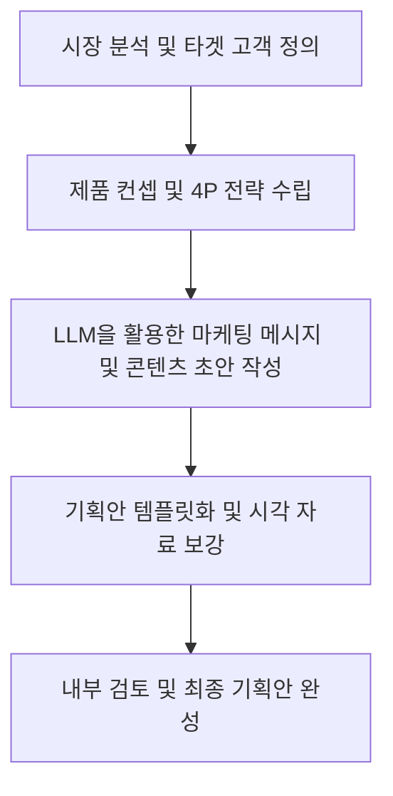

# 1. 언어모델을 활용한 기획서 작성 📝

## 목차 📑

### 1. 언어모델을 활용한 기획서 작성 📝
- [1. 언어모델을 활용한 기획서 작성 📝](#1-언어모델을-활용한-기획서-작성-)
  - [목차 📑](#목차-)
    - [1. 언어모델을 활용한 기획서 작성 📝](#1-언어모델을-활용한-기획서-작성--1)
  - [기획안 작성 프로세스 및 언어모델 활용 🤖](#기획안-작성-프로세스-및-언어모델-활용-)
  - [최신 트렌드 및 성공 사례 분석 📊](#최신-트렌드-및-성공-사례-분석-)
  - [핵심 전략 및 실행 방안 🚀](#핵심-전략-및-실행-방안-)
  - [기획안 템플릿 및 스토리텔링 기법 📝](#기획안-템플릿-및-스토리텔링-기법-)
  - [결론 🌟](#결론-)

---

## 기획안 작성 프로세스 및 언어모델 활용 🤖

**언어모델 활용법**:  
1. 역할 부여(예: 신제품 출시 전략가)로 맥락 맞춤형 답변 유도
```json
{"role": "system", "content": "You are a new product launch strategist specializing in the cosmetics industry."}
```
- 5W1H(Who, What, When, Where, Why, How) 구조로 논리적 기획안 작성  
- 다양한 포맷(목록, 표 등)과 톤(논리적, 감성적, 유머러스 등) 조절 가능  
- 하이퍼파라미터(temperature 등)로 답변 스타일 세밀 조정  
- 템플릿 구조화 및 코드블록 활용으로 복사·편집 용이
```json
{
  "role": "user", 
  "content": "Create a launch plan for a new eco-friendly cosmetic product. Your plan should follow the 4P (Product, Price, Place, Promotion) structure and include visual elements like tables and bullet points. Your tone should be professional and persuasive. Format your response in a code block for easy copying and that response should follow the example below."
}
```



---

## 최신 트렌드 및 성공 사례 분석 📊

- **정보 한계**: LLM에게는 cutoff knowledge가 있어 최신 정보는 반영되지 않음
> cutoff knowledge란? : LLM이 학습한 데이터의 최신 시점 이후의 정보는 반영되지 않는 한계를 의미합니다.
- **성공 사례**:  
  - 러쉬(Lush)의 친환경 캠페인, 이솝(Aesop)의 감성 브랜딩, 올리브영·세포라 등 뷰티 플랫폼  
  - 주요 성과 지표: 신제품 판매량, 브랜드 인지도, 고객 생애 가치(CLV) 등  
- **트렌드**:  
  - 클린 뷰티·비건 뷰티에 대한 관심 증가  
  - 가치 소비(친환경, 윤리적 생산) 확산  
  - 데이터 기반 개인 맞춤형 화장품 시장 성장

---

## 핵심 전략 및 실행 방안 🚀

- **온·오프라인 연계 친환경 캠페인**  
  - 친환경 패키지 및 리필 스테이션 운영  
  - 인스타그램·유튜브에서 '#가치소비' 챌린지, 뷰티 인플루언서·UGC 활용  
  - 온라인 구매 시 오프라인 매장 체험 쿠폰 제공  
- **고객 충성도 프로그램**  
  - 공병 수거 시 포인트 제공, 친환경 활동 인증 시 할인 혜택  
- **실행 방안**  
  - 성분·효능 중심의 정보성 콘텐츠 제작  
  - 온·오프라인 판매 데이터 통합 분석 및 재고 관리 최적화  
  - KPI(판매량, 재구매율, 캠페인 참여율 등) 지속 모니터링

---

## 기획안 템플릿 및 스토리텔링 기법 📝

- **기획안 템플릿 주요 항목**:  
  - 개요(목적, 배경, 문제 정의)  
  - 목표(SMART, KPI)  
  - 타깃 분석(고객 특성, 시장/경쟁 분석)  
  - 전략 및 실행계획(세부 실행안, 일정, 리소스)  
  - 기대 효과 및 결론  
- **스토리텔링 구조**:  
  1. 문제 제기(공감 유도)  
  2. 해결책 제안(영웅처럼 등장)  
  3. 감정적 연결고리  
  4. 데이터·사례로 뒷받침  
  5. 비전 제시  
- **LLM 활용법**:  
  - 중간 결과물 확인 및 수정 요청  
  - 예시·표·목록 등 다양한 형식 요청 가능  
  - 피드백 반복으로 맞춤형 문서 완성

---

## 결론 🌟

- **결론 및 권장 사항**:  
  - 제안 전략은 데이터 기반 실행 및 실시간 피드백으로 지속 개선  
  - LLM 등 생성형 AI 도구의 적극 활용과 추가 검증 병행  
  - 세부 일정과 리소스 확보 후 단계별 실행 권장