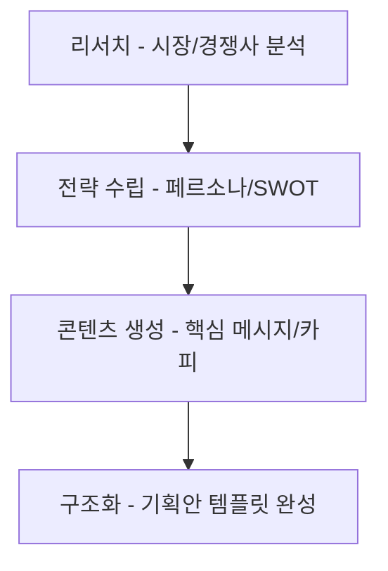

# 1. LLM을 내 전략가로 만들기: 기획서 작성 자동화

## 목차
- [1. LLM을 내 전략가로 만들기: 기획서 작성 자동화](#1-llm을-내-전략가로-만들기-기획서-작성-자동화)
  - [목차](#목차)
  - [1. 기획서 작성, LLM과 함께하는 새로운 방식](#1-기획서-작성-llm과-함께하는-새로운-방식)
  - [2. 1단계 (리서치): 시장 및 경쟁사 분석 자동화](#2-1단계-리서치-시장-및-경쟁사-분석-자동화)
  - [3. 2단계 (전략 수립): 타겟 페르소나 및 SWOT 분석](#3-2단계-전략-수립-타겟-페르소나-및-swot-분석)
      - [타겟 페르소나 생성](#타겟-페르소나-생성)
      - [SWOT 분석](#swot-분석)
  - [4. 3단계 (콘텐츠 생성): 핵심 메시지 및 마케팅 카피 제작](#4-3단계-콘텐츠-생성-핵심-메시지-및-마케팅-카피-제작)
  - [5. 4단계 (구조화): 전체 기획안 템플릿 완성](#5-4단계-구조화-전체-기획안-템플릿-완성)

---

## 1. 기획서 작성, LLM과 함께하는 새로운 방식

LLM은 기획서 작성의 전 과정을 획기적으로 단축하고, 결과물의 질을 높일 수 있습니다.

우리는 각 단계별로 특화된 프롬프트를 사용하여 LLM의 능력을 최대한 활용할 것입니다.

## 2. 1단계 (리서치): 시장 및 경쟁사 분석 자동화

LLM은 방대한 데이터를 학습했기 때문에, 특정 산업의 트렌드나 경쟁 구도를 빠르게 요약하고 분석하는 데 매우 유용합니다. (단, 최신 정보는 RAG 기능이 있는 모델을 활용해야 합니다.)

> **[시장 분석 프롬프트 예시]**
>
> **페르소나**: 당신은 20년 경력의 시장 분석 전문가입니다.
>
> **작업**: 2024년 대한민국 20대 여성을 위한 '비건 뷰티' 시장의 최신 트렌드 3가지를 분석하고, 각 트렌드에 대한 근거를 제시해주세요.
>
> **형식**: 각 트렌드를 불렛 포인트로 요약하고, 근거는 그 하위에 작성해주세요.

## 3. 2단계 (전략 수립): 타겟 페르소나 및 SWOT 분석

리서치 결과를 바탕으로, 더 구체적인 전략을 수립합니다.

#### 타겟 페르소나 생성

- **목표**: 우리의 핵심 고객을 구체적인 한 사람의 '페르소나'로 정의하여, 팀 전체가 동일한 고객상을 공유하게 합니다.

> **[페르소나 생성 프롬프트 예시]**
>
> **페르소나**: 당신은 사용자의 행동 패턴을 분석하여 가상의 인물을 만드는 UX 리서처입니다.
>
> **맥락**: 우리의 타겟 고객은 '서울에 거주하는 20대 중반의 여성으로, SNS를 활발히 사용하며, 가치 소비와 비건 뷰티에 관심이 많은 대학원생'입니다.
>
> **작업**: 위 맥락을 바탕으로, 이 타겟 고객의 구체적인 페르소나를 이름, 나이, 직업, 라이프스타일, 소비 패턴, 고민, 목표 등을 포함하여 상세하게 묘사해주세요.

#### SWOT 분석

- **목표**: 우리의 강점(Strength), 약점(Weakness), 기회(Opportunity), 위협(Threat) 요인을 체계적으로 분석하여 전략의 방향을 설정합니다.

> **[SWOT 분석 프롬프트 예시]**
>
> **페르소나**: 당신은 신제품 런칭을 앞둔 스타트업의 전략 컨설턴트입니다.
>
> **맥락**: 우리는 '친환경 성분'과 '감성적인 패키지 디자인'을 강점으로 가진 비건 뷰티 브랜드를 런칭하려고 합니다. 하지만 '브랜드 인지도'가 낮고 '유통 채널'이 부족한 약점이 있습니다. 현재 '클린 뷰티 시장'이 성장하고 있다는 기회가 있지만, '대기업들의 시장 진입'이라는 위협도 존재합니다.
>
> **작업**: 위 맥락을 바탕으로, 우리 브랜드의 SWOT 분석을 Markdown 테이블 형식으로 정리해주세요.

## 4. 3단계 (콘텐츠 생성): 핵심 메시지 및 마케팅 카피 제작

수립된 전략을 바탕으로, 고객의 마음을 움직일 수 있는 구체적인 콘텐츠를 생성합니다.

> **[마케팅 카피 생성 프롬프트 예시]**
>
> **페르소나**: 당신은 애플(Apple)과 같은 혁신적인 브랜드의 광고 문구를 만들어 온 전설적인 카피라이터입니다.
>
> **맥락**: 우리의 제품은 '자연 유래 성분으로 만든 비건 립밤'이며, 타겟 고객은 '자신의 신념을 소비로 표현하고자 하는 20대 여성'입니다.
>
> **작업**: 위 맥락을 바탕으로, 우리 제품의 인스타그램 광고에 사용할 핵심 캐치프레이즈를 5가지 제안해주세요. 짧고, 감성적이며, 강력한 메시지를 담아야 합니다.

## 5. 4단계 (구조화): 전체 기획안 템플릿 완성

지금까지 생성한 모든 내용을 바탕으로, LLM에게 전체 기획서의 구조를 잡고 초안을 작성하게 합니다.

> **[기획안 초안 작성 프롬프트 예시]**
>
> **페르소나**: 당신은 투자자에게 발표할 사업 계획서를 작성하는 전문 기획자입니다.
>
> **작업**: 아래 [내용]들을 조합하여, '신규 비건 뷰티 브랜드 런칭 사업 계획서'의 전체 초안을 작성해주세요.
>
> **형식**:
> 1.  **개요**: 사업 목표 및 배경
> 2.  **시장 분석**: 시장 트렌드 및 기회
> 3.  **타겟 고객**: 상세 페르소나
> 4.  **제품 및 전략**: SWOT 분석 및 4P 전략
> 5.  **마케팅 실행 방안**: 핵심 메시지 및 광고 카피
> 6.  **기대 효과**: 예상 성과 및 비전
>
> **[내용]**
> - (2단계에서 생성한 시장 분석 결과 붙여넣기)
> - (3단계에서 생성한 페르소나 및 SWOT 분석 결과 붙여넣기)
> - (4단계에서 생성한 마케팅 카피 붙여넣기)
> - ...
