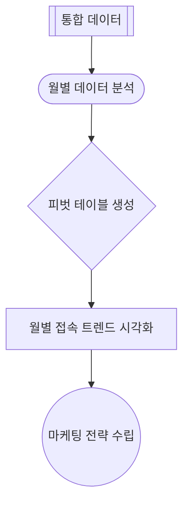

# 3. 언어모델과 엑셀 및 VBA를 활용한 자동화 📝

## 목차 📑

- [3. 언어모델과 엑셀 및 VBA를 활용한 자동화 📝](#3-언어모델과-엑셀-및-vba를-활용한-자동화-)
  - [목차 📑](#목차-)
  - [데이터 자동화 및 시각화 개요 🚀](#데이터-자동화-및-시각화-개요-)
  - [엑셀 VBA를 활용한 데이터 통합 🛠️](#엑셀-vba를-활용한-데이터-통합-️)
  - [자동화 과정과 코드 개선 🔄](#자동화-과정과-코드-개선-)
    - [헤더/클립보드/형식 문제 해결](#헤더클립보드형식-문제-해결)
    - [MacOS 등 환경별 유의사항](#macos-등-환경별-유의사항)
  - [월별 데이터 분석 및 시각화 📊](#월별-데이터-분석-및-시각화-)
  - [마케팅/캠페인 전략 수립 및 제안 📈](#마케팅캠페인-전략-수립-및-제안-)

---

## 데이터 자동화 및 시각화 개요 🚀

엑셀 VBA를 활용해 여러 연도의 웹사이트 트래픽 분석 데이터 파일(.xlsx)을 자동으로 통합하고, 피벗테이블 및 그래프 생성까지 자동화한다. 반복적이고 오류가 잦은 수작업을 최소화하여, 데이터 기반 의사결정과 전략 수립에 활용한다.



---

## 엑셀 VBA를 활용한 데이터 통합 🛠️

여러 개별 엑셀 파일(.xlsx)을 하나의 통합 파일로 자동으로 합치는 절차를 단계별로 안내한다.

| 기술             | 설명                                                             | 활용 사례             |
|------------------|------------------------------------------------------------------|-----------------------|
| **피벗 테이블**  | 대용량 데이터를 요약, 분석, 탐색하여 패턴과 추세 파악            | 월별 접속자 수 집계   |
| **VBA 차트 생성**| 분석된 데이터를 기반으로 막대/선 그래프 등 시각 자료 자동 생성   | 트렌드 시각화 보고    |
| **조건부 서식**  | 특정 조건(예: 평균 이상)을 만족하는 셀을 시각적으로 강조         | 주요 데이터 강조      |

---

## 자동화 과정과 코드 개선 🔄

### 헤더/클립보드/형식 문제 해결

- 첫 번째 파일만 헤더를 복사, 이후 파일은 데이터만 복사하도록 VBA 코드 수정
- 클립보드 관련 메시지(“클립보드의 내용을 나중에 붙여넣으시겠습니까?”)가 반복적으로 출력되는 문제를, 배열 직접 처리 방식으로 해결
- 날짜·시간 컬럼이 숫자로 변환되는 문제는 PasteSpecial 옵션(xlPasteValuesAndNumberFormats)으로 해결
- 각 파일의 헤더(첫 행)를 연한 회색, 굵은 글씨로 강조하는 자동화 코드 구현

```python
# 데이터 정제 및 전처리 예시
import pandas as pd

def preprocess_data(df):
    # 실제 VBA에서는 데이터 타입을 직접 확인하고 변환
    df['방문일'] = pd.to_datetime(df['방문일'])
    df['방문요일'] = df['방문일'].dt.day_name()
    return df

# VBA에서 날짜 형식 변환 예시
# Range("A2").NumberFormat = "yyyy-mm-dd"
```

### MacOS 등 환경별 유의사항

- MacOS에서도 VBA 활용 가능하나 일부 기능 제한(ActiveX 등) 존재
- .xlsm 형식(매크로 포함)으로 파일 저장 필요(.xlsx는 VBA 코드 저장 불가)
- 데이터 형식(날짜 등) 통일 필요, OS별 차이 확인 권장

> 💡 **참고**: 코드 개선 및 자동화 과정에서 ChatGPT 등 AI 도구의 도움을 받을 수 있습니다.

---

## 월별 데이터 분석 및 시각화 📊

엑셀 VBA 및 피벗테이블을 활용해 월별 데이터를 분석하고 시각화를 자동화한다.

```python
import pandas as pd

# 웹사이트 트래픽 데이터 예시
df = pd.DataFrame({
    '날짜': pd.to_datetime(['2023-01-10', '2023-01-25', '2023-02-05', '2023-02-20']),
    '페이지뷰': [1500, 1800, 2100, 2000],
    '순방문자': [800, 950, 1100, 1050]
})
df['월'] = df['날짜'].dt.month

# 월별 평균 트래픽 집계
monthly_traffic = df.groupby('월').agg({'페이지뷰': 'mean', '순방문자': 'mean'}).reset_index()
print(monthly_traffic)
```

- 날짜 데이터에서 '월' 정보를 추출하여 월별 분석을 수행하는 VBA 코드 구현
- 월별 평균 페이지뷰, 순방문자 수를 계산하는 피벗 테이블 및 추이 그래프 자동 생성
- 전체 트래픽, 월별 합계, 평균 등 다양한 통계 지표 제공
- 피벗 차트의 축 서식, 데이터 레이블 등 시각화 세부 기능은 추가 작업 필요

---

## 마케팅/캠페인 전략 수립 및 제안 📈

웹사이트 트래픽 분석 결과를 바탕으로, 방문자 수가 많은 시기에 맞춘 콘텐츠 마케팅 및 SEO 강화 전략을 제안한다.

> 💡 **고급 기능**:
> - **콘텐츠 개인화**: 방문자 행동 데이터(체류 시간, 조회 페이지) 기반 맞춤형 콘텐츠 제공
> - **랜딩 페이지 최적화(LPO)**: A/B 테스트를 통해 전환율이 높은 페이지 디자인 및 문구 발굴
> - **재방문 유도 캠페인**: 이탈률이 높은 페이지 분석 및 개선, 이메일/푸시 알림 활용

- 데이터 분석 및 시각화 자동화로 업무 효율성 극대화
- 주요 타겟 고객의 유입 경로 및 검색 키워드 트렌드 반영
- 장기적 방문자 충성도 확보 및 이탈률 감소 대응
- 피벗테이블 및 그래프 자동화로 데이터 기반 전략 수립 지원
> - **재방문 유도 캠페인**: 이탈률이 높은 페이지 분석 및 개선, 이메일/푸시 알림 활용

- 데이터 분석 및 시각화 자동화로 업무 효율성 극대화
- 주요 타겟 고객의 유입 경로 및 검색 키워드 트렌드 반영
- 장기적 방문자 충성도 확보 및 이탈률 감소 대응
- 피벗테이블 및 그래프 자동화로 데이터 기반 전략 수립 지원
