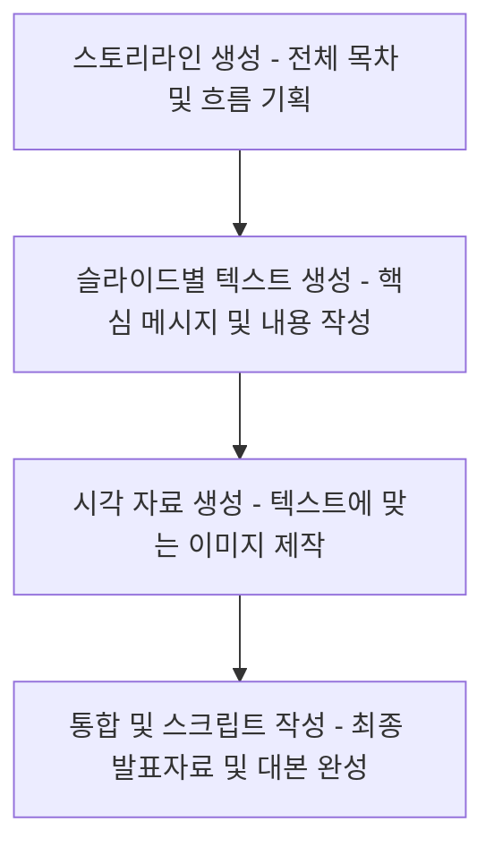

# 4. LLM으로 발표자료 만들기: 스토리텔링부터 시각화까지

## 목차
- [4. LLM으로 발표자료 만들기: 스토리텔링부터 시각화까지](#4-llm으로-발표자료-만들기-스토리텔링부터-시각화까지)
  - [목차](#목차)
  - [1. 발표자료 제작의 새로운 패러다임](#1-발표자료-제작의-새로운-패러다임)
  - [2. 1단계 (기획): 발표의 뼈대 세우기 (스토리라인 생성)](#2-1단계-기획-발표의-뼈대-세우기-스토리라인-생성)
  - [3. 2단계 (텍스트 작성): 각 슬라이드의 핵심 메시지 생성](#3-2단계-텍스트-작성-각-슬라이드의-핵심-메시지-생성)
  - [4. 3단계 (시각화): 슬라이드를 위한 이미지 생성](#4-3단계-시각화-슬라이드를-위한-이미지-생성)
  - [5. 4단계 (완성): 전체 내용 통합 및 발표 스크립트 작성](#5-4단계-완성-전체-내용-통합-및-발표-스크립트-작성)


---

## 1. 발표자료 제작의 새로운 패러다임

LLM을 활용하면, 발표자료 제작 과정을 다음과 같이 체계적으로 자동화할 수 있습니다.



## 2. 1단계 (기획): 발표의 뼈대 세우기 (스토리라인 생성)

가장 먼저, 발표의 전체적인 구조와 논리적 흐름을 잡아야 합니다.

> **[스토리라인 생성 프롬프트 예시]**
>
> **페르소나**: 당신은 청중의 몰입을 이끌어내는 스토리텔링 전문가입니다.
>
> **맥락**: '신규 서비스 런칭'을 주제로, 투자자들을 대상으로 15분간 발표를 할 예정입니다. 발표의 목표는 투자를 유치하는 것입니다.
>
> **작업**: 위 상황에 맞춰, 설득력 있는 발표의 전체 스토리라인(목차)을 10개의 슬라이드 제목으로 제안해주세요. 각 슬라이드 제목에는 어떤 핵심 내용이 들어가야 하는지도 한 문장으로 요약해주세요.
>
> **형식**:
> - 슬라이드 1: [제목] - [핵심 내용]
> - 슬라이드 2: [제목] - [핵심 내용]
> ...

## 3. 2단계 (텍스트 작성): 각 슬라이드의 핵심 메시지 생성

전체 뼈대가 잡혔다면, 이제 각 슬라이드를 채울 구체적인 텍스트 콘텐츠를 생성합니다.

> **[슬라이드 텍스트 생성 프롬프트 예시]**
>
> **페르소나**: 당신은 간결하고 명확한 메시지를 전달하는 커뮤니케이션 전문가입니다.
>
> **맥락**: 이전 단계에서 생성된 발표 스토리라인 중, 4번째 슬라이드인 **"시장 문제점 분석: 고객들은 무엇을 불편해하는가?"**  에 들어갈 내용을 작성하려고 합니다.
>
> **작업**: 위 슬라이드의 핵심 메시지를, **3개의 핵심 불렛 포인트**로 작성해주세요. 각 포인트는 20단어 이내로 간결해야 하며, 데이터에 기반한 문제점을 명확히 제시해야 합니다.

## 4. 3단계 (시각화): 슬라이드를 위한 이미지 생성

텍스트만으로는 청중의 시선을 사로잡기 어렵습니다. 각 슬라이드의 핵심 메시지를 시각적으로 전달할 수 있는 이미지를 생성형 AI로 만듭니다.

> **[이미지 생성 프롬프트 예시]**
>
> **페르소나**: 당신은 복잡한 개념을 하나의 이미지로 표현하는 전문 일러스트레이터입니다.
>
> **맥락**: 발표자료의 "시장 문제점 분석" 슬라이드에 들어갈 이미지입니다. 슬라이드의 핵심 메시지는 "기존 서비스들은 너무 복잡하고, 사용자들이 원하는 기능을 찾기 위해 미로 속을 헤매고 있다"는 것입니다.
>
> **작업**: 위 맥락을 시각적으로 표현하는 컨셉 아트를 생성하기 위한 **상세한 영어 프롬프트**를 작성해주세요.
>
> **[프롬프트에 포함될 요소]**
> - **주요 객체**: 정장을 입은 비즈니스맨이 거대한 미로 속에서 길을 잃고 혼란스러워하는 모습.
> - **분위기**: 어둡고, 답답하며, 약간의 좌절감이 느껴지는 분위기.
> - **스타일**: 미니멀리즘 스타일의 디지털 일러스트레이션.
> - **색상**: 회색과 파란색 톤을 주로 사용하고, 출구를 암시하는 희미한 노란색 빛을 추가.

```python
# 위 프롬프트를 LLM에 입력하여 DALL-E용 프롬프트를 생성
# dalle_prompt = "A minimalist digital illustration of a businessman in a suit, looking lost and confused inside a giant, complex maze. The atmosphere is dark and frustrating, with a color palette of grays and blues, highlighted by a faint yellow light in the distance suggesting an exit."

# 생성된 프롬프트로 이미지 생성 (DALL-E API 호출)
# image_url = generate_image_with_dalle(dalle_prompt)
```

## 5. 4단계 (완성): 전체 내용 통합 및 발표 스크립트 작성

모든 텍스트와 이미지가 준비되었다면, 이를 실제 발표자료 툴(파워포인트, 키노트 등)에 옮기고, 마지막으로 발표 대본(스크립트)을 작성합니다.

> **[발표 스크립트 작성 프롬프트 예시]**
>
> **페르소나**: 당신은 스티브 잡스처럼 청중을 사로잡는 프레젠테이션의 대가입니다.
>
> **맥락**: 아래는 나의 발표자료 4번 슬라이드의 핵심 내용과 이미지입니다. 이 슬라이드에서 약 1분 30초 동안 발표할 예정입니다.
>
> **[슬라이드 내용]**
> - (3단계에서 생성한 텍스트 불렛 포인트 붙여넣기)
> - (4단계에서 생성한 이미지에 대한 설명 붙여넣기)
>
> **작업**: 위 내용을 바탕으로, 청중의 공감을 얻고 문제의 심각성을 효과적으로 전달할 수 있는 흡입력 있는 발표 스크립트를 작성해주세요.

