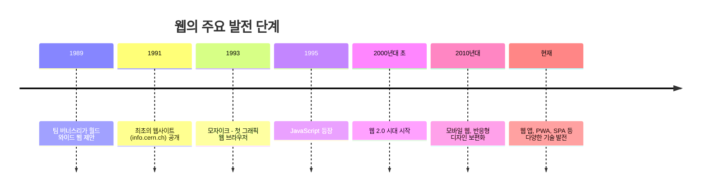
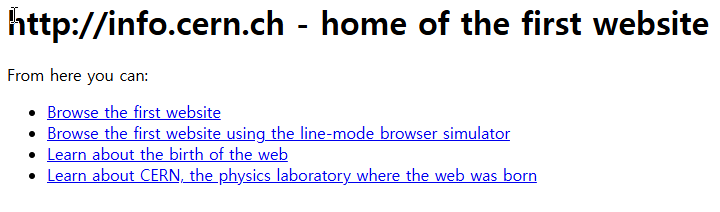
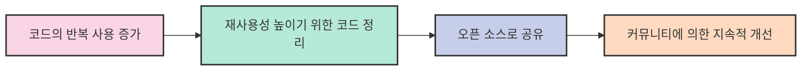
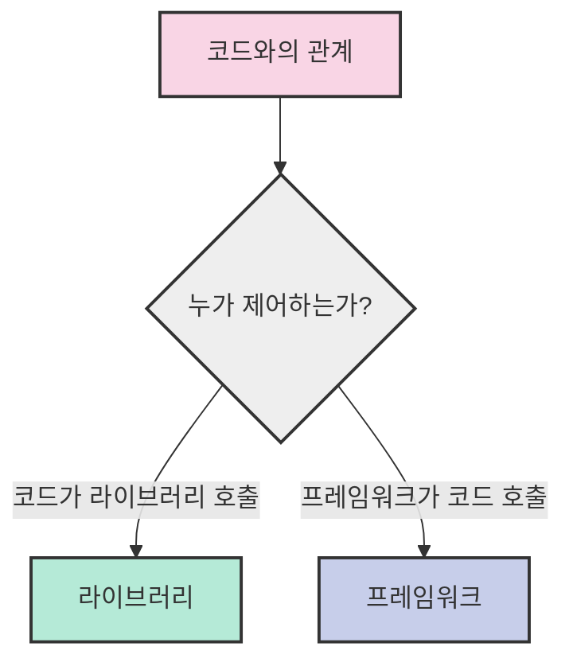

# 4. 라이브러리와 프레임워크 📚

## 목차
- [4. 라이브러리와 프레임워크 📚](#4-라이브러리와-프레임워크-)
  - [목차](#목차)
  - [웹의 역사: 웹 프로그래밍의 발전 과정 🌐](#웹의-역사-웹-프로그래밍의-발전-과정-)
    - [웹의 탄생](#웹의-탄생)
    - [현대 웹 개발의 특징](#현대-웹-개발의-특징)
  - [라이브러리 📦](#라이브러리-)
    - [라이브러리의 탄생 과정](#라이브러리의-탄생-과정)
    - [대표적인 라이브러리 예시](#대표적인-라이브러리-예시)
      - [Chart.js (JavaScript 차트 라이브러리)](#chartjs-javascript-차트-라이브러리)
      - [기타 유명한 라이브러리들](#기타-유명한-라이브러리들)
    - [라이브러리를 사용하는 이유](#라이브러리를-사용하는-이유)
    - [라이브러리와 API의 비교](#라이브러리와-api의-비교)
  - [프레임워크 🏗️](#프레임워크-️)
    - [프레임워크의 특징](#프레임워크의-특징)
    - [주요 프레임워크 살펴보기](#주요-프레임워크-살펴보기)
      - [Django (Python 웹 프레임워크)](#django-python-웹-프레임워크)
      - [기타 유명한 프레임워크들](#기타-유명한-프레임워크들)
    - [라이브러리 vs 프레임워크](#라이브러리-vs-프레임워크)

---

## 웹의 역사: 웹 프로그래밍의 발전 과정 🌐

### 웹의 탄생

CERN의 물리학자였던 **팀 버너스리 경(Sir Tim Berners-Lee)** 은 현재의 www(월드 와이드 웹)을 창시하였고, HTML, CSS, HTTP 통신, URL 등 현대 웹의 기반 기술을 개발하였다. 태초의 웹은 연구자들간의 자료 공유를 위한 목적이었지만, 이후 대중에게 무료로 공개되었다.





*그림 2: 세계 최초의 웹사이트 info.cern.ch를 복원한 모습*

### 현대 웹 개발의 특징

현대에 들어 웹 개발은 점점 복잡해지고 있으며, 다음과 같은 특징을 가지고 있다:

| 특징 | 설명 | 영향 |
|------|------|------|
| **코드 재사용성** | 코드들이 반복적으로 자주 사용됨 | 객체지향 프로그래밍(OOP)의 핵심 개념인 *재사용성*이 중요해짐 |
| **협업 중심** | 프로젝트들이 **협업**으로 진행됨 | 코드 관리와 버전 관리의 중요성 증가 |
| **구조화된 개발** | **Enterprise Style**의 코드 작성이 필요해짐 | 체계적인 아키텍처와 패턴의 필요성 대두 |

> 💡 **참고**: 이러한 특징들이 라이브러리와 프레임워크의 필요성을 증가시켰습니다.

---

## 라이브러리 📦

**라이브러리**는 반복해서 자주 사용하는 코드들을 정리해 놓은 것으로, 일종의 코드로 이루어진 도구 모음이라고 할 수 있다.

### 라이브러리의 탄생 과정



1. **코드의 반복 사용**이 많아짐
2. **재사용성**을 높이기 위해 코드를 정리
3. **오픈 소스**의 영역에서 활발하게 생산 및 공유

### 대표적인 라이브러리 예시

#### Chart.js (JavaScript 차트 라이브러리)


*그림 3: 색과 데이터를 이용하여 복잡한 자바스크립트 코드 작성 필요 없이 간단하게 차트를 이용 가능하다.*

**Chart.js 사용 예시:**

```javascript
// HTML: <canvas id="myChart"></canvas>

const ctx = document.getElementById('myChart').getContext('2d');
const myChart = new Chart(ctx, {
    type: 'bar',
    data: {
        labels: ['빨강', '파랑', '노랑', '초록', '보라', '주황'],
        datasets: [{
            label: '색상 선호도',
            data: [12, 19, 3, 5, 2, 3],
            backgroundColor: [
                'rgba(255, 99, 132, 0.2)',
                'rgba(54, 162, 235, 0.2)',
                'rgba(255, 206, 86, 0.2)',
                'rgba(75, 192, 192, 0.2)',
                'rgba(153, 102, 255, 0.2)',
                'rgba(255, 159, 64, 0.2)'
            ],
            borderWidth: 1
        }]
    }
});
```

#### 기타 유명한 라이브러리들

| 분야 | 라이브러리 | 언어 | 주요 기능 |
|------|-----------|------|----------|
| **UI/디자인** | Bootstrap | CSS/JS | 반응형 디자인, UI 컴포넌트 |
| **데이터 시각화** | D3.js | JavaScript | 동적, 인터랙티브 데이터 시각화 |
| **데이터 과학** | Pandas | Python | 데이터 분석, 조작 |
| **머신러닝** | TensorFlow | Python/C++ | 딥러닝, 신경망 구축 |
| **UI 상태 관리** | Redux | JavaScript | React 애플리케이션 상태 관리 |

### 라이브러리를 사용하는 이유

- **재사용성 향상**: 앞서 언급했듯이, 반복된 코드를 매번 다시 구현해야 한다는 것은 낭비다. 라이브러리를 사용하면 이러한 낭비를 줄일 수 있다.
  
- **효율성 증대**: 라이브러리는 이미 검증된 코드이기 때문에, 사용자는 더 빠르게 개발을 진행할 수 있다. 내가 직접 구현한 것보단 이미 수백만, 수천만번의 사용이 검증된 코드를 사용하는게 안전하니까!
  
- **기능 확장 용이**: 라이브러리는 이미 다양한 기능을 제공하고 있기 때문에, 이를 활용하여 더 다양한 기능을 구현할 수 있다.

> ⚠️ **주의사항**: 라이브러리를 적재적소에 사용하지 못한 경우에는 성능 저하가 일어날 수 있으므로 주의해야 한다.

### 라이브러리와 API의 비교

| 항목 | 라이브러리 | API |
|------|-----------|-----|
| **정의** | 특정 기능을 수행하는 재사용 가능한 코드 모음 | 다른 소프트웨어와 통신하기 위한 인터페이스 |
| **사용 방식** | 로컬 환경에서 직접 코드 실행 | 네트워크 통신을 통해 서비스 요청/응답 |
| **예시** | jQuery, React, Pandas | X(구 Twitter) API, Google Maps API |
| **통합 방식** | 코드에 직접 포함 (import, require) | 네트워크 요청을 통해 접근 (HTTP) |
| **공통점** | 둘 다 **재사용성**을 높이기 위한 도구 | |

---

## 프레임워크 🏗️

**프레임워크(Framework)**는 프로그램을 효율적으로 제공하기 위한 Frame을 제공하는 형태이다. **공통된 규칙** 하에서 작업하기 때문에 협업에 유리하고 코드 로직 자체에만 집중하게 해주며, 언어별로 다양한 프레임워크가 존재한다.

### 프레임워크의 특징

1. **제어의 역전(Inversion of Control)**: 개발자가 코드의 흐름을 직접 제어하지 않고, 프레임워크가 코드의 흐름을 제어한다.
   
2. **규칙과 구조 제공**: 일관된 코드 구조를 강제하여 협업과 유지보수에 유리하다.
   
3. **기본 기능 내장**: 자주 사용되는 기능(인증, 로깅, 데이터베이스 연결 등)을 기본적으로 제공한다.

### 주요 프레임워크 살펴보기

#### Django (Python 웹 프레임워크)

Django는 Python 기반의 웹 개발을 빠르고 쉽게 할 수 있도록 도와주는 프레임워크이다.

**Django의 주요 특징:**
- **관리자 패널 내장**: 데이터베이스 관리를 위한 UI 자동 생성
- **ORM 시스템**: SQL 쿼리 없이 데이터베이스 조작 가능
- **MVT 패턴**: Model-View-Template 구조로 코드 구성
- **보안 기능**: CSRF 보호, SQL 인젝션 방지 등


#### 기타 유명한 프레임워크들

| 언어 | 프레임워크 | 용도 | 주요 특징 |
|------|-----------|------|----------|
| **JavaScript** | React | UI 개발 | 컴포넌트 기반, 가상 DOM |
| **JavaScript** | Vue.js | 점진적 웹 UI | 쉬운 학습 곡선, 유연한 통합 |
| **Python** | Flask | 가벼운 웹 개발 | 마이크로 프레임워크, 간단한 API |
| **Java** | Spring | 엔터프라이즈 앱 | 의존성 주입, AOP 지원 |

### 라이브러리 vs 프레임워크



| 비교 항목 | 라이브러리 | 프레임워크 |
|----------|-----------|-----------|
| **제어 흐름** | 개발자가 제어 (호출하여 사용) | 프레임워크가 제어 (제어의 역전) |
| **규칙/제약** | 적음 (자유로운 사용) | 많음 (엄격한 규칙과 구조) |
| **유연성** | 높음 (필요한 부분만 선택적 사용) | 낮음 (전체 아키텍처 준수 필요) |
| **학습 곡선** | 일반적으로 낮음 | 일반적으로 높음 |
| **시작 속도** | 빠름 (간단한 기능부터 점진적 도입) | 느림 (전체 구조 이해 필요) |
| **대규모 협업** | 덜 적합 (일관성 부족 가능) | 매우 적합 (일관된 구조 강제) |
| **비유** | 도구상자에서 필요한 도구만 꺼내 사용 | 이미 짜여진 건물 구조에 살을 붙이는 작업 |

> 💡 **요약**: 라이브러리는 "내가 필요할 때 불러 쓰는 도구"이고, 프레임워크는 "나를 불러서 사용하는 환경"이라고 생각할 수 있습니다.
