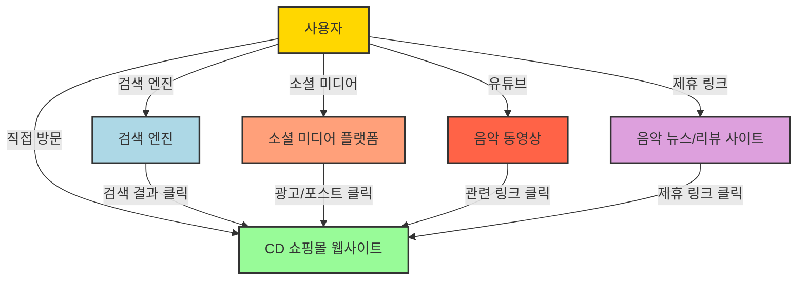
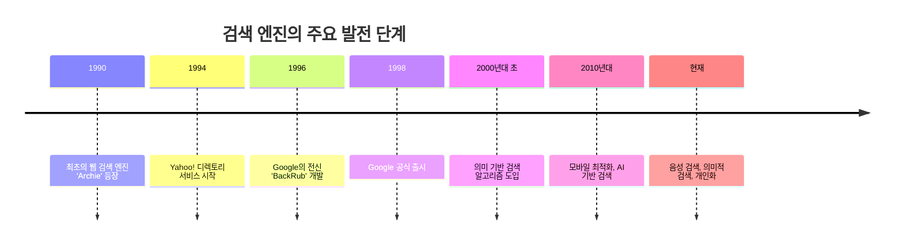
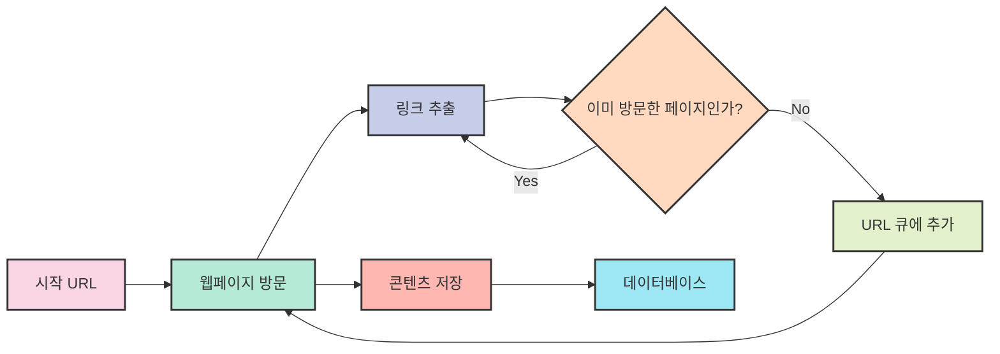
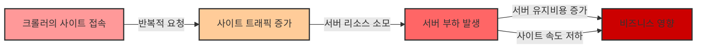

# 5. 검색엔진 최적화 SEO 🔍

## 목차
- [5. 검색엔진 최적화 SEO 🔍](#5-검색엔진-최적화-seo-)
  - [목차](#목차)
  - [SEO의 개념: 검색 엔진에서 웹사이트 가시성을 높이는 기술 📈](#seo의-개념-검색-엔진에서-웹사이트-가시성을-높이는-기술-)
  - [검색엔진의 시작: 인터넷 정보의 체계적 수집과 분류의 역사 📚](#검색엔진의-시작-인터넷-정보의-체계적-수집과-분류의-역사-)
    - [검색엔진 최적화 연구 프로세스](#검색엔진-최적화-연구-프로세스)
  - [검색엔진 최적화: 사이트 노출을 위한 전략과 실전 테크닉 🛠️](#검색엔진-최적화-사이트-노출을-위한-전략과-실전-테크닉-️)
    - [방법 1: 웹 사이트를 다운받아 모으기](#방법-1-웹-사이트를-다운받아-모으기)
    - [방법 2: 직접 등록하기](#방법-2-직접-등록하기)
    - [예시 1: 해시태그, SNS에서의 검색 최적화](#예시-1-해시태그-sns에서의-검색-최적화)
    - [예시 2: Google의 경우](#예시-2-google의-경우)
  - [웹 크롤링 vs 웹 스크래핑: 웹 데이터 수집의 두 가지 접근법 🕸️](#웹-크롤링-vs-웹-스크래핑-웹-데이터-수집의-두-가지-접근법-️)
    - [웹 크롤링과 스크래핑 방지 규약: robots.txt](#웹-크롤링과-스크래핑-방지-규약-robotstxt)
    - [웹 크롤링과 스크래핑 비교](#웹-크롤링과-스크래핑-비교)
    - [크롤링으로 발생 가능한 문제점](#크롤링으로-발생-가능한-문제점)
    - [크롤링의 법적 문제 가능성](#크롤링의-법적-문제-가능성)
    - [크롤링에 의한 권리 침해 대상의 예시](#크롤링에-의한-권리-침해-대상의-예시)
    - [크롤링으로 인한 문제가 생기는 이유](#크롤링으로-인한-문제가-생기는-이유)

---

## SEO의 개념: 검색 엔진에서 웹사이트 가시성을 높이는 기술 📈

블로그나 개인 웹사이트를 운영해 본 경험이 있는 사람들은 검색 결과가 어떻게 내 게시물을 반영하는지 궁금해 한 적이 있을 것이다. 다음 그림은 쇼핑몰 방문 경로의 예시를 나타낸 것이다:



**SEO(Search Engine Optimization)** 는 검색 엔진으로 방문하는 경우에 사용하는 검색 엔진 최적화를 의미하며, 검색 엔진에서 웹사이트가 상위에 노출되도록 하는 작업을 말한다. (즉 알고리즘에게 어떻게 채택될 수 있을까)

> 💡 **핵심 포인트**: SEO는 웹사이트의 트래픽을 증가시키고, 브랜드 인지도를 높이며, 비즈니스 성장에 기여하는 중요한 디지털 마케팅 전략입니다.

---

## 검색엔진의 시작: 인터넷 정보의 체계적 수집과 분류의 역사 📚

검색 엔진의 개념 자체는 이전부터 꾸준히 제시되어왔으나, 현대적인 검색엔진은 1996년 Google의 전신인 BackRub이 **"검색 알고리즘"** 의 개념을 제시하면서 시작되었다.



### 검색엔진 최적화 연구 프로세스

1. **웹 사이트 다운로드**: 웹 크롤러가 웹 사이트의 내용을 다운로드한다.
2. **DB 저장**: 다운로드한 내용을 DB에 저장하여 효율적인 관리를 꾀한다.
3. **웹 구성요소 분류 및 분석**: 저장된 데이터를 분석하여 웹사이트 내의 다양한 구성 요소(예: 제목, 본문, 링크, 이미지 등)를 분류한다.

이처럼 검색엔진 최적화 연구 프로세스에는 **웹의 내용을 분석 및 분류**하여 최적의 검색 알고리즘을 만드는 과정이 존재한다.

---

## 검색엔진 최적화: 사이트 노출을 위한 전략과 실전 테크닉 🛠️

### 방법 1: 웹 사이트를 다운받아 모으기

검색엔진이 웹 사이트를 다운받아 모으는 과정이 검색 엔진 최적화에 반드시 필요하다.

| 단계 | 검색엔진 활동 | 웹사이트 준비사항 |
|-----|-------------|----------------|
| **크롤링** | 웹페이지 스캔 및 링크 추적 | 사이트맵 제공, 내부 링크 구조 최적화 |
| **인덱싱** | 콘텐츠 분석 및 저장 | 명확한 타이틀 태그, 메타 설명, 키워드 배치 |
| **랭킹** | 검색 쿼리 관련성 평가 | 양질의 콘텐츠, 모바일 최적화, 페이지 속도 개선 |

### 방법 2: 직접 등록하기

검색엔진이 알고리즘에 내 검색 결과를 반영하기까지는 위에 기재된 과정을 모두 거치기 때문에 시간이 걸릴 수 있는데, 네이버 웹마스터 도구나 구글 콘솔 등에 들어가 직접 사이트를 등록하는 방법 또한 존재한다.


*그림 4: 네이버 Search Advisor 화면*

### 예시 1: 해시태그, SNS에서의 검색 최적화

#맛집 #서울맛집 #강남맛집 #이태원맛집 과 같은 해시 기호('#')와 띄어쓰기 없는 단어가 결합된 문자열을 본 적이 있을텐데, 이런 해시태그도 검색 엔진 최적화의 예시로 볼 수 있다.

> 💡 **팁**: 해시태그는 소셜 미디어 검색 최적화의 핵심이며, 관련성 높은 콘텐츠를 쉽게 찾을 수 있게 해줍니다.

### 예시 2: Google의 경우

Google은 검색엔진에 다음의 3단계를 반영한다. 

| 단계 | 설명 | 중요 요소 |
|-----|------|---------|
| **크롤링(Crawling)** | 웹 페이지를 찾아내는 과정 | 사이트맵, 내부 링크, robots.txt |
| **색인 생성(Indexing)** | 웹 페이지를 분석하여 데이터베이스에 저장 | 콘텐츠 품질, 메타데이터, 구조화된 데이터 |
| **최종 검색결과 제공** | 사용자의 검색어에 대한 결과를 제공 | 페이지 관련성, 사용자 경험, 백링크 품질 |

> 💡 **팁**: **색인(Indexing)** 이란: 많은 데이터가 쌓였을 경우 원하는 정보에 빠르게 접근하기 위해 데이터를 정리하는 과정. 예를 들어 "네이버"라고 검색하면 네이버 고객센터, 부동산, 클로바 등과 같은 연관 정보가 나오는 것은 이러한 색인의 결과라 볼 수 있다.


*그림 5: Google 검색엔진 최적화 소개 화면*

> 구글의 SEO 최적화에 대해 더 읽어보기 : [Google 검색엔진 최적화 가이드](https://developers.google.com/search/docs/fundamentals/seo-starter-guide?hl=ko)

---

## 웹 크롤링 vs 웹 스크래핑: 웹 데이터 수집의 두 가지 접근법 🕸️

**웹 크롤링**은 검색엔진 최적화의 핵심이며, 웹 크롤러가 웹 사이트의 내용 발견하고 색인화(indexing)하는 과정을 의미한다. '거미(spider)'가 거미줄을 타고 이리저리 이동하듯, 웹페이지 간의 링크들을 따라가며 데이터를 모으기 때문에 **웹 스파이더(Web Spider)**라고도 부른다.


*크롤링 과정을 표현한 도표*


*그림 6: 웹 크롤링 결과의 예시*

> 웹 크롤링의 개념에 대해 더 읽어보기 : [How Website Crawling Works](https://keyword.com/seo-wiki/crawling/)

**웹 스크래핑**은 웹 크롤링과는 다르게 웹 사이트의 내용(데이터)을 수집하고 분석하는 과정을 의미한다. 웹 크롤링은 데이터를 수집하는 과정이라면, 웹 스크래핑은 수집한 데이터를 분석하는 과정이라고 볼 수 있다.

웹 스크래핑의 경우 **파싱(Parsing)** 을 통해 데이터를 분석한다. 예를 들어, 아래와 같은 XML 데이터가 있다고 가정해보자:

```xml
<cd>
   <title>Map of the Soul: 7</title>
   <artist>BTS</artist>
   <country>Korea</country>
   <company>BigHit Entertainment</company>
   <price>27000</price>
   <year>2020</year>
   <tracks>
     <track>Intro: Persona</track>
     <track>Boy With Luv</track>
     <track>Make It Right</track>
     <track>ON</track>
     <track>Black Swan</track>
   </tracks>
 </cd>
```

*설명: 위의 XML 데이터에서 가격 정보는 `<price>27000</price>`로 표현되어 있다.*

> 💡 **팁**: **파싱**은 데이터의 구조를 구문 분석 하는 과정으로, 규칙이 정해져 있는 문장을 잘라내 분석하는 방법이다.

### 웹 크롤링과 스크래핑 방지 규약: robots.txt

모든 사이트를 크롤링 할 수 있는 것은 아니고, 검색 사이트에 노출을 방지할 수 있는 방법이 있는데 그것이 사이트 루트(root)에 존재하는 **robots.txt**를 설정하는 것이다. 페이지별로 크롤링을 허용할지 막을지 설정할 수 있으며, 이를 지키지 않으면 법적 문제의 소지나 사이트 차단으로 이어질 수 있다.

```
# 예시 robots.txt 파일
User-agent: *           # 모든 크롤러에 적용
Disallow: /private/     # /private/ 디렉토리 크롤링 금지
Disallow: /temp/        # /temp/ 디렉토리 크롤링 금지
Allow: /public/         # /public/ 디렉토리 크롤링 허용
Sitemap: https://example.com/sitemap.xml  # 사이트맵 위치
```

### 웹 크롤링과 스크래핑 비교

| 비교 항목 | 웹 크롤링 (Web Crawling) | 웹 스크래핑 (Web Scraping) |
|:---------|:------------------------|:-------------------------|
| **정의** | 웹페이지 간의 링크를 따라가며 웹 페이지를 발견하고 색인화하는 과정 | 특정 웹사이트에서 데이터를 추출하고 구조화하는 과정 |
| **목적** | 검색 엔진 색인 구축, 웹 아카이빙 | 데이터 수집, 분석, 비교 및 연구 |
| **범위** | 보통 여러 웹사이트를 광범위하게 탐색 | 일반적으로 특정 웹사이트나 페이지 집중 |
| **작동 방식** | 링크를 따라 웹페이지 간 자동 이동 | 특정 웹사이트의 HTML/XML 구조를 파싱하여 원하는 데이터 추출 |
| **속도** | 일반적으로 느림 (광범위한 작업) | 상대적으로 빠름 (집중적인 작업) |
| **자동화 정도** | 완전 자동화 | 일부 수동 설정 필요 (원하는 데이터 지정) |
| **사용 사례** | 검색 엔진, 웹 아카이브, 포털 사이트 | 가격 비교, 데이터 분석, 시장 조사, 연구 |
| **법적 고려사항** | robots.txt 파일 준수 필요 | robots.txt 준수 + 저작권, 이용 약관 고려 필요 |
| **데이터 처리** | 주로 색인화(indexing)에 집중 | 데이터 추출, 구조화, 정제 및 분석에 집중 |
| **결과물** | 색인화된 URL 목록, 웹 그래프 | 구조화된 데이터(CSV, JSON, DB 등) |

### 크롤링으로 발생 가능한 문제점



크롤링 또한 웹 사이트와 **요청-응답**을 주고받는 과정이기 때문에, 반복적인 요청으로 인해 사이트 트래픽이 증가하고 서버 부하가 발생할 수 있다. **많은 사람이 제한없이 크롤링을 한다면 운영 비용이 증가할것이다.**

### 크롤링의 법적 문제 가능성

> **It is not illegal as such.** There are no specific laws prohibiting web scraping, and many companies employ it in legitimate ways to gain data-driven insights. - [Is Web Scraping Legal?](https://oxylabs.io/blog/is-web-scraping-legal)

크롤링 자체가 불법을 함의하진 않는다. 그러나 크롤링의 대상이 공적으로 이용 가능한지(publicly available), 또 크롤링의 대상이 어떤 라이선스를 적용하고 있는지 등을 고려해야 한다. 
**크롤링의 대상이 저작권이나 개인 정보를 담고 있다면 크롤링을 통해 데이터를 수집하는 것은 불법일 수 있다.** 

### 크롤링에 의한 권리 침해 대상의 예시

| **개인 정보 (Personal Data)** | **저작권 보호 데이터 (Copyrighted Data)** |
|:----------------------------|:-------------------------------------|
| 전체 이름 (Full Name) | 뉴스 기사 또는 블로그 글 (News Articles or Blogs) |
| 이메일 주소 (Email Address) | 유료 논문 (Research Papers Behind Paywalls) |
| 주민등록번호 또는 사회보장번호 (SSN / National ID) | 웹사이트 소유 이미지, 영상, 오디오 (Site-owned Media) |
| 건강 기록 (Health Records) | 로고 (Logos) |
| 금융 정보 (신용카드 번호 등) (Financial Info) | 온라인 출판 도서 또는 발췌본 (Books or Excerpts Online) |
| 기타 개인 데이터 (Other Personal Data) | 기타 저작권 보호 데이터 (Other Copyrighted Data) |

### 크롤링으로 인한 문제가 생기는 이유

정보화 사회가 되면서 정보의 원천인 데이터의 가치가 어느 때보다 크고, 기업 혹은 개인의 권리로 인정되기 때문이다. 예를 들어 구글은 검색엔진으로 수집한 통계를 **구글 트렌드**로 제공하고 있는데, 이를 통해 구글은 사용자의 검색 기록을 통해 사용자의 성별, 나이대, 심지어는 소득이나 정치 성향까지 추론할 수 있다.

이러한 개인 정보를 포함한 데이터와 같이 데이터의 수집 방식에 따라 제3자가 이용할 경우 어느 쪽의 권리를 침해했는지가 복잡해질 수 있기 때문에, 웹 크롤링과 스크래핑은 필수적이면서도 논쟁적인 영역에 머무를 수 있다.
