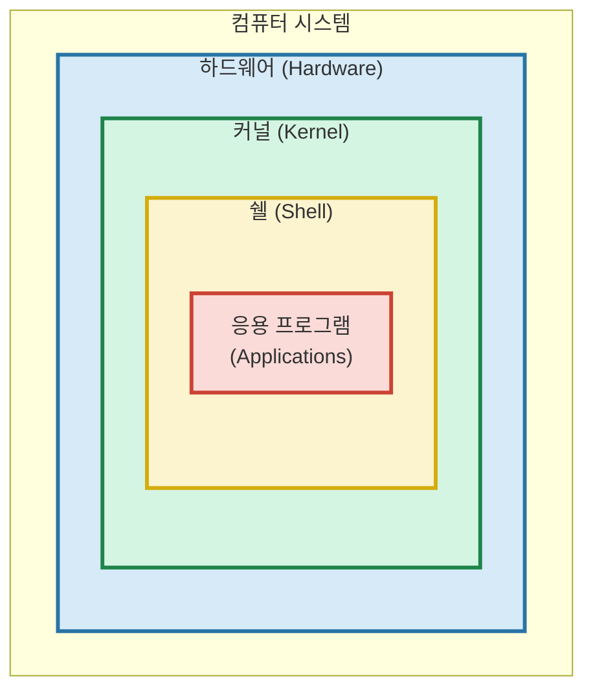

# 2. 운영체제

## 목차
- 운영체제: 운영체제가 무엇일까?
- 프로세스와 스레드: 프로세스와 스레드의 차이점은?
- 운영체제의 역할: 컴퓨터의 규칙을 잡아라
- 커널과 쉘: 운영체제의 핵심
- 리눅스: 개발 서버로 가장 많이 사용되는 오픈소스 운영체제

## 운영체제: 운영체제가 무엇일까?

컴퓨터는 하드웨어와 소프트웨어로 이루어져 있다. 하드웨어는 컴퓨터를 구성하는 모든 물리적 부품이고, 소프트웨어는 컴퓨터 시스템에서 작동하는 프로그램 전반을 일컫는다.

**운영체제 또한 소프트웨어이다.** 다만 일반적인 소프트웨어와 성격이 조금 달라 하드웨어와 소프트웨어를 관리하고 제어하는 일종의 메타-소프트웨어라 볼 수 있다. 다른 말로, 컴퓨터의 **자원(Resource)을 효율적으로 관리**해주는 프로그램이다.

※ 자원은 컴퓨터가 동작하기 위해 필요한 모든 것으로, CPU나 RAM 등이 포함될 수 있고 대체로 시스템 내에 존재하는 물리적인 부품으로 표현된다. **작업 관리자**를 켜면 주요 컴퓨터 자원의 사용량을 확인할 수 있다.

💡 **응용 소프트웨어 vs 시스템 소프트웨어 전격비교**
| 특성 | 응용 소프트웨어 (Application Software) | 시스템 소프트웨어 (System Software) |
|------|-------------------------------------|----------------------------------|
| **정의** | 특정 작업이나 사용자 목적을 수행하기 위한 소프트웨어 | 하드웨어를 관리하고 응용 프로그램을 지원하는 소프트웨어 |
| **목적** | 사용자의 특정 문제 해결 및 작업 수행 | 컴퓨터 시스템의 기본 기능 제공 및 하드웨어 관리 |
| **하드웨어 의존성** | 낮음 (다양한 플랫폼에서 실행 가능) | 높음 (특정 하드웨어와 밀접하게 연결) |
| **사례** | • 워드 프로세서 (MS Word, 한글)\n• 웹 브라우저 (Chrome, Firefox) | • 운영체제 (Windows, macOS, Linux)\n• 디바이스 드라이버 |
| **리소스 접근** | 제한된 시스템 리소스 접근 | 모든 시스템 리소스에 직접 접근 가능 |
| **고장 시 영향** | 해당 프로그램만 영향 받음 | 전체 시스템 작동에 영향 |

## 프로세스와 스레드: 프로세스와 스레드의 차이점은?

프로세스와 스레드에 대해 말하기 전에, 프로그램이란 명령어가 실행되는 순서의 집합이다. 이 프로그램으로부터 자원을 할당 받아 실행되는 것이 **프로세스**이며, 프로세스 내에서 실행되는 흐름(작업)의 단위가 **스레드**이다. 프로세스와 스레드는 단독 혹은 여러개가 동시에 실행될 수 있으며, **단독/여러개**의 여부에 따라 **싱글/멀티** 프로세스/스레드로 구분된다.

> **요약**: 프로세스는 컴퓨터에서 실행되고 있는 컴퓨터 프로그램, 스레드는 프로세스 내에서 실행되는 흐름의 단위!

## 운영체제의 역할: 컴퓨터의 규칙을 잡아라

운영체제는 컴퓨터의 자원을 효율적으로 관리하고 사용자와 하드웨어 사이의 인터페이스 역할을 한다. 운영체제가 수행하는 역할은 굉장히 많지만, 주된 역할은 다음과 같다:

1. **메모리 관리**: 프로그램이 실행될 때 메모리를 할당하고, 프로그램이 종료되면 메모리를 회수한다.
2. **가상 메모리**: 보조기억장치의 일부를 실제 메모리처럼 활용하거나 프로그램이 실행되는 부분만 메모리에 저장해 물리적 메모리 크기보다 더 큰 프로그램을 실행하게 해준다.
3. **프로세스 관리**: 프로세스가 실행되는 순서를 프로세스 스케줄링으로 관리한다.(멀티태스킹 실현)

이 외에도
**네트워크 자원에 대한 관리**, **파일 시스템 관리**, **입출력 작업 관리**, **보안 및 인증**등의 기능 또한 수행한다.

## 커널과 쉘: 운영체제의 핵심

운영체제는 Application-Shell-Kernel-Hardware 구조를 따른다고 한다.

### 권한 레벨(Privilege Level/Protection Ring)
운영체제는 또한 다양한 계층으로 구성되어 있는데, 흔히 **Privilege Level/Protection Ring**으로 불리는 계층 구조를 사용한다.

이러한 Ring의 구조는 0~3레벨이 기본적으로 존재하는데,
- Ring 0: **커널(Kernel)**, 운영체제의 핵심 부분으로 하드웨어를 직접 제어하고 시스템의 모든 자원에 접근할 수 있다.
- Ring 1: **디바이스 드라이버** 등의 커널 확장 부분으로, 커널의 기능을 확장하는 역할을 한다.
- Ring 2: **시스템 서비스**를 제공하는 부분으로, 사용자 프로그램이 직접 접근할 수 없는 시스템 서비스를 제공한다.
- Ring 3: **사용자 어플리케이션**이 실행되는 부분으로, 사용자 프로그램이 직접 접근할 수 있는 영역이다.
Ring 1~2의 경우 현대 OS에서는 잘 채택하지 않으며, Ring 0과 Ring 3만을 사용하는 경우가 많다.